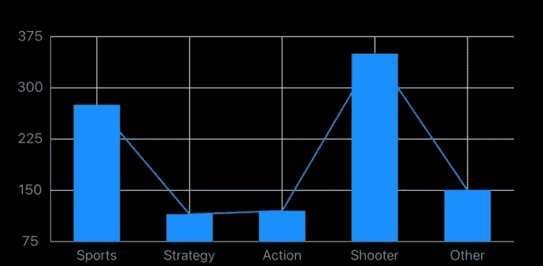
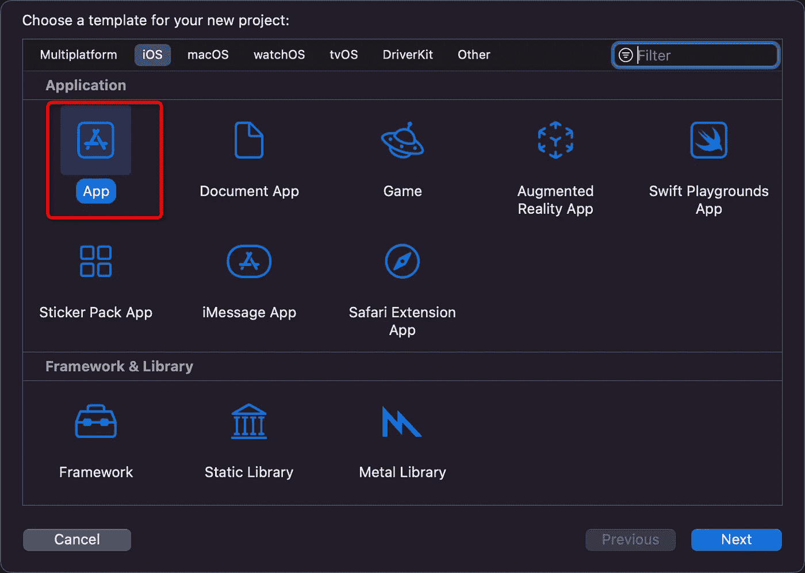
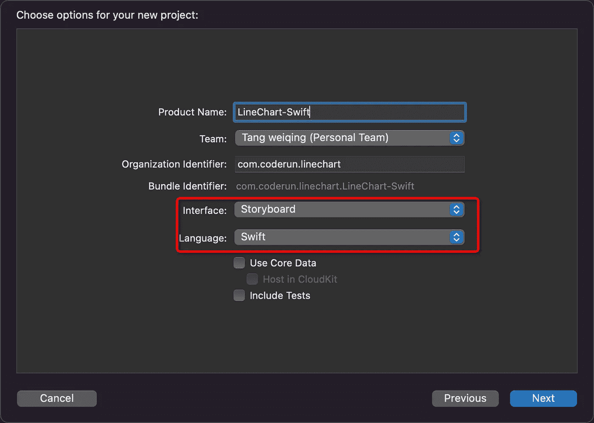
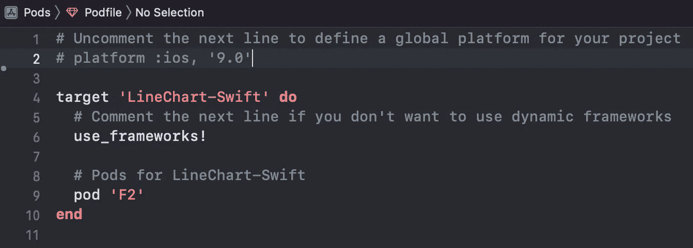
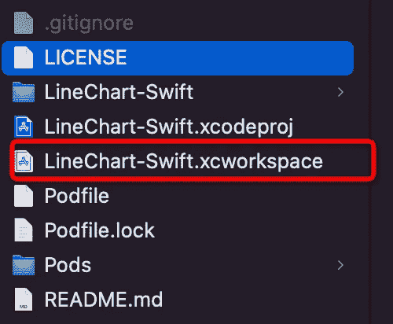
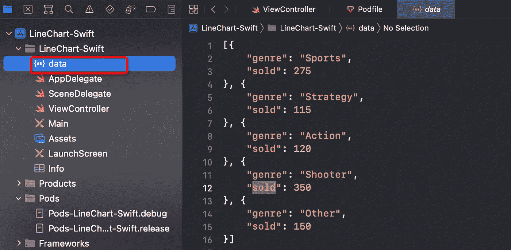
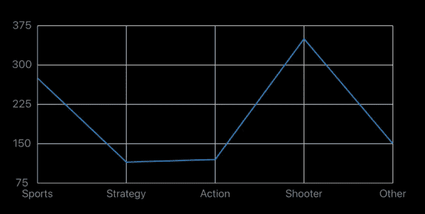
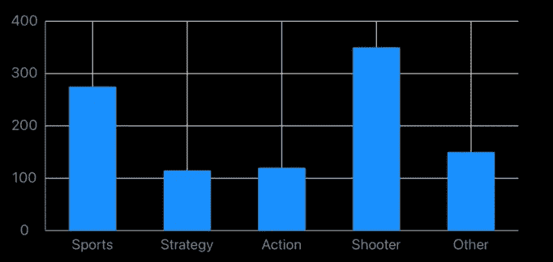

# 使用 Swift 在 10 行代码内绘制线条和条形图

> 原文：<https://medium.com/codex/draw-a-line-and-bar-chart-using-swift-within-10-lines-code-c36aadaf3cdd?source=collection_archive---------4----------------------->



在大数据时代的入口之内，`visualization`可以用更直观的方式展示数据，让数据更客观，更有说服力，从而帮助用户理解和分析数据。今天我们来看看如何使用 Swift 的 **10 行代码**绘制线图**。**

# 技术选择

其实 iOS 上的可视化图表库很少。著名的是[图表](https://github.com/danielgindi/Charts)，但今天我选择了 [F2Native](https://github.com/antvis/F2Native) ，主要是因为它丰富的图表类型，`supporting 7 types of charts`，跨越`iOS`、`MacOS`、`Android`、`Webassembly`平台，最后实现了 `the grammar of graphic`理论，可以组合形成千变万化的图表。


# 开发和实施

代码提交在 GitHub 上，你可以在最后直接下载。那我们开始吧。

我们使用`CocoaPods`来导入这个库，如果你的机器上没有安装，你需要先安装它。

```
sudo gem install cocoapods
```

# 1.创建项目

我们使用`Xcode`创建线图-Swift 项目，文件- >新建- >项目，选择`iOS Tab`下的`App`，点击下一步



接下来，我们在`Interface`中选择`StoryBoard`，在`Language`中选择`Swift`，点击下一步，完成项目创建



## 2.CocoaPod 设置

我们使用`CocoaPod`来导入`F2Native`。首先，使用命令行输入项目的目录。

```
cd /Users/weiqing.twq/Documents/LineChart-Swift
```

创建 Podfile

```
pod init
```

用编辑器打开 Podfile，输入`pod 'F2'`(注意这里叫`F2`，不是`F2Native`)



安装它

```
pod install
```

安装完成后，目录下会有一个`LineChart-Swift.xcworkspace`文件，双击打开(记得关闭创建时自动打开的`Xcode`窗口)。



## 3.准备数据

由于发动机的输入数据格式是一个`NSArray`，所以我准备了以下数据，保存为`data.json`文件。

```
[{ “genre”: “Sports”, “sold”: 275 }, 
{ “genre”: “Strategy”, “sold”: 115 }, 
{ “genre”: “Action”, “sold”: 120 }, 
{ “genre”: “Shooter”, “sold”: 350 }, 
{ “genre”: “Other”, “sold”: 150 }]
```

将`data.json`拖到项目中



## 4.编码

在`ViewController.swift`进口`F2`

```
import F2
```

在`viewDidLoad`中绘制图表，具体的绘制步骤已经在代码中标注

```
var canvasView:F2CanvasView?
var chart:F2Chart?override func viewDidLoad() {
    super.viewDidLoad()

    //Step 1 init a canvas view to show chart
    self.canvasView = F2CanvasView.canvas(CGRect(x:0, y: 100, width: self.view.frame.width, height: 200))
    self.view.addSubview(self.canvasView!)

    //Step 2 prepare a chart for drawing
    self.chart = F2Chart.init(self.canvasView!.bounds.size, name: "LineChart")

    //Step 3 connect chart and canvasview
    self.chart!.canvas()(self.canvasView!).padding()(20, 20, 20, 20)

    //Step 4 setup the source data of chart
    let jsonPath = Bundle.main.path(forResource: "data", ofType: "json")
    guard let jsonString = try? String.init(contentsOfFile: jsonPath!) else {
        return
    }
    let jsonData = F2Utils.toJsonArray(jsonString)
    self.chart!.source()(jsonData)

    //Sete 5 draw a line in chart
    //The mapping of the x-axis data is the genre field, and the mapping of the y-axis data is the sold field
    self.chart!.line()().position()("genre*sold")

    //Step 6 draw chart and show on canvas view
    self.chart!.render()();
}
```

👏 👏恭喜你！下面是我们绘制折线图所需的代码，我们已经使用`10 lines code at all`完成了折线图的绘制。点击`Xcode`的▶️，弹出



刚才我提到过，`F2Native`实现了`the grammer of graphic`，通过组合可以快速应对业务迭代的快速性。如果需求突然变成条形图，那么我们只需要把`Step 5`的线改成下图:

```
self.chart!.interval()().position()("genre*sold")
```

条形图出来了



或者你可以把它们放在一起，线形条形图就出来了

```
self.chart!.line()().position()(“genre*sold”)
self.chart!.interval()().position()("genre*sold")
```

线形条形图出来了


# **终于**

当然，这还是基本的图表显示。在实际业务中，应该会有一些更复杂的设计。例如，y 轴上应该增加额外的单位，其次，应该区分条形的颜色。最后，按压的时候最好有一些提示。我会在后面的文章中详细展示这些，感谢阅读，代码已经提交到 [GitHub](https://github.com/weiqingtangx/LineChart-Swift) ，欢迎下载。😄

[](https://github.com/weiqingtangx/LineChart-Swift) [## GitHub-weiqing tangx/line chart-Swift:一个展示如何使用 Swift 创建折线图示例

### 此时您不能执行该操作。您已使用另一个标签页或窗口登录。您已在另一个选项卡中注销，或者…

github.com](https://github.com/weiqingtangx/LineChart-Swift)