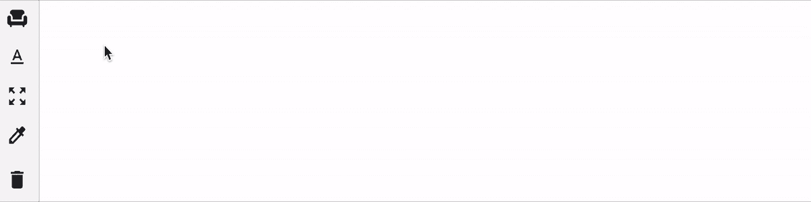
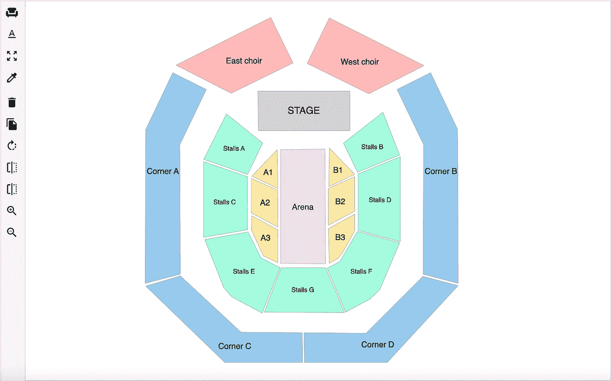
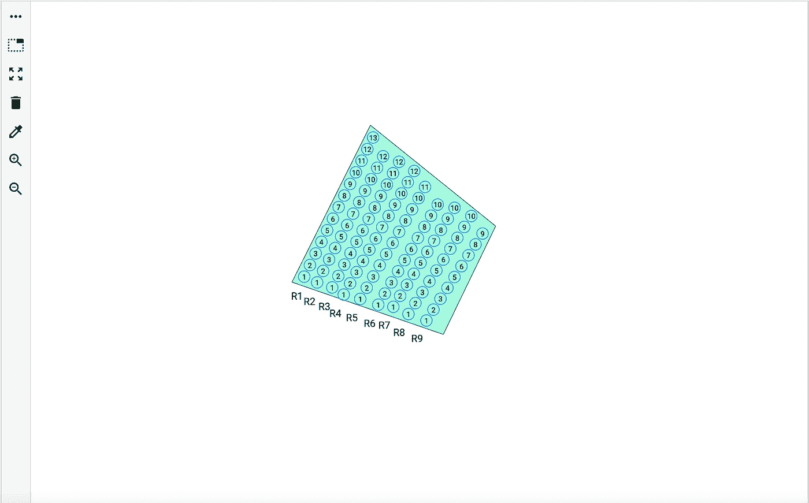

# 使用 SVG 和 Angular 绘制座位图。

> 原文：<https://medium.com/codex/draw-a-seating-chart-using-svg-shapes-and-angular-7092a52f4176?source=collection_archive---------0----------------------->

## 放学后不再需要数学和几何了？三思而后行！

前一段时间，我们受一家活动组织公司的委托，帮助他们转变在活动行业的运营方式。该公司希望通过开发一种产品来扩大其在该地区的业务，这种产品将与像 [TicketMaster](https://www.ticketmaster.com) 这样的大平台竞争，并使他们组织和管理各种活动的方式现代化。

因此，我们集思广益，设计了一系列为各种活动量身定制的功能，如活动设置、门票模板定制、活动签到、支付网关集成、电子邮件营销模块、客户支持、财务等。

作为一名前端开发人员，当你想评估这些类型的平台中最困难的部分时，在你的研究之后，我敢打赌你肯定会说是场馆设计师。活动地点可以是剧院、体育场、多层建筑，也可以是建在空地或室内的定制设施。如今，技术已经赢得了“没有什么是不可能的”的声誉，作为一个活动组织者，你会想要一个场地定制级别，理想的是一个设计工具，能够绘制不同的区域形状和座位排。



场馆设计工具

此外，其他公司已经发明了这些类型的工具。所以这不是什么新鲜事，对吧？

# 市场提供了什么？

作为开发人员，我们总是有一种确定感，我们可以“Google”它，或者我们可以“StackOverflow”它，但是坏消息来了！

这个话题你找不到像样的。

浏览网页并进行竞争研究，你可以找到一些提供这种类型服务的商业模式，但他们提供的服务与售票功能捆绑在一起，然后…

是的，你猜对了，每卖出一张票就要收费，所以基本上你就“赢得”了一个捆绑了所有东西的特许合作伙伴。所以这是一个方便的婚姻，而不是一个理想的婚姻。

# 选择框架

在框架决定的过程中，我们选择了 Angular，因为它提供了非常好的 DOM 访问和操作，这是在浏览器中绘制形状和侦听 DOM 事件时必须的。

其次，这个项目已经在 Angular 中开发了，所以继续使用相同的技术框架是很自然的。

# SVG 与 HTML5 画布

开始使用 Javascript 在浏览器中绘制一个场馆模板，你很快意识到选择并不多。你可以选择 SVG 或者 Canvas。我不打算解释选择其中一个的利弊，因为那里有一些非常好的文章，有大量的参考资料。我推荐阅读这篇[文章](https://css-tricks.com/when-to-use-svg-vs-when-to-use-canvas/)，我相信它足以帮助你决定选择哪个选项。

当时，我选择了 SVG，因为我并不期待繁重的浏览器交互。此外，SVG 非常适合调试和分辨率独立，这对于我想要在不同类型的设备上渲染场景来说是完美的。

# 如何玩 DOM

现在是与 DOM 交互的时候了。如果你不知道它是什么，这里有一个简单的句子可以让你快速上手:

> “**D**document**O**object**M**odel 是一个平台和语言中立的接口，它允许程序和脚本动态地访问和更新文档的内容、结构和样式。”

如果您有 JavaScript 背景，那么您应该熟悉本机方法，比如:

*   ***getElementById()*** 方法，返回一个元素对象，允许与该对象进行交互。
*   ***set attribute()***设置指定元素的属性值。
*   ***set property*()**为 CSS 样式声明对象的属性设置新值。

即使您熟悉上面的方法，并且它们可以在 Angular 中使用，我们也不要忘记这个框架提供了许多与 DOM 交互的好特性。这里的最佳实践是将呈现逻辑保存在指令中，这样就不会与组件中编写的表示逻辑混淆。事情是这样的:

```
@Component({
  selector: 'app-root',
  template: `<svg 
               appSvg 
               style="border: 1px solid black;" 
               width="1000" 
               height="700" 
               >
             </svg>`,
})export class AppComponent {}@Directive({
  selector: '[appSvg]'
})export class SvgDirective implements OnInit { constructor(private element: ElementRef, 
              private renderer: Renderer2) {}

  ngOnInit(): void {
    this.renderer.setAttribute(this.element.nativeElement, '');
  } @HostListener('mousedown', ['$event'])
  onMouseDown(event: MouseEvent): void {
    // Interact with DOM when you click inside the SVG 
  }

  @HostListener('mousemove', ['$event'])
  onMouseMove(event: MouseEvent): void {
    // Interact with DOM when you are moving the mouse
  } @HostListener('mouseup', ['$event'])
  onMouseUp(event: MouseEvent): void {
    // Interact with DOM to cleanup and reset the state
  }}
```

所以基本上，我们有:

*   [**ElementRef**](https://angular.io/api/core/ElementRef) —帮助从组件中访问 DOM 元素。因为我们在< svg >标签中使用了指令选择器名称“[appSvg]”，所以我们正在访问 Svg 元素的引用。
*   [**渲染器**](https://angular.io/api/core/Renderer2) —可以安全地修改元素，而无需直接接触 DOM。它还可以用于实现自定义呈现和拦截呈现调用。
*   [**host listener**](https://angular.io/api/core/HostListener)—一个角度装饰器，用于注册事件监听器，以便我们可以实时跟踪鼠标事件的发生。

# 最低设计工具要求

在我看来，能够绘制场景所必需的功能有:

1.  画多边形。
2.  拖放多边形。
3.  书写和放置文本。
4.  删除形状和文本。
5.  复制/粘贴形状。
6.  水平和垂直反射形状。
7.  放大/缩小形状。
8.  形状颜色填充。
9.  画座位排

写了一堆代码后，用 venue designer 工具左边列出的工具，我可以画出下面的模板。



场景*设计工具*



区域设计器工具

# 后续步骤

我将写一篇由多个部分组成的文章，详细介绍如何开始实现这些特性的技术细节。

下一步:[绘制 SVG 角形(多边形)](https://orlandokaramani.medium.com/draw-svg-shapes-in-angular-polygons-897bfb4614fc)

看看完成的[项目](https://seats.better.network)。

如果你喜欢这篇文章，请在 [LinkedIn](https://www.linkedin.com/in/orlando-karamani/) 上关注我。