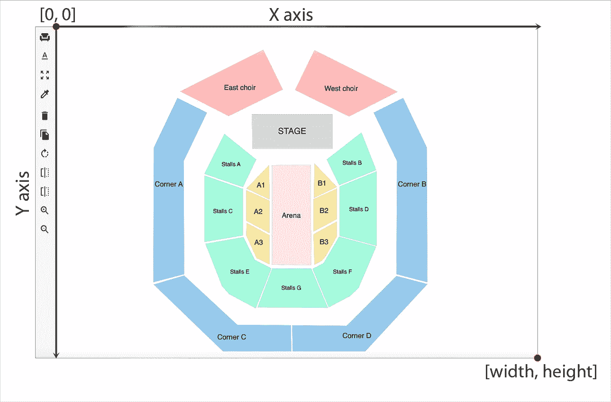
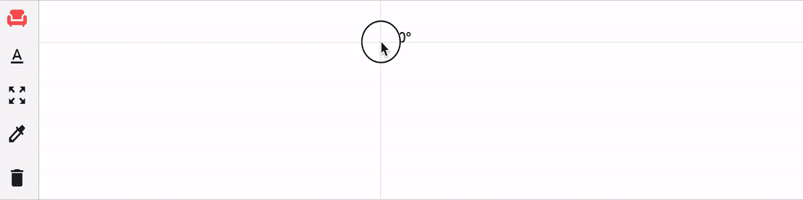
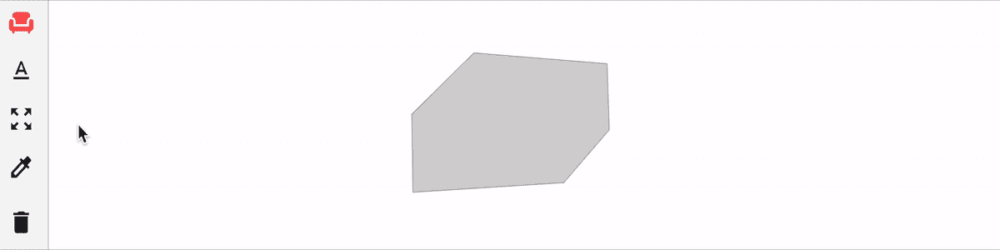

# 以角度(多边形)绘制 SVG 形状。

> 原文：<https://medium.com/codex/draw-svg-shapes-in-angular-polygons-897bfb4614fc?source=collection_archive---------1----------------------->

在上一篇文章中，我解释了最低要求，这样我们就可以开始在 web 浏览器中使用 Angular 在 SVG 元素中绘制形状。本质上，我们有一个处理呈现逻辑的指令和一个处理表示逻辑的组件。

在本文中，我将解释如何在 SVG 元素中绘制多边形并与之交互。

# 绘制多边形

多边形是用来表示至少有三条边或三个点的图形的元素。如果您看一下代码，一个多边形元素看起来像这样:

```
<polygon points="280,118 455,30 496,114 382,170"></polygon>
```

如果要画多边形，必须要有 ***点*** 属性，无非就是一组用空格分割的坐标。但是我们在哪里可以找到这些坐标呢？这里有一个插图，让您能够描绘 SVG 元素的轴。



因为我们想要用鼠标交互来绘制多边形，所以可以想象在每次鼠标点击后都可以提取坐标。



绘制多边形

现在让我们开始编写指令内部的逻辑。我也将使用 [d3 库](https://d3js.org/)，它对创建具有多种属性的不同类型的形状有很好的支持。

```
@Directive({
  selector: '[appSvg]'
})export class SvgDirective { private points: Array<[number, number]> = [];
  private currentLine?: d3.Selection<SVGLineElement, unknown, null, any>; constructor(private elementRef: ElementRef, private renderer: Renderer2) { } @HostListener('mousedown', ['$event'])
  onMouseDown(event: MouseEvent): void {
		// Create the polygon only if we have three or more points 
    // and we are clicking on the rectangular helping shape
    if ((event.target as HTMLElement).tagName === 'rect' && this.points.length >= 3) {
      this.createPolygon();
      this.clearHelperShapes();
    } else {
			// Otherwise, create another helping line or rectangular
      this.addHelperShapes(event);
    }
  } @HostListener('mousemove', ['$event'])
  onMouseMove(event: MouseEvent): void {
    let coordinates = this.getMousePosition(event);
    if ((event.target as HTMLElement).tagName === 'rect' && this.points.length >= 3) {
      this.renderer.setAttribute(event.target, 'stroke', '#0784fa');
    } else {
      let rect: SVGRectElement | null = document.querySelector('rect');
      if (rect) {
        this.renderer.setAttribute(rect, 'stroke', 'transparent');
      }
    }
    // Move line by changing the coordinates
    if (this.currentLine) {
      this.currentLine.attr('x2', coordinates.x).attr('y2', coordinates.y)
    }
  } /**
   * After each mouse click, we add a point into the array of polygon coordinates
   * and insert the next helping line.
   * @param event Mouse Event
   */
  private addHelperShapes(event: MouseEvent) {
    let coordinates = this.getMousePosition(event);
    this.points.push([coord.x, coord.y]); if (this.points.length == 1) {
      d3.select(this.elementRef.nativeElement).append('rect')
        .attr('x', coordinates.x - 5)
        .attr('y', coordinates.y - 5)
        .attr('width', '10')
        .attr('height', '10')
        .attr('fill', 'transparent')
        .attr('class', 'help')
    } this.currentLine = d3.select(this.elementRef.nativeElement)
      .insert('line', ':nth-child(1)')
      .attr('x1', coordinates.x)
      .attr('x2', coordinates.x)
      .attr('y1', coordinates.y)
      .attr('y2', coordinates.y)
      .attr('stroke', '#0784fa')
      .attr('class', 'help')
  } /**
   * Create a polygon shape
   * @param event Mouse Event
   */
  private createPolygon() {
    d3.select(this.elementRef.nativeElement)
      .append("polygon")
      .attr("points", this.points.join(' '))
      .attr("fill", "lightgrey")
      .attr("stroke", "black")
      .attr('stroke-width', '0.2')
  } /**
   * Get the mouse coordinates relative to the SVG element
   * @param event Mouse Event
   */
  private getMousePosition(event: MouseEvent) {
    return {
      x: event.offsetX,
      y: event.offsetY
    }
  } /**
   * Clear the helping lines and rectangular
   * @param event Mouse Event
   */
  private clearHelperShapes() {
    document.querySelectorAll('.help')
    .forEach(element => {
      element.remove();
    });
    this.points = [];
  }
}
```

# 移动多边形

要移动多边形，你需要三样东西:

*   点的当前坐标。
*   元素引用。
*   鼠标的当前坐标。

请记住，为了达到预期的效果，您只需要在按下鼠标时移动多边形，因此我们有一个拖放行为。



移动多边形

现在让我们深入编码

```
@Component({
  selector: 'app-root',
  template: `<svg appSvg style="border: 1px solid black;" width="1000" height="700" >
  <polygon points="477,175 579,281 407,318" fill="lightgrey" stroke="black" stroke-width="0.2"></polygon>
  </svg>`,
})@Directive({
  selector: '[appSvg]'
})export class SvgDirective { private draggingPoints: number[][] = [];
  private draggingElement?: d3.Selection<SVGPolygonElement, unknown, null, any>;
  private currentPoint: { x: number, y: number } = { x: 0, y: 0 };
  private mousedown = false;

  constructor(private elementRef: ElementRef, private renderer: Renderer2) { } @HostListener('mousedown', ['$event'])
  onMouseDown(event: MouseEvent): void {
    this.mousedown = true;
    let coordinates = this.getMousePosition(event);
    let target = (event.target as SVGPolygonElement);
    if (target.tagName === 'polygon') {
      this.currentPoint = coordinates;
      this.draggingElement = d3.select(target);
      this.draggingPoints = this.getPointsFromPolygon();
    }
  } @HostListener('mousemove', ['$event'])
  onMouseMove(event: MouseEvent): void {
    let coordinates = this.getMousePosition(event);
    if (!!this.draggingElement && this.mousedown) {
        document.body.style.cursor = 'move';
        let x = coordinates.x - this.currentPoint.x;
        let y = coordinates.y - this.currentPoint.y;
        let h = Math.sqrt(Math.pow(x, 2) + Math.pow(y, 2));
        let angle = this.angleFromCoordinates(x, y);
        var newPoints = this.polygonTranslate(this.draggingPoints, angle, h);
        this.draggingElement.attr('points', newPoints.join(" "));
    }
  } @HostListener('mouseup', ['$event'])
  onMouseUp(event: MouseEvent): void {
    this.mousedown = false;
    this.draggingElement = undefined;
    this.renderer.setStyle(document.body, 'cursor', 'initial');
  }
  /**
   * Get the angle from two coordinates
   */
  angleFromCoordinates(x: number, y: number) {
    let rad = Math.atan2(y, x)
    var pi = Math.PI
    let angle = Math.round(rad * (180 / pi)) if (angle < 0) {
      angle = angle + 360
    }
    return angle
  }
  /**
   * Translate current polygon into a new one
   * @param polygon An array of polygon coordinates
   * @param angle The angle created by the polygon and the current mouse position
   * @param distance The distance from the polygon to the mouse position
   * @returns 
   */
  polygonTranslate(polygon: number[][], angle: number, distance: number) {
    let p = [];
    for (let i = 0, l = polygon.length; i < l; i++) {
      const r = angle / 180 * Math.PI;
      p[i] = [polygon[i][0] + distance * Math.cos(r), polygon[i][1] + distance * Math.sin(r)];
    }
    return p;
  }
  /**
   * Extract the points of current polygon
   * @param event Mouse events
   */
  getPointsFromPolygon(): number[][] {
    let points: Array<{x: number, y: number}> = this.draggingElement?.property('points');
    let pointsArray = []
    for (let i = 0; i < points.length; i++) {
      pointsArray.push([points[i].x, points[i].y])
    }
    return pointsArray
  } private getMousePosition(event: MouseEvent) {
    return {
      x: event.offsetX,
      y: event.offsetY
    }
  }
}
```

# 后续步骤

我将解释 SVG 元素中更多的形状交互。敬请期待🙂

看看已经完成的[项目](https://seats.better.network)。

如果你喜欢这篇文章，请在 LinkedIn 上关注我。