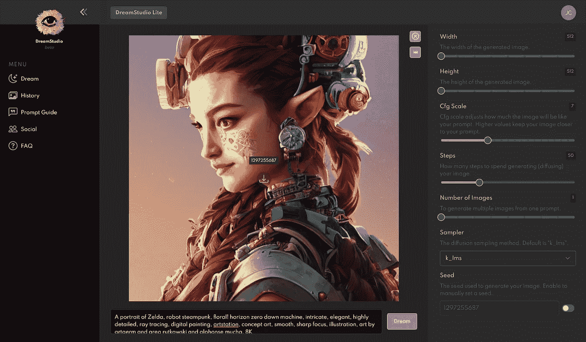

# 梦工厂——稳定扩散的人工智能艺术网络应用工具

> 原文：<https://medium.com/codex/dream-studio-stable-diffusions-ai-art-web-app-tool-5687e75cc100?source=collection_archive---------0----------------------->

如果你一直关注人工智能文本到图像领域，你可能会意识到过去几周稳定扩散如何席卷互联网。

不到 10 秒，[稳定扩散](/codex/stable-diffusion-new-and-free-text-to-image-ai-tool-70f95ea14440)，一个潜在的文字转图片扩散模型，可以从一个简短的描述性文字提示产生一个图片。