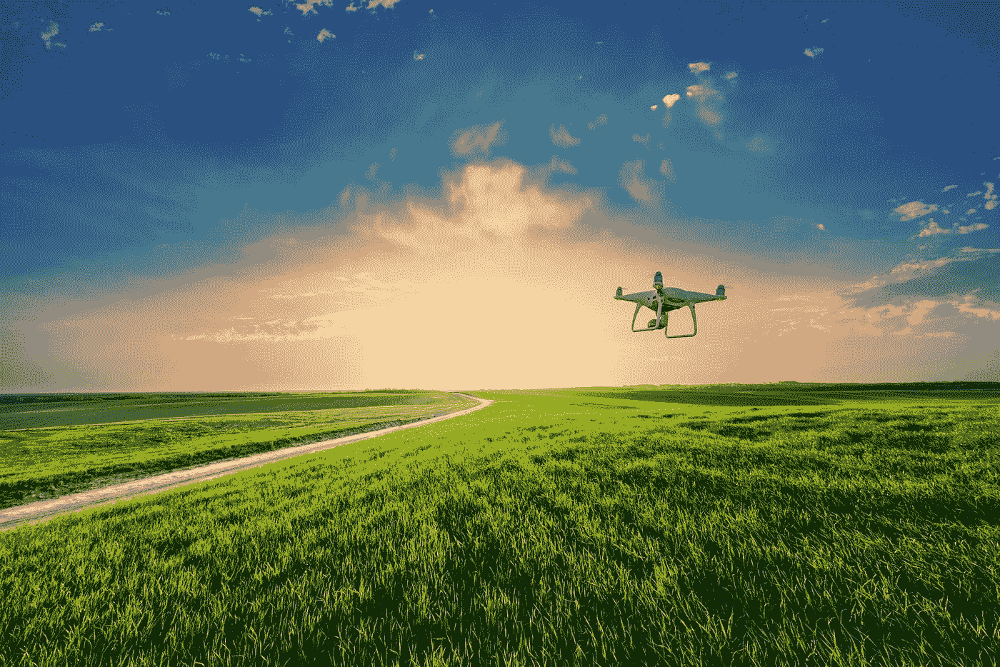

# 无人机打击+无人机艺术:技术是一把双刃剑

> 原文：<https://medium.com/codex/drone-strikes-drone-art-the-double-edged-sword-of-technologies-9acbc02c4479?source=collection_archive---------9----------------------->

## 两全其美。

照片由*鲁斯兰·伊万佐夫*

去年夏天，我和几个朋友在坦慕尼山徒步旅行。我们到达这个美丽的远眺处。我们决定休息一下，观察一下风景。突然，一个嗡嗡的声音引起了我的注意。很快，一架无人驾驶飞行器出现在我面前几英尺处，转移了我对风景的注意力。

“这就是在《T2》*《移动艺术》* 的一集里的感觉，”我心想。

在很长一段时间里，我告诉人们这是我最喜欢的网飞秀:一部没有任何旁白、由古典音乐伴奏的自然纪录片。(我姐姐 Siri 认为*移动艺术*让她接触到了她最喜欢的艺术家之一——鲁多维科·艾奥迪的音乐。)

在解释了这个节目的前提后，我经常会遇到好奇的目光:无人机飞过风景，捕捉“大自然中的瞬间，而不是其中那些人的生与死。”⁵当人和动物出现在画面中时，你会大吃一惊。

高中毕业后的那个夏天，在我开始上大学之前的一次生存危机中，我对运动艺术的喜爱与日俱增。然而，我并没有完全解释为什么我喜欢观看无人机在世界各地飞行的摄影作品，或者一朵花的延时镜头。事实上，直到去年秋天，我在一堂关于人工智能和算法数据挖掘的课上，无人机作为一种战争技术的例子出现时，我才完全忘记了移动艺术。

我相信，我第一次了解无人机袭击是在中学历史课的背景下，也是通过新闻报道中传播的信息，这些新闻报道评论了无人机在抓捕奥萨马·本·拉登和监视基地组织营地中的作用。

在中东战争的背景下不断听到无人机的消息——美国最常以巴基斯坦、阿富汗、索马里或也门的恐怖分子为目标——我觉得无人机总是很遥远，它的重要性在世界的另一个地方发挥，离我很远。我受到詹妮弗·李在她的书《机器人幻想世界》中所说的“这里”的保护，一个“受保护的特权”空间，“在这里，这种极端的暴力行为据说是不可想象的。”⁷

我现在意识到渲染无人机存在于一个不同的世界的讽刺，因为无人机本身挑战邻近性，重组“距离/亲密度”。⁷无人机战争的概念与我的生活“无关”，这让我有机会不对这种技术产生恐惧，只是因为我亲自接触无人机是为了军事化框架之外的目的。

我成长的环境允许我将无人机视为治疗技术，而不是种族暴力和非人化的技术。在高中，我会在课间休息时观看无人机拍摄的风景——这是我对当前现实的“逃离”。这让我有机会至少想象探索一个与我生活的空间完全不同的空间意味着什么。

然而，我很快发现，许多其他人也将无人机镜头作为一种放松和“逃避现实”的方式。无人机促进了治疗实践:残疾人和行动不便的人使用无人机来帮助他们重新获得日常生活中可能缺乏的运动和活力——退伍军人驾驶无人机来缓解 PTSD 的症状。

在为我的人工智能和算法数据挖掘课程阅读 Rhee 的*机器人想象*时，我开始意识到无人机作为一种治疗实践*在其军事化框架*内的吸引力。无人机在无人机操作员的心理中实现的全知幻想让他们有机会暂时体验“看到一切……听到一切……知道一切”的感觉。⁷

*移动艺术*是否让我看到了一种视觉视角，这种视角可以满足我对自己生活拥有更大控制权的愿望，至少是暂时的？

我对无人机的吸引力是因为它的“同时隐形和无所不在”吗？这是基于它构建了一个控制论的“人机混合体”，可以让我生活在一个空间既存在又不存在的幻觉中？⁷

有趣的是，我对这个节目的看法在遇到 Rhee 的文章后发生了变化。我现在意识到*移动艺术*，为了娱乐西方观众而捕捉“异国情调”的地方，强化了“那边”和“这里”的二元对立。⁷

塑造当今对无人机态度的殖民主义和帝国主义的历史在这部剧中得到了呼应，通过监视和开发“外国”土地以获取金钱利益——这取决于它在娱乐业的成功。

*移动艺术*传达的空间差异可能是无害的，只是因为这些电影制作人没有利用无人机作为摄影背后的技术。此外，人们可以争辩说，该展览促进了“他人的道德共存”，而不是加强空间差异。⁷在这种情况下，无人驾驶飞机不服务于煽动暴力的目的，因此非人化的问题可能不适用。

然而，专门寻求纪念无人机受害者的生活并创造性地表现社区之间团结的无人机艺术，往往在传达这一信息方面有所欠缺，因为像[雷顿和贝利的*家用无人机*](https://dronecenter.bard.edu/interview-heather-layton-and-brian-bailey/) 和[马勒的*无人机阴影*](https://www.moma.org/interactives/exhibitions/2013/designandviolence/drone-shadow-james-bridle/) 这样的艺术作品是基于这样一种基础而创作的，即无人机袭击对像我这样生活在新泽西一个普通小镇的人来说是“异常暴力”，而对世界另一端的人来说却很平常。⁷

试图传达团结的艺术作品可能会通过在“这里”和“那里”之间设定二元对立来传达双重信息。

在我结束对无人机的思考时，我想评价一下这项技术的双重功能。这种征服和非人化人口的技术，将我们降低到这样的“可计算和分类的过程”(当我们考虑 2010 年无人机袭击被误认为恐怖分子的无辜阿富汗平民时，其准确性和可靠性是值得怀疑的)，也可以将自己作为治疗的促进者。⁷在评估无人机作为一种既使用暴力又使用治疗手段的战争技术的有利和不利后果时，我开始意识到“技术是一把双刃剑”的概念如何适用于无人机之外的许多其他技术。

*   脸书和 Instagram 允许我们将我们的观点和照片编辑到一个平台上，让我们能够与朋友和家人数字化地分享我们的生活，然而，正如[约翰·切尼-利波尔德](https://ijoc.org/index.php/ijoc/article/viewFile/8680/2245)所指出的那样，这些平台使用“软生物政治”，即没有控制的控制，通过将我们的在线自我提炼为“算法身份”，有利于公司评估营销策略——社交媒体上真实/真实的表现被这种“数据监督”低估了。
*   个性化的健身跟踪应用程序，如 Whoop 和 MyFitnessPal，为我们提供了 Natasha Schull 所说的关于我们生活方式的“第四人视角”,并允许我们减轻一些自我护理的责任，然而，这些旨在促进我们健康的应用程序具有创业动机，试图获得尽可能多的用户，从而助长成瘾——在某种程度上，用户可以在未经同意的情况下使用这些应用程序，并会避免删除它们，因为他们依赖“自我数据库”而不是自己的直觉。⁸
*   护照和签证等移动技术保护了边境通道，然而正如[西蒙·布朗](https://journals.sagepub.com/doi/10.1177/0896920509347144)所指出的，这些技术可以“强化传统的权力和权威性别模式”。面部识别软件和虹膜扫描等生物监测技术可以有效地计算和测量活体，但这些技术的运作是基于白人的原型和“无种族主义”，即他们如何“优待白人，或至少是亮度”。
*   [伊莱扎和 Woebot](https://99percentinvisible.org/episode/the-eliza-effect/) 可以让人们更容易获得心理治疗，但人类可能会陷入“将计算机拟人化，并相信程序理解(我们的)人类行为”的陷阱，尽管它们并不理解——更不用说这些技术的隐私和安全问题了。⁶
*   我遇到的关于技术的双刃剑的最不和谐的例子是艾娃，一个来自电影 *Ex 玛奇纳*的虚构人工智能，它可以教会我们人类行为的社会结构，但具有愚弄、杀戮和逃跑的能力/智能。

无人机、社交媒体平台、自我跟踪应用、im(移动性)技术和人工智能的这些例子证明，只要技术创新有望提高我们社会的效率和进步，我们就会权衡成本和收益，并且几乎总是会忽略一项技术的不利后果，因为它有改善人类生活某个方面的令人信服的承诺。

**来源**

1.  布朗，西蒙。2010."数字表皮化:种族、身份和生物统计学."批判社会学 36(1):131–150。
2.  约翰.切尼.利波德。2017.《我们是数据:算法和我们数字自我的形成》导论。纽约:NYU 出版社。
3.  戴利，列兵:大卫。“无人机意想不到的好处:拯救生命。” *Boomer Magazine* ，2019 年 1 月 14 日，[www . Boomer Magazine . com/unexpected-benefits-of-drones-saving-life-and-provide-therapy/。](http://www.boomermagazine.com/unexpected-benefits-of-drones-saving-lives-and-providing-therapy/.)
4.  “无人机战争。”【www.thebureauinvestigates.com/projects/drone-war.新闻调查局，[，](http://www.thebureauinvestigates.com/projects/drone-war.)
5.  *网飞移动艺术*。movingart.com/netflix/.
6.  播客:“伊莱扎效应”，99%看不见
7.  李詹妮弗。2018.“关心。”机器人想象:人类和非人劳动的价格。明尼阿波利斯:明尼苏达大学出版社。
8.  娜塔莎·舒尔。2016."生活数据:可穿戴技术和自我保健的设计."生物社会学 11:第 317-333 页。