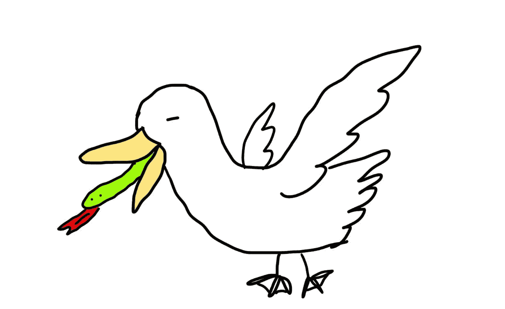

# 鸭子打字——它到底意味着什么

> 原文：<https://medium.com/codex/duck-typing-what-it-means-exactly-3099215f91c3?source=collection_archive---------7----------------------->

## #去他的鸭子的例子

有多少人听过这句名言:

> 如果它走路像鸭子，叫声像鸭子，那么它一定是一只鸭子

然后说“等什么”？不幸的是，当我读这本书的前几遍时，我确实理解了，直到很久以后，我才真正理解了鸭子打字。所以这篇文章发给所有…