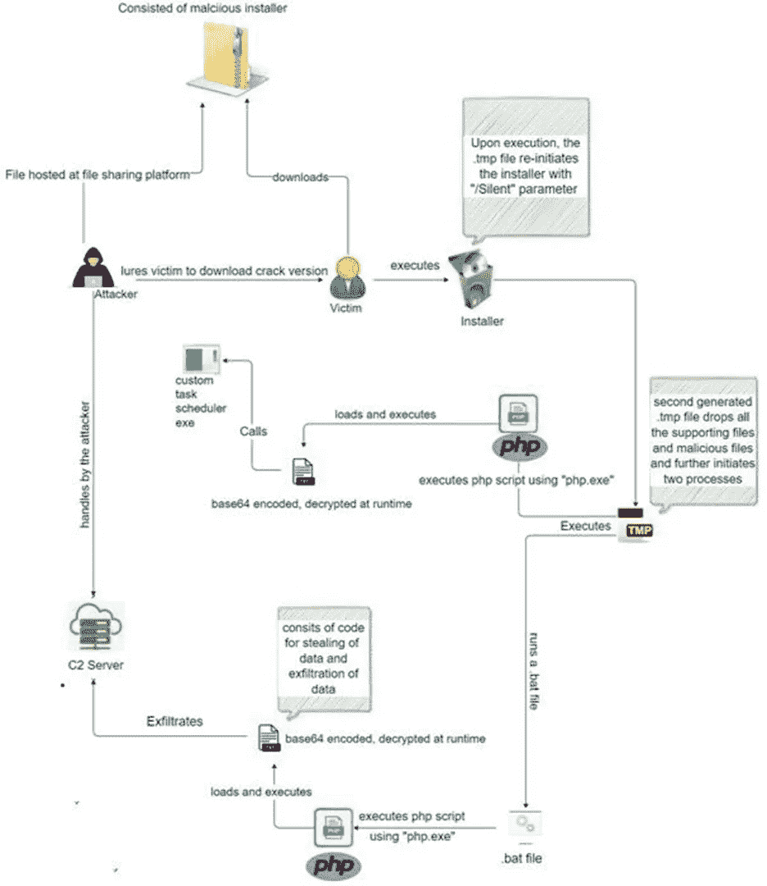

# 鸭尾恶意软件

> 原文：<https://medium.com/codex/ducktail-malware-2ad40fba3e02?source=collection_archive---------14----------------------->

作者= [anshul vyas](https://www.instagram.com/_ansh_vyas/)

由[迈克尔·盖格](https://unsplash.com/@jackson_893?utm_source=medium&utm_medium=referral)在 [Unsplash](https://unsplash.com?utm_source=medium&utm_medium=referral) 上拍摄的照片

# 什么是鸭尾恶意软件？

根据 WithSecure 情报报告，鸭尾恶意软件是一种恶意软件，几年前起源于越南，自 2021 年以来一直存在。该软件正在不断更新，以包括新的功能，使其能够绕过脸书的安全措施。它的主要目的是劫持脸书的广告和商业账户。

# 它是如何工作的？

在这种恶意软件中，网络犯罪分子搜索脸书的商业/广告平台，寻找潜在目标，并锁定高级用户。使用处于重要或完全控制之下的脸书商业页面，目的是获取受害者的账户。例如，DUCKTAIL 的理想受害者应该拥有管理员权限或财务编辑权限。删除和管理企业帐户(例如，首选项、权限、角色、工具等。)同前者。

网络罪犯将能够查看财务数据(如交易、发票、支出、支付方式、信用卡等)。)并通过劫持后者来滥用它。一旦 DUCKTAIL 被成功渗透，它就开始检查已安装的浏览器，特别是 Google Chrome、Mozilla Firefox、Microsoft Edge 和 Brave。为了提取与脸书会话相关的 cookie，恶意软件试图识别并提取 cookie 路径。

恶意程序可以使用这些 cookies 来访问受害者的脸书帐户，并收集它能找到的任何相关信息(如安全凭证)以获得访问权限。DUCKTAIL 还检查是否需要双因素身份验证，如果需要，它会尝试获取恢复代码。除了会话 cookies，恶意软件还可以窃取访问令牌、用户代理、IP 地址(地理位置)和 2FA 代码。

在大多数情况下，Ducktail 通过与个人身份相关的脸书账户窃取商业账户。该恶意软件将网络罪犯掌握的电子邮件与脸书的商业账户结合起来，从而建立对账户的控制。它收集受害者的姓名、生日、电子邮件地址和用户 id 等信息。

在与 DUCKTAIL 相关联的账户或企业被攻破的情况下，DUCKTAIL 收集以下信息:名称、验证状态、连接的账号、广告支出和支付周期、广告账户许可、货币设置、待定用户、所有者、成员角色、链接的电子邮件和客户信息等。

鸭尾感染可能会导致严重的隐私问题、经济损失和身份盗窃等。如果您怀疑您的设备感染了 DUCKTAIL(或其他恶意软件)，我们强烈建议使用防病毒软件立即删除该恶意软件。如果您怀疑您的帐户已被破坏，请立即联系脸书官方支持。如果可能，将多因素身份验证与双因素身份验证配对，确保您的密码安全可靠，并明智地设置访问、权限和隐私设置。

# DUCKTAIL 怎么渗透你的电脑？

根据 WithSecure Intelligence 的说法，这种恶意软件是通过 LinkedIn 传递的，在某些情况下，它是为潜在的受害者量身定制的。WithSecure Intelligence 的研究人员还注意到，启动 DUCKTAIL 感染链的感染文件托管在 Dropbox、MediaFire 和 iCloud 等云服务上。文件通常以(通常是通用的)与业务相关的名称(通常是通用的)存档。

一般认为恶意软件是通过网络钓鱼和社会工程传播的。恶意文件可能有多种格式，包括归档文件(ZIP，RAR)、可执行文件(。exe，。运行)、微软 Office 和 PDF 文档、JavaScript 等。当感染文件被执行、运行或以其他方式打开时，恶意软件下载/安装过程开始。

有多种方法用于分发恶意软件，包括路过式下载(秘密/欺骗性)、垃圾邮件附件/链接、在线诈骗、不可信的下载源(例如，免费软件和第三方网站、P2P 共享网络等)。)、恶意广告、非法程序激活工具(“破解”)和虚假更新。

# 如何避免安装恶意软件？

如果您收到可疑或无关的电子邮件或信息，请确保不要打开其中包含的任何附件或链接，因为它们可能会导致系统感染。浏览时也要小心，因为欺诈和恶意网站往往乍看起来像是合法的。

也建议从官方和认证的渠道下载。由于非法激活(“破解”)工具和假冒更新程序可能包含恶意软件，所有程序都必须使用正版开发者提供的工具进行激活和更新。安装一个有信誉的防病毒程序并保持更新是至关重要的。

# 常见问题(FAQ)

1.  **duck tail 恶意软件的目的是什么？**

大多数恶意程序的目的都是为了创收，DUCKTAIL 也不例外。然而，同样值得一提的是，恶意软件可以出于测试目的或为了给攻击者带来无意义的伤害而发布。此外，恶意软件被用于政治/地缘政治原因以及个人恩怨。

**2。如果我的计算机感染了 DUCKTAIL 恶意软件，我需要格式化我的存储设备吗？**

没有必要为了去除鸭尾巴而采取如此激烈的措施。

**3。DUCKTAIL 恶意软件会导致各种问题。最大的有哪些？**

该软件专门针对脸书病毒感染威胁，包括帐户(个人、商业、广告等)。)、财务损失和身份盗窃。

**4。你能告诉我如果我的账户被盗了该怎么办吗？**

如果您怀疑您的个人身份、财务或其他易受攻击的信息已经暴露，请立即联系相关部门。立即更改所有潜在受损帐户的密码。其次，告知他们官方的支持。