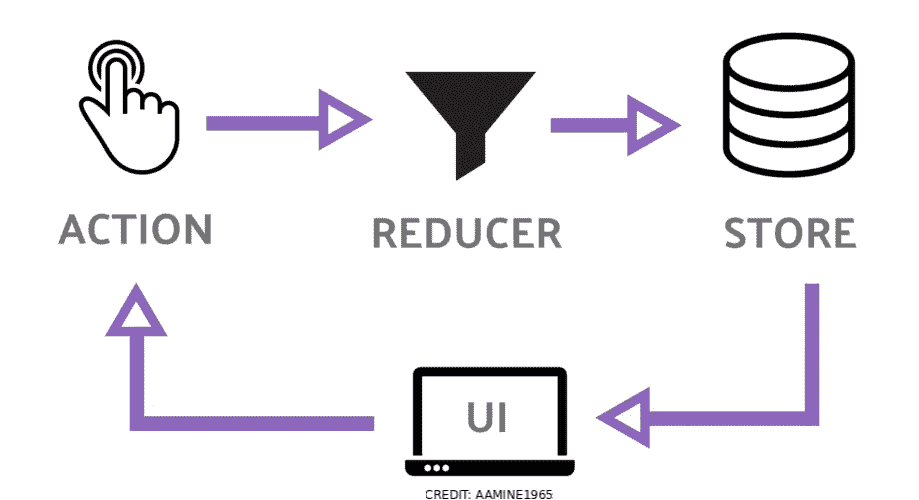
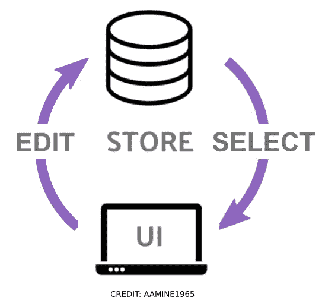

# 戒掉重复的习惯

> 原文：<https://medium.com/codex/dumping-redux-wasnt-so-hard-578a0e0bf946?source=collection_archive---------14----------------------->



经典冗余状态变化传播

我喜欢 Redux 隔离的业务逻辑和可预测的变更传播模式，但是样板文件看起来像是纯粹的开销。Redux Toolkit 有所帮助，但复杂性仍然存在。为什么在 React 应用中干净地管理状态会如此困难？

并没有。

直觉上，所有这些间接的层次似乎都是不必要的，但是只有一种方法可以证明这一点——突然戒除法！最后，很容易用更简单的东西替换 Redux。

# 两个箭头功能

绑定到状态和启动对状态的更改只需要两个箭头函数就可以实现:一个选择器和一个编辑器。我将使用经典的计数器应用程序作为说明。

选择器看起来像这样…

```
(state) => state.counter
```

一个编辑长这样…

```
(draft) => (draft.counter += 1)
```

使用这些函数，您可以使用一个简单的 javascript 对象绑定状态、触发和跟踪更改。

# 一个最小的例子

上面的编辑器和选择器函数来自一个示例 Javascript [计数器应用](https://codesandbox.io/s/github/cefn/lauf/tree/main/apps/counter-js)(参见 Typescript 中的等效[版本)。](https://codesandbox.io/s/github/cefn/lauf/tree/main/apps/counter)

在示例应用程序中，编辑器在业务逻辑模块中定义，并由 ui 事件调用。

选择器嵌入在每个 React 组件中，因此很容易跟踪它订阅了应用程序状态的哪一部分…

在下面的沙盒中查看完整的行为及其来源。

计数器应用程序沙箱

这种彻底的简单性背离了 Flux/Redux 模型——在该模型中，我们会有一个动作类型、一个结构化的有效载荷定义、一个动作创建器、一个 thunk 创建器，其结果通过一个调度程序发送，以便(希望)与一个 reducer 和一些中间件中的相应行为保持一致。

使用一个最小的不可变存储，变更传播开始看起来像这样…



没有动作和 Reducer 样板文件的更改传播

## 孤立的业务逻辑

互联网上充斥着说“你可能不需要 Redux”的文章，然后这些文章推荐依靠完全依赖于 React 原语并与 render 循环可怕地混合在一起的状态管理。您可能不需要 Redux，但是有一些选项。

编辑器和状态应该独立定义，与 React 组件分开。这导致完全隔离的、可预测的和可测试的业务逻辑，并确保从 React 切换到 React Native 或 Vue 或 Svelte 或未来带来的任何事物的自由。

那么，我们如何为不可变状态定义一个容器来连接我们的编辑器和选择器功能呢？

## 快速捷径

[柜台演示](https://codesandbox.io/s/github/cefn/lauf/tree/main/apps/counter-js)使用来自 [@lauf/store-react](https://www.npmjs.com/package/@lauf/store-react) 的[商店对象](https://cefn.com/lauf/api/interfaces/_lauf_store.store.html)。我编写并测试了这个 NPM 模块来体现所提出的方法，但它只是您可以自己编写的几行代码。

Store 只保存一个 Javascript 对象作为状态，有一个 ***edit*** 方法接受编辑器函数来改变状态，并在编辑完成时通知订阅者。[***use selected***React binding](https://github.com/cefn/lauf/blob/main/modules/store-react/src/index.ts)只是一个挂钩，用于设置订阅，并过滤与选择器匹配的更改。

您可以按照自己的意愿将存储传递给组件——它包装了一个变化的对象，但它自己的引用永远不会改变。在 Counter 应用程序中，商店是在父组件中创建的，并传递给 props 中的子组件。对于深度嵌套的组件，你可能应该使用 [React 上下文 API](https://reactjs.org/docs/context.html) 来传递它。

## 具体来说:使用选择的反应钩子

一个选择器函数被传递给 [useSelected 钩子](https://cefn.com/lauf/api/modules/_lauf_store_react.html#useselected)来订阅一个遵循这个基本签名的 React 组件…

```
 const value = useSelected(store, selector)
```

这将在每次渲染时从存储中检索您选择的值。它还确保无论何时编辑后您选择的值不同，您的 React 组件都会被*重新渲染*(根据 [Object.is](https://developer.mozilla.org/en-US/docs/Web/JavaScript/Reference/Global_Objects/Object/is) )。

## 具体来说:商店编辑方法

在这个基本签名之后，一个编辑器函数被传递给商店的[编辑方法](https://cefn.com/lauf/api/interfaces/_lauf_store.store.html#edit)

```
store.edit(editor)
```

您的编辑器被传递一个状态树的副本来进行编辑。

就像 Redux 一样，从不修改原始状态树意味着当状态或状态的一个[选择的](https://cefn.com/lauf/api/modules/_lauf_store.html#selector)分支与之前的 ***项*** 相同时，保证包含所有与之前相同的 ***值*** 。致力于不变性允许您的业务逻辑、呈现器和记忆器使用“浅层相等检查”。他们可以有效地检查对项目的更改何时应该触发重新渲染或重新计算——只需在`Object.is(prevItem,nextItem)===false`时。

为了确保不变性，Lauf 依赖 Redux Toolkit 使用的 [Immer](https://immerjs.github.io/immer/) 库[。你的编辑是通过一个 Immer 草案，而不是真正的状态。您可以使用普通的 javascript 赋值和操作在编辑器函数中操作草稿。当您的函数返回时，Immer 编写一个新的不可变状态来与您所做的更改保持一致，重用任何未更改的部分。您可以在编辑器函数中使用常规的 javascript 语法和数据结构，而不用考虑不变性。](https://redux-toolkit.js.org/usage/immer-reducers)

## 具体来说:变更传播

变化会自动传播。编辑完成后，只有编辑更改了选定值的组件才会触发渲染。

就是这样！

# 轮到你了

请在评论中分享你的想法。我期待着找到这种方法的漏洞:)

我错过了什么来证明 Redux 和 friends 的所有额外层？

# 跟进:一个复杂的例子

为了回答这种担心，即这只适用于简单的应用程序，如计数器，下面的 Snake 应用程序是一个更复杂的例子，它也使用 [@lauf/store-react](https://www.npmjs.com/package/@lauf/store-react) 作为业务逻辑。

该应用将游戏状态与动画和输入事件相结合，[由多个并发脚本](https://github.com/cefn/lauf/blob/main/apps/nextjs-snake/src/logic.ts)控制。然后使用选择器将生成的动态状态绑定到 React UI。

它使用箭头键来控制方向，但由于其业务逻辑完全隔离，游戏体验可以很容易地移植到触摸屏上基于拖动输入的界面或 Javascript 运行的任何其他地方。

## 详细来说:使用 followSelector 订阅

因此，如果业务逻辑需要对变化的状态做出响应，那么 Snake 应用程序如何在没有反应的情况下工作呢？

为了在没有 React [useSelected](https://cefn.com/lauf/api/modules/_lauf_store_react.html#useselected) 钩子的情况下监视状态变化，Snake 应用程序使用了来自 [@lauf/store-follow](https://www.npmjs.com/package/@lauf/store-follow) 的便利的 [followSelector](https://cefn.com/lauf/api/modules/_lauf_store_follow.html#followselector) 方法，该方法没有 React 依赖项。在下面的摘录中 ***followSelector*** 在蛇的头部位置每次改变时调用一个回调。它检查它是否已经与水果碰撞…

点击 Snake App 播放或拖动分隔符查看源代码。