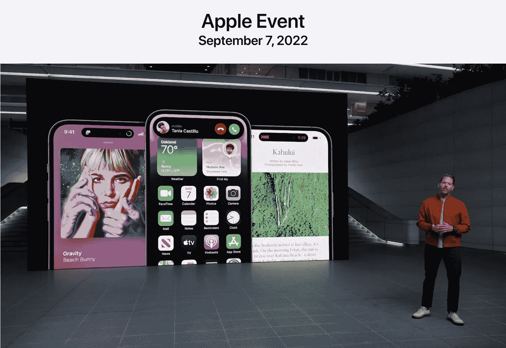

# 您需要额外付费的动态岛功能

> 原文：<https://medium.com/codex/dynamic-island-feature-you-pay-extra-for-d7446c34c19f?source=collection_archive---------0----------------------->

## 看看它带来了什么

毫无疑问，新 iPhone 14 Pro (Max)最显著的变化是苹果公司称之为动态岛的到来。这特别取代了传统 iPhone 14 (Plus)的经典镂空部分，当然，也取代了旧款。

来源:苹果 Keynote

动态岛剪切看起来确实很优雅，苹果再次展示了…