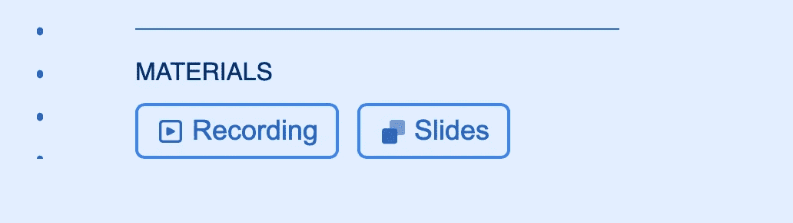
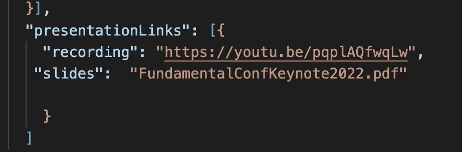
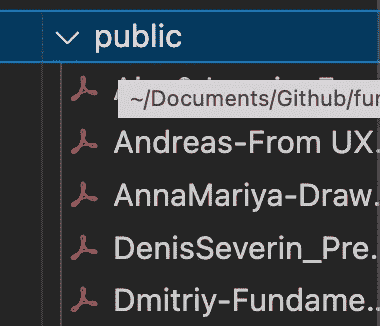

# for 循环| Vue3 中的动态 PDF 文件

> 原文：<https://medium.com/codex/dynamic-pdf-file-in-for-loop-vue3-f5b723eea8ac?source=collection_archive---------11----------------------->

## 基础会议 2022 网站

图片由[曲德](https://unsplash.com/@curvd)在 [Unsplash](https://unsplash.com) 拍摄。

如果你想在 Vue3 中打开或下载一个动态的 PDF 文件，你就来对地方了。类似于我在动态 img src 文章中展示如何获取特定的图像并在项目列表中显示它们，我将向您展示如何在项目列表中获取和显示 PDF 文件。

作为参考，我将使用[**Fundamental Conference 2022 网站。**](https://fundamentalconf.com/#/agenda) 如果您没有机会参加会议，我们已经在我们的[**议程页面**](https://fundamentalconf.com/#/agenda) **上附上了所有的录音和演示材料。**

截图来自[基本面会议网站](https://fundamentalconf.com/#/agenda)

## 要求

项目这一部分的要求是在不同的选项卡中打开幻灯片。但是，我也将展示帮助下载 pdf 文件的技巧。列表中的不同项目有不同的幻灯片。

**注意:**我见过使用不同库的不同解决方案。虽然，对于这种类型的需求，我不认为有必要用更多的库来过载这个项目。

## 解决办法

JSON 文件的屏幕截图

对于这种类型的项目，没有很多数据，所以我们将 JSON 文件存储在本地，而不是使用数据库。上面的截图是数据如何存储在 JSON 文件中的一个片段。这个想法是循环通过**演示链接**并获得幻灯片的文件名。演示文稿的幻灯片被转换成 pdf 文件，以便每个用户都可以访问。

另一种方法是用路径名存储文件名并直接使用它们，但这意味着每个幻灯片名称都有点重复(查看*[***干货***](/technology-hits/dry-dont-repeat-yourself-c1a8086530be) )。此外，在这篇文章的后面，你会看到为什么使用路径名不是一个好主意。*

*In the code snipped above, I have looped through the presentations links in the*

*然后在*   中我检查**链接.幻灯片**是否存在，如果存在我通过< a :href >得到文件的链接。如你所见，这里没有路*

*`<a :href=require(`../assets/pdf/${links.slides}`)>`*

*这是因为幻灯片都保存在公共文件夹中。公共文件夹是我们必须**存储静态资产的文件夹，比如 CSS 文件和图像，以及不会随时间变化的媒体文件**。放置在公共文件夹**中的任何静态资产将被简单地复制，而不会通过 webpack** 。如果您试图将 pdf 文件保存在保存所有组件的 **src 文件夹**中，VUE 会抱怨并要求包含一个 webpack 以便阅读 pdf 文件。如果你的项目需要在上面读和写，那么使用 webpack 和一些库来做这些是个好主意。在我们的例子中，我们的 pdf 不会随着时间而改变。*

**

*来自基础会议 2022 代码的截图*

***在新标签页中打开 pdf 文件***

*如果你想在一个新的标签页中打开 pdf 文件，你只需要添加`target=”_blank” rel=”noreferrer”`，它会帮助你在一个新的标签页中打开。*

*`<a :href=”links.slides” target=”_blank” rel=”noreferrer”>`*

***下载 pdf 文件***

*如果你想下载 pdf 文件，你可以简单地在标签<中添加`download` 属性。这将帮助您下载与保存在公共文件夹中的 pdf 文件同名的文件。*

*`<a :href=”links.slides” download>`*

*但是，如果你想下载一个新名字的 pdf 文件，你可以简单地添加文件名(静态或动态)*

*`<a :href=”links.slides” download="New name">` → ***静态****

*`<a :href=”links.slides” :download="links.title">` → ***动态****

*如果你是 VUE 语言的初学者，我希望这篇文章对你有所帮助。开心快乐编码！*