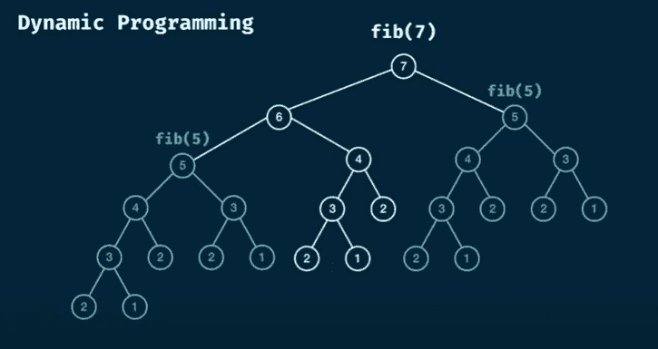
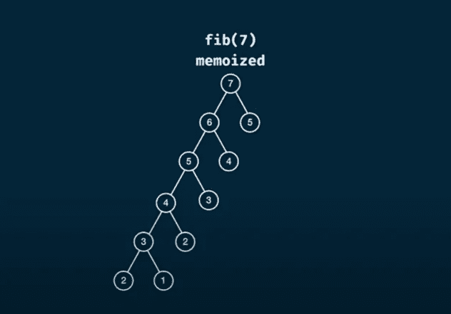

# 动态编程:概述和实现

> 原文：<https://medium.com/codex/dynamic-programming-an-overview-and-implementation-e29aa424bad7?source=collection_archive---------39----------------------->

动态规划是以最佳方式解决复杂问题的算法方法。基本上，一个复杂的问题被分成多个更简单的子问题，这些子问题更容易解决，最终的解决方案取决于所有子问题的解决方案。

动态规划问题涉及递归模式，其中解决方案是从最基础的情况一直向上构建到最高层。因此，它在时间和空间复杂性方面相当密集。但是人们很少使用一些技术来优化他们的解决方案，因此他们的算法需要更少的时间和内存来执行。最受欢迎的有:

*   记忆化
*   表格

**记忆:**

由于递归算法的性质，许多子问题是重复的，但又被解决了。例如，考虑以下斐波纳契数列:

*0，1，1，2，3，5，8，13，…*

我们知道序列中的每个 Fib(n)都等于 Fib(n-1)+Fib(n-2)。让我们看看代码和它的树形结构:

```
const Fib = (n) => {
    if(n <= 1) return n;

    return Fib(n-1) + Fib(n-2);
}console.log(Fib(7));
```



coderbyte.com

从这个树形图中我们可以看到，要计算 Fib(7)，就得计算 Fib(6)和 Fib(5)。并且为了计算 Fib(6)，Fib(5)需要与 Fib(4)一起被再次计算，并且这个循环继续。

估计时间复杂度:O(2^n)

估计的空间复杂度:O(n)

> 记忆是一种技术，在这种技术中，我们存储子问题的解决方案，以便我们可以在以后需要时使用它们，因此避免了重复。

让我们看一下记忆解决方案:

```
const Fib = (n, memo={}) => {
    if(n in memo) return memo[n];
    if(n <= 1) return n;

    memo[n] = Fib(n-1, memo) + Fib(n-2, memo);
    return memo[n];
}console.log(Fib(7));
```



Fib(2)、Fib(3)、Fib(4)、Fib(5)被计算一次并存储在 memo 对象中以备后用。因此，这种方法计算结果快得多。

估计时间复杂度:O(n)

估计的空间复杂度:O(n)

**制表:**

使用这种技术，动态问题被迭代地而不是递归地解决。基本上，在确定了主要问题和它的子问题之间的关系之后，我们从最基本的情况开始，直到解决主要问题。结果被存储在适合于这类问题的数据结构中。

让我们用这种方法解决同一个 Fib(n)问题:

```
const Fib = (n) => {
    const sequence = new Array(n+1).fill(0);

    //base case
    sequence[0] = 0;
    sequence[1] = 1;
    // relation: sequence[i] = sequence[i-1] + sequence[i-2];

    for(let i = 2; i <= n; i++){
        sequence[i] = sequence[i-1] + sequence[i-2];
    }
    return sequence[n];
}console.log(Fib(n));
```

这是优化动态问题解决方案的另一种方式。

估计时间复杂度:O(n)

估计的空间复杂度:O(n)

> **记忆**和**列表**都可以有效减少动态规划算法的执行时间和内存。在**记忆**中，我们通过存储结果以备后用来解决这个问题，在**列表**中，采用迭代方法而不是递归。