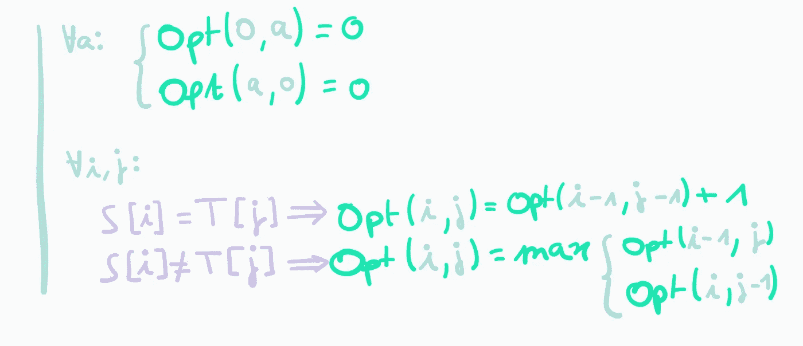
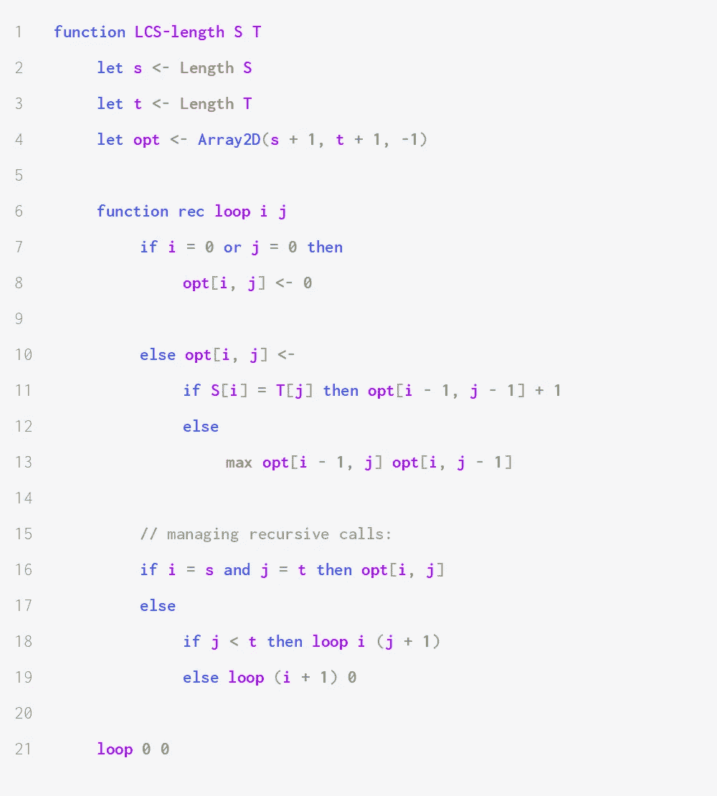
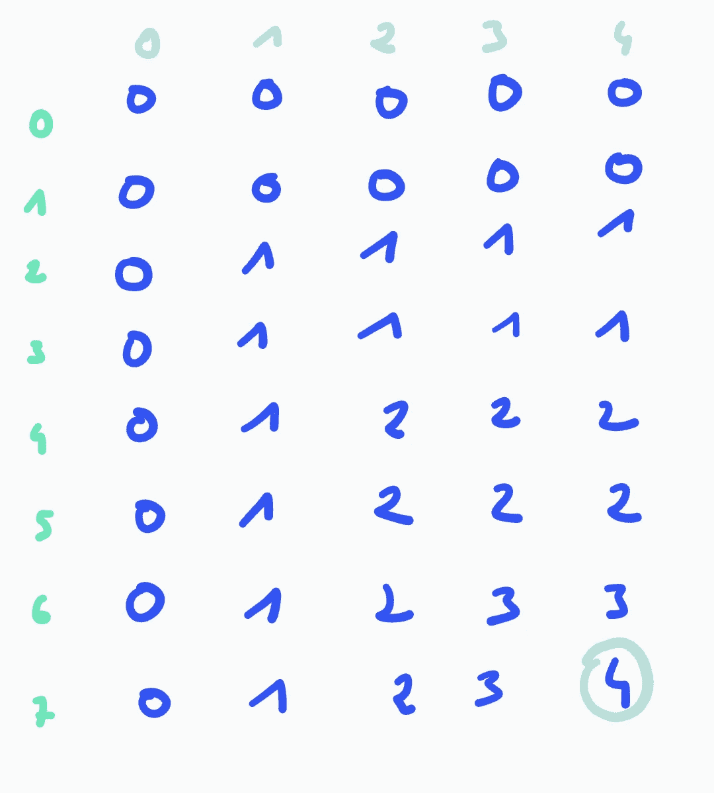
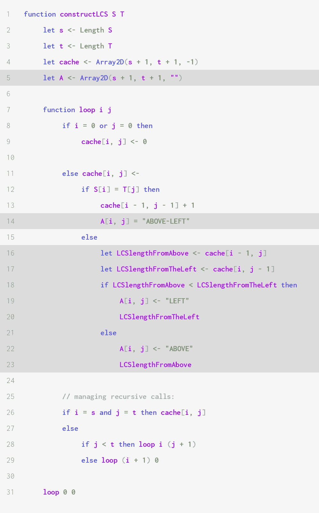
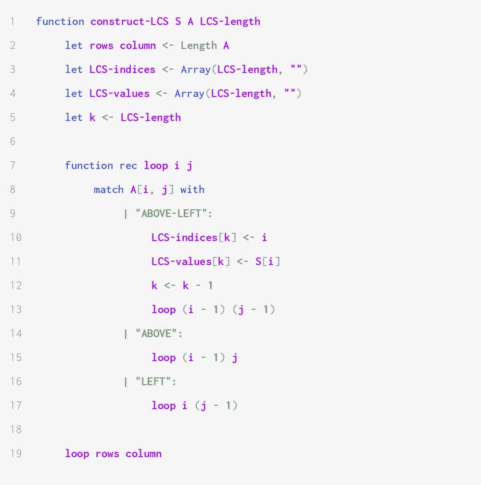

# 动态规划:如何解决最长公共子序列问题

> 原文：<https://medium.com/codex/dynamic-programming-how-to-solve-the-longest-common-subsequence-problem-88f2110e12c8?source=collection_archive---------3----------------------->

本文描述了最长公共子序列问题，并推导和分析了解决该问题的算法。

最长公共子序列问题在许多领域都有应用，包括版本控制。例如，给定两个文本 A 和 B(由单词序列表示),使得 B 是 A 的更新版本，从 B 中寻找保持不变和被修改的摘录归结为寻找 A 和 B 的最长公共子序列。

下图说明了上一个示例。突出显示的单词是最长公共子序列的一部分。

更正式地说，我们将大小分别为 *N* 和 *M* 的序列 *S* 和*S’*的公共子序列定义为严格递增序列 *X* ，其值在[1，…，*N*×[1，…， *M* 中，使得对于*的所有值( *i* ， *j* *增加*正是在 *a* ≤ *c* 和 *b* ≤ *d* 时，使用( *a* ， *b* ) ≤ ( *c* ， *d* )定义的关系。*

一种简单的方法是检查第一个序列的所有可能的子序列，并检查它们是否也能在第二个序列中找到。某个序列 *S* 的子序列与 *S* 的索引子集一样多，即 2 个 *ⁿ* ，其中 *n* 是 *S* 的长度。因此，我们需要ω(2*ⁿ*)的时间来解决这个问题——但幸运的是，我们可以使用动态编程做得更好。

在整篇文章中，我将使用缩写 *LCS* 来表示*最长公共子序列*。

# LCS 问题的最优子结构

本节将展示我们如何推导出一个递归关系，以较小实例的解来表达 LCS 问题实例的解。

我们考虑两个序列:尺寸为 *s* 的 *S* 和尺寸为 *t* 的 *T* 。我们让 **Opt( *a* ， *b* )** 表示 S[1]的 LCS 的长度..a]和 T[1..b】。

如果 *s* = 0 或者 *t* = 0 那么 *S* 和 *T* 正好有一个 LCS，就是空序列。因此，对于所有的 *a* ，LCS 长度为 **Opt(0， *a* ) = Opt( *a* ，0) = 0** 。

假设现在 *s* 和 *t* 都是正的。我们将考虑两种情况:要么是*S*[*S*]=*T*[*T*]，要么是 S[s] ≠ T[t]。

如果*S*[*S*]=*T*[*T*，那么 *S* 和 *T* 的每个 LCS 都是通过将( *s* ， *t* )附加到*S*【1】的任意一个 LCS 上而构造的.. *s* -1】和 *T* [1.. *t* -1】。因此， **Opt( *s* ， *t* ) = Opt( *s* -1， *t* -1) + 1** 。

> **证明:** 我们通过证明左侧小于等于右侧，反之，右侧小于等于左侧来证明等式。
> 
> **证明 Opt(s-1，t-1) + 1 ≤ Opt(s，t) |** 设 X(长度为 X)是 S[1]的 LCS..s-1]和 T[1..t-1】。那么由 X'[i] = X[i]定义的长度为 x + 1 的序列 X '当 i ≤ x，X'[x + 1] = (s，T)是 S 和 T 的公共子序列，证明 x + 1 ≤ Opt(s，T)。代入 x，我们得到 Opt(s-1，t-1) + 1 ≤ Opt(s，t)
> 
> **证明 Opt(s，t) ≤ Opt(s-1，t-1) + 1 |** 设 Y(长度为 Y)是 S 和 t 的 LCS
> 
> (1)如果 Y[y] = (s，t)那么 Y' = Y[1..y-1]是 S[1]的公共子序列..s-1]和 T[1..t-1】。y '的长度为 y - 1 = Opt(s，t) - 1。这证明了 Opt(s，t) - 1 ≤ Opt(s-1，t-1)。
> 
> (2)如果 Y[y] = (u，v)且 u ≠ s 且 v ≠ t，那么我们可以通过将(s，t)附加到 Y 上来定义长度为 y + 1 的 Y*，从而与 Y 的最优性相矛盾。
> 
> (3)若 Y[y] = (u，t)其中 u ≠ s(分别为 Y[y] = (s，u)其中 u ≠ t)则 S[u] = S[s](分别为。T[u] = T[t])，根据公共子序列的定义。因此，我们可以用 s (resp)代替 u。用 t)并以(1)结束。
> 
> 因此，Opt(s，t) = Opt(s-1，t-1) + 1。
> 
> — *这就完成了证明。*

如果*S*[*S*≦*T*[*T*]那么 S 和 T 的 LCS 与*S*【1.. *s* - 1】和 T，或者与 S 和 *T* [1】的 LCS 相同.. *t* - 1】。因此， **Opt( *s* ，*t*)= max { Opt(*s*-1， *t* )，Opt(s，t-1)}** 。

> **证明大纲:**
> 
> (1)如果 Y 是 S[1]的公共子序列..s-1]和 T 那么 Y 也是 S 和 T 的公共子序列，所以 Opt(s-1，t) ≤ Opt(s，T)。
> 
> (2:证明 S 和 T 的 LCS 是 *S* 的 LCS[1.. *s* - 1]和 T 或 S 和 *T* [1.. *t* - 1】)设 X(长度为 X)是 S 和 t 的 LCS，如果 x = 0，证明是平凡的，所以我们假设 X 是非空的。设 u，v := X[x]。假设暗示(u，v)≦(s，t)。假设 u ≠ s(不失一般性，如果 v ≠ t 产生相同的结果，类似的论证)。那么 X 是 S[1]的公共子序列..s - 1]和 t .因此，x ≤ Opt(s-1，t)。
> 
> 由(1)得出 Opt(s，t) = max{Opt(s-1，t)，Opt(s，t-1)}，证明 X 是[1]的 LCS..s-1]和 t。这就完成了证明。

我们可以用下面的循环来总结最后几段:

## 编写解决方案

在不使用动态规划的情况下，使用我们之前推导的公式计算两个序列的 LCS 长度，在最坏的情况下，将需要指数级的许多步骤。这是因为我们需要进行两次递归调用，一次是计算 Opt( *i* -1， *j* )，另一次是计算 Opt( *i* ， *j* -1)，直到两个索引中的一个都为零。

由于实际上只需要计算 *s* * *t* 个不同的值(其中 *s* 和 *t* 是序列的长度)，动态编程允许我们在多项式时间内解决这个问题。

下面是计算两个序列的 LCS 长度的伪代码:

每次递归调用都会找到*S*【1】的最长公共子序列.. *i* 和*T*【1.. *j* 。当 *i* = s 并且 *j* = *t* 时，即当我们已经计算了 Opt( *S* ， *T* )时，循环终止。请注意，索引从 1 开始。

由于主循环在线性时间内运行，因此算法在θ(*ST*)时间内运行，并使用θ(*ST*)空间。

例如，当两个输入序列是 S = (1，6，3，5，10，6，8，9)和 T = (6，10，5，8，9)时，该算法逐行然后逐列构建以下矩阵:

有一个 LCS。它的长度为 4，对应于值(6，5，8，9)。

## 构建 LCS

如果我们不能明确地计算 LCS，寻找最大公共子序列长度可能不是很有用。正如我们之前研究的问题一样，这可以在不改变渐近运行时间和空间复杂度的情况下完成。我们将维护一个额外的二维数组 *A* 来记录我们如何构建 LCS。对于所有指数 I，j，A[i，j]表示 S[: i]和 T[: j]的 LCS 是否:

1.  通过将(I，j)加到 S[1]的子序列中来构造..i-1]和 T[1..j-1]或
2.  与 S[1]的子序列相同..i-1]和 T[1..j]或
3.  与 S[1]的子序列相同..i]和 T[1..j-1】。

为了保持直观，我们在第一种情况下将 A[i，j]设为`ABOVE-LEFT`，在第二种情况下设为`ABOVE`，在第三种情况下设为`LEFT`。

这给出了以下实现(修改后的行突出显示):

元素 *S* [ *i* ](或者等价地， *T* [ *t* ])是 LCS 的一部分的唯一情况是第一种情况，即当 A[i，j] = `ABOVE-LEFT`时。

这使我们能够从数组 *A* 构造一个 LCS，如下所示:

