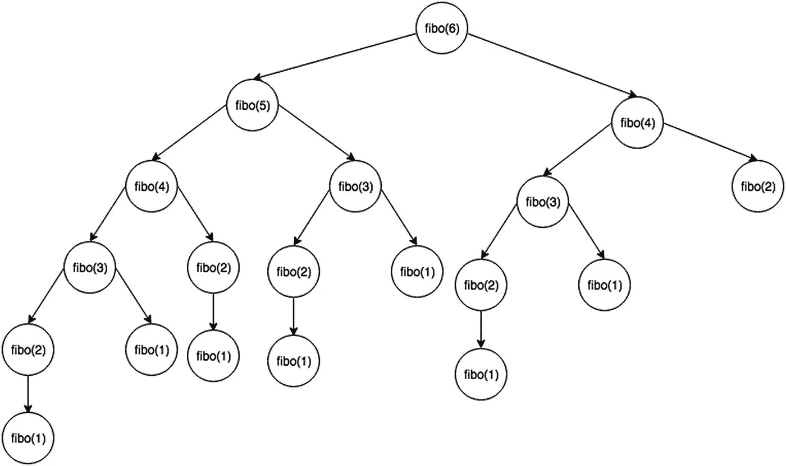
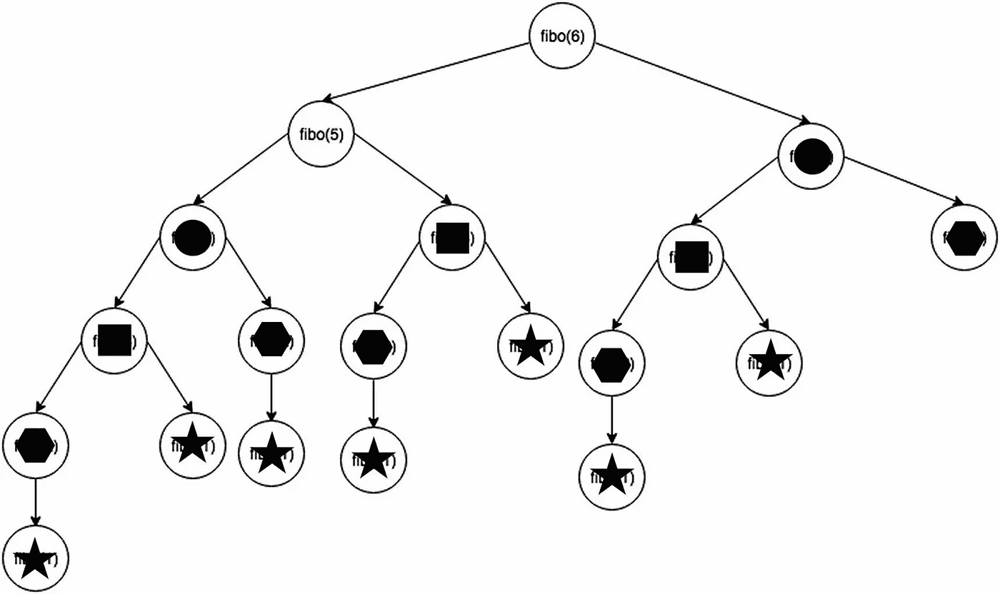

# 动态编程:节省递归时间

> 原文：<https://medium.com/codex/dynamic-programming-memoization-22aa7bfbf167?source=collection_archive---------7----------------------->


动态编程可能是学习数据结构和算法中最难的概念之一，这不是因为理解使用动态编程模式编写的解决方案特别困难，而是因为很难识别可以通过动态编程解决的问题，然后执行该解决方案。通常，DP 解决方案的一个可能性是编写递归解决方案的能力。然而，并不是所有的递归问题都可以用动态编程来改进，所以递归解决方案的存在并不是一个完美的提示。

要使用动态规划的递归解，必须满足两个条件:最优子结构和重叠子问题。为了探讨动态编程，我想先解释一下这些条件是什么意思，以及如何知道它们是否满足。

# 最优子结构

一个问题有最优子结构意味着什么？这意味着可以通过组合子问题的最优解来找到问题的最优解。这是动态编程的一部分，使得递归成为一条线索。因为递归，就其本质而言，要求子问题解决方案组合起来产生整体解决方案，所以递归解决方案是问题具有最优子结构的线索。

符合这个标准的一个例子是斐波那契数列，我在前面的[中已经提到过它作为递归的一个例子。因为斐波那契数列的*第 n 个*数是前两个斐波那契数之和，符合动态规划的最优子结构约束。](/codex/an-introduction-to-recursion-in-javascript-1f3c8e6055da)



一个递归斐波纳契数生成器的图表，展示了它是如何符合最优子结构标准的。

# 重叠子问题

这种可以通过动态规划解决的问题的约束比最优子结构更难理解。它本质上意味着，给定一个问题的强力递归解决方案，随着整体函数生成最终解决方案，相同的子问题将被重复解决。这可以从上面斐波纳契数列的第 n 个*数*的递归解图表中看出:生成函数求解 fibo(4)两次，fibo(3)三次，fibo(2)五次，依此类推(求解的次数本身就是斐波纳契数列的函数)。



递归斐波纳契数生成器的相同图表，用符号表示每个重叠的子问题，以显示它被解决了多少次。

对于像斐波纳契数列的第六个数字这样的简单问题，这种递归在计算时间方面并没有花费太多。然而，当我们要求越来越大的斐波那契数时，递归解决方案真的开始增加计算的复杂性。这个问题具有时间复杂性——我将在本系列的后续文章中介绍，但可以阅读 O(2^n 的[和](https://en.wikipedia.org/wiki/Big_O_notation)[文章，这被认为是极其糟糕的性能。动态编程试图通过只解决每个子问题一次来消除重叠子问题的重复，从而消除许多递归解决方案的高时间复杂性。](https://www.geeksforgeeks.org/analysis-algorithms-big-o-analysis/)

# 简单的问题

在本文的其余部分，我将使用下面的问题(可以在 [Leetcode](https://leetcode.com/problems/triangle/) 上找到)来演示动态编程:

> 给定一个`triangle`数组，返回*从上到下的最小路径和*。对于每一步，您可以移动到下一行的相邻数字。更正式地说，如果您在当前行的索引`i`上，您可以移动到下一行的索引`i`或索引`i + 1`。

```
Example 1:Input: triangle = [[2],[3,4],[6,5,7],[4,1,8,3]]
Output: 11
Explanation: The triangle looks like:
   ***2***
  ***3*** 4
 6 ***5*** 7
4 ***1*** 8 3
The minimum path sum from top to bottom is 2 + 3 + 5 + 1 = 11 (bolded above).Example 2:Input: triangle = [[-10]]
Output: -10
```

这显然可以递归解决。这里有一个蛮力或幼稚的递归解决方案。如果这是在 Leetcode 上提交的，它将不会通过，因为它超过了给定测试用例数量的时间限制。但是，可以通过在沙箱中输入各种测试用例来手工测试。确实有效。

```
var minimumTotal = function(triangle, idx = 0, height = 0) {

    if(height === triangle.length - 1){
        return triangle[height][idx]
    }

    let sum = 0;
    let path1 = minimumTotal(triangle, idx, height + 1)
    let path2 = minimumTotal(triangle, idx + 1, height + 1)

    sum = triangle[height][idx] + Math.min(path1, path2)
    return sum
}
```

这个问题符合动态编程的条件吗？首先，它有最优子结构吗？由于它要求一条路径，我们可以说“是”——该路径必须是连接的(距离前一个数字在 I 或 i + 1 的特定距离内),并且该路径必须穿过整个三角形(包括数组的所有行)。因此，子问题的解决方案应该产生整体问题的解决方案。它有最佳的子结构。

朴素递归解法中是否存在重叠的子问题？在这种情况下，答案是简单的“是”如果我们检查上面代码片段中的代码，我们可以清楚地看到，函数的每次运行都在重新计算 path1 和 path2，一个数字的 path1 将与前一个数字的 path2 相同，依此类推。有相当多的重叠。

由于问题符合通过动态编程进行返工的条件，我们现在可以讨论如何改变递归解决方案，以便子问题只解决一次，从而节省大量求解时间。

# 通过列表的动态规划

有两种基本方法可以用来降低递归解的复杂性:记忆和列表。记忆化可以被认为是解决递归问题的“自顶向下”的方法。虽然它保留了原始解决方案中的一些递归，但它通过递归向下传递先前子问题的解决方案，直到构建出一个解决方案。虽然这比纯递归节省了时间，但许多工程师认为它不同于实际的动态编程。一种常见的动态编程技术，称为制表，工作方式几乎相反。制表不是自上而下的工作，而是在一个问题中自下而上的逆向工作。在这个问题中的三角形数组的情况下，列表解从三角形的底部向顶部进行。

以下是上述三角形数组最小和问题的列表解决方案示例:

```
var minimumTotal = function(triangle) {
    for(let row = triangle.length - 2; row >= 0; row--){
        for(let col = 0; col < triangle[row].length; col++){
            triangle[row][col] += Math.min(triangle[row + 1][col], triangle[row + 1][col + 1])
        }
    }
    return triangle[0][0]
};
```

这个相当聪明的解决方案(我并不认为这是我的功劳——这要归功于 [ChippyChoppy](https://gist.github.com/ChippyChoppy/577b4a63a3c59016a2240493bc0ae8e7) ，也就是我的朋友 Becca)使用三角形数组本身来保存许多基于路径的解决方案，直到到达三角形的顶部。从“底部”(三角形数组的倒数第二个子数组)上面的行开始，该函数将“下面”的两个路径中较小的一个添加到数组中的当前数字。然后，它向上移动到下一行，进行相同的操作，直到它返回三角形的顶部数字，这是现在的最小路径和。下面的伪代码更清楚地显示了正在发生的事情:

```
// Test array: [[2],[3,4],[6,5,7],[4,1,8,3]]
// Starting on the [6,5,7] row, we add the smaller of the two
// numbers below each to that number
// [6,5,7] becomes [6+1,5+1,7+3] or [7,6,10]
// Moving up to the [3,4] row we do the same
// [3,4] becomes [3+6,4+6] or [9,10]
// And now we add to the 'top' or zeroth row
// [2] becomes [2+9] or 11
// return the top row, only number, which is now the sum, 11
```

与 2^n 时间复杂的递归解决方案相反，这种通过制表的动态规划解决方案的时间复杂性仅为 O(n)，因为它通过一对嵌套的循环来获得完整大小的输入数据集(n)。

虽然这肯定不是可以通过动态编程解决的所有问题的完整概述，也不是所涉及的每种技术，但我当然希望这是对该主题的一个有价值的介绍。动态编程是降低问题的时间复杂度的一个很好的方法，这些问题可以通过递归的暴力来解决。