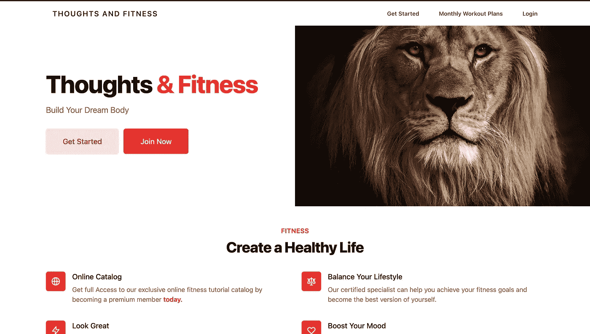

# 具有简单表单、JavaScript 和 Tailwind CSS 的动态 Rails 表单

> 原文：<https://medium.com/codex/dynamic-rails-forms-with-simple-form-javascript-tailwind-css-af70749139bc?source=collection_archive---------3----------------------->



[思想&健身](https://thoughtsandfitness.com)

查看这篇文章的视频【https://www.youtube.com/watch?v=gAXs3xhfHVg。感谢订阅！

在建立[思想&健身](https://thoughtsandfitness.com)电子商务平台的时候，我遇到了一个非常有趣的问题。我的客户希望能够在他的网站上创建日常锻炼。每个锻炼项目都有一定的举重次数，并且每次锻炼的举重次数会有所不同。

通常，在处理相关模型时，我们倾向于使用嵌套资源，但在这种情况下，嵌套资源会使每次锻炼增加锻炼变得非常麻烦。我需要一个动态表单，一个可以让我在日常锻炼中为每次举重无缝添加新表单的表单。

如果通过视频来学习更容易的话，这篇文章的 YouTube 版本[https://www.youtube.com/watch?v=gAXs3xhfHVg](https://www.youtube.com/watch?v=gAXs3xhfHVg)

# Gem 文件配置

对于本教程，我们将使用[简单形式](https://github.com/heartcombo/simple_form)和 [tailwindcss-rails](https://github.com/rails/tailwindcss-rails) gems。简单表单使得编写 Rails 表单变得非常容易。我发现 [TailwindCSS](https://tailwindcss.com/) 比 [Bootstrap](https://getbootstrap.com/) 要好得多，因为它允许我对每个类应用单独的断点，给了我更多的控制权，它还提供了比 [Bootstrap](https://getbootstrap.com/) 更多的组件。此外，我们将使用[simple _ form _ tailwind](https://github.com/tarellel/simple_form-tailwind)gem，它为我们设计了所有表单的样式。

让我们开始配置我们的 gem 文件。

```
gem "tailwindcss-rails", "~> 0.3.3"gem 'simple_form'gem 'simple_form-tailwind'
```

为了简洁起见，我不打算介绍安装所有这些 gem 的命令，但是它们的 git 页面都在上面链接了。

# 创建我们的模型

我们每天将有两个模型工作和电梯。每天的工作都会有一个焦点。我们今天要做的是身体的哪一部分，将会有很多托举。每个电梯将有一个名称，组数，代表人数，并属于一个日常工作。

```
rails g model DailyWorkout focus rails g model Lift name sets:integer reps:integer daily_workout:referencesrails db:migrate
```

引用是向我们的 lift 模型添加外键的一种方式。这个键将等于我们的电梯所属的 DailyWorkout 的 ID。

我们的提升模型文件应该如下所示:

```
class Lift < ApplicationRecord
  belongs_to :daily_workout
end
```

我们的日常锻炼应该是这样的:

```
class DailyWorkout < ApplicationRecord
  has_many :lifts
  accepts_nested_attributes_for :lifts
end
```

根据 Rails 文档，a[ccepts _ nested _ attributes _ for](https://api.rubyonrails.org/classes/ActiveRecord/NestedAttributes/ClassMethods.html)助手允许我们通过其父级保存相关记录。这基本上意味着我们将通过我们的日常工作模型来创造我们所有的提升。

# 控制器

让我们创建我们的日常锻炼控制器，不要忘记配置您的路线！。

```
rails g controller DailyWorkouts new create
```

我们的控制器现在应该是这样的:

```
class DailyWorkoutsController < ApplicationController

  def new
    @daily_workout = DailyWorkout.new
    @daily_workout.lifts.build
  end

  def create
    @daily_workout = DailyWorkout.create(daily_workout_params)
    if @daily_workout.save
      flash[:success] = "A daily Workout Was Created !"
      redirect_to root_path
    else
       render :new
    end
  end

  private def daily_workout_params
    params.require(:daily_workout).permit(:focus, 
       lifts_attributes: %i[name sets reps])
  end

end
```

在我们的新动作中，我们创建了一个 DailyWorkout，并使用 active_record build 辅助工具将一组举重动作添加到我们的日常锻炼中。创建操作与标准模型没有什么不同。

我们的 daily_workout_params 方法允许值:我们锻炼的重点和每次锻炼的属性。让我们开始设计我们的视图。

# 景色

在我们使我们的窗体动态化之前，我们将对它进行编程，以便我们只为我们的日常工作构建一个电梯。因为这种形式已经非常复杂，所以在扩展到复杂的任务之前，让事情尽可能简单是很重要的。

```
# new.html.erb<%= simple_form_for @daily_workout do |f| %>
          <%= f.input :focus %>
          <%= f.simple_fields_for :lifts do |w| %>
            <div id='fieldsetContainer'>
              <fieldset id="0" class="text-indigo-500">
                <%= w.input :name %>
                <%= w.input :sets %>
                <%= w.input :reps %>
          <% end %>
          </fieldset>
          </div>
          <%= f.button :submit %>
<% end %><br/><button id=”addLift” onclick="addLift()">
       Add another lift
</button>
```

simple_fields_for 方法用于为我们的电梯创建一个包装器，它几乎与默认的 Rails fields_for helper 相同。在我们的表单之后，我们创建了一个按钮，单击它将调用一个 JavaScript 函数。这个函数将负责添加一个新的电梯形式，从而使我们能够添加更多的电梯到我们的集合。

我将 script 标签直接放在 HTML 下面，并包含了一些用于调试的控制台日志记录，请查看下面的代码:

```
<script>
    const addWorkout = ()=> {
        const lastId =   document.querySelector('#fieldsetContainer').lastElementChild.id;
        console.log(lastId)

        const newId = parseInt(lastId,10) + 1
        console.log(newId)

        const newFieldset = document.querySelector('[id="0"]').outerHTML.replace(/0/g, newId)
        console.log(newFieldset)
        document.querySelector("#fieldsetContainer").insertAdjacentHTML("beforeend", newFieldset)
    }
</script>
```

实际上，我们所做的就是找到最后创建的 lift 表单的 ID，创建一个 ID 为 N + 1 的新表单，并将这个表单添加到我们的 HTML 中。

本教程到此为止，希望你学到了东西！

一定要订阅！

YouTube:【https://www.youtube.com/channel/UCfd8A1xfzqk7veapUhe8hLQ 

科里的角落播客:【https://anchor.fm/coreys-corner 