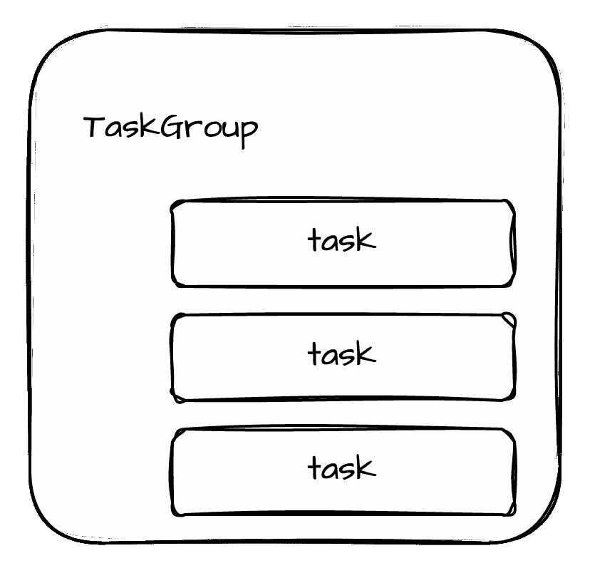
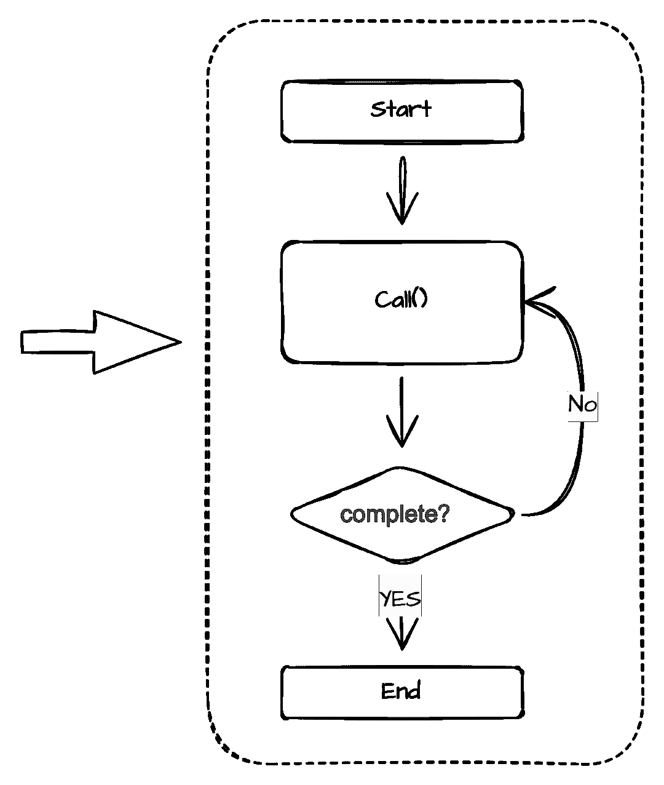
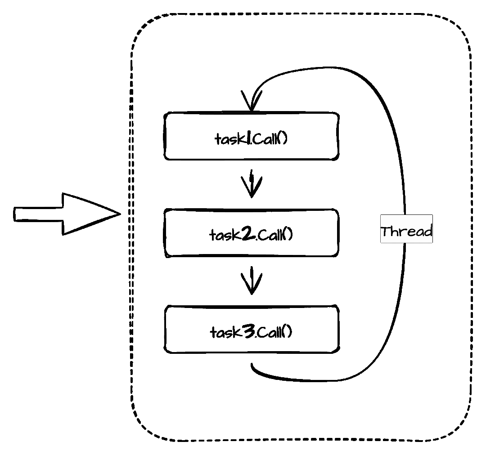
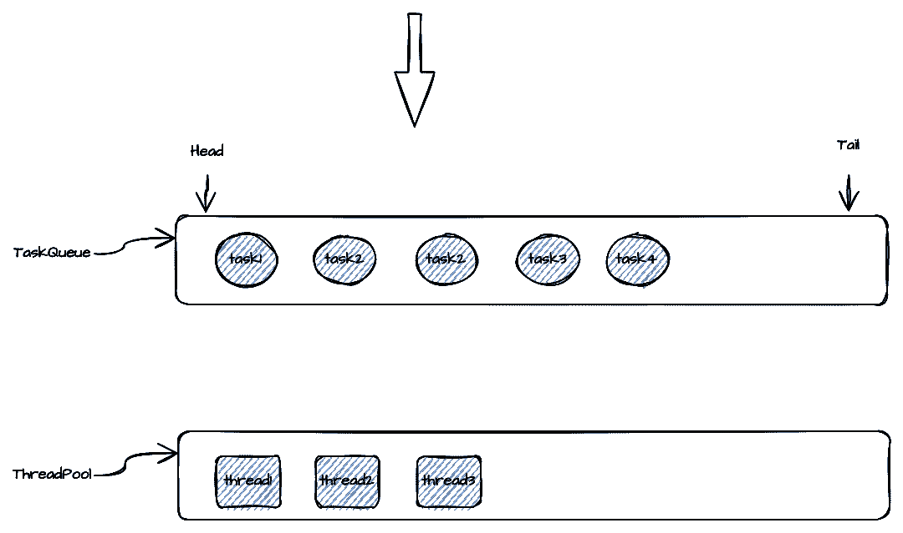
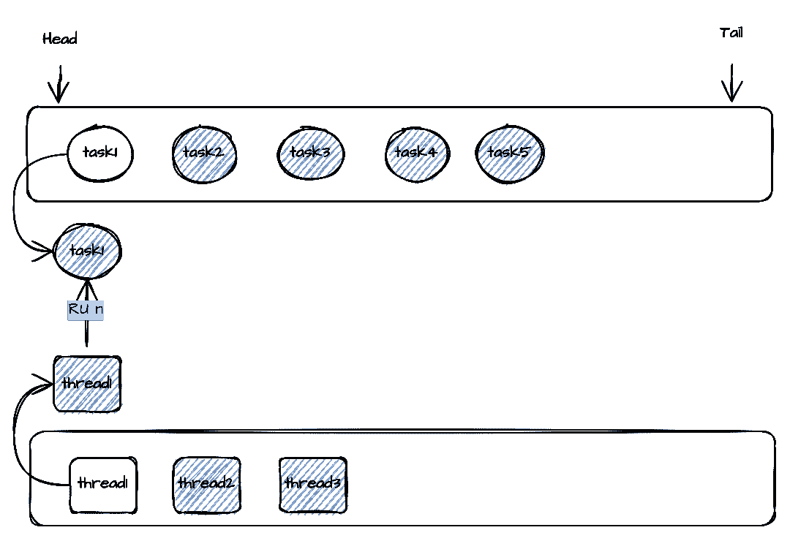
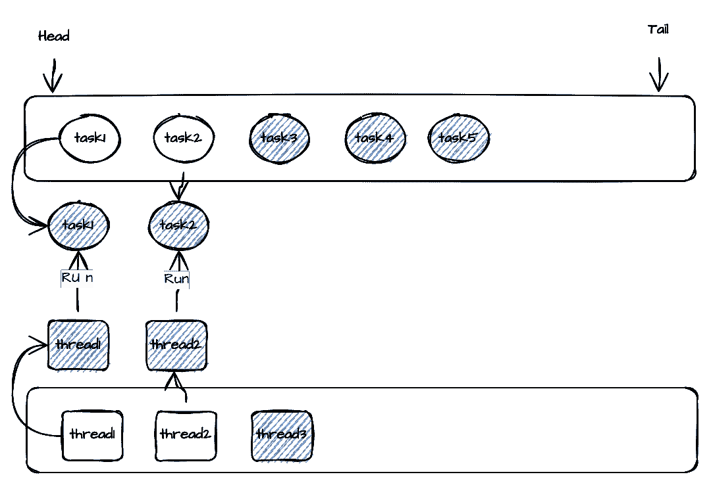
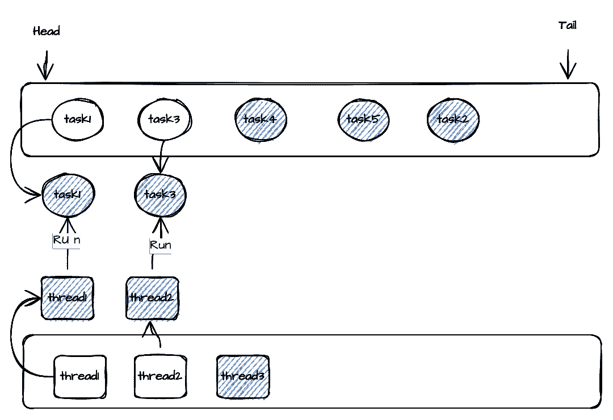
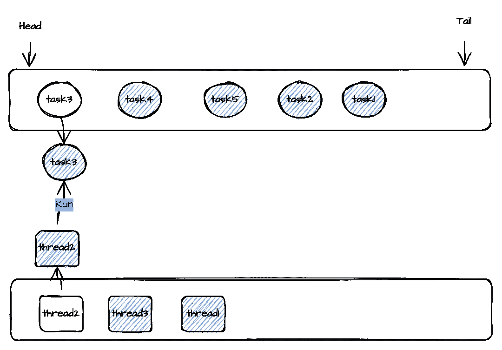
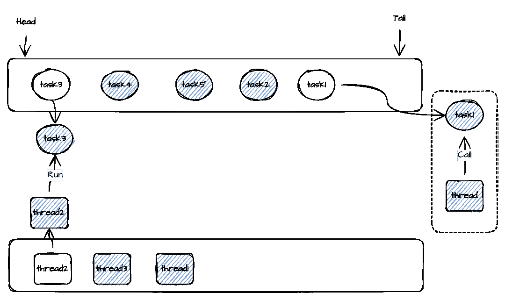

# 动态线程共享，SeaTunnel-TaskExecutionServer 的设计思想

> 原文：<https://medium.com/codex/dynamic-thread-sharing-the-design-idea-of-seatunnel-taskexecutionserver-5d51e0487166?source=collection_archive---------15----------------------->

我将在本文中介绍 Apache SeaTunnel 的 TaskExecutionServer 的设计思想。

TaskExecutionServer 是执行任务的特定服务，它将在每个节点上运行一个实例。

TaskExecutionServer 不仅负责接收 JobMaster 下发的 TaskGroup 并运行其中的任务，还维护 TaskID->TaskContext 之间的映射关系。

TaskContext 中封装了对 Task 的具体操作。

Task 内部持有 OperationService，这意味着 Task 可以通过 OperationService 远程调用其他任务或 JobMaster 并与之通信。

# 01 任务组

TaskGroup 中的任务都在同一个节点上运行。

一个优化:同一任务组内的任务之间的数据通道使用本地队列，不同任务组之间的数据通道可能在不同的节点上执行，所以数据通道使用分布式队列(hazalcast Ringbuffer)。

# 02 任务设计

Task 最重要的方法之一是 call()方法。执行器通过调用任务的 call()方法来驱动任务的操作。call()方法会有一个返回值 ProgressState，通过这个返回值执行者可以判断任务是否结束，是否需要继续调用 call()方法。

# 03 线程共享优化

背景:在很多小任务同步的场景下，会产生很多任务。如果一个线程负责一项任务，那么将会运行多个线程，导致资源浪费。这时，如果一个线程可以运行多个任务，情况就会大大改善。但是一个线程如何同时执行多个任务呢？

因为任务是通过反复调用 call()方法在内部驱动的，所以一个线程可以依次调用它所负责的所有任务的 Call()方法。

这也会带来一个问题，就是如果执行一个任务的 call()方法需要很长时间，这个线程就会被占用太久，导致其他任务的延迟非常高。

针对这样的问题，暂提出以下两种优化方案:

## 1 标记螺纹份额

在任务上提供一个标识符，以标识任务是否支持线程共享(线程共享)。任务实现时，用来标识任务是否支持线程共享。可以共享的任务会在一个线程中执行，不能共享的任务会独占在一个线程中执行。

任务是否支持线程共享是由任务的具体实现者来评估的。根据调用方法的执行时间，如果调用方法的实现是在 ms 级别，那么可以将任务标记为支持线程共享。

## 2 动态线程共享

上述方案 1 有一个根本问题，就是 Call 方法的执行时间往往不固定，任务本身对其 Call()方法的调用时间也不是很清楚，因为 Call 方法的执行时间会受到不同阶段、不同数据量下等的影响。这样的任务标记为支持共享线程与否并不是很合适，因为在标记为共享线程的情况下，如果对 call 方法的调用执行时间很长，这将导致共享当前线程的其他任务有非常高的延迟。如果不支持共享，资源浪费的问题还是没有解决。

于是就有可能让任务线程共享动态化，一组任务由一个线程池执行(任务号>>线程号)。在执行 thread1 的过程中，如果 Task1 的 call()方法的执行时间超过了设定值(100ms)，就会从线程池中取出一个 thread2 来执行 Task2 的下一个 Call 方法。保证其他任务的延迟不会因为 Task1 的执行时间过长而过高。

当 Task2 的 call 方法在超时期限内正常执行时，会将 Task2 放回任务队列的末尾，thread2 继续从任务队列中取出 Task3 执行 Call 方法。当 Task1 的 call 方法执行完成后，thread1 将被放回线程池，Task1 将被标记为超时一次。当 TaskCall 方法的执行超时次数达到一定限制时，该任务将从共享线程任务队列中移除，一个线程将被独占使用。

步骤 1:开始执行，从线程池中取出一个线程，开始执行任务队列中的任务

步骤 2:如果 Task1 的执行时间超过设定值，将使用另一个线程来执行 task2，以确保其他任务的延迟不受 Task1 的影响

第三步:如果 Task2 正常执行，它将被放在队列的末尾，等待下一次执行。同时，Thread2 将从队列中取出另一个任务来执行

步骤 4:此时，如果 Task1 的执行完成，Task1 将被放在队列的末尾，Thread1 也将被放回线程池

步骤 5:如果 Task1 执行多次超时，它将从任务队列中删除，并由一个线程独占执行

方案二已经在目前的 SeaTunnel 引擎中实现，未来还会继续优化，希望能给大家带来更好的体验。

# 关于海底隧道

SeaTunnel(原 Waterdrop)是一个简单易用、超高性能的分布式数据集成平台，支持海量数据的实时同步，可以稳定高效地同步每天数千亿的数据。

我们为什么需要海底隧道？

SeaTunnel 竭尽所能解决你在同步海量数据时可能遇到的问题。

*   数据丢失和重复
*   任务构建和延迟
*   低吞吐量
*   从应用到生产周期长
*   缺乏应用程序状态监控

**海底隧道使用场景**

*   海量数据同步
*   海量数据集成
*   大量数据的 ETL
*   海量数据聚合
*   多源数据处理

**海底隧道的特点**

*   丰富的组件
*   高可扩展性
*   使用方便
*   成熟稳重

**如何快速上手 SeaTunnel？**

想快速体验海底隧道？SeaTunnel 2.1.0 只需 10 秒钟即可启动并运行。

[https://seatunnel.apache.org/docs/2.1.0/developement/setup](https://seatunnel.apache.org/docs/2.1.0/developement/setup)

我能做些什么？

我们邀请所有对本地开源全球化感兴趣的合作伙伴加入 SeaTunnel 贡献者大家庭，共同促进开源！

提交问题:

[https://github.com/apache/incubator-seatunnel/issues](https://github.com/apache/incubator-seatunnel/issues)

将代码贡献给:

[https://github.com/apache/incubator-seatunnel/pulls](https://github.com/apache/incubator-seatunnel/pulls)

订阅社区发展邮件列表:

dev-subscribe@seatunnel.apache.org

开发邮件列表:

dev@seatunnel.apache.org

加入时差:

[https://join . slack . com/t/Apache seatunnel/shared _ invite/ZT-1 HSO 5 N2 TV-mkfkwxonc 70 heqgxtvi 34 w](https://join.slack.com/t/apacheseatunnel/shared_invite/zt-1hso5n2tv-mkFKWxonc70HeqGxTVi34w)

关注 Twitter:

[https://twitter.com/ASFSeaTunnel](https://twitter.com/ASFSeaTunnel)

来加入我们吧！