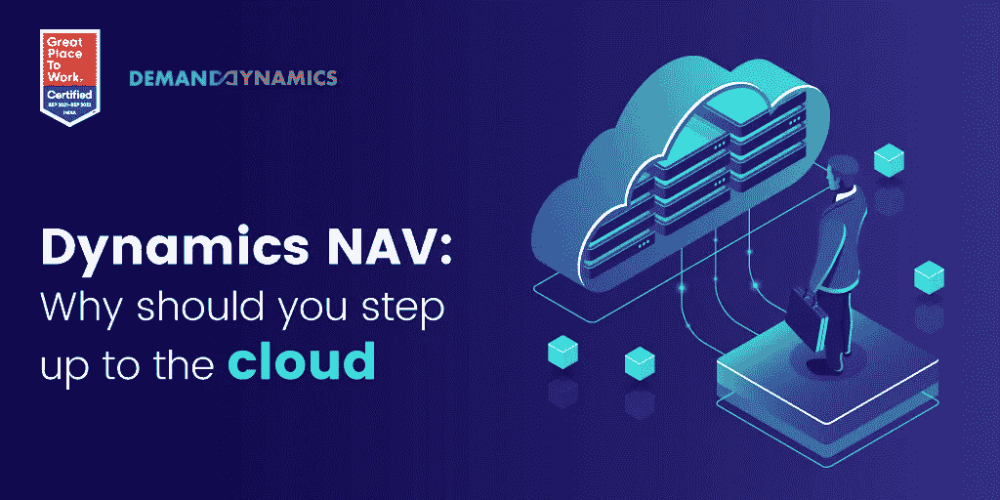

# Dynamics Nav To Dynamics 365 Business Central—为什么您应该升级到云计算

> 原文：<https://medium.com/codex/dynamics-nav-to-dynamics-365-business-central-why-you-should-step-up-to-the-cloud-376c886a1267?source=collection_archive---------23----------------------->

Dynamics NAV 是一家 ERP 巨头，由于其灵活性和可定制性，它经受住了时间的考验，非常适合任何行业或企业。因此，20 多年来，它一直是市场的宠儿。然而，随着技术的不断进步，微软已经采用了云优先战略，推出了 Dynamics 365 Business Central，其根源来自 Dynamics NAV。

## **微软动态 365 商务中心 VS 动态** **导航**

[Dynamics 365 Business Central](https://demanddynamics.com/microsoft-dynamics-365-erp-implementation-partner/)是一个基于云的 ERP 解决方案，而 Dynamics NAV 是在内部托管的。Dynamics 365 BC 允许随时随地跨多个通道访问数据。其广泛的功能使其易于导航和根据您的独特要求进行定制。此外，它还分解了数据孤岛并自动化了操作流程，从而提高了生产效率。它可以轻松地与其他微软应用程序集成，并在低代码平台上实现强大的工作流。

## **为什么要从 DYNAMICS NAV 迁移到 DYNAMICS 365****BUSINESS CENTRAL？**

从传统产品 Dynamics NAV 迁移到 Dynamics 365 Business Central 是一个复杂、昂贵且耗时的过程。在选择内部环境和云环境时，有几个因素需要考虑。Dynamics NAV 建立在复杂的代码基础上，需要额外的定制才能实现最佳性能。微软推出 Dynamics 365 业务

Central 是一个基于云的 ERP 系统，具有许多有助于端到端业务管理的功能。超过 15，000 家公司使用 Dynamics 365 Business Central 作为其 ERP 系统。它使用 AL 编码语言，提供广泛的定制和容易升级。凭借其许可证灵活性、增强的生产力工具和用户友好的设计，这引起了各行各业企业的关注。此外，Dynamics 365 BC 是一个基于 web 的解决方案，可以部署在云上或混合模型中。

从 [**Dynamics NAV 迁移到 Business Central**](https://demanddynamics.com/dynamics-nav-to-dynamics-365-business-central/) 的企业非常欣赏其全面的业务管理功能，可以快速适应市场趋势，并为更好的决策提供见解。下面列出的迁移优势使这项投资物有所值。

**●成本降低:**公元前 365 年基础设施成本大幅降低。它用目前每个用户每月大约 6 美元的许可费代替了所有与服务器维护相关的费用。

● **促进远程工作文化:**全球的 COVID 疫情见证了远程工作文化的发展。迁移到 Business Central 后，员工可以轻松地在家工作，并从远程位置访问数据。此外，高安全性和灾难恢复功能使这种设置非常安全。

**●新功能:**Dynamics NAV 到 Dynamics 365 BC 的迁移为企业提供了人工智能和现金流管理等新功能。此外，实时数据和业务分析可生成可操作的见解，并提供 360 度的视图，这些功能是大多数传统 ERP 应用程序所缺乏的。

**●协作优势:** Dynamics 365 Business Central 与原生微软应用程序和在线微软套件解决方案(如 Office 365、Outlook 和 SharePoint)集成良好。消除数据和运营孤岛进一步优化了效率。

**●可扩展:** D365 商业中心的 al 代码让定制几乎毫不费力。该解决方案扩展性好，有助于整体业务增长。此外，它通过减少许可证数量，仅在需要时激活，最大限度地降低了费用。

**升级和许可选项**

Microsoft Dynamics 365 Business Central 使用每月订阅模式和定价选项，包括一次性付款或基于报价的定价。相比之下，微软 NAV 仅提供有限的定价选项。此外，Business Central 包含两年一次的自动版本升级，因此您不会错过新功能。随着不断增强，微软自动应用累积更新。每六个月——4 月的第一波和 10 月的第二波——软件升级到一个新的、具有增强功能的永久版本。

**AZURE 在迁移过程中的作用**

微软的 Azure 是一个可以帮助你远程操作的平台，如果你在不同国家有分支机构，这是一个必不可少的功能。此外，Azure 提供 200 多种产品和服务，帮助您充分利用微软的云服务。例如，Dynamics 365 统一了应用程序，并确保不间断和快速的工作流。虽然云提供了许多优势，但它也增加了数据泄露的风险。因此，微软在网络安全上投入了数十亿美元来保护您的业务安全。

**相关:** [**从 Dynamics NAV 迁移到 Business Central 的原因**](https://demanddynamics.com/reasons-to-migrate-from-microsoft-nav-to-dynamics-365-bc/)

## **与合适的合作伙伴一起推动您的迁移**

如果迁移到 Dynamics 365 Business Central 是一个重要的考虑因素，那么找到一个有经验的微软合作伙伴是必不可少的。作为微软金牌认证合作伙伴的公司可以帮助其不同的客户完成大量的迁移。在制定一致的战略之前，确保选择一个有专家团队的合作伙伴，他们能够了解您的业务需求和客户群。

与行业专家交谈，了解更多关于[**Dynamics 365 Business Central**](https://demanddynamics.com/microsoft-dynamics-365-erp-implementation-partner/)的信息，以及它如何帮助您的企业发展壮大。