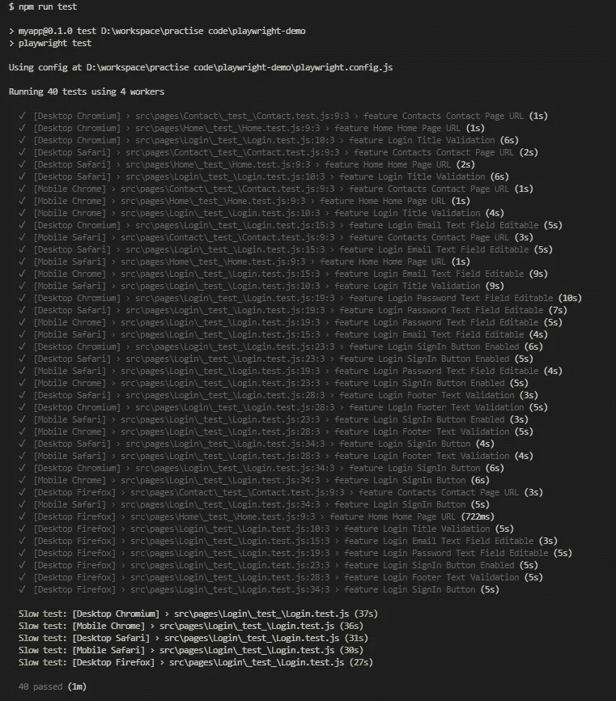

# E2E 使用剧作家实现 Web 测试自动化

> 原文：<https://medium.com/codex/e2e-implementation-of-web-test-automation-using-playwright-b284da4ebe33?source=collection_archive---------4----------------------->


戏剧家；正如诗人写诗一样，剧作家写剧本。

> 自动化 web 浏览器交互是测试 web 应用程序功能的一个好方法。

# 介绍

[剧作家](https://github.com/microsoft/playwright)是一个基于[木偶师](https://developers.google.com/web/tools/puppeteer)构建的用于浏览器自动化的开源 [Node.js](https://nodejs.org/) 库。它是由《木偶师》的作者开发的，由微软维护，如果你注意到《木偶师》的前两名贡献者现在都在为《剧作家》工作的话。木偶团队实质上从[谷歌](https://www.google.com)转移到[微软](https://www.microsoft.com/)，成为剧作家团队。在本文中，让我们来看一个使用剧作家、剧作家测试和类型脚本开发的 web 框架，并探索它的功能。

# 为什么是剧作家

剧作家能够在所有现代浏览器上实现快速、可靠和强大的测试和自动化。本指南涵盖了这些关键的区别点，以帮助您为您的自动化测试决定合适的工具。

*   [支持所有浏览器](https://playwright.dev/docs/why-playwright#support-for-all-browsers)
*   [快速可靠的执行](https://playwright.dev/docs/why-playwright#fast-and-reliable-execution)
*   [强大的自动化功能](https://playwright.dev/docs/why-playwright#powerful-automation-capabilities)

## 支持所有浏览器

*   在 Chromium、Firefox 和 WebKit 上测试。剧作家拥有所有现代浏览器的完整 API 覆盖，包括谷歌 Chrome 和微软 Edge(带有 [Chromium](https://www.chromium.org/) )、苹果 Safari(带有 [WebKit](https://webkit.org/) )和 Mozilla Firefox。
*   跨平台 WebKit 测试。使用剧作家，测试您的应用程序在 Apple Safari 中的表现，包括 Windows、Linux 和 macOS 的 WebKit 版本。在本地和 CI 上测试。
*   移动测试。使用[设备仿真](https://playwright.dev/docs/emulation)来测试你在移动网络浏览器中的响应网络应用。
*   无头有头。剧作家支持所有浏览器和所有平台的 headless(无浏览器 UI)和 headed(有浏览器 UI)模式。Headed 非常适合调试，headless 更快，适合 CI/cloud 执行。

## 快速可靠的执行

*   自动等待 API。剧作家互动[自动等待元素](https://playwright.dev/docs/actionability)准备就绪。这提高了可靠性并简化了测试编写。
*   无超时自动化。剧作家接收浏览器信号，如网络请求、页面导航和页面加载事件，以消除导致剥落的睡眠超时的需要。
*   与浏览器上下文的快速隔离。通过[浏览器上下文](https://playwright.dev/docs/core-concepts)，为多个隔离的执行环境重用单个浏览器实例。
*   弹性元件选择器。剧作家可以依靠面向用户的字符串，如文本内容和可访问性标签来[选择元素](https://playwright.dev/docs/selectors)。这些字符串比紧密耦合到 DOM 结构的选择器更有弹性。

## 强大的自动化功能

*   多个域、页面和框架。剧作家是一个进程外自动化驱动程序，不受页面内 JavaScript 执行范围的限制，可以自动化[多页面](https://playwright.dev/docs/multi-pages)的场景。
*   强大的网络控制。剧作家引入了上下文范围的[网络拦截](https://playwright.dev/docs/network)来拦截和模仿网络请求。
*   现代网络功能。剧作家通过[阴影穿透选择器](https://playwright.dev/docs/selectors)、[地理定位、权限](https://playwright.dev/docs/emulation)、web workers 和其他现代 web APIs 支持 web 组件。
*   覆盖所有场景的能力。支持[文件下载](https://playwright.dev/docs/downloads)和[上传](https://playwright.dev/docs/input)，进程外 iframes，原生[输入事件](https://playwright.dev/docs/input)，甚至[黑暗模式](https://playwright.dev/docs/emulation)。

# 入门指南

剧作家既可以作为剧作家测试的一部分(本指南)，也可以作为[剧作家库](https://playwright.dev/docs/library)。

剧作家测试是专门为适应端到端测试的需要而创建的。它做了你期望从普通测试者那里得到的一切，甚至更多。剧作家测试允许:

*   在所有浏览器上运行测试。
*   并行执行测试。
*   享受开箱即用的环境隔离。
*   捕捉失败时的视频、截图和其他工件。
*   将您的 POM 集成为可扩展的设备

## 装置

剧作家有自己的端到端测试运行器，我们称之为剧作家测试。

```
npm i -D @playwright/test*# install supported browsers*npx playwright install
```

## 创建配置文件

到目前为止，我们已经查看了剧作家测试的零配置操作。对于真实世界的应用程序，您可能希望使用配置。

创建`playwright.config.js`来配置您的测试。您可以使用配置文件指定浏览器启动选项，在多个浏览器中运行测试，等等。下面是一个在 Chromium、Firefox 和 WebKit 中运行每个测试的配置示例，包括桌面和移动版本。在[配置部分](https://playwright.dev/docs/test-configuration)寻找更多选项。

配置 NPM 脚本以运行测试。剧作家考试会自动接`playwright.config.js`。

如果你把你的配置文件放在不同的地方，用`--config`选项传递它。

## 环境设置

首先，让我们为基于 reactJS 的 web 应用程序建立开发环境。

使用以下命令添加新的 react 项目，而不全局安装 react CLI:

*   `$ npm create-react-app myapp`
*   `$ cd myapp`
*   `$ npm start`

# 文件夹结构

## ../Pages/XYZ/组件/*。jsx

*   所有组件都应标有出口名称。这将避免任何冲突。
*   由复杂逻辑组成的组件。
*   **提示**:尝试为所有组件创建命名导出，而不是默认导出。这将避免任何命名冲突。

## ../Pages/XYZ/_test_/*.test.js

*   所有的组件测试用例都应该写在这里。

# 让我们写测试用例吧！

## 登录组件(..pages/log in/Components/log in . jsx)

登录组件

## 登录组件测试用例(..pages/log in/_ test _/log in . test . js)

## 安慰

`$ npm run test`



所有测试用例

剧作家入门代码可在 [Git](https://github.com/engr-muzammil/playwright-demo) 获得。

## 许多其他剧作家的功能仍有待发现

*   [自动等待](https://playwright.dev/docs/actionability)
*   [断言](https://playwright.dev/docs/assertions)
*   [认证](https://playwright.dev/docs/auth)
*   [浏览器](https://playwright.dev/docs/browsers)
*   [Chrome 扩展](https://playwright.dev/docs/chrome-extensions)
*   [核心概念](https://playwright.dev/docs/core-concepts)
*   [对话框](https://playwright.dev/docs/dialogs)
*   [下载](https://playwright.dev/docs/downloads)
*   [元素选择器](https://playwright.dev/docs/selectors)
*   [仿真](https://playwright.dev/docs/emulation)
*   [事件](https://playwright.dev/docs/events)
*   [扩展性](https://playwright.dev/docs/extensibility)
*   [手柄](https://playwright.dev/docs/handles)
*   [输入](https://playwright.dev/docs/input)
*   [督察](https://playwright.dev/docs/inspector)
*   [多页面场景](https://playwright.dev/docs/multi-pages)
*   [导航](https://playwright.dev/docs/navigations)
*   [网络](https://playwright.dev/docs/network)
*   [页面对象模型](https://playwright.dev/docs/pom)
*   [截图](https://playwright.dev/docs/screenshots)
*   [跟踪查看器](https://playwright.dev/docs/trace-viewer)
*   [验证](https://playwright.dev/docs/verification)
*   [视频](https://playwright.dev/docs/videos)

# 选择图书馆

因为剧作家和木偶师基本上是由同一个团队开发的，并且具有如此相似的 API，所以从木偶师迁移到剧作家并不太困难。然而，你不应该仅仅因为剧作家更新就选择剧作家而不是木偶师——剧作家刚刚发布了 1.0 版本，所以 API [可能会有突破性的变化](https://github.com/microsoft/playwright#q-is-playwright-ready)。

我认为要考虑的三个主要因素是跨浏览器支持、长期库支持和您的浏览器自动化的特定用例。

# 自己和剧作家玩

阅读博客帖子帮助我理解了什么是剧作家，但当我用它来探索现实场景时，我才真正对这个工具有了感觉！我建议你也这样做。

你可以使用这篇博文中的[代码示例](https://github.com/engr-muzammil/playwright-demo)以及[剧作家的文档](https://playwright.dev/)来开始。祝你好运！

# 资源:

1.  【https://github.com/microsoft/playwright 
2.  [https://剧作家.开发](https://playwright.dev/)