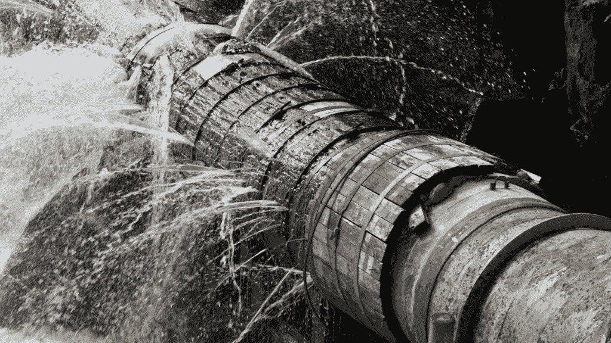

# 早期采用者:你现在可以从空气中取水

> 原文：<https://medium.com/codex/early-adopters-you-can-now-pull-water-from-the-air-e4cbda017a18?source=collection_archive---------0----------------------->

## 我们不必仅仅依赖老化的水利基础设施

[老化的水基础设施(深水跋涉的媒介)](https://images.ctfassets.net/sr1t8a9wvxz9/32zUacOkutaRy1zSLhk7vN/b669c3991c06ec9ffda58970864a28fb/leaks-all-over-1280x720-istockphoto-1024x576.jpeg)

前几天我听到了一个令人不安的事实。平均而言，美国每天处理的饮用水总量的 14%至 18%通过泄漏损失，一些供水系统报告水损失率超过 60%。毫无疑问，我们迫切需要解决老龄化问题…