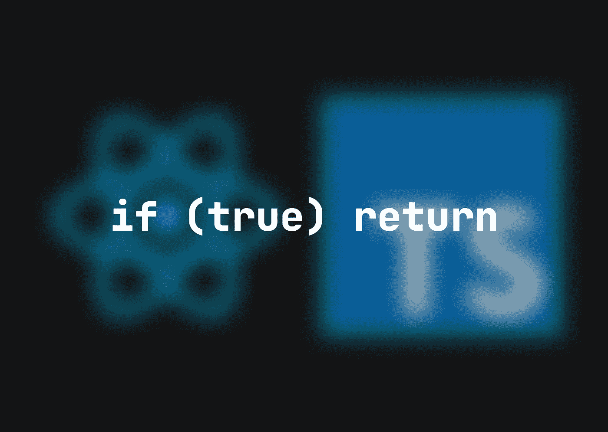

# 解释了 TypeScript 中的早期返回，以及我如何在 React 应用程序中使用它

> 原文：<https://medium.com/codex/early-return-in-typescript-explained-along-with-how-i-use-it-in-react-apps-92c0694a8356?source=collection_archive---------4----------------------->

条件是最基本的编程概念。现在，由于有了可用的模式，我们不需要总是使用基本的`if… else…`块来声明它们。其中一个模式，也是我个人最喜欢的，是提前回报。我将在本文中解释它，并提供 React 示例。



TypeScript React 应用程序中的基本条件如下

```
🗿 **A BASIC CONDITION IN REACT**
const handleValueChange = (value: number | null) => {
  **if (!value || value > 0)** {
    setState(value)
    ...
  } **else** {
    return
  }
}
```

这意味着如果`value`大于`0`，我们将`state`设置为它和一些其他操作，否则我们什么也不做。

当然，我们可以通过简单地离开`else`来缩短它

```
🪵 **LEAVING THE** **else** **BRANCH IS MUCH NICER**
const handleValueChange = (value: number | null) => {
  **if (!value || value > 0)** {
    setState(value)
    ...
  }
}
```

或者，如果有必要，我们可以使用带有反转条件的早期返回来退出函数

```
🔥 **USING EARLY RETURN IS THE BEST**
const handleValueChange = (value: number | null) => {
  **if (!value || value === 0) return**
  setState(value)
  ...
}
```

以这种方式在 TypeScript 中编写函数会使它们更加清晰易读。让我们来看一些实际的 React 示例:

## 呈现空荡的 JSX

[](/codex/how-i-use-conditional-rendering-in-react-252dba391b55) [## 我如何在 React 中使用条件渲染

### 如果使用得当，条件渲染是一个非常有用的 React 概念。您可以决定渲染哪些组件或…

medium.com](/codex/how-i-use-conditional-rendering-in-react-252dba391b55) 

正如我在上一篇文章中提到的，您可以在 React 中使用 early return 来呈现组件中的空 JSX。此方法防止应用程序在用户界面上呈现没有必要数据但有填充、垂直线和背景色的空组件。

```
🩹 **IF SPECIFIC DATA IS MISSING, EARLY RETURN AN EMPTY JSX**
const UserProfile = (props: 
  { name: string | null, email: string | null, age: number | null }
) => {
  **if (!props?.name && !props?.email && !props?.age) return <></>**
  return (
    ...
  )
}
```

## 表单提交处理

通常，当我们使用 web 应用程序时，用户数据是可修改的。为了更新它，我们必须开发一个表单 UI 和一些逻辑。稍后我将解释我用来管理 React 组件中任何类型数据的方法；现在，我将只关注`submit`功能

```
⭕️ **EARLY RETURN FROM A SUBMIT FUNCTION WHEN ESSENTIAL DATA IS MISSING**
// these can be updated somewhere on the UI
const [name, setName] = useState<string | null>(null)
const [email, setEmail] = useState<string | null>(null)
// this function submits the form
const submit = () => {
  **if (!name || !email) return window.alert('Missing fields!')**
  // API or service call to update or create data
}
```

## 删除确认

带有确认窗口的提前返回对于从数据库中删除数据的函数来说是一个很好的工具

```
🤔 **EARLY RETURN WITH A CONFIRMATION WINDOW**
const handleRemove = (id: string) => {
  **if (!window.confirm('Are you sure?')) return**
  // API or service call to delete the item by id
}
```

这意味着如果用户点击确认窗口上的“取消”按钮，`confirm`将变为`false`，并且`handleRemove`函数返回。

👋我希望这在你寻找新的学习材料时对你有用。感谢您花时间阅读这篇文章！如果你想在未来读到更多这样的故事，请订阅我的电子邮件列表！