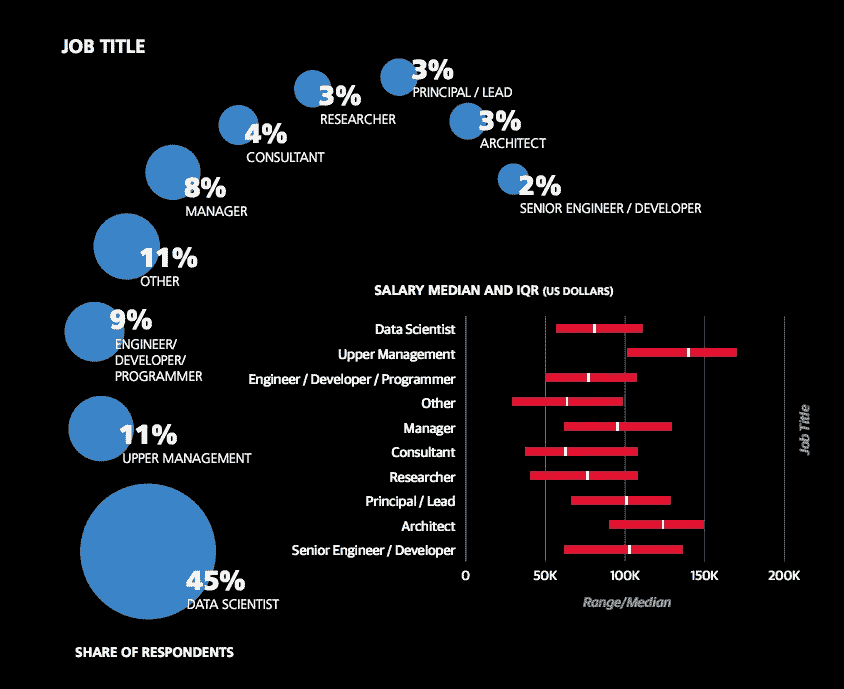

# 作为这些行业的数据科学家，收入超过 25 万美元

> 原文：<https://medium.com/codex/earn-250k-as-a-data-scientist-in-these-industries-career-options-for-data-scientists-fdc76cd4c85a?source=collection_archive---------0----------------------->

## 数据科学家的职业选择

照片由 [Unsplash](https://unsplash.com?utm_source=medium&utm_medium=referral) 上的 [Jp Valery](https://unsplash.com/@jpvalery?utm_source=medium&utm_medium=referral)

> “许多现代企业已经精通挖掘数据。事实上，数据挖掘几乎成了例行公事。但是，随着我们进一步进入 21 世纪和 22 世纪，数据的利用开始占据优先地位。因此，这不仅仅是收集所有这些数据，还包括真正发挥创造力，以新的方式利用这些数据来增加价值。”
> ― **小亨德里思·万隆·史密斯**

“我是一名数据科学家”，这么说听起来很酷。嗯，我只是一个知道从一堆数据中做出判断的人。不太精通，但足以理解并根据结果做出决策。

如今，几乎每五个人中就有一个人将他们的职业道路转向数据科学，各行业也在他们的组织中实施这些计划。

许多人都在探索新的职业道路，掌握了一定的技能。现在的市场非常原始，因为每天都有成千上万的人注册学习 AI/ML/数据科学等课程。新手确实获得了知识和技能，但他们缺乏行业曝光度，有些人只是盲目跟风。然而，有许多行业领导者会雇佣新人，并给他们一个试水的机会。

今天这篇文章的目的是为那些刚刚进入这个领域并希望达到更高境界的人提供一个新的视角和职业选择。这里提到的两个行业是经过仔细研究的，记住这里给出的见解只是冰山一角。你可以更深入地研究。

我还会强调为什么我相信你可以在这些行业获得超过 6 位数的收入，以及我做了哪些研究来得出这个结论。

在这篇文章中，我只强调两个主要的行业，在下一篇文章中，我会介绍一些其他的行业。

# 汽车工业

汽车工业是美国最大的产业之一。尽管汽车工业在疫情期间遭受了打击，但目前的趋势显示它正在毫发无损地反弹:(来源: [Zippia](https://www.zippia.com/advice/automotive-industry-statistics/) )

*   2020 年，美国生产了 880 万辆汽车，比 2019 年下降了 19%
*   **92.3 万美国人**从事汽车及零部件制造业，**125.16 万人**受雇于汽车经销商。
*   2020 年，美国汽车及零部件经销商的收入为 1.249 万亿美元。
*   汽车工业占美国国内生产总值的 3%。
*   美国汽车工业预计在 2020 年销售**144.718 亿辆轿车和轻型卡车**。
*   美国汽车经销商协会(NADA)预测，根据 2021 年第一季度的销量，今年新的轻型汽车销量将达到 1630 万辆，预计比 2020 年增长 12.7%。

这些数字仅仅来自美国，想象一下全球的产业价值。如今的制造单位正在变得自动化，AI/ML 已经成为每个流程不可或缺的一部分，从制造到安全，再到交付，每个流程都以这样或那样的方式使用 AI/ML。

莱尼·屈尼在 Unsplash 的照片

在提高汽车工业自动化方面，有许多新的特点和无限的可能性。无人驾驶汽车现在已经成为现实，而不仅仅是一些詹姆斯·邦德小说。有 100 多家公司制造自动驾驶汽车，自动驾驶汽车不断使用人工智能/人工智能来克服挑战。参考这篇文章，它会让你对这个行业在全球范围内发生的事情有所了解。

## 你怎么会参与其中？

[Udacity 的自动驾驶汽车工程师](https://www.udacity.com/course/self-driving-car-engineer-nanodegree--nd0013)课程是最好的开始方式。但是对这个行业的深入了解也是必要的。通常的途径是获得汽车工程学士学位，参加 Udacity 的课程，在行业内的类似项目上建立自己的投资组合，然后申请雇佣类似人才的公司。

或者，你甚至可以自己创业，做类似的事情，把自己打造成一个品牌，我相信大多数欧洲国家确实缺乏人力来支持发展，而美国有大量的工程师。

## 能赚多少？

***重要提示:出现了飞行汽车和磁悬浮动力汽车的新概念。如果有人想更深入地了解这一点，你可以更深入地挖掘，你可以自己算出数字。这里有一个快速的事实，大多数汽车制造业的高级研究数据科学家的年薪超过 25 万美元*** 。

**来源:** [**奥莱利薪酬数据科学薪酬报告，2016**](http://www.oreilly.com/data/free/2016-data-science-salary-survey.csp)

有了这个，你应该能知道研究人员的起薪很高。你可以从 180-195，000 美元开始，但要做到这一点，你需要有博士学位。和惊人的投资组合。

人们需要几年时间才能达到这个阶段，如果你知道市场需求，并准确地提供这些需求，那么只需几年的经验，你就可以达到 25 万美元。

提示:研究一下行业的最新趋势，看看市场上存在的问题，这样你就有了答案。你解决了它，你也可以要求远不止 25 万美元。

# 医疗保健行业

我感谢万能的主，读这篇文章的人还活着穿过疫情。我的叔叔被 Covid 夺去了生命，我知道我们有多无助，在第一波海啸中，我们无法得到必要的预防措施，甚至药物，我们不得不失去他。当你们都在继续阅读的时候，我想在这里花一点时间，感谢活着的每一个人，感谢他们活下来并战胜了这一切。保持坚强，保持幸福。

现在，我很抱歉打断你的话题，并提醒你失去某人的感觉，但这正是为什么我不得不在这里提到这个行业。

人们愿意卖掉他们的整个豪宅，只是为了首先在市场上得到毒品，不是因为他们有钱这样做，而是因为他们不想失去他们所爱的人。AI/ML/DL 在促进药物从试验到临床的输送方面发挥了重要作用。

当然，还涉及到其他事情，但这是一个重要的东西，从事这项工作的人知道得最多。今天，已经有非常先进的技术在 AI/ML/DL 中得到应用，但是我们仍然需要用更好的知识和经验来弥补这个差距。

许多在医疗保健、制药、成像、手术设备改进、医疗操作领域工作的研究数据科学家的收入已经超过 30 万美元。

[国立癌症研究所](https://unsplash.com/@nci?utm_source=medium&utm_medium=referral)在 [Unsplash](https://unsplash.com?utm_source=medium&utm_medium=referral) 上拍摄的照片

以下是世卫组织 2022 年报告中的陈述:

> 新冠肺炎疫情对卫生系统的能力，特别是卫生人力造成了前所未有的压力。即使在疫情之前，许多国家提供基本卫生服务的能力也因持续的卫生人力短缺而受到限制。2016 年，世卫组织已经预测到 2030 年全球将短缺 1800 万保健工作者，特别是在世卫组织非洲和东南亚地区。值得注意的是，非洲地区承担了世界上近四分之一(24%)的疾病负担，却只有世界上 3%的卫生保健工作者

**资料来源:**[**《2022 年世界卫生统计:为可持续发展目标、可持续发展目标**](https://www.who.int/publications/i/item/9789240051157) **监测健康》，您可以下载报告并完整阅读。**

现在你可以从这句话中看到，非洲最需要卫生保健的关注。但是，它也告诉你，2016 年有 1800 万的缺口。由于 Covid，这也成为世界上最大的问题。每个国家都用 AI/ML/DL 加强了他们的医疗保健部门，招聘正在进行中。

这是每个国家都面临的一个大问题，所以如果你在企业领域找不到工作，就去医疗保健部门试试吧。

## 你如何成为这个行业的一份子？

许多致力于研究和改善我们福祉的初创公司，现在正在吸引全球各地的优秀人才。

你不需要坐在他们的办公室里工作，你可以在印度，或者印度尼西亚，或者事实上在世界上的任何地方，仍然可以利用你的知识和专长成为这个行业的一部分。一些初创公司提供的薪水和股票加起来高达 16 万美元，所以几年内可能会变成 30 万美元，也可能是 50 万美元，你永远不知道。

*提示或者可能是警告:领域知识是非常必要的，在进入这个领域之前，某人的生活直接依赖于，或者可能间接依赖于你的行动。*

您可以执行以下操作来获得良好的开端:

1.  拥有超级扎实的 DL/AI/ML 知识，并参与专注于该行业的黑客马拉松
2.  了解更多关于你想从事的领域，我建议和已经在这个行业的人谈谈，还有博士。大学里的候选人，因为他们对未来 5 年的生活有一个清晰的描述，你永远不知道，可能会有一些联系，有人会成为你的导师
3.  做项目，不断培养你的个性和技能
4.  如果需要的话，加入研究小组，深入基层。

你可以从底层往上爬，或者如果你是领域专家，2 年的数据科学经验应该可以让你进入大联盟。通过拥有至少 5 年的领域知识和 2 年的数据科学经验，你将获得 15-18 万美元以上的奖金。

查看谷歌学者，阅读研究论文，了解人们在建立什么。注意，在没有足够的技术知识的情况下，不要马上投入研究。

还有，别忘了感谢我给你一个新的方法来考虑你的重点。如果你不知道如何进入其中一家公司，你可以看看我的一篇文章。

 [## 逆向工程成为数据科学家

### “在这个游戏中总会有失望和拒绝，但这是写作旅程的一部分，每个人都…

faun.pub](https://faun.pub/reverse-engineering-to-become-a-data-scientist-7bd73097f175) 

## 推荐理由:如果你能为某人解决一个问题，你也可以要价超过 25 万美元。确保你问对了人。

我试图给出一个关于可能性是什么的想法，以及在哪里可以找到它们。如果你决定从事这些行业中的一个，也许有一天你会相信我😂。

让我们让世界变得更美好，我相信你们中的某个人已经在每天这样做了。

在 [LinkedIn](https://www.linkedin.com/in/soham-sharma/) 上关注我，关注更多此类文章。