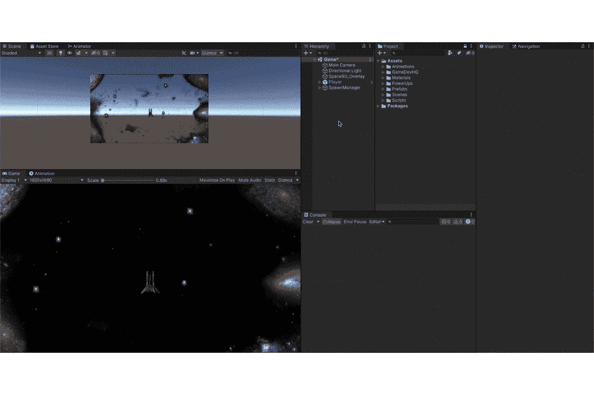
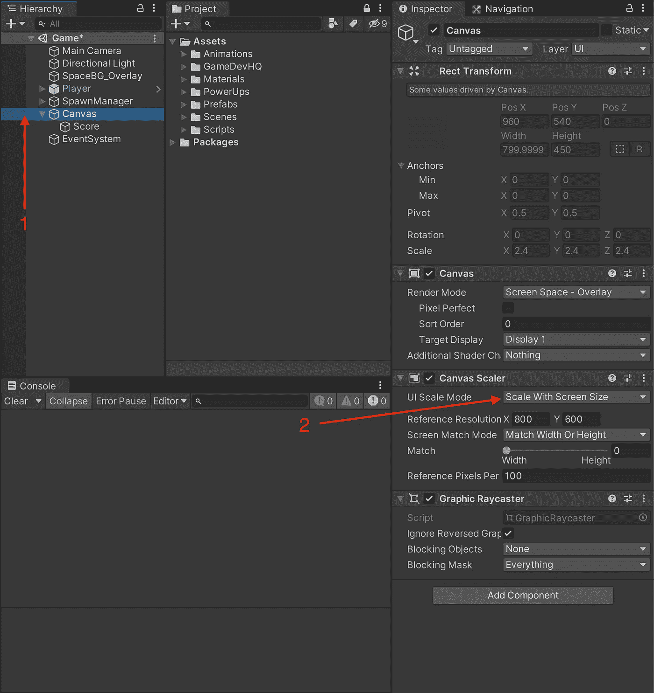
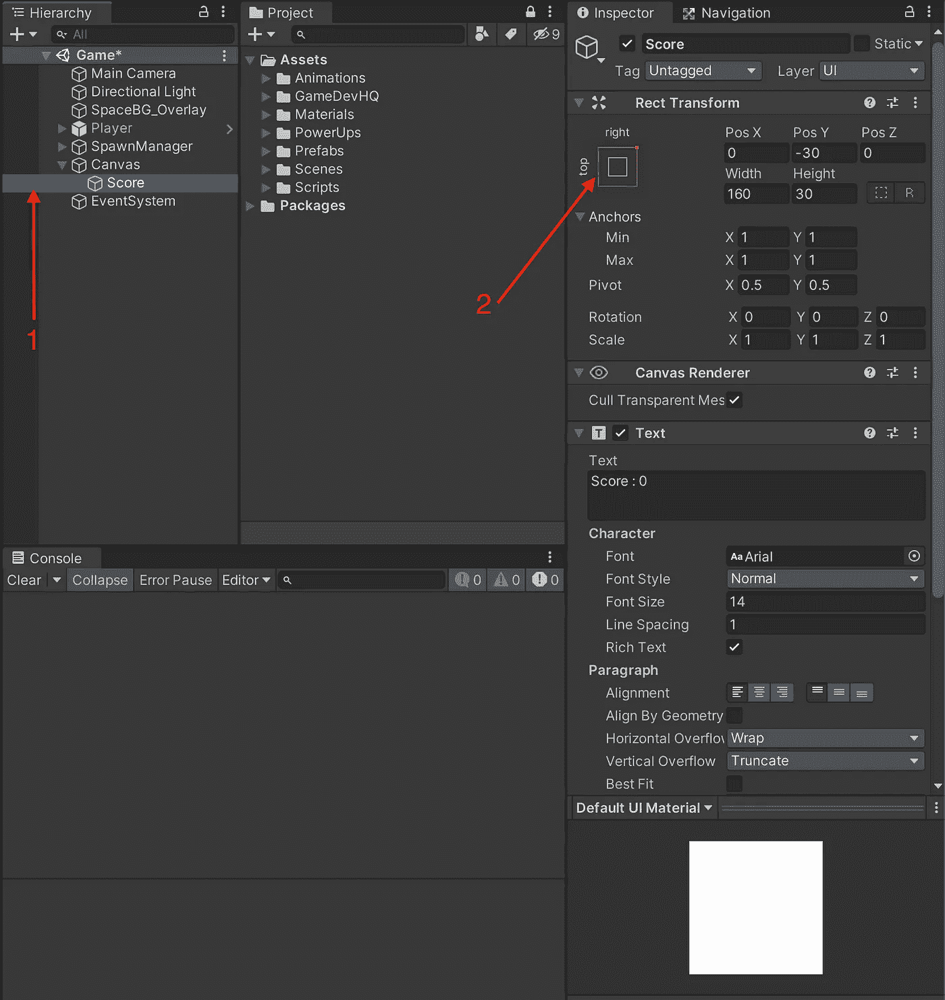

# 在 Unity 中构建 UI 元素的简易性

> 原文：<https://medium.com/codex/ease-of-building-ui-elements-in-unity-405f2d8bbff?source=collection_archive---------9----------------------->

哈帕尔·辛格在 [Unsplash](https://unsplash.com?utm_source=medium&utm_medium=referral) 上的照片

随着游戏行业的发展，我们看到越来越多的玩家希望在玩游戏时关闭所有的 hud(平视显示器)，也就是 UI(指基本的用户界面)，或者在屏幕上几乎没有 UI 元素。原因是沉浸感。游戏也在向最小化用户界面迁移，因为这是玩家(我们)想要的，像《最后的我们》、《对马幽灵》这样的游戏，环境线索被用来引导玩家，显示玩家状态，等等。但是对于竞技游戏(街机游戏，皇家战役)，需要 UI 元素(例如，时间，分数，杀戮)来让玩家沉浸其中。

目前，我们的街机游戏没有办法让玩家在屏幕上看到美丽的游戏之前知道他可以承受多少生命/多少打击，我们也没有分数因子让玩家跟踪他的进展。幸运的是，Unity 使得创建这些元素变得非常容易。

***评分 UI:***

让我们从实现一个分数因子开始，它随着被消灭的敌人数量而增加。

首先，让我们创建一个 UI 文本字段，作为玩家分数的占位符。

我们现在需要一个位置来将我们的分数显示在玩家屏幕上。

乐谱字体获得了一种颜色，我们将画布设置为随屏幕大小缩放。

乐谱被放置，并且也设置了它的锚点。

这里已经做了一些事情，让我们简单看一下，

**Canvas** 游戏对象包含一个 **Canvas Scaler** 组件，该组件包含一个 **UI 缩放模式**，请确保您将此设置为**随屏幕大小缩放**，因为您不希望屏幕大小影响您的 UI 的外观和感觉。

这里，在**分数**游戏对象中，我们需要确保设置了锚点位置。这样做是为了确保 UI 元素(在本例中是 Score)即使在屏幕缩放时也能保持附着在该位置。把它想象成一艘船的锚。

***健康 UI:***

同样，我们现在将增加一个健康栏，这将帮助玩家记录他还剩下多少生命。但它不是一个根据我们剩余的生命更新的文本字段，我们将使用精灵来跟踪玩家的生命数。

过程是相同的，但有一点小小的变化，我们将创建一个图像对象，而不是文本对象(因为我们希望精灵显示剩余的生命数量)。

这是另一个问题，如果我们保持原样，传入的精灵不会是它的原生大小，而是会被缩放以适合白色图像对象，如上所示。

以前

在...之后

这是通过执行以下操作实现的，

拉伸通过了。

将图像缩放到所需的大小。

完成这些后，我们现在可以通过使用脚本来管理这种增加分数和减少生命的行为。

***评分行为:***

由于这是一个 UI 行为，我们可以创建一个 UIManager 来处理任何与 UI 相关的事情，并将其附加到画布游戏对象上。

现在让我们创建一个方法来更新玩家分数，

UIManager 脚本

该方法将一个整数值作为输入参数，并将其附加到玩家分数中。所以根据敌人的类型，我们可以给玩家不同的分数。

现在，让我们进入玩家脚本

玩家脚本

剩下的就是根据敌人的类型来决定给玩家的分数了，因为现在我们只有一个敌人，但是考虑到可扩展性，编码总是更好。

所以，这就是敌人行为的得分更新方式。

更多关于上述触发碰撞方法[的信息，点击这里](/nerd-for-tech/unity-development-collisions-vs-triggers-740d455757bf)，了解脚本如何相互通信[点击这里](/nerd-for-tech/script-communication-in-unity-using-getcomponent-2eaaea4c49d0)。

这样我们就可以根据被消灭敌人的类型来更新我们的分数(在这种情况下，我们现在只有一种敌人类型，所以每消灭一个敌人，分数就会增加 10)。

*注意:请确保在编辑器中将分数游戏对象添加到您的 UIManager。*

这样我们就有了分数函数，现在让我们用*生命*来反映我们还剩多少**生命**。

***人命行为:***

这里的概念是，我们将用新精灵替换游戏对象的精灵，以显示我们还剩下多少生命。为此，我们将使用一个数组来存储 4 个精灵，每个精灵对应一种状态(3 个生命，2 个生命，1 个生命，没有生命)。

我们知道数组的索引是 0，这意味着索引从 *0* 开始，一直到*长度(数组)-1* 。因此，如果我们还有 3 次生命，我们将检查第 4 个位置的数组(数组[3])。同样的，

两个生命→ Array[2]表示数组的第三个位置。
一个生命→数组[1]暗示数组的第 2 个位置。
无生命→ Array[0]表示数组的第一个位置。

现在剩下的就是传递**玩家**的生命数，这可以通过**玩家**脚本来完成。

注意:如果你和我一样使用这个方法，那么我们不需要数组大小为 4，因为我们可以用 3 来凑合。那就是 2 条命，1 条命，没有命，因为默认情况下游戏已经显示我们还剩 3 条命。

这给了我们以下结果，

感谢您的阅读。更多即将推出！！！