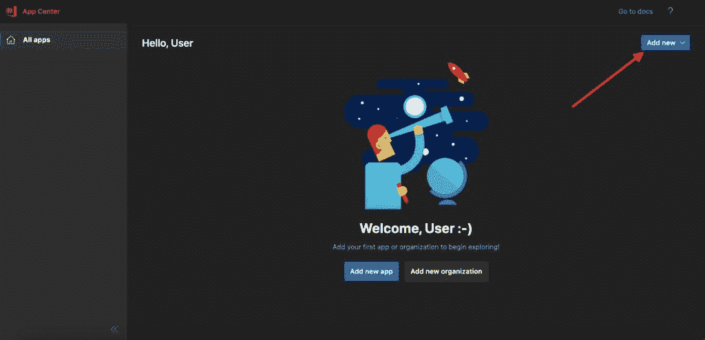
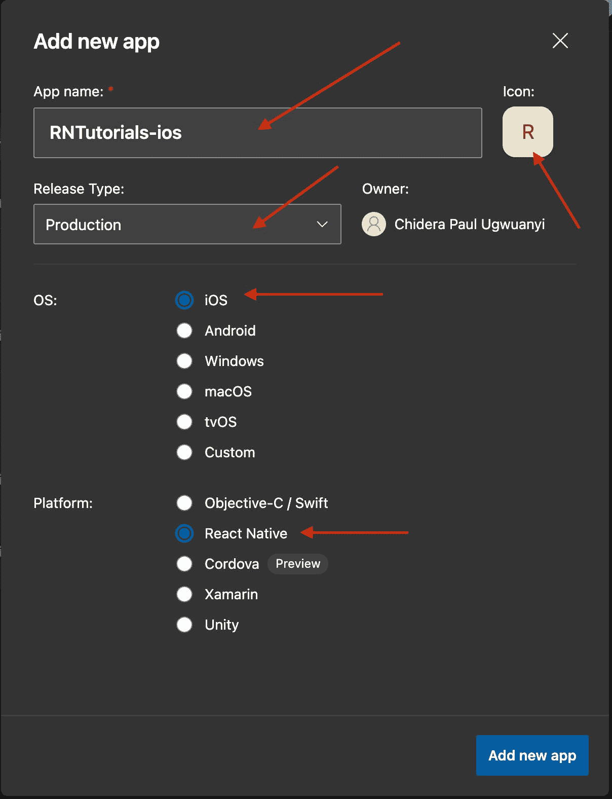
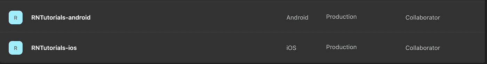
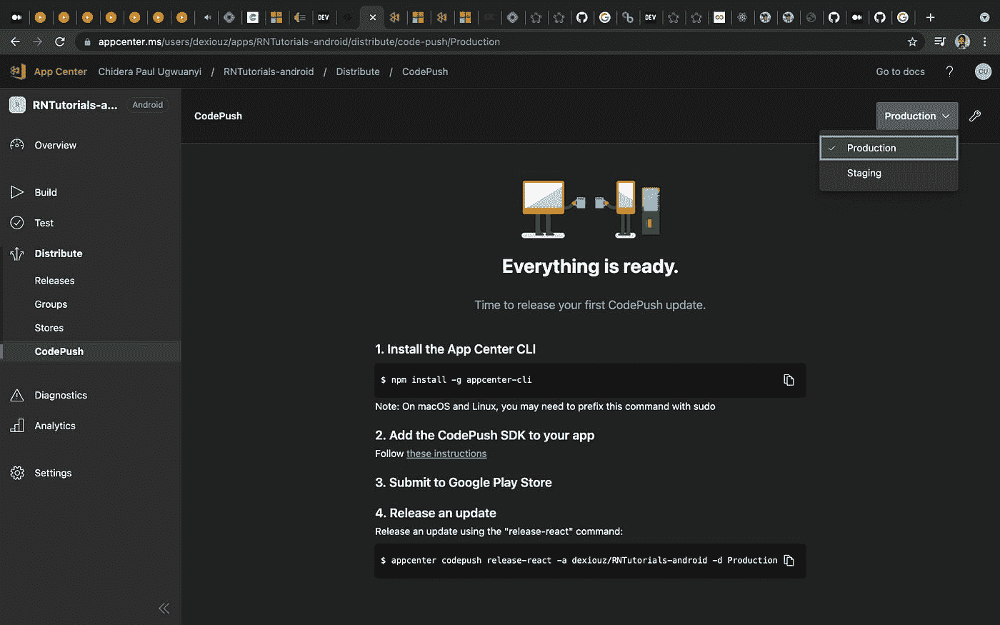
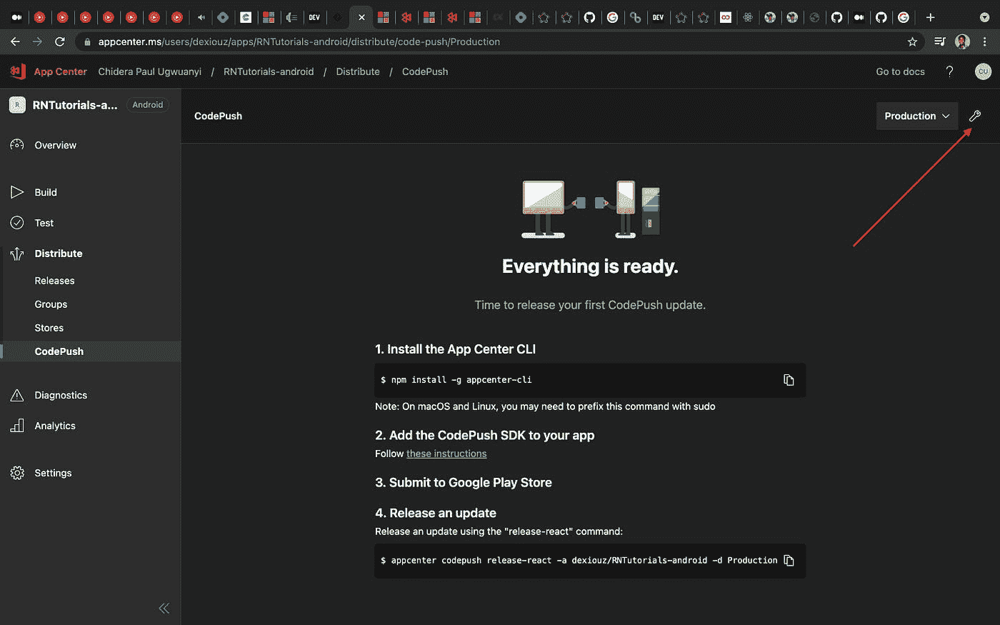
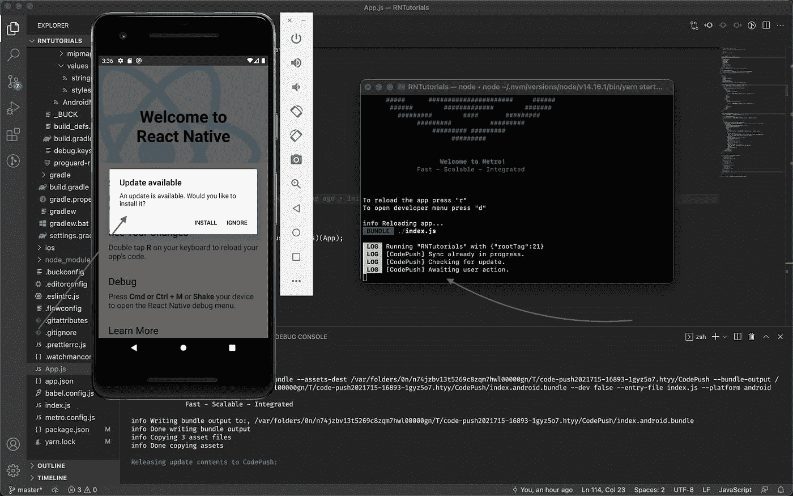
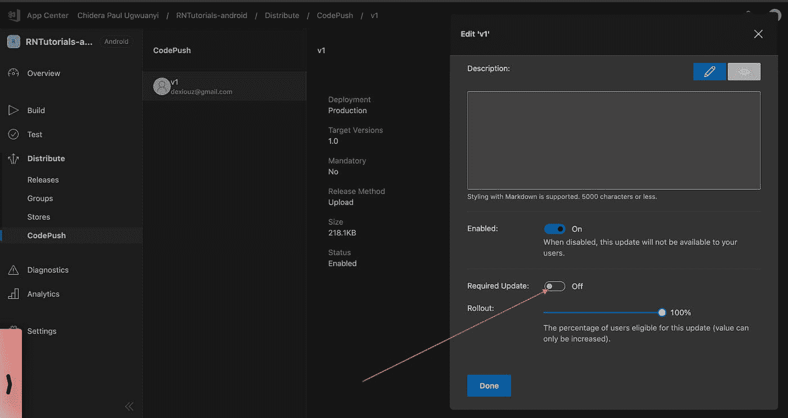
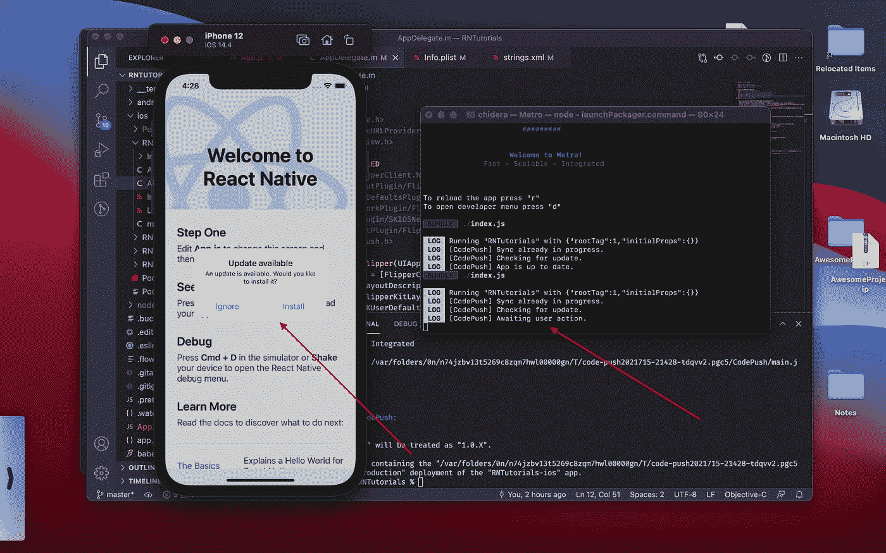

# 使用 CodePush 轻松更新 React 原生应用。

> 原文：<https://medium.com/codex/easily-update-your-react-native-app-with-codepush-db5858e0706b?source=collection_archive---------13----------------------->


# 为什么是 CodePush？

> *[*code push 服务*](https://github.com/microsoft/code-push) *，*[*App center*](https://appcenter.ms/)*的一部分，是一个云服务，使****Cordova****和* ***React 原生*** *开发者能够将移动应用更新直接部署到他们用户的设备上。**
> 
> *App center 是微软在云中构建、测试、分发和监控应用的解决方案。*

*(TLDR)当你开始开发移动应用时，会发生一些事情。你意识到在某些时候项目的所有者会想看看你的工作进展到什么程度了。与 web 应用程序不同，在 web 应用程序中，你可以通过 url 发送给客户端进行检查，而对于移动应用程序(例如 android ),你必须构建一个我们称之为`release apk`的东西，然后发送给客户端。有时 apk 的大小可以达到 40mb+。我们在这里通常做的是将 apk 上传到 Google drive，客户端可以从那里下载(当然也有其他细粒度的方法，比如在 Playstore 中托管为 beta)。*

*现在的问题是，每次你做了一个新的改变(例如，修复一个打字错误，改变颜色)客户想看到的，你必须重新构建，然后再次上传到 Google drive。因此，项目负责人必须从他的手机上卸载以前的应用程序，并下载新版本，比如说 40mb+。但愿你没有再犯同样的错误，否则你就得重新开始。*

> *一天早上，一位客户想向他的投资者演示一款应用，我们不得不上传和下载更多的 9x，同时修改非常小的改动。*

*另一件事是，一旦应用程序通过 playstore(Android)或 App store(ios)发布，更新 JavaScript 代码(例如，修复错误或添加新功能)或图像资产，需要重新编译和重新分发整个二进制文件，这当然包括与发布它的商店相关的任何审查时间。我必须说很可怕。*

*简单来说，CodePush 为你做的是确保用户不必每次都删除他的应用程序并安装一个全新的 40mb 应用程序，而是告诉他有一个新的更新，如果他接受它，新的/所需的更改将在他仍然使用应用程序时下载。只有所需的变化大小将被下载，比如 3mb，2kb 等，而不是 40mb+的整个应用程序。*

*CodePush 的另一个优点是，它维护您发布的每个更新版本的副本。这样做的好处是，如果你发布了一个新的更新，而这个更新导致应用程序崩溃，你可以回滚到之前的工作更新。*

*有这么多，但这只是一点。我相信你现在已经了解大局了。因此，让我们看看如何将 CodePush 集成到我们的 React 本机应用程序中。*

> **但是请注意，CodePush 不会更新任何影响本机代码的更改，例如修改 app delegate . m/main activity . Java 文件、添加新插件。这些必须通过适当的商店进行更新。**

# *创建一个 React 本地项目*

*如果您已经有了一个 React 本地项目，那很好，否则请导航到您选择的终端目录并键入*

```
*npx react-native init RNTutorials*
```

*这将创建一个名为`RNTutorials`的新 React 本地项目。确保它在 android 和 iOS 上运行 etc。*

# *创建应用中心帐户*

*前往[微软应用中心](https://appcenter.ms/create-account)创建一个免费账户。除了 CodePush 服务，App center 还提供其他服务，如构建应用二进制文件(aab、apk、ipa)、应用分发管理、真实设备上的应用测试、崩溃和使用分析。*

# *在应用中心创建您的应用*

*一旦你注册并登录到你的仪表板，接下来的事情是在应用中心创建你的应用，你的应用可以是 ios 或 android。*

*在您的仪表板上，单击“`Add New`”按钮。*

**

*这将打开一个新页面来创建您的应用程序，我们将进行两次，首先是 iOS，然后是 android。*

**

*为 ios 填写如下表格:*

*   *应用名称:你的是你的应用名称，我的是`RNTutorials-ios`，*
*   *图标:你的应用图标，*
*   *释放类型:选择`Production`，*
*   *OS:选择`iOS`，*
*   *平台:选择`React Native`，*

*现在点击`Add new app`按钮完成该过程。*

*它将带你到新创建的应用程序的概览屏幕，其中包含你想要添加分析和应用程序中心崩溃的信息。*

*返回上一页或再次点击仪表板上的`Add New`按钮，为 android 创建如下内容:*

*   *App 名称:你的是你的 app 名称，我的是`RNTutorials-android`，*
*   *图标:你的应用图标，*
*   *释放类型:选择`Production`，*
*   *操作系统:选择`Android`，*
*   *平台:选择`React Native`，*

*现在点击`Add new app`按钮完成该过程。*

*在您的仪表板上，您现在应该可以看到新创建的应用程序。*

**

*点击其中任何一个，让我们从 android 开始，所以点击*

> **rn tutorials-Android>Distribute>code push>创建标准部署。**

*这样，App center 将为您创建两个环境:暂存和生产。对于本指南，我们将使用生产。*

*也去 ios App 做同样的事情*

> **rn tutorials-IOs>Distribute>code push>创建标准部署。**

**

# *在 React Native client 应用中实现 CodePush SDK*

*通过在命令行上运行以下命令来全局安装 appcenter-cli*

```
*npm install -g appcenter-cli*
```

*在成功的全局安装之后，您必须通过终端运行以下命令登录到 appcenter*

```
*appcenter login*
```

*现在转到你的应用程序，安装 react 原生代码推送*

```
*npm install --save react-native-code-push yarn add react-native-code-push*
```

> **大多数 React 原生插件通常对 Android 和 iOS 有不同的集成流程。让我们继续做单独的设置。**

# *Android 设置*

*从你的应用程序，*

*   *转到`android/settings.gradle`并添加以下代码行；*

```
*include ':app', ':react-native-code-push'
project(':react-native-code-push').projectDir = new File(rootProject.projectDir, '../node_modules/react-native-code-push/android/app')*
```

*   *转到`android/app/build.gradle`，寻找这段代码*

*`apply from: "../../node_modules/react-native/react.gradle"`*

*   *然后在它下面加上这个*

*`apply from: "../../node_modules/react-native-code-push/android/codepush.gradle"`*

*   *现在一切看起来应该是这样的:*

```
*...
apply from: "../../node_modules/react-native/react.gradle"
apply from: "../../node_modules/react-native-code-push/android/codepush.gradle"
...*
```

*   *去`android/app/src/main/java/MainApplication.java`*

*首先导入插件类*

```
*import com.microsoft.codepush.react.CodePush;*
```

*然后在这里更新*

```
*public class MainApplication extends Application implements ReactApplication {
    private final ReactNativeHost mReactNativeHost = new ReactNativeHost(this) {
        ...
        // Override the getJSBundleFile method to let
        // the CodePush runtime determine where to get the JS
        // bundle location from on each app start
        [@Override](http://twitter.com/Override)
        protected String getJSBundleFile() {
            return CodePush.getJSBundleFile();
        }
    };
}*
```

*要获取部署密钥，请在终端中键入以下内容*

```
*appcenter codepush deployment list -a <ownerName>/<appName> -k*
```

*我的看起来像这样*

```
*appcenter codepush deployment list -a dexiouz/RNTutorials-android -k*
```

*你应该有这样的东西*

```
*Name: Staging, Key: opoGVuUethk2uZlFsWX5Oq1upZeSoiBLcYAjc
Name: Production, Key: ZrgDzqIHGennFQ3fhDw3U915LmudyRcXSZswW*
```

*部署密钥让 CodePush 知道它应该总是查询哪个运行时(从哪个运行时更新),是登台还是生产。我们将使用`production`。*

*找到部署键的另一种方法是在`yourApp/Distribute/CodePush`点击 CodePush 仪表板上的选项图标。在右上角，看着像扳手哈哈。*

**

*为了利用`android/app/src/main/res/values/strings.xml`中的部署密钥，创建一个名为`CodePushDeploymentKey`的新字符串，其值是您想要配置此应用程序的部署密钥(类似于生产部署的密钥)。您的`strings.xml`应该看起来像这样，确保您复制了用于生产的部署密钥。*

```
*<resources> 
  <string name="app_name">RNTutorials</string> 
  <string moduleConfig="true" name="CodePushDeploymentKey">ZrgDzqIHGennFQ3fhDw3U915LmudyRcXSZswW</string> 
</resources>*
```

# *用 CodePush 包装你的根组件。*

*在我的例子中，根组件是`App.js`。*

```
*// App.js
...
import codePush from "react-native-code-push";let codePushOptions = { 
    checkFrequency: codePush.CheckFrequency.ON_APP_RESUME, 
    updateDialog: { appendReleaseDescription: true }
};...
const App = () => {
    return (
        ...
    )
};export default codePush(codePushOptions)(App);*
```

*注意我们增加了`codePushOptions`，你可以在这里查看 codePushOptions [列表。选项 update dialog:{ appendReleaseDescription:true }表示当更新可用时，用户将获得更新对话框。](https://docs.microsoft.com/en-gb/appcenter/distribution/codepush/rn-api-ref#codepushoptions)*

*现在重新构建您的应用程序，并检查 metro 日志，您应该会看到类似这样的内容。*

*厉害！*

# *向 CodePush 发布一个 android 版本*

*通过跑步做到这一点*

```
*appcenter codepush release-react -a <owner_name>/<app_name> -d Production*
```

*在我的情况下，我做到了*

```
*appcenter codepush release-react -a dexiouz/RNTutorials-android -d Production*
```

*在处理和完成时，我的终端是这样的*

```
*chidera@Chideras-MacBook-Pro RNTutorials % appcenter codepush release-react -a dexiouz/RNTutorials-android -d ProductionDetecting android app version:Using the target binary version value "1.0" from "android/app/build.gradle".Running "react-native bundle" command:node node_modules/.bin/react-native bundle --assets-dest /var/folders/0n/n74jzbv13t5269c8zqm7hwl00000gn/T/code-push2021715-16893-1gyz5o7.htyy/CodePush --bundle-output /var/folders/0n/n74jzbv13t5269c8zqm7hwl00000gn/T/code-push2021715-16893-1gyz5o7.htyy/CodePush/index.android.bundle --dev false --entry-file index.js --platform android
Welcome to Metro!
              Fast - Scalable - Integratedinfo Writing bundle output to:, /var/folders/0n/n74jzbv13t5269c8zqm7hwl00000gn/T/code-push2021715-16893-1gyz5o7.htyy/CodePush/index.android.bundle
info Done writing bundle output
info Copying 3 asset files
info Done copying assetsReleasing update contents to CodePush:Your target-binary-version "1.0" will be treated as "1.0.X".Successfully released an update containing the "/var/folders/0n/n74jzbv13t5269c8zqm7hwl00000gn/T/code-push2021715-16893-1gyz5o7.htyy/CodePush" directory to the "Production" deployment of the "RNTutorials-android" app.
```
```

*成功后，返回到应用中心的 CodePush 仪表板，重新加载并确保您的新版本在那里。*

*要确认一切正常，请再次运行应用程序，查看 metro 服务器日志，注意您可以从 CodePush 下载最新版本。*

**

*单击“安装”后，我们会在 metro 服务器日志中看到这个消息*

```
*LOG  Running "RNTutorials" with {"rootTag":21}
 LOG  [CodePush] Sync already in progress.
 LOG  [CodePush] Checking for update.
 LOG  [CodePush] Awaiting user action.
 LOG  [CodePush] Downloading package.
 LOG  [CodePush] Installing update.
 LOG  [CodePush] Update is installed and will be run on the next app restart.*
```

*它说新的更新将在下一次应用程序重启时运行。但是如果你想在同一个会话中运行它，而不是在重启应用程序时，那么，点击应用程序中心上的`Released update`，点击选项图标，然后勾选“需要更新”按钮为真。然后点击“完成”。*

**

# *iOS 设置*

*对于 iOS 设置，由于您已经安装了 react-native-codePush，请执行以下操作*

*从你的应用程序，*

*还是在`AppDelegate.m`里，找到这行代码*

```
*return [[NSBundle mainBundle] URLForResource:@"main" withExtension:@"jsbundle"];*
```

*并替换为*

```
*return [CodePush bundleURL];*
```

*此更改会将您的应用程序配置为始终加载您的应用程序的 JS 包的最新版本。*

*还记得那个部署键吗？，我们来拿 iOS 版的加到这里。*

*我们将创建一个名为`CodePushDeploymentKey`的新条目，它的值是您想要配置该应用的部署的关键字(在我们的例子中，它是生产)。*

*要获取部署密钥，请在终端中键入以下内容*

```
*appcenter codepush deployment list -a <ownerName>/<appName> -k*
```

*我的看起来像这样*

```
*appcenter codepush deployment list -a dexiouz/RNTutorials-ios -kd*
```

*你应该有这样的东西*

```
*Name: Staging, Key: Xheg3rfeO7VyKtEoGSRnRh3Lrh0lgwVs2j4rt
Name: Production, Key: QbQuDUS4hSELnN4BMrVos1pWsvX6k6MnFFedc*
```

*部署密钥让 CodePush 知道它应该总是查询哪个运行时(从哪个运行时更新),是登台还是生产。我们将使用`production`。*

*找到部署密钥的另一种方法是在`yourApp/Distribute/CodePush`点击 CodePush 仪表板上的选项图标。在右上角，看着像扳手哈哈。*

*现在复制用于生产的部署密钥，并将该密钥添加到`info.plist`*

```
*... 
<key>CodePushDeploymentKey</key> <string>QbQuDUS4hSELnN4BMrVos1pWsvX6k6MnFFedc</string>
...*
```

*因为我们已经用 CodePush 包装了根组件，所以让我们继续重新构建我们的 ios 应用程序。*

*检查 metro 服务器日志，我们得到*

# *向代码推送发布 iOS 版本*

*通过跑步做到这一点*

```
*appcenter codepush release-react -a <owner_name>/<app_name> -d Production*
```

*在我的情况下，我做到了*

```
*appcenter codepush release-react -a dexiouz/RNTutorials-ios -d Production*
```

*我的终端看起来像这样*

```
*chidera@Chideras-MacBook-Pro RNTutorials % appcenter codepush release-react -a dexiouz/RNTutorials-ios -d Production
Detecting ios app version:Using the target binary version value "1.0" from "ios/rntutorials/Info.plist".Running "react-native bundle" command:node node_modules/.bin/react-native bundle --assets-dest /var/folders/0n/n74jzbv13t5269c8zqm7hwl00000gn/T/code-push2021715-21428-tdqvv2.pgc5/CodePush --bundle-output /var/folders/0n/n74jzbv13t5269c8zqm7hwl00000gn/T/code-push2021715-21428-tdqvv2.pgc5/CodePush/main.jsbundle --dev false --entry-file index.js --platform ios
Welcome to Metro!
              Fast - Scalable - Integratedinfo Writing bundle output to:, /var/folders/0n/n74jzbv13t5269c8zqm7hwl00000gn/T/code-push2021715-21428-tdqvv2.pgc5/CodePush/main.jsbundle
info Done writing bundle output
info Copying 3 asset files
info Done copying assetsReleasing update contents to CodePush:Your target-binary-version "1.0" will be treated as "1.0.X".Successfully released an update containing the "/var/folders/0n/n74jzbv13t5269c8zqm7hwl00000gn/T/code-push2021715-21428-tdqvv2.pgc5/CodePush" directory to the "Production" deployment of the "RNTutorials-ios" app.
chidera@Chideras-MacBook-Pro RNTutorials %*
```

*要确认一切正常，请再次运行应用程序，查看 metro 服务器日志，注意您可以从 CodePush 下载最新版本。*

**

*单击“安装”后，我们会在 metro 服务器日志中看到这个消息*

```
*LOG  Running "RNTutorials" with {"rootTag":1,"initialProps":{}}
 LOG  [CodePush] Sync already in progress.
 LOG  [CodePush] Checking for update.
 LOG  [CodePush] Awaiting user action.
 LOG  [CodePush] Downloading package.
 WARN  Sending `CodePushDownloadProgress` with no listeners registered.
 LOG  [CodePush] Installing update.
 LOG  [CodePush] Update is installed and will be run on the next app restart.*
```

*它说新的更新将在下一次应用程序重启时运行。但是，如果您想在同一个会话中运行它，而不是在重启应用程序时运行，那么，单击应用程序中心上的`Released update`,单击选项图标，然后选中“需要更新”按钮。然后点击“完成”。*

**

*如果您访问，可以查看您的 ios 版本*

*`yourapp/Distribute/CodePush/Production(From the options icon - top right)`。*

*仅此而已。恭喜您，您已经成功在 React 本机应用中设置了 CodePush 服务。*

> *如果你觉得这篇文章有用，请点赞，留下你的评论并与你的朋友分享。*
> 
> **你也可以在推特上关注我:* [*@talk2dera*](https://twitter.com/talk2dera)*

**原发布于*[*https://dera . hash node . dev*](https://dera.hashnode.dev/easily-update-your-react-native-app-with-codepush)*。**