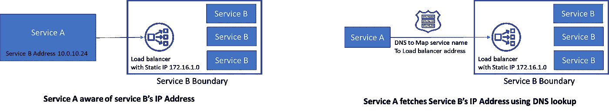

# Kubernetes 中的东西方通信——集群中的服务如何通信？

> 原文：<https://medium.com/codex/east-west-communication-in-kubernetes-how-do-services-communicate-within-a-cluster-310e9dc9dd53?source=collection_archive---------0----------------------->

## 进一步了解支持服务到服务通信的 3 个本地 k8s 对象的动态特性——cluster IP 服务、DNS 和 Kube 代理。

在我以前的文章“Kubernetes 中的南北沟通”中，我写了客户机如何在集群中获得服务。进入集群后，我们现在可以看到后端服务如何在集群内相互通信。

概观

## 传统的服务对服务通信

在进入 Kubernetes 生态系统之前，快速浏览一下传统的服务到服务通信 **—** 通信通过 IP 地址进行，因此为了让服务 A 调用服务 B，一种方法是为服务 B 分配一个静态 IP 地址。现在，要么服务 A 已经知道这个 IP 地址(这在处理非常少量的服务时可能有效)，要么服务 B 用域名&注册自己。服务 A 通过 DNS 查找获得服务 B 的联系地址。

传统的服务对服务通信

## Kubernetes 网络模型

现在，在 Kubernetes 集群中，我们有了控制平面，它构成了集群管理组件&一组称为节点的工作机。这些节点托管 pod，pod 将后端微服务作为容器化服务运行。

按照 Kubernetes 网络模型在集群内部进行点对点通信。

按照 Kubernetes 网络模型——

1.  群集中的每个 pod 都有自己唯一的群集范围的 IP 地址
2.  所有的豆荚都可以和集群内的每个豆荚通话，
3.  通信在没有 NAT 的情况下进行，这意味着目的地 pod 可以看到源 pod 的真实 IP 地址。Kubernetes 认为容器网络或在其上运行的应用程序是可信的，不需要网络级别的身份验证。

## 集群 IP 服务 Pods 上的持久抽象

由于群集中的每个 pod 都有自己的 IP 地址，因此一个 pod 与另一个 pod 对话应该很容易？不，因为 pod 是不稳定的，每次创建一个 pod，它都会获得一个新的 IP 地址。因此客户服务必须以某种方式切换到下一个可用的 pod，这是不希望的。

Pod 之间直接对话的问题在于另一个目的地 Pod 的短暂性&其次是发现替代的 Pod IP 地址。

因此，Kubernetes 可以在一组 Pods 之上创建一个层，为该组分配一个 IP 地址，并提供基本的负载平衡。

pod 通过持久 IP 地址上的集群 IP 服务公开，客户端与服务对话，而不是直接与 pod 对话

这个抽象是由 Kubernetes 中一个名为 **ClusterIP service** 的服务对象提供的。它在多个节点上生成，从而在集群中创建一个服务。它可以在任何端口上接收请求，并将其转发到 pod 上的任何端口。

因此，当应用程序服务 A 需要与服务 B 对话时，它调用服务 B 对象的 ClusterIP 服务，而不是运行该服务的单个 pod。

ClusterIP 使用 Kubernetes 中标签和选择器的标准模式来扫描符合选择标准的 pod。豆荚是有标签的，服务有选择器来寻找标签。利用这一点，有可能进行基本的流量划分，其中新旧版本的微服务共存于同一个 clusterIP 服务之后。

## CoreDNS —集群内的服务发现

现在服务 B 已经获得了一个持久的 IP 地址，服务 A 仍然需要知道这个 IP 地址是什么，然后才能与服务 B 对话。

Kubernetes 支持使用 CoreDNS 进行名称解析。服务 A 应该知道它需要与之对话的集群 IP 的名称(& port)。

1.  CoreDNS 扫描集群，每当创建 ClusterIP 服务时，它的条目都会添加到 DNS 服务器中(如果进行了配置，它还会为每个 pod 添加一个条目，但它与服务到服务的通信无关)。
2.  接下来，CoreDNS 将自己暴露为一个集群 IP 服务(默认情况下称为 kube-dns ),并且这个服务被配置为 pods 中的名称服务器。
3.  发起请求的 Pod 从 DNS 获取 ClusterIP 服务的 IP 地址，然后可以使用该 IP 地址和端口发起请求。

使用<host name="">解析服务。<name of="" namespace="">。<type>。<root>。该类型可以是用于 pod 的 pod(与服务到服务的通信无关)或用于服务的 svc。</root></type></name></host>

## kube-proxy——cluster IP 服务和 backing Pods(目标网络地址转换)之间的链接

到目前为止，从本文来看，似乎是 ClusterIP 服务将调用转发到后端 pod。但实际上，它是由 Kube-proxy 完成的。

Kube-proxy 在每个节点上运行，并监视服务和它们的后备 Pods(实际上是端点对象)。

1.  当一个节点上运行的 pod 向 ClusterIP 服务发出请求时，kube-proxy 会拦截它。
2.  通过查看目标 IP 地址和端口，它可以识别目标群集 IP 服务。并且它将这个请求的目的地替换为一个端点的地址，在该端点上实际的 Pods 服务于该请求。

## 它是如何真正协同工作的？

集群 IP 服务、核心 DNS、客户端 Pod、Kube 代理、端点和目标服务 Pod 的交互

1.  目标的 ClusterIP 服务已在 CoreDNS 中注册
2.  DNS 解析:每个 pod 都有一个 resolve.conf 文件，其中包含核心 DNS 服务的 IP 地址，pod 执行 DNS 查找。
3.  Pod 使用它从 DNS 收到的 IP 地址和它已经知道的端口调用 clusterIP 服务。
4.  目的地地址转换:Kube-proxy 将目的地 IP 地址更新为来自服务 B 的 Pod 可用的地址

**总结**

我们看到了原生的 Kubernetes 对象，它们使得服务到服务的通信成为可能。虽然这些细节对应用层来说是隐藏的，但是了解 vanilla Kubernetes 中有什么是好的&在 Kubernetes 之上构建的平台/产品适合去哪里。

在我的下一篇文章中，我将讨论服务网格，它提供了一个智能网络来简化服务到服务的通信。

我希望报道传达了它所承诺的内容。让我知道你的反馈。

**我的相关文章**

**边车模式，流程外架构** & **对多容器 pod 的需求**—[https://medium . com/codex/communication-inside-a-kubernetes-pod-why-do-we-Need-multi-container-pods-3d 8d 0d 64 c 2 c 9](/codex/communication-inside-a-kubernetes-pod-why-do-we-need-multi-container-pods-3d8d0d64c2c9)

**为什么我们需要 Kubernetes 的服务网络？—**[https://medium . com/codex/east-west-service-to-service-communication-what-is-service-mesh-4 e 56 f 94 BC 89 c](/codex/east-west-service-to-service-communication-what-is-service-mesh-4e56f94bc89c)

**通过入口控制器暴露非 HTTP 端点&新的网关 API**[https://medium . com/codex/north-south-communication-in-kubernetes-exposure-Non-HTTP-services-to-the-outside-world-4 ebba 4217443](/codex/north-south-communication-in-kubernetes-exposing-non-http-services-to-the-outside-world-4ebba4217443)

**Kubernetes 中的南北沟通——客户端如何与集群内部的服务进行对话？**[https://medium . com/better-programming/north-south-communication-in-kubernetes-how-a-client-talk-to-a-service-inside-a-cluster-8 af8 b 27 dbb 9](/better-programming/north-south-communication-in-kubernetes-how-does-a-client-talk-to-a-service-inside-a-cluster-8af8b27dbb9)