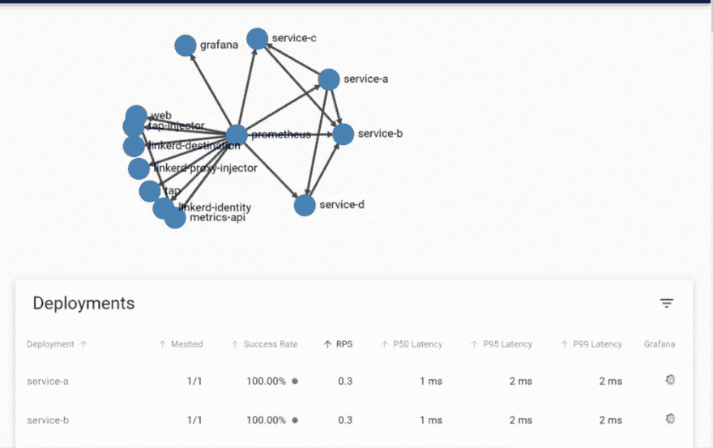
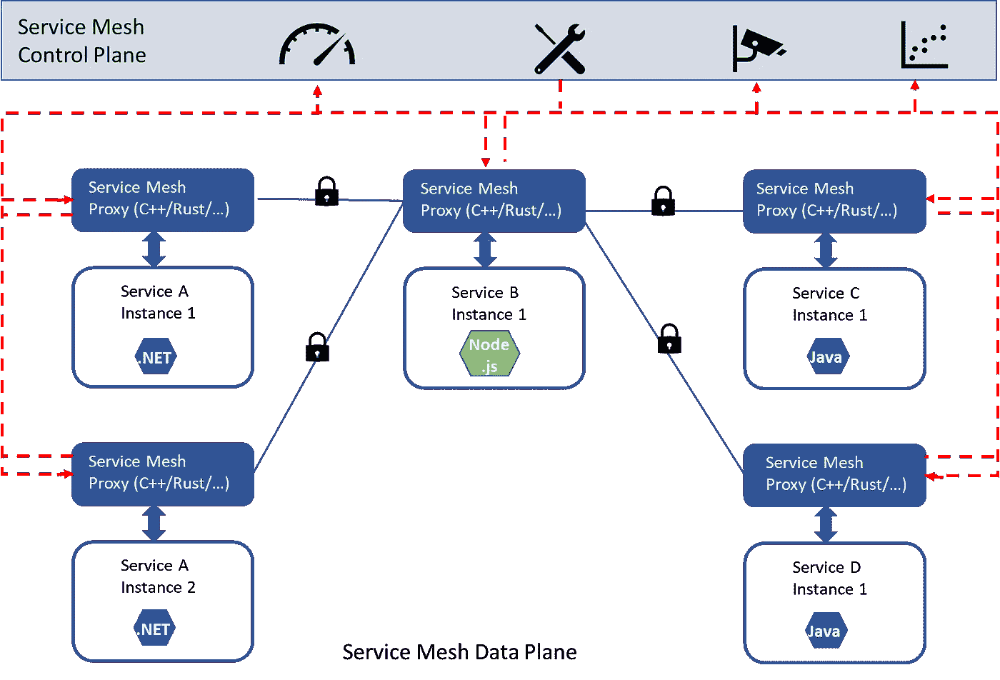
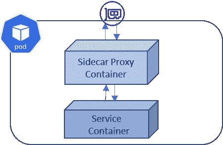
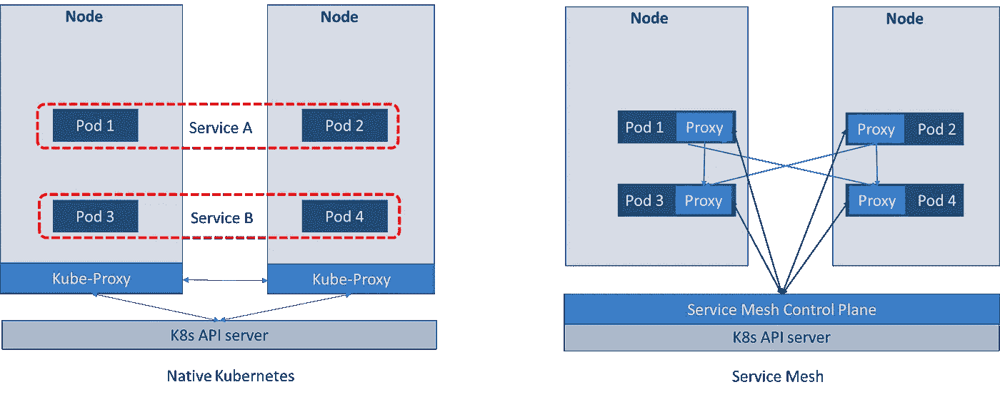

# 东西方(服务到服务)通信—什么是服务网格？为什么我们需要它而不是 Kubernetes？

> 原文：<https://medium.com/codex/east-west-service-to-service-communication-what-is-service-mesh-4e56f94bc89c?source=collection_archive---------2----------------------->

## 根据 2022 年 5 月发布的 [CNCF 调查](https://www.cncf.io/wp-content/uploads/2022/05/CNCF_Service_Mesh_MicroSurvey_Final.pdf)——服务网格正在增加，但需要更多的了解。这篇文章试图阐明服务网格如何支持服务间通信&为什么它们如此受欢迎。

显示服务呼叫的服务网格(Linkerd)仪表板

在我以前的文章“[Kubernetes 中的东西(服务到服务)通信——集群中的服务如何通信？](/codex/east-west-communication-in-kubernetes-how-do-services-communicate-within-a-cluster-310e9dc9dd53)“我写了 Kubernetes 对使用服务发现的服务到服务通信的本地支持，pods 的持久抽象&基本负载平衡。虽然它可能适用于一些较简单的工作负载，但对于安全性、性能&可用性至关重要的许多其他工作负载来说，它可能不是理想的解决方案。因此，许多组织要么建立自己的平台，要么寻求现成的产品。

> 正如云计算领导者 Kelsey Hightower 所言——“Kubernetes 是一个用于构建平台的平台。这是一个更好的起点；而不是最后阶段。”

因此，让我们看看服务网格是如何使它成为服务到服务通信的最终目标的。

## 什么是服务网格？

顾名思义，它是服务的网络/网格。它通过消除服务的连接性问题，使网络更加智能。因此，服务可以专注于他们的主要业务，而不必担心诸如流量管理、传输中的安全性、弹性和可观察性等问题。**把它当成一个可编程的网络。**

就层而言，可以认为它位于网络层和应用程序编程层之间。

**可编程网络—** 服务网格的分层放置

## 服务网格是如何工作的？

服务网格在**分布式代理**上工作(与边缘代理或中央代理相对)，其中代理与应用/服务(或微服务)的每个实例一起运行。该代理的目的是拦截进出应用/服务**的所有流量。**如果服务内的所有通信都通过这样的代理发生，那么所有的通信都是可观察和可操作的。

服务网格代理拦截进出服务的流量，使其安全、可观察和可操作。

在一个容器化的世界中(比如 Kubernetes)，服务的每个实例都运行在独立的容器中，而容器本身也在一个 Pod 中。服务网格沿着同一 pod 中的服务容器注入其代理容器(称为**边车代理**)。这个过程叫做**啮合一个豆荚**。

网状 Pod —服务网状边车代理，充当拦截传入和传出流量的大使。

Sidecar 代理是协同定位、共同管理的，并且具有与服务本身相同的生命周期。但是它产生了优雅的**“进程外”架构**，因此代理对服务是透明的。这也使得代理能够在与服务完全不同的技术中实现(例如，envoy 代理在 AWS 应用网格中使用，Istio 在 C++中实现& Linkerd 的微代理在 Rust 中实现)。

如果你对“进程内”和“进程外”的设计感兴趣，我在之前的文章[中提到过。](/codex/communication-inside-a-kubernetes-pod-why-do-we-need-multi-container-pods-3d8d0d64c2c9)

分布式代理构成了服务网格的数据平面，而治理由控制平面提供。

## 我们为什么需要它？

服务网格通过运行代理将流量管理从 Kubernetes 中分离出来，从而通过提供更接近服务/应用层的抽象来管理服务间的流量、安全性和可观察性。

1.  **安全性** —在某些业务领域(如银行业)，源服务和目标服务都可以验证彼此的身份(即使它们在同一个集群中)，同时保持通信加密，这是一项安全义务。服务网格使用开箱即用的相互 TLS 和服务到服务的访问控制策略来减轻这种要求。
2.  **性能** —更多的网络跳数并不意味着更多的延迟，神奇！在源和目的地的网状单元在单元到单元的通信中引入了 2 个额外的跳跃。但是与让它变慢的预期相反，实验表明使用**智能路由算法的服务网格可以更快**。下面是一个实验[https://linkerd . io/2017/02/01/making-things-fast-by-adding-more-steps/](https://linkerd.io/2017/02/01/making-things-faster-by-adding-more-steps/)。这无法与 Kubernetes 的循环负载平衡相比。
3.  **审核和监控** —因为所有流量都流经侧车代理。所有流量都是可以观察到的。服务网格可以将这些矩阵交付给仪表板，以显示实时和历史行为。
4.  **细粒度流量管理** —在一个部署频繁的敏捷微服务世界& canary 版本中，服务网格实现了从旧版本到新版本服务的精确&渐进流量转移。
5.  **多集群&混合集群** —对于服务网格，我们确实需要缝合网络。一旦连接了网络层，服务网格就从服务中抽象出集群(这是我打算在以后的文章中讨论的主题)。
6.  **弹性通信** —服务网格带有重试策略，可以克服故障，使分布式服务工作。

## 考虑

更多内存和 CPU 利用率——每个 sidecar 代理都需要资源。而一个边车的资源可能很少。当预期运行数千个代理时，需要进行适当的考虑。考虑到需求、未来预测和 nfr，这是考虑是否应该选择一种服务网格产品而不是另一种产品的合适地方。此外，某些事件可能会触发每个侧车代理的资源利用率的临时峰值。

> 对于每秒通过代理的 1000 个请求，Envoy 代理使用 0.35 vCPU 和 40 MB 内存。特使代理将 2.65 毫秒增加到第 90 个百分位数的延迟。[https://istio . io/latest/docs/ops/deployment/performance-and-scalability/](https://istio.io/latest/docs/ops/deployment/performance-and-scalability/)

 [## 基准测试 Linkerd 和 Istio: 2021 Redux

### 今年早些时候，我们发布了 Linkerd 与 Istio 性能指标评测，比较了…

linkerd.io](https://linkerd.io/2021/11/29/linkerd-vs-istio-benchmarks-2021/) 

选择一种服务网格产品而不是另一种产品的其他考虑因素可能是跨多个集群、混合环境和托管服务产品的需求。

## 摘要

Kubernetes 提供资源和服务(或微服务)的生命周期，而服务网格控制服务之间的通信。服务网格不是 Kubernetes 特有的技术。

值得一提的是，根据对 KubeKon 2020 的一些问题的回答，Kubernetes 似乎可能会获得更丰富的 L7 功能，与服务网格的功能集有些重叠。因此，关注 Kubernetes 的演变是有好处的。但这仍然意味着，如果使用了诸如 Istio 或 Linkerd 之类的实现，它们将仍然有效。

CNCF 调查的链接是[这里是](https://www.cncf.io/wp-content/uploads/2022/05/CNCF_Service_Mesh_MicroSurvey_Final.pdf)。

我希望你喜欢这篇文章，我试图使它简洁，同时涵盖了主题的广度。请让我知道你的想法。

我在 Kubernetes 上的其他文章

[集群内的服务如何通信？](/codex/east-west-communication-in-kubernetes-how-do-services-communicate-within-a-cluster-310e9dc9dd53)

[为什么我们需要多容器箱？](/codex/communication-inside-a-kubernetes-pod-why-do-we-need-multi-container-pods-3d8d0d64c2c9)

[在 Kubernetes 集群之外公开非 HTTP 服务的可能性有多大？](/codex/north-south-communication-in-kubernetes-exposing-non-http-services-to-the-outside-world-4ebba4217443)

Kubernetes 中的南北沟通——客户端如何与集群内部的服务进行交流？