# 对随机变量和分布基本原理的简单解释

> 原文：<https://medium.com/codex/easy-explanation-of-a-random-variable-and-fundamentals-of-a-distribution-4fd197bb7303?source=collection_archive---------5----------------------->

## Pdf，Cdf，期望值，方差

假设您正在调查客户对您的服务有多满意。假设你抽样 10 个人，他们可以回答是或不是。当我们应用组合公式时，你得到的结果总数是 2 ⁰.但是考虑到样本量，这个数字是不是太大了？当你用 10 个人得到 2 个⁰结果时，当结果的数量呈指数增长时，你如何处理一个更大的数据集？

关于这类问题，你应该记住的一点是，每个人不是这里的主要焦点。在这种情况下，你关心的是有多少人回答是或否，而不是谁回答什么。所以不用两个⁰结果，你可以简化它。

布雷特·乔丹在 [Unsplash](https://unsplash.com?utm_source=medium&utm_medium=referral) 上的照片

# 简化样本空间:随机变量

从上面的例子来看，人们通常关心你从调查中得到多少肯定。因此，我们可以将样本空间重新定义为我们感兴趣的空间。

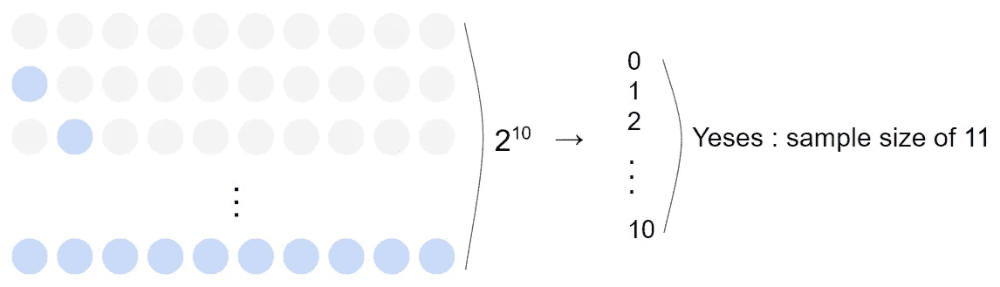

随机变量如何简化样本空间

这被称为随机变量，正如你所看到的，你从中获得的最大好处是，你可以把一个样本空间变成一个更简单的版本。在数学中，人们用大写字母表示随机变量，如下所示。

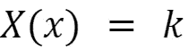

随机变量 X

因此，上面的符号意味着，当 X 被赋予一个随机变量 X 时，它给出一个值 k。例如，使用上面的调查示例，当 k = 1 时，X 将是 10 个人的每个组合，其中包括 1 个是。

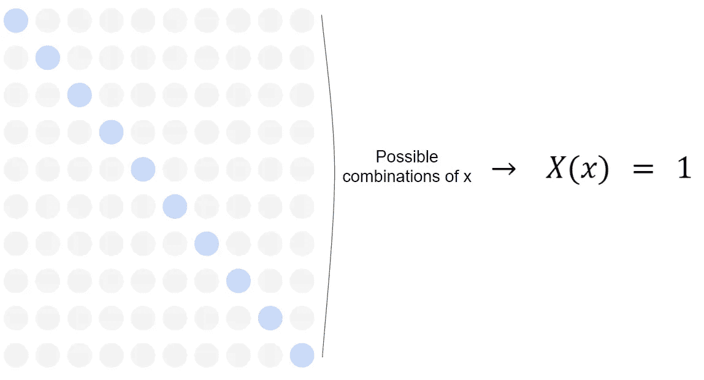

仔细看看 X(x) = 1

因为它的好处，随机变量被用于统计中的每一个分布。我们可以把它分为两种类型:离散型和连续型。

## 离散随机变量

从它的名字可以看出，当样本空间 S 中的点要么是有限的，要么是可数无限的，我们称之为离散随机变量。因此，上面的调查示例是一个离散随机变量，因为它的样本空间由 0 到 10 的整数组成。除此之外，二项分布、几何分布、超几何分布、负二项分布和泊松分布中的随机变量被认为是离散随机变量。

## 连续随机变量

与离散随机变量的样本空间不同，连续随机变量的样本空间包含不可计数的无穷多个结果。换句话说，一个随机变量的结果是以实数为特征的。举个例子，当你让一个人在 0.0 到 1.0 之间选择一个数字时，这涉及到一个连续的随机变量。指数分布、伽玛分布、卡方分布、正态分布和均匀分布都属于这一类。每个发行版是什么以及它们看起来如何将是即将到来的帖子的主题。但是在我们进入每个分布之前，让我们先看看将军。

# 分销基础

## 概率密度函数

然而，只有这些对样本空间的描述，很难处理你将来会遇到的各种统计程序。因此，您通常使用随机变量的概率密度函数或 pdf，它描述了概率是如何分布的，并遵循以下要求。(有人称之为离散随机变量的概率质量函数或 pmf。)除了它们的符号之外，对于离散和连续的要求是相同的。

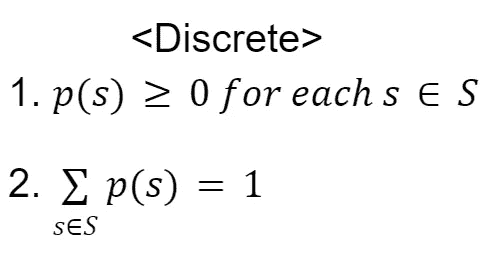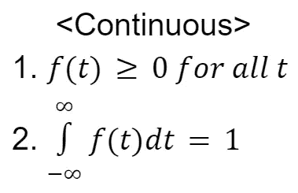

每个 p()和 f()代表离散和连续的概率函数

如上所示，样本空间中的每个值都应该有一个大于或等于 0 的相应概率，并且所有概率之和必须等于 1。p(s)用于离散，而连续用 f(t)表示。但是你可以看到有些人也用 f(s)来表示离散，所以最好通过理解问题来决定它是哪种类型的随机变量，而不是只看符号。当我们把这个符号和一个随机变量联系起来，就变成了下面这个符号。

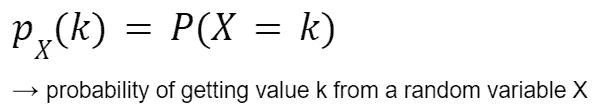

举个例子，假设 pX(k)指的是两次抛硬币得到的人头数的 pdf。那么，pX(1) = P(X=1)就变成了抛两个硬币得到 1 头的概率。因为有 4 个可能的结果，{HH，HT，TH，TT}，pdf 的值是 1/2。

## 累积分布函数

对于单个值，可以使用上述过程。但是，如果您想要计算多个值的概率，例如硬币示例中的 1 和 2 个头像，或者连续情况下从 0 到 0.8 的值范围，该怎么办呢？在这种情况下，可以使用累积分布函数或 cdf。

根据定义，随机变量 X 的累积分布函数是满足下列条件的函数。

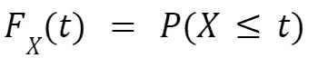

任意随机变量 X 的 cdf

上面的符号表示随机变量 X 的值小于或等于任何实数 t 的概率。一般定义和数学符号 Fx(t)对于离散和连续都是相同的。而且，由于 0 ≤ f(t)，两种情况下的 cdf 都是单调非减函数。然而，函数的一般外观是不同的。

对于离散情况，因为它基于有限或可数无限的样本空间，cdf 看起来像一个阶跃函数，在概率为正数的值处增加。

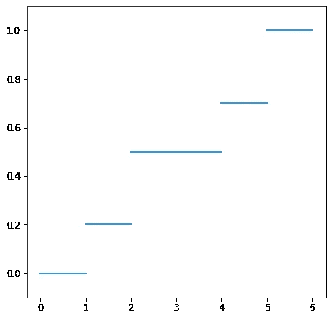

一个离散 cdf 的例子。它不会在 3 处增加，因为 x = 3 处的 pdf 为 0。

另一方面，cdf 看起来像一个连续随机变量的线性函数。

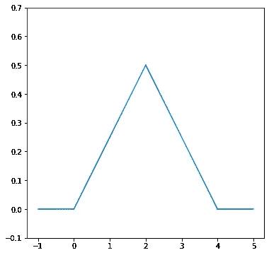

连续 cdf 的一个例子。

另一个区别是你如何计算 cdf。对于离散，您使用 sigma 来计算从一点到另一点的概率之和。但是对于连续，你用积分。所以从微积分的角度来看，这就像计算曲线下的面积。

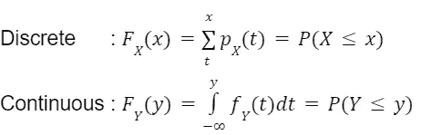

来自 sigma 的 t 是不确定的，但是它从对应概率不为 0 的最小值开始

如你所见，连续随机变量的 cdf 可以通过对 pdf 进行积分得到。尽管上面的公式计算的是点左侧的面积，但只要对公式稍加调整，您也可以计算右侧的面积或两点之间的面积。

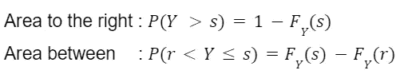

如何计算右边的面积和两点之间的面积

接下来你要看的两件事，是你从现在开始会不断遇到的。

## 预期值

第一个是期望值，也称为集中趋势、平均值或重心。以后，这个值将经常用于比较两个不同概率分布的位置。除了符号不同，离散公式和连续公式的基本结构是相同的。不同的发行版会有不同的表现，这将在后面的文章中解释。所以此时此刻，你只需要知道公式的基本结构。

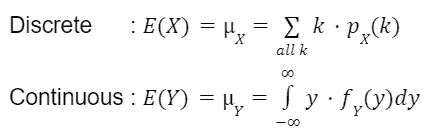

离散和连续的期望值公式

关于期望值，我们总是假设的一个关键点是它绝对收敛。这一点非常重要，因为如果违反了这一假设，就意味着期望值将取决于您添加的订单。这不应该发生，因为期望值是“代表”概率分布的指标之一。

## 差异

第二个重要的概念是方差。有些人可能已经很熟悉这个术语了，它表示从一个平均值分散出多少值。因此，我们通过取平均值和单个点之间的平方差的平均值来计算方差。

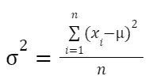

方差公式

通过使用期望值，同样的逻辑适用于随机变量的方差。

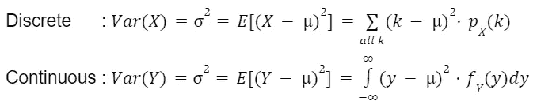

随机变量的方差公式

但是根据您的情况，使用下面的等式可能更容易，其中 W 代表任何随机变量，离散或连续的。

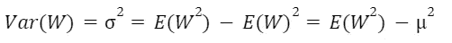

任何随机变量的更简单的方差公式

需要考虑的一件事是，在计算方差时，我们对一个随机变量求平方。因此，单位也是平方的；然而，当单位不匹配时，很难解释结果。所以常见的是取方差的平方根来计算标准差。

> 下一个故事:[数据科学中 EDA 需要了解的 5 个基本离散分布](https://bbeat2782.medium.com/5-basic-discrete-distributions-you-need-to-know-for-eda-in-data-science-83f3921cd1ee)

# 参考

[1] Larsen，Richard J .，和 Morris L. Marx。*数理统计及其应用简介*。第六版。

[2]托马斯·威廉姆斯。"随机变量和概率分布."*大英百科全书*，大英百科全书股份有限公司[https://www . Britannica . com/science/statistics/Random-variables-and-probability-distributions。](https://www.britannica.com/science/statistics/Random-variables-and-probability-distributions.)