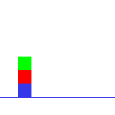

# 用张量流简单解释关系深度强化学习

> 原文：<https://medium.com/codex/easy-explanation-of-relational-deep-reinforcement-learning-with-real-code-4e2455217853?source=collection_archive---------5----------------------->

由于 LSTMs 的内存限制，目前的深度学习模型大多使用了注意机制。DeepMind 已经在 2019 年 ICLR 会议上发表了一篇题为“具有关系归纳偏差的深度强化学习”的论文。

# 关系环境

本文使用网格型环境来验证该模型的性能。然而，可以肯定的是，由于移动滑车的方式，与训练的质量相比，这种环境花费了太多的时间。这就是为什么我决定使用[另一个环境](https://drive.google.com/file/d/1mfZ1O0DKWPlBQYl6UNQUL0IMgfJ4_FyX/view?usp=sharing)的原因，它具有关系特性，但具有简单的移动方式。在确认论文的算法是否可行之后，我们就可以在星际争霸 2 的环境下使用了。

盒子世界环境的可视化

这是一个非常简单的环境，代理应该按顺序堆叠箱子。难度取决于积木的数量。因此，这是一个非常理想的环境来检查关系强化学习的性能。

网络体系结构

首先，我们来看一下使用 Tensorflow 的[官方变形金刚教程的多头注意力方法解决一个有三个盒子的盒子世界环境的代码。](https://www.tensorflow.org/text/tutorials/transformer)

Tensorflow 的变压器教程的多头关注功能

为了训练速度快，使用了 Tensorflow 2.0 的[演员-评论家教程代码](https://www.tensorflow.org/tutorials/reinforcement_learning/actor_critic)。您只需要添加一个关系模块来建模部分代码。

A2C 与关系政策

如果没有，下载 [my code](https://drive.google.com/file/d/1QLttW9Za_Tzk0P50q25Wx6xzZiEieecT/view?usp=sharing) 并用 BoxWorldEnv.py 文件运行它。

A2C 培训结果

在注意力策略下，训练将在大约 11k 集内完成。与同等条件下的 CNN 政策相比较是合理的。和注意力政策一样，CNN 的政策可以达到最高奖励。然而，它需要更多的插曲。

DQN 培训结果

有趣的是，DQN 不能用 A2C 的注意力网络训练好。要自己检查，下载[我的代码](https://drive.google.com/file/d/19dz18dZ9wzS7g2U47K9HRc_gjELBzXwl/view?usp=sharing)并在 BoxWorld 环境中使用它。

注意网络的数量效应

最后需要检查的是根据关系块数训练性能。在我的情况下，我看不出使用相同环境和算法的注意力网络的数量有任何性能差异。

嵌套注意网络

注意力网络的嵌套方式类似于上面的代码。

# 关系块如何工作？

查看模型的结构。首先，一个大小为(batch，64，64，3)的图像通过两个 CNN。这样就得到一个大小为(batch，W，H，C)的矩阵。如果将其转换为 size (batch，W x H，C)，则获得具有多个 C 特征的多个 W x H 实体。

论文 CNN 输出中的实体抽取

从 CNN 输出的代码中提取实体

下面是将之前获得的(batch，W x H，C) size 实体作为查询、键、值放入 MultiHeadAttention 模型中。这也将产生一个关注值 size (batch，W x H，C)。

最后，注意添加大小为(batch，W x H，C)的实体。然后，选取具有最大 C 值的图元。它将给出一个矩阵的大小(批，C)。在残差操作之前对关注值应用下降，然后在操作之后应用层归一化。

然后，得到的值可以作为深度强化学习中的共同特征。

经由可微分神经逻辑的归纳逻辑编程

例如，在 BoxWorld 中，当指定背景知识时，可以使用谓词 above(a，b)来表示框 a 在框 b 之上。这样的谓词然后可以在盒 c 和 d 的学习期间使用。

# Dr-Derk 环境

上面解释的网络可以应用于需要关系功能的其他环境。在我的例子中，我将其应用于一个名为 Derk's Gym 的 3: 3 多人在线战斗竞技场类型的游戏。

德克健身房

我的理论是，分享同一个团队成员的信息比只使用自己的信息玩游戏更有利于获得更高的分数。

德克健身房的观察与行动

对德克健身房的观察包括地形、物品以及敌人和盟友的个人信息，大小为 64。在动作的情况下，它简单地由向前移动的速度、旋转的速度和使用项目 1/2/3 组成，大小为 5。

德克健身房的奖励

德克的健身房奖励包括给予和接受单位的伤害，给予建筑物的伤害，给予单位的治疗量，摔倒死亡和合作分数。

竞技场和平行

Derk's Gym 的一个特点就是可以自己提供多种环境功能。用户无需额外编码即可轻松确定名为 Arena 的游戏场数。最近，有各种分布式强化学习方法用于在多种环境下快速训练。我为 A2C 修改了谷歌研究代码的 Seed-RL。

德克体育馆一个场馆的网络结构

一个竞技场中每个代理的信息可以看作一个实体。如果我们把它们放在一起，网络就能知道每个实体之间的关系信息，从而为团队游戏选择行动。

德克健身房注意阻滞的效果

我用与第一个实验相同的方式比较了 CNN 政策、关系政策的案例。如果注意力集中，您可以看到代理获得更多奖励，如上图所示。

# 结论

德克健身房的代码是一个正在进行的比赛。因此，与公众分享它看起来不是一个好主意。然而，如果你完全理解关系推理的注意，你可以很容易地把它应用到你自己的项目中。