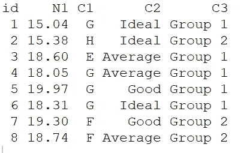

# R 语言中伪编码/一键编码的简单实现

> 原文：<https://medium.com/codex/easy-implementation-of-dummy-coding-one-hot-coding-in-r-42c0486f8996?source=collection_archive---------3----------------------->


本文总结了一些简单的方法，可以快速地将分类变量一起转换为 0-1 值，其他变量保留在数据帧中以供下一步分析。

我们不使用繁琐的 ifelse 或 case_when 函数。

我将构建一个常规任务:在一个数据框架中，我们有一个 ID 变量，一个数值变量，N1，两个分类变量，C1 和 C2，我们想把它们编码为虚拟变量，还有一个分类变量，C3，我们保持不变。

我们首先创建一些数据。函数 set.seed 用于保证每次运行代码时都可以复制结果。

```
set.seed(451)
df=data.frame(
id=1:8,
N1=round(runif(8,14,20),2),
C1=sample(c("E","F","G","H"),8,replace=T),
C2=sample(c("Ideal","Good","Average"),8,replace=T),
C3=sample(c("Group 1","Group 2"),8,replace=T),stringsAsFactors = T) 
```

我创建了一个有 5 个变量和 8 行的数据帧。见下文。如果对 set.seed()使用 451，那么应该创建和我一样的数据帧。



如开始所述，我们只需要伪编码 C1 和 C2。C1 有 4 个不同的级别(E、F、G 和 H)，C2 有 3 个不同的级别(好、理想和一般):4+3=7。如果我们不考虑满级，我们将创建 7 个假人，每个一级。

但是，如果我们想保持一个完整的秩，并避免所谓的“伪陷阱”，我们将有一个截距(或常数，即一列 1)和 5 个伪，或 6 个没有截距的伪。我让读者去弄清楚什么是虚拟陷阱。

下面我提供三种方法。每个都只是使用管道的一行代码。你可以复制我的代码，做一些小的改动来完成你的工作。

首先，我使用 pivot_wider 函数来完成虚拟编码。

```
library(tidyverse)
df1=df %>% mutate(value1=1,value2=1) %>% pivot_wider(names_from =C1,values_from=value1,**values_fill = 0**) %>%  pivot_wider(names_from = C2,values_from=value2,values_fill = 0);df1
```

诀窍是创建两个 1 的常量列(称为 value1 和 value2)，并通过 pivot_wider 两次将数据转换为宽形。每次我们使用 **values_fill = 0** 用零填充 NAs。我们现在只为 C1 和 C2 完成了彻底的虚拟转换。总共创建了 7 个虚拟变量。

为了获得满秩变换，我们可以移除 7 个虚拟对象中的一个，或者添加一个截距并从两个因子中的每一个移除一个虚拟对象。由这两个虚拟变量代表的因子水平被选择作为参考。在下面，我选择**虚拟 E 和理想**作为参考，并在添加截距时相应地删除它们。

```
df2=df1 %>% mutate(intercept=1) %>% **select(-c(E,Ideal)**);df2
```

有时人们想跟踪那些新的假人(他们最初来自哪个栏目，C1 还是 C2？).他们想给那些假名字加上前缀或附录，比如“C1”。e”或“好的 C2”我的方法是在改变 C1 和 C2 的价值观之前先改变它们。

```
df1=df %>% mutate(value1=1,value2=1,**C1=str_c("C1_",C1),C2=paste0(C2,".C2")**) %>% pivot_wider(names_from =C1,values_from=value1,values_fill = 0) %>%  pivot_wider(names_from = C2,values_from=value2,values_fill = 0);df1
```

无论是 **paste0 还是 strc_c** 都可以系统地改变 C1 和 C2 的值(如上图所示)。如果你找到更好的方法，请告诉我。

pivot_wider 的对立面 pivot_longer 可以轻松地将一组虚拟变量转换回分类变量。你可以从我之前的文章中找到答案。

另一种方法是在 caret 包中使用 dummyVar。语法 dummyVar 有点奇怪，因为它需要两步才能得到我们需要的数据帧。

```
library(caret)
df1=dummyVars( ~.-C3, data = df,sep = "_")
data.frame(predict(df1, newdata = df))
df1$C3=df$C3;df1
```

使用管道，

```
df1=df %>% dummyVars(~.**-C3**,data=., **sep="_"**) %>% predict(,newdata=df) %>% as.data.frame()%>%mutate(C3=df$C3)
```

dummyVars 像 pivot_wider 一样给你 7 个虚拟变量。dummyVars 的优点是它可以自动保留原来的列名(C1 和 C2)作为前缀，并相应地将它们添加到那些虚拟变量的名称中。

dummiesVars 的问题是，它将数据框架中的每个分类变量转换为 dummy，除非我们将 C3 排除在转换之外(通过在公式中添加 **-C3** )。因此，C3 从新数据帧中移除，我们必须通过 mutate 函数手动将其添加回来。

公式也有猫腻:“~。——C3“，”~C1+。——C3“，”~C2+。——C3“，”~C1+C2+。-C3”和“~C1+C2+N1+id-C3”都给出了相同的结果，但是列的顺序不同。公式中的点表示包括数据框架中的所有变量。

使用 dummyVars 时如何获得满秩变换？dummyVars 有一个选项 **fullRank=T** 来实现这个目标。

```
df1=df %>% dummyVars(~.-C3,data=., sep="_",**fullRank=T**) %>% predict(,newdata=df) %>% as.data.frame()%>%mutate(intercept=1,C3=df$C3)
```

总共制作了 5 个假人。然后，我们需要通过 mutate 向数据帧添加一个截距。

相反，如果我们不想要截距，但仍然喜欢满秩转换，我们可以修改 dummyVars 函数中上述代码的公式参数。

```
df1=df %>% dummyVars(~.-C3**-1**,data=., sep="_",fullRank=T) %>% predict(,newdata=df) %>% as.data.frame()%>%mutate(C3=df$C3)
```

公式中的“ **-1** ”告诉 R 在变换过程中不考虑截距。结果，创建了 6 个假人。

最后一种方法是使用 model.matrix。

```
df1=as.data.frame(model.matrix(~C1+.-C3,df));df1 
```

如果我们不想拦截，你可以

```
as.data.frame(model.matrix(~C1+.-1-C3,df))
```

model.matrix 的优点是转换总是满秩的(要么用一个截距创建 5 个虚拟对象，要么不用截距创建 6 个虚拟对象)。缺点是您不能定制那些新创建的虚拟变量的名称，并且您仍然会丢失您不想在输出中转换为虚拟变量的分类变量。此外，model.matrix 的输出仍然需要转换回 dataframe。

使用管道，我们有

```
df1=df %>% model.matrix(~.-C3,.) %>% as.data.frame()%>%mutate(C3=df$C3)
```

model.matrix 中的第二个点(~。-C3。)来指示管道中的数据参数。

总而言之，这三种方法各有利弊。但是它们比其他情况下要方便得多。如果我们准备线性回归或 glm，我们将使用 model.matrix，而不用担心满秩或虚拟陷阱。在其他情况下，dummyVars 可以一次快速处理包含许多分类变量的数据集(例如产品特性)，如果您只想对选定数量的分类变量进行伪编码，pivot_wider 允许进行定制。