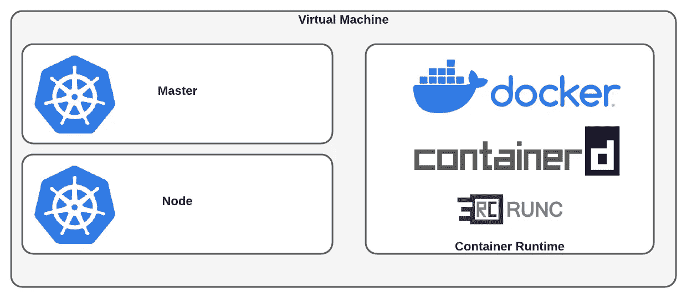
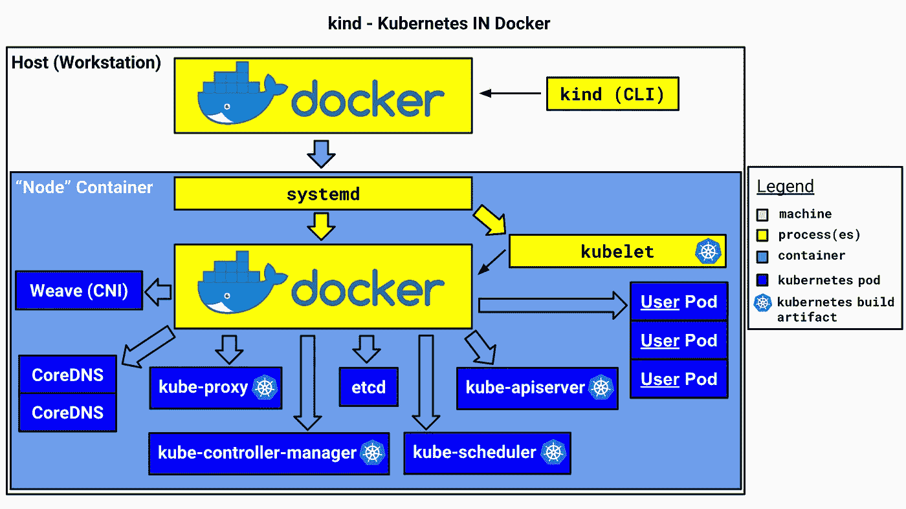
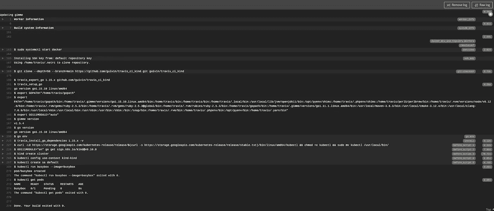

# 在 Docker 中轻松运行 K8S 的小工具

> 原文：<https://medium.com/codex/easy-kubernetes-integration-in-your-ci-a546556d7da5?source=collection_archive---------7----------------------->

## [法典](http://medium.com/codex)

## 想要动态部署 Kubernetes 集群吗？是的，可以直接在 Docker 下运行 Kubernetes！


照片由西蒙·维亚尼 / [Unsplash](https://unsplash.com/?utm_source=ghost&utm_medium=referral&utm_campaign=api-credit) 拍摄

要在本地部署 Kubernetes，目前的解决方案是安装 [Docker Desktop](https://www.docker.com/products/docker-desktop) 或 [minikube](https://minikube.sigs.k8s.io/) 。我们将在这里看到如何使用一个叫做 [kind](https://kind.sigs.k8s.io/docs/user/quick-start/) 的伟大工具在 Docker 中部署 Kubernetes。我们将看到如何将其安装在您的笔记本电脑上，并使用 Travis CI 在 CI 端进行一点推动。

对于 CI，我们来看下面的场景:您有一个应用程序的 YAML 清单，您想在不同版本的 Kubernetes 上测试它。为有重大变化的每个版本创建一个真正的集群会很复杂。

# 为什么不是 Minikube？

Minikube 是在本地部署 Kubernetes 集群进行测试的最初方式。可以使用虚拟机配置一个主节点和多个节点。每个虚拟机嵌入一个运行时容器:



Minikube 架构图

虚拟机需要更长时间才能启动。这在一个 CI 环境中尤为重要，因为在这个环境中有几个作业必须在一个链中运行。作业的执行时间越短越好！最后，如果我们用容器化层替换虚拟化层会怎么样？

# 码头上的 Kubernetes

> “kind 是一个使用 Docker 容器节点运行本地 Kubernetes 集群的工具。kind 主要是为测试 Kubernetes 本身而设计的，但也可能用于本地开发或 CI。来自[https://kind.sigs.k8s.io/](https://kind.sigs.k8s.io/)

Kind 是一个与 docker 守护进程交互的 CLI。它创建一个“节点”容器，为 Kubernetes 创建必要的组件，如 etcd、kubelet、addons:



https://kind.sigs.k8s.io/docs/design/initial/[的实物设计图](https://kind.sigs.k8s.io/docs/design/initial/)

在这一部分，我们将看到如何在本地安装`kind`，然后创建一个集群。然后，我们将配方导出到 Travis CI 配置中。

## 安装

首先安装 golang:

```
$ brew install golang
$ go version                                                                                                                                                                                                                     
go version go1.16 darwin/amd64
```

然后 kind 超级容易安装:

```
$ GO111MODULE="on" go get sigs.k8s.io/kind@v0.10.0 
```

## 创建具有种类的集群

```
$ kind create cluster
Creating cluster "kind" ...
 ✓ Ensuring node image (kindest/node:v1.20.2) 🖼
 ✓ Preparing nodes 📦
 ✓ Writing configuration 📜
 ✓ Starting control-plane 🕹️
 ✓ Installing CNI 🔌
 ✓ Installing StorageClass 💾
Set kubectl context to "kind-kind"
You can now use your cluster with:kubectl cluster-info --context kind-kindThanks for using kind! 😊$ kubectl cluster-info --context kind-kind                                                                                                                                                                                     
Kubernetes control plane is running at [https://127.0.0.1:50968](https://127.0.0.1:50968)
KubeDNS is running at [https://127.0.0.1:50968/api/v1/namespaces/kube-system/services/kube-dns:dns/proxy](https://127.0.0.1:50968/api/v1/namespaces/kube-system/services/kube-dns:dns/proxy)To further debug and diagnose cluster problems, use 'kubectl cluster-info dump'.$ kubectl run busybox --context kind-kind --image=busybox
pod/busybox created
$ kubectl get pods
NAME      READY   STATUS      RESTARTS   AGE
busybox   0/1     Completed   0          7s
```

# 崔维斯词中的亲切

配置使用 golang 语言，并重复使用之前在本地执行的手动步骤:

具有种类的 Travis CI 配置文件

一切都运转良好:



先前配置文件的 Travis CI 输出

# 结论

Kind 的启动速度比 Minikube 快得多。安装和创建 Kubernetes 集群非常简单。鉴于所有这些，它非常适合 CI 实践。如果你正在寻找一个最小的解决方案，你也可以用它来代替 Docker for Desktop 的 Kubernetes 特性。

# 资源

[](https://kind.sigs.k8s.io/) [## 种类

### kind 是一个使用 Docker 容器“节点”运行本地 Kubernetes 集群的工具。kind 主要是为…

kind.sigs.k8s.io](https://kind.sigs.k8s.io/)