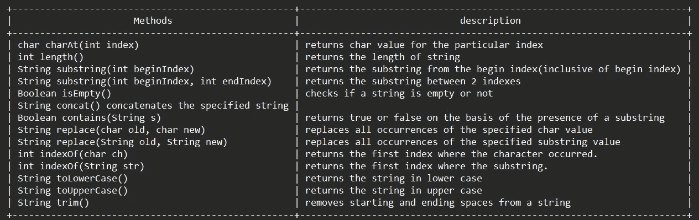

# Java 字符串、StringBuilder 和 StringBuffer 的简单教程

> 原文：<https://medium.com/codex/easy-tutorial-on-java-string-stringbuilder-and-stringbuffer-763b2e1f5fe6?source=collection_archive---------8----------------------->

照片由 [Henry Be](https://unsplash.com/@henry_be?utm_source=medium&utm_medium=referral) 在 [Unsplash](https://unsplash.com?utm_source=medium&utm_medium=referral) 上拍摄

在本教程中，我们将深入探讨 Java String、StringBuilder 和 StringBuffer 的概念，并了解我们应该使用什么类以及何时使用。

字符串被广泛用作一种数据类型，它允许程序员处理单词、句子、电话号码，甚至只是普通的数字。从根本上说，String 是一个表示字符值序列的对象。

# 字符串类

Java String class 是 Java 自带的标准类，专门用于处理字符串。Java string 类实现了 Serializable、Comparable 和 CharSequence 接口。字符数组的工作方式也和 Java 字符串一样。例如:

`char[] ch = {‘j’, ‘a’, ‘v’ , ‘a’};`

`String str = new String(ch);`

这将初始化一个新的字符串，其内容为`java`。

上面两行可以写成

`String str = ”java”;`

我们初始化字符串的第一种方法向我们展示了字符串包含一个字符数组。

据说 Java 字符串是不可变的。不可变意味着不可修改或不可改变，这意味着一旦一个字符串对象被创建，我们就不能改变它的内容。

下面我们可以看到一个描述这一事实的例子。

这里`Gaurav`没有改变，但是用`Gaurav Sharma`创建了一个新对象。这就是字符串被称为不可变的原因。

但是如果我们把它显式赋给引用变量，它就会引用`Gaurav Sharma`对象。

这里我们将变量 s 的引用从`“Gaurav”`改为字符串`“Gaurav sharma”`

## 字符串操作

我们可以用字符串执行很多操作，我将在这里列出最重要的。

1.  **字符串连接:** 这个部分处理使用不同的技术连接两个或更多的字符串

*   **使用+运算符的字符串串联**

我们可以使用+操作符连接两个字符串，它将返回一个字符串，该字符串将两个字符串的内容附加在一起。

但是`+`操作符在连接字符串和数字的情况下会导致歧义。让我们通过一个例子来理解这一点。

在这个例子中，我们可以看到串联的工作方式非常奇怪，足以让我们重新考虑输出

> H 之前我们得到了输出`*50TestString2040*`，因为使用+的**字符串连接创建了一个新的字符串，并且它一直将操作数追加到前面操作数的末尾。**

让我们用循序渐进的方法来更好地理解这句话。

语句`10+20+20+s1+s2+20+40`的工作方式如下。

10+20 = 30
30+20=50
50+S1 = 50 测试
50 测试+S2 = 50 测试字符串
50 测试字符串+20 = 50 测试字符串 20
50 测试字符串 20+40 = 50 测试字符串 2040

*注意:追加到字符串的整数将始终产生一个字符串。*

*   **通过 concat 方法的字符串连接:**

**2。比较字符串**

使用各种技术来检查字符串在值和引用方面的相等性。java 中有 3 种方法来比较字符串值。

*   **字符串比较等于方法**

String equals 方法根据字符串的内容对字符串进行比较。它比较字符串的奇偶或相等性。

String 类提供了两种比较内容的方法。

`public Boolean equals(String str)
public Boolean equalsIgnoreCase(String str)`

`equals`该方法通常比较两个字符串，但也会考虑大小写

`“Apple” != “apple”`

但是在`equalsIgnoreCase`的情况下，该陈述将为真

`“Apple” == “apple”`

*   **字符串比较 by ==运算符**

==运算符比较堆中对象的引用或内存位置。它不检查它所检查的引用值。

1.  s1==s2 为真，因为二者在字符串常量池中有相同的地址。要了解更多关于字符串常量池的信息，请参考这个链接，因为这个主题很大，超出了本教程的范围。
    [https://www.geeksforgeeks.org/string-constant-pool-in-java/](https://www.geeksforgeeks.org/string-constant-pool-in-java/)
2.  s1==s3 为假，因为每当我们用 new 关键字创建一个字符串对象时，我们就在字符串常量池中为这个对象分配一个新的内存位置，这样 s1 和 s3 就不会引用堆中的同一个内存位置。

*   **用 compareTo()方法进行字符串比较**

`compareTo()`方法按字典顺序比较两个字符串，并返回一个整数值，指示第一个字符串小于、等于或大于第二个字符串。对于两个串 s1 和 s2，如果

s1==s2 返回 0
s1 > s2 返回正数
s1 < s2 返回负数

这里我们可以看到,`compareTo`方法只检查两个字符串中字母的相对顺序。

## String 类的一些重要方法

# STRINGBUFFER 类

String 和 StringBuffer 类在 java.lang 包中定义。StringBuffer 类用于创建可变或可修改的字符串。String 和 StringBuffer 中的一切都是相同的，只是 StringBuffer 类表示一个可增长和可写的字符序列。可以替换 StringBuffer 中的任何字符，我们也可以在 StringBuffer 中插入字符，StringBuffer 的大小会自行增长。

我们可以用 3 种方法声明 StringBuffer(它有 3 个构造函数),我们将会看到所有的方法。

1.  `StringBuffer str = new StringBuffer();`
    这将创建一个 StringBuffer 对象，它是一个空的字符串缓冲区，初始容量为 16 个字符。
2.  `StringBuffer str = new StringBuffer(String string);` 这将创建一个 StringBuffer 对象，将字符串的内容作为参数传递。
3.  它将创建一个空的 StringBuffer 对象，初始大小等于作为参数传递的整数。

## StringBuffer 方法:

一些方法使字符串缓冲区从字符串中脱颖而出，我们将详细讨论它们

*   **append():**

append 方法将给定的参数追加到字符串中。它接受三种类型的参数 String、int 和 Object。

> ***语法:
> String buffer append(String str)
> String buffer append(int num)
> String buffer append(Object obj)***

示例:

*   **插入()**

insert()方法将给定的字符串、字符或对象插入到另一个字符串的给定位置。

> ***语法:
> String buffer insert(int index，String str)
> String buffer insert(int index，char ch)
> String buffer insert(int index，Object obj)***

示例:

*   **删除()**

delete()方法用于从索引处的字符串中删除一个字符，或者我们可以删除一个范围内的字符。

> ***语法:
> string buffer insert(int startIndex，int endIndex)***

示例:

*   **反转()**

此方法反转字符串。它进行字符串的原位反转。

> ***语法:
> string buffer reverse()***

示例:

*   **容量()**

Java 中 StringBuffer 类的 capacity()方法用于返回缓冲区容量。默认情况下，字符串缓冲区的容量为 16 个字符。通过调用这个方法，我们可以计算它的当前容量。

> 如果字符数增加了当前容量 Stringbuffer 的大小增加了(当前容量*2)+2

示例:

# STRINGBUILDER 类

StringBuilder 类用于创建与 StringBuffer 类相同的可变和可修改的字符串，但 StringBuffer 和 StringBuilder 之间的唯一区别是 StringBuffer 是同步的。StringBuffer 的所有方法在 StringBuilder 中都可用。

## STRING 和 STRINGBUFFER 类之间的区别

**字符串**

1.  String 类是不可变的。
2.  当我们连接太多的字符串时，String 会变慢并消耗更多的内存，因为每次它都会创建一个新的实例。
3.  String 类重写 Object 类的 equals()方法。所以你可以用 equals()方法比较两个字符串的内容。
4.  字符串类在执行串联操作时速度较慢。
5.  字符串类使用字符串常量池。

**StringBuffer**

1.  当我们连接两个字符串时，StringBuffer 速度更快，占用的内存更少。
2.  StringBuffer 类不重写 Object 类的 equals()方法。
3.  StringBuffer 类在执行串联操作时速度更快。
4.  StringBuffer 类是可变的。
5.  StringBuffer 使用堆内存。

## STRINGBUILDER 和 STRINGBUFFER 类之间的区别

**StringBuffer**

1.  StringBuffer 是同步的，即线程安全的。这意味着两个线程不能同时调用 StringBuffer 的方法。
2.  StringBuffer 的效率比 StringBuilder 低。
3.  StringBuffer 是在 Java 1.0 中引入的

**StringBuilder**

1.  StringBuilder 是*非同步的*，也就是说，不是线程安全的。这意味着两个线程可以同时调用 StringBuilder 的方法。
2.  StringBuilder 比 StringBuffer 更高效。
3.  StringBuilder 是在 Java 1.5 中引入的

这都是关于 String，StringBuffer 和 StringBuilder 类的，在这里我们了解了这些类是什么，它们能做什么，不能做什么。我希望你喜欢阅读和深入了解这些课程。

如果你明白我在这里说的任何事情，请鼓掌回应并跟我来，因为它帮助我保持动力并从我的时间表中抽出时间来写这些文章。这不会花你任何钱，但会帮我很多忙

> 高拉夫·夏尔马是一个狂热的读者和热情的旅行者。他试图通过传播他的知识和他的生活经历来过一个更有意义和目标的生活！跟随他踏上平衡数字生活和现实生活的新旅程。他住在印度的北阿坎德邦。他在 Instagram 上的 [@golf。_.塞拉](https://www.instagram.com/golf._.sierra/)