# StackOverflow 开发者调查 2020 的探索性数据分析

> 原文：<https://medium.com/codex/eda-stackoverflow-2020-70f22bea8f1c?source=collection_archive---------6----------------------->


Stack Overflow 的年度开发人员调查是近十年来全球最大的程序员和程序员调查之一。在 2020 年，这项调查的重点是更好地代表全球程序员的多样性，大约有 65，000 人参加了调查。

我将对这个数据集进行完整的探索性数据分析。这一次，我使用了一个名为“opendatasets”的助手库来下载所需的数据集。这个库包含了一个精选数据集的集合，并提供了一个直接下载的帮助函数。

```
#importing the required library and downloading the required dataset
import opendatasets as od
od.download('stackoverflow-developer-survey-2020')

#checking/verifying if the dataset was downloaded into the directory
import os
os.listdir('stackoverflow-developer-survey-2020')Using downloaded and verified file: .\stackoverflow-developer-survey-2020\survey_results_public.csv
Using downloaded and verified file: .\stackoverflow-developer-survey-2020\survey_results_schema.csv
Using downloaded and verified file: .\stackoverflow-developer-survey-2020\README.txt

['README.txt', 'survey_results_public.csv', 'survey_results_schema.csv']#Importing the required libraries
import numpy as np
import pandas as pd
import matplotlib
import matplotlib.pyplot as plt
import seaborn as sns
%matplotlib inline

#loading the csv file into a dataframe
survey_rawdf = pd.read_csv('stackoverflow-developer-survey-2020/survey_results_public.csv')
survey_rawdf
```

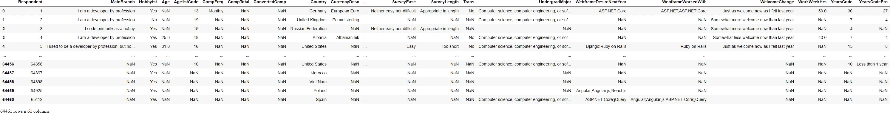

该数据集包含对 61 个问题的大约 65，000 个回答。这些回答似乎已经被匿名化，以删除个人身份信息。相反，每个回答者都被分配了一个随机的回答者 ID。

由于快捷方式已经用于列名，我们可以查看模式文件来查看每个问题的完整文本。我们可以将它作为一个序列加载，以 ColumnName 作为索引，以 Question 作为值。

```
schema_srs = pd.read_csv('stackoverflow-developer-survey-2020/survey_results_schema.csv', index_col = 'Column').QuestionText
schema_srsColumn
Respondent            Randomized respondent ID number (not in order ...
MainBranch            Which of the following options best describes ...
Hobbyist                                        Do you code as a hobby?
Age                   What is your age (in years)? If you prefer not...
Age1stCode            At what age did you write your first line of c...
                                            ...                        
WebframeWorkedWith    Which web frameworks have you done extensive d...
WelcomeChange         Compared to last year, how welcome do you feel...
WorkWeekHrs           On average, how many hours per week do you wor...
YearsCode             Including any education, how many years have y...
YearsCodePro          NOT including education, how many years have y...
Name: QuestionText, Length: 61, dtype: object
```

现在我准备进入下一步，即预处理和清理我的数据。此外，很明显，调查包含大量信息，但是，在本次分析中，我将重点关注以下几个方面:

*   调查受访者和全球编程社区的人口统计数据。
*   编程技能、经验和偏好的分布。
*   与就业相关的信息、偏好和意见。

## 数据准备和清理:

这个过程包括处理丢失和无效的数据、按某些列分组、选择所需的列等等。

```
#selecting a subset of columns with relevant data

selected_columns = [
    # Demographics
    'Country',
    'Age',
    'Gender',
    'EdLevel',
    'UndergradMajor',
    # Programming experience
    'Hobbyist',
    'Age1stCode',
    'YearsCode',
    'YearsCodePro',
    'LanguageWorkedWith',
    'LanguageDesireNextYear',
    'NEWLearn',
    'NEWStuck',
    # Employment
    'Employment',
    'DevType',
    'WorkWeekHrs',
    'JobSat',
    'JobFactors',
    'NEWOvertime',
    'NEWEdImpt'
]

#creating/extracting a copy of the data from these columns into a new data frame so that we can continue to modify further without affecting the original data frame

survey_df = survey_rawdf[selected_columns].copy()
survey_df
```

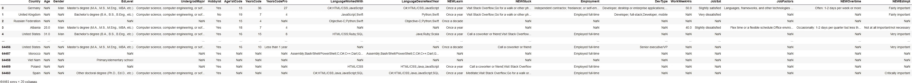

```
schema = schema_srs[selected_columns]
schemaColumn
Country                                                  Where do you live?
Age                       What is your age (in years)? If you prefer not...
Gender                    Which of the following describe you, if any? P...
EdLevel                   Which of the following best describes the high...
UndergradMajor                        What was your primary field of study?
Hobbyist                                            Do you code as a hobby?
Age1stCode                At what age did you write your first line of c...
YearsCode                 Including any education, how many years have y...
YearsCodePro              NOT including education, how many years have y...
LanguageWorkedWith        Which programming, scripting, and markup langu...
LanguageDesireNextYear    Which programming, scripting, and markup langu...
NEWLearn                  How frequently do you learn a new language or ...
NEWStuck                  What do you do when you get stuck on a problem...
Employment                Which of the following best describes your cur...
DevType                   Which of the following describe you? Please se...
WorkWeekHrs               On average, how many hours per week do you wor...
JobSat                    How satisfied are you with your current job? (...
JobFactors                Imagine that you are deciding between two job ...
NEWOvertime               How often do you work overtime or beyond the f...
NEWEdImpt                 How important is a formal education, such as a...
Name: QuestionText, dtype: object
```

关于我们的数据框架的一些基本信息:

```
survey_df.shape(64461, 20)
```

我们有 64461 行(回答者)和 20 列(问题)。

```
survey_df.info()<class 'pandas.core.frame.DataFrame'>
RangeIndex: 64461 entries, 0 to 64460
Data columns (total 20 columns):
 #   Column                  Non-Null Count  Dtype  
---  ------                  --------------  -----  
 0   Country                 64072 non-null  object 
 1   Age                     45446 non-null  float64
 2   Gender                  50557 non-null  object 
 3   EdLevel                 57431 non-null  object 
 4   UndergradMajor          50995 non-null  object 
 5   Hobbyist                64416 non-null  object 
 6   Age1stCode              57900 non-null  object 
 7   YearsCode               57684 non-null  object 
 8   YearsCodePro            46349 non-null  object 
 9   LanguageWorkedWith      57378 non-null  object 
 10  LanguageDesireNextYear  54113 non-null  object 
 11  NEWLearn                56156 non-null  object 
 12  NEWStuck                54983 non-null  object 
 13  Employment              63854 non-null  object 
 14  DevType                 49370 non-null  object 
 15  WorkWeekHrs             41151 non-null  float64
 16  JobSat                  45194 non-null  object 
 17  JobFactors              49349 non-null  object 
 18  NEWOvertime             43231 non-null  object 
 19  NEWEdImpt               48465 non-null  object 
dtypes: float64(2), object(18)
memory usage: 5.4+ MB
```

大多数列都具有数据类型 object(它们可能包含不同类型的值或包含空值(NaN))。)此外，我们可以看到每一列都包含一些空值，因为每一列的非空计数都低于总行数(64461)。所以我们必须处理空值，并且可能需要根据具体情况手动调整每一列的数据类型。

类似地，只有两列，即 Age 和 WorkWeekHrs 被检测为数字列。但是肯定还有一些其他列具有数值，如 Age1stCode、YearsCode、YearsCodePro。所以我将把这些列转换成数字数据类型。我将忽略任何非数字值，并将它们转换为 NaN。

```
survey_df['Age1stCode'] = pd.to_numeric(survey_df.Age1stCode, errors='coerce')
survey_df['YearsCode'] = pd.to_numeric(survey_df.YearsCode, errors='coerce')
survey_df['YearsCodePro'] = pd.to_numeric(survey_df.YearsCodePro, errors ='coerce')#some basic statistics about our numeric columns
survey_df.describe()
```


我们可以看到，年龄一栏的最小值是 1，最大值是 279，这是相当不寻常的。这是调查的一个常见问题:由于回答时的意外或故意错误，回答可能包含无效值。一个简单的解决方法是忽略年龄大于 100 岁或小于 10 岁的行，因为它们是无效的调查响应。类似地，在 WorkWeekHrs 的情况下，让我们忽略该列的值高于 140 小时(每天 20 小时)的条目。

```
survey_df.drop(survey_df[survey_df.Age < 10].index, inplace = True)
survey_df.drop(survey_df[survey_df.Age > 100].index, inplace = True)

survey_df.drop(survey_df[survey_df.WorkWeekHrs > 140].index, inplace = True)survey_df['Gender'].value_counts()Man                                                            45895
Woman                                                           3835
Non-binary, genderqueer, or gender non-conforming                385
Man;Non-binary, genderqueer, or gender non-conforming            121
Woman;Non-binary, genderqueer, or gender non-conforming           92
Woman;Man                                                         73
Woman;Man;Non-binary, genderqueer, or gender non-conforming       25
Name: Gender, dtype: int64
```

在性别列中，我将删除包含多个选项的值，以简化我们的分析。

```
survey_df.where(~(survey_df.Gender.str.contains(';', na= False)), np.nan, inplace=True)

survey_df['Gender'].value_counts()Man                                                  45895
Woman                                                 3835
Non-binary, genderqueer, or gender non-conforming      385
Name: Gender, dtype: int64
```

我的数据框架示例:

```
survey_df.sample(10)
```

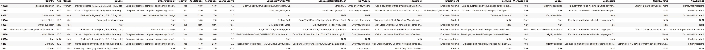

看起来我们的数据帧不需要任何进一步的清理，所以继续下一步。

## 探索性分析和可视化:

```
#Setting some styles first

sns.set_style('darkgrid')
matplotlib.rcParams['font.size'] = 13
matplotlib.rcParams['figure.figsize'] = (11, 7)
matplotlib.rcParams['figure.facecolor'] = '#0f0f0f80'
```

在询问有关调查回答的问题之前，先了解受访者的人口统计数据(国家、年龄、性别、教育水平、就业水平等)会有所帮助。)探究这些变量将有助于解释该调查对全球编程社区的代表性。

## 国家:

查看受访者所在的国家，并绘制出回复数量最高的国家。

```
top_countries = survey_df.Country.value_counts().head(15)
top_countriesUnited States         12371
India                  8364
United Kingdom         3881
Germany                3864
Canada                 2175
France                 1884
Brazil                 1804
Netherlands            1332
Poland                 1259
Australia              1199
Spain                  1157
Italy                  1115
Russian Federation     1085
Sweden                  879
Pakistan                802
Name: Country, dtype: int64#visualizing this using a barplot; where index of this series is the xaxis and its values is the yaxis

plt.figure(figsize=(13,5))
plt.xticks(rotation=75) #since the labels displayed horizontaly will be messed up
plt.title("15 Countries with the highest number of respondents")
sns.barplot(top_countries.index, top_countries)c:\users\beeka\appdata\local\programs\python\python38-32\lib\site-packages\seaborn\_decorators.py:36: FutureWarning: Pass the following variables as keyword args: x, y. From version 0.12, the only valid positional argument will be `data`, and passing other arguments without an explicit keyword will result in an error or misinterpretation.
  warnings.warn(

<AxesSubplot:title={'center':'15 Countries with the highest number of respondents'}, ylabel='Country'>
```

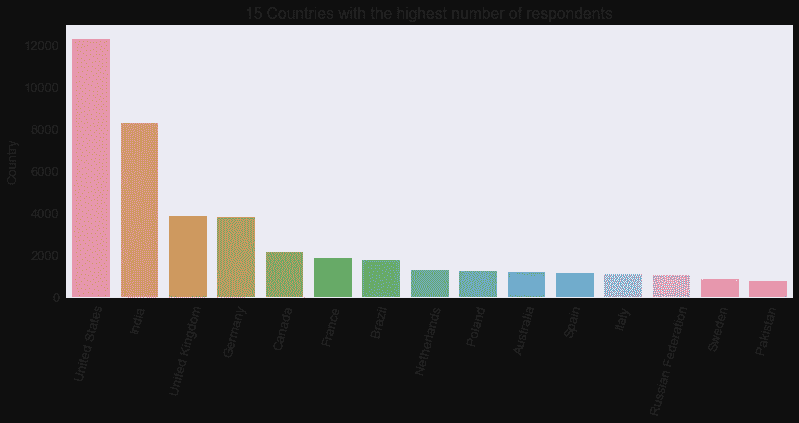

这表明最多的受访者来自美国和印度。这可能是因为调查是用英语进行的，而这些国家讲英语的人口最多。因此，该调查似乎并不代表全球编程社区——尤其是来自非英语国家的编程社区。几乎可以肯定，来自非英语国家的程序员人数不足。还有，StackOverflow 是一个完全英文的平台，所以它的用户群自然是来自专业讲英语或者优先讲英语的国家。

因此，StackOverflow 可以尝试将他们的调查翻译成不同的语言，以鼓励非英语国家参与进来，并获得更具代表性的结果。

现在，让我们找出英语国家和非英语国家的回答百分比:

```
od.download('countries-languages-spoken')

lang_df = pd.read_csv('countries-languages-spoken/countries-languages.csv')

lang_df['English'] = lang_df['Languages Spoken'].str.contains('English') #creating a boolean column for strings that contain English

lang_df['LanguagePreferred'] = lang_df['English'].map({True:'English', False: 'NonEnglish'}) #using that column to map a differetn column to separate English and NonEnglish countries

lang_dfUsing downloaded and verified file: .\countries-languages-spoken\countries-languages.csv
```


```
merge_lang = survey_df.merge(lang_df, on='Country') #merging the two dataframes into a new one
lang_counts = merge_lang.LanguagePreferred.value_counts()
lang_counts = lang_counts/merge_lang.shape[0] *100 #converting it into percentage
lang_countsEnglish       62.853751
NonEnglish    37.146249
Name: LanguagePreferred, dtype: float64#using a piechart to plot it

plt.figure(figsize=(12,6))
plt.title("English speaking vs Non-English speaking countries in the survey")
plt.pie(lang_counts, labels=lang_counts.index, autopct='%1.1f%%', startangle=180);
```

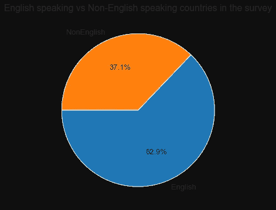

因此，几乎 63%参与调查的国家将英语作为口语使用，或者在专业上优先考虑英语。

## 年龄:

```
#using a histogram to visualize it

plt.figure(figsize=(13,7))
plt.title('Age of the respondents in years)')
plt.xlabel('Age')
plt.ylabel('Number of respondents')

plt.hist(survey_df.Age,  bins= np.arange(10,80,5), color= "Orange")(array([  209.,  2419.,  9135., 11938.,  8739.,  5582.,  3031.,  1756.,
         1038.,   622.,   333.,   143.,    75.]),
 array([10, 15, 20, 25, 30, 35, 40, 45, 50, 55, 60, 65, 70, 75]),
 <BarContainer object of 13 artists>)
```

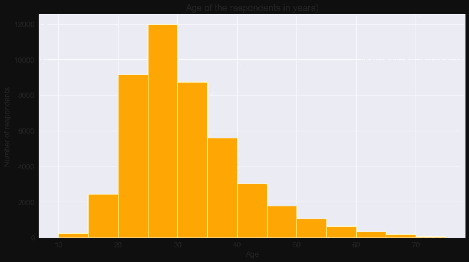

大多数受访者年龄在 20-40 岁之间，其中 25-30 岁的人最多。所以看起来大多数年轻人都喜欢编程。

让我们按年龄组筛选出答案，以便分析和比较不同年龄组的调查结果。为此，我将创建一个名为 AgeGroup 的新列，其中包含以下值:10 岁以下、10-18 岁、18-30 岁、30-45 岁、45-60 岁和 60 岁以上。

```
survey_df['AgeGroup'] = pd.cut(x=survey_df['Age'], bins=[0,10,18,30,45,60,100], labels=['Younger than 10 years', '10-18 years', '18-30 years', '30-45 years', '45-60 years', 'Older than 60 years'])
```

## 性别:

让我们看看基于性别的回答分布。

```
gender_counts = survey_df.Gender.value_counts()
gender_countsMan                                                  45895
Woman                                                 3835
Non-binary, genderqueer, or gender non-conforming      385
Name: Gender, dtype: int64plt.figure(figsize=(13,7))
plt.title("Gender distribution in the survey")
plt.pie(gender_counts, labels=gender_counts.index, autopct='%1.1f%%', startangle=180);
```

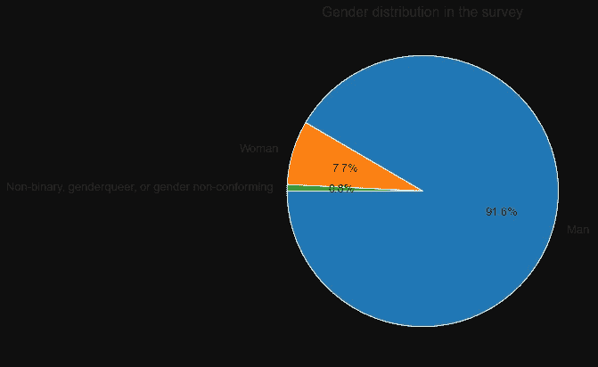

在编程领域，男性和女性的数量似乎存在巨大差异&非二元性别。众所周知，女性和非二进制性别在编程社区中的代表性不足，所以这里很明显可以看到一个倾斜的分布。

## 教育水平:

计算机科学领域的正规教育通常被认为对成为程序员很重要。然而，技术领域的当前情况表明并非如此。网上有无数的免费资源和教程可以用来学习编程。因此，让我们比较一下受访者的教育水平，以获得一些见解。

```
#using a horizontal barplot

sns.countplot(y=survey_df.EdLevel)
plt.title(schema['EdLevel'])
plt.ylabel(None);
```

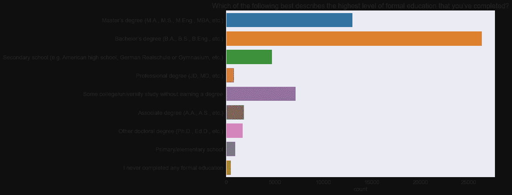

将其转换为基于百分比显示:

```
ed_counts = (survey_df.EdLevel.value_counts() * 100 / survey_df.shape[0]).round(2)

sns.barplot(x=ed_counts, y=ed_counts.index)
plt.title(schema['EdLevel'])
plt.xlabel('Percentage');
```

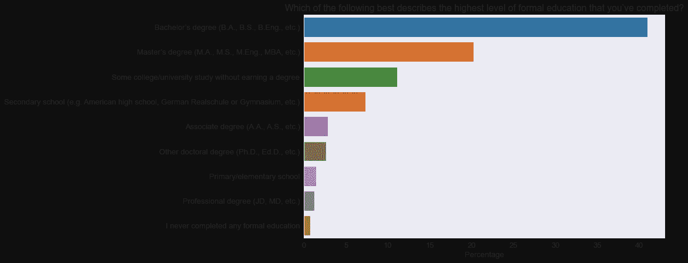

比较男女获得每个学位的百分比:

```
sns.countplot(y=survey_df.EdLevel, hue = survey_df.Gender)
plt.title(schema['EdLevel'])
plt.ylabel(None);
```

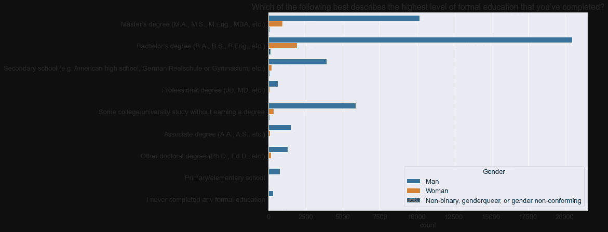

绘制本科专业(以百分比为基础):

```
undergrad_counts = (survey_df.UndergradMajor.value_counts() * 100 / survey_df.UndergradMajor.count()).round(2)

sns.barplot(x= undergrad_counts, y= undergrad_counts.index)
plt.title(schema['UndergradMajor'])
plt.xlabel("Percentage");
```

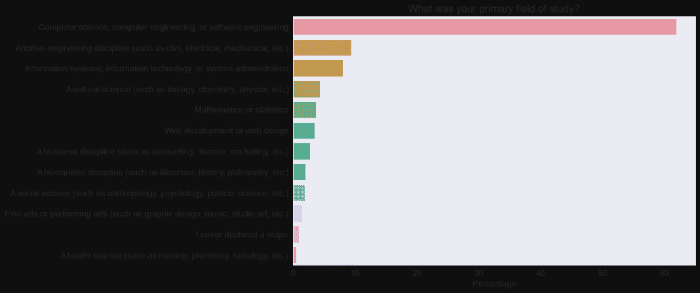

所以从上面的可视化来看，很明显，大约 50%的受访者持有学士或硕士学位，所以大多数程序员似乎都有一些大学教育。大约 40%的拥有大学学位的程序员拥有计算机科学以外的研究领域。因此，虽然正规教育总体来说很重要，但对于一个想成为程序员的人来说，攻读计算机科学领域的学位并不是强制性的。

让我们分析一下 NEWEdImpt 专栏中拥有计算机科学学位和没有学位的受访者的观点，看看他们的观点是否有所不同。

```
survey_df['degComp'] = (survey_df.UndergradMajor == 'Computer science, computer engineering, or software engineering')

survey_df['compdeg'] = survey_df['degComp'].map({True:'Computer Science', False: 'Not Computer Science'})

edimp_count= survey_df['NEWEdImpt'].value_counts()
edimp_countFairly important                      12588
Very important                        11783
Somewhat important                    11298
Not at all important/not necessary     7707
Critically important                   4716
Name: NEWEdImpt, dtype: int64sns.countplot(y=survey_df.NEWEdImpt, hue = survey_df.compdeg)
plt.title(schema['NEWEdImpt'])
plt.ylabel(None);
```

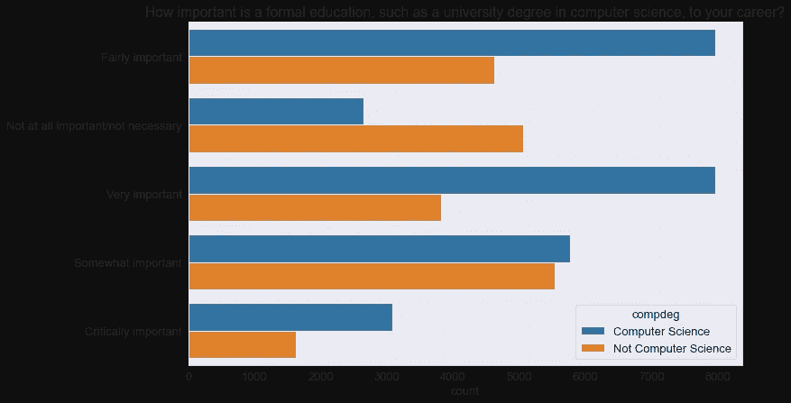

```
sns.countplot(y=survey_df.NEWEdImpt, hue = survey_df.AgeGroup)
plt.title(schema['NEWEdImpt'])
plt.ylabel(None);
```

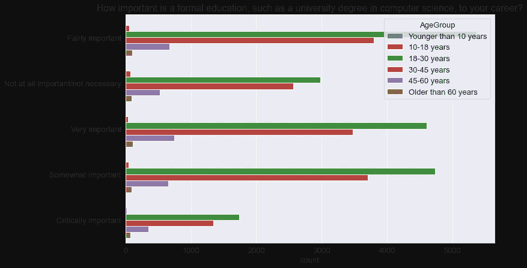

因此，上面的图表表明，那些拥有计算机科学学位的人认为正规教育(如计算机科学的大学学位)对编程职业非常重要，而那些没有这种学位的人似乎大多不这么认为。同样，年龄在 18-30 岁之间的大多数人也认为计算机科学学位是有帮助的。

## 就业:

让我们把就业一栏的数据形象化。

```
survey_df.Employment.value_counts()Employed full-time                                      44958
Student                                                  7734
Independent contractor, freelancer, or self-employed     5619
Not employed, but looking for work                       2324
Employed part-time                                       2200
Not employed, and not looking for work                    318
Retired                                                   241
Name: Employment, dtype: int64empcount = survey_df.Employment.value_counts(normalize = True, ascending = True) *100
empcount.plot(kind='barh', color='r')
plt.title('schema.Employment')
plt.xlabel('Percentage')Text(0.5, 0, 'Percentage')
```

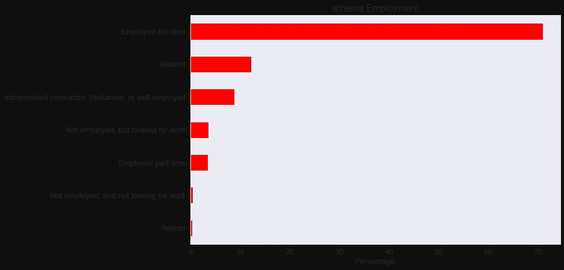

因此，超过 70%的受访者是全职员工。大约 10%的人是独立承包人、自由职业者或个体经营者。

现在，让我们添加一个新的列 EmploymentType，其中包含值爱好者(学生或未就业但正在找工作)、专业人员(全职、兼职或自由职业者)和其他(未就业或退休)。

```
groups = {
          'Enthusiast': ('Student', 'Not employed, but looking for work'),
          'Professional': ('Employed full-time', 'Employed part-time', 'Independent contractor, freelancer, or self-employed')
        }

empseries = pd.Series(survey_df.Employment) #creating a series for the Employment column

#creating a function to group the required members accordingly
from typing import Any

def membership_map(s: pd.Series, groups: dict,
                   fillvalue: Any=-1) -> pd.Series:
    # Reverse & expand the dictionary key-value pairs
    groups = {x: k for k, v in groups.items() for x in v}
    return s.map(groups).fillna(fillvalue)

survey_df['EmploymentType'] = membership_map(empseries, groups, fillvalue='Other')
```

DevType 字段包含关于回答者所担任角色的信息。由于该问题允许多个答案，因此该列包含由分号(；)，这样直接分析就有点难了。因此，让我们定义一个助手函数，它将包含值列表的列(如 survey_df。DevType)放入一个数据帧中，每个可能的选项对应一列。

```
def split_multicolumn(col_series):
    result_df = col_series.to_frame()
    options = []
    # Iterate over the column
    for idx, value  in col_series[col_series.notnull()].iteritems():
        # Break each value into list of options
        for option in value.split(';'):
            # Add the option as a column to result
            if not option in result_df.columns:
                options.append(option)
                result_df[option] = False
            # Mark the value in the option column as True
            result_df.at[idx, option] = True
    return result_df[options]

dev_type_df = split_multicolumn(survey_df.DevType)
dev_type_df
```

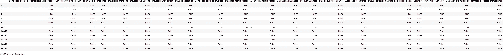

我们可以看到 dev_type_df 为回答者可以选择作为响应的每个选项提供了一列。因此，如果她/他选择了一个选项，则相应列的值为 True。否则，它就是假的。

让我们使用列汇总来确定最常见的角色:

```
dev_type_totals = dev_type_df.sum().sort_values(ascending=False)
dev_type_totalsDeveloper, back-end                              26996
Developer, full-stack                            26915
Developer, front-end                             18128
Developer, desktop or enterprise applications    11687
Developer, mobile                                 9406
DevOps specialist                                 5915
Database administrator                            5658
Designer                                          5262
System administrator                              5185
Developer, embedded applications or devices       4701
Data or business analyst                          3970
Data scientist or machine learning specialist     3939
Developer, QA or test                             3893
Engineer, data                                    3700
Academic researcher                               3502
Educator                                          2895
Developer, game or graphics                       2751
Engineering manager                               2699
Product manager                                   2471
Scientist                                         2060
Engineer, site reliability                        1921
Senior executive/VP                               1292
Marketing or sales professional                    625
dtype: int64
```

因此，最常见的角色名称中包含“开发人员”。

让我们来看看哪些职位女性比例最高:

```
#joinging the two dataframes
merged_dev_type = survey_df.join(dev_type_df)

merged_dev_woman = merged_dev_type.loc[merged_dev_type['Gender'] == 'Woman']

#creating a dataframe only for the dev types for women
new_merged_dev = merged_dev_woman.loc[:, 'Developer, desktop or enterprise applications':'Marketing or sales professional']

new_devtype_totals = new_merged_dev.sum().sort_values(ascending=False)sns.barplot(x= ((new_devtype_totals* 100 / new_merged_dev.shape[0]).round(2)), y= new_devtype_totals.index)
plt.title('Which positions have the highest percentage of women?')
plt.xlabel("Percentage");
```

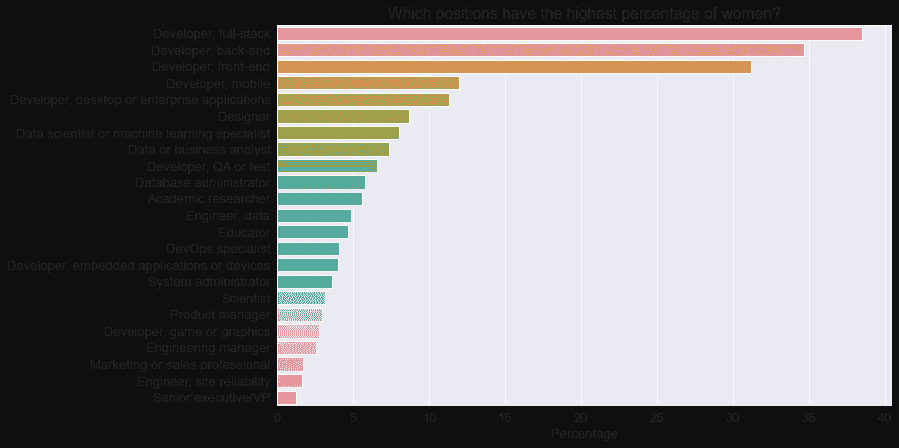

因此，似乎大多数女性都是全栈开发人员或后端开发人员。

## 现在是我们进行下一步分析的时候了。让我们就我们的数据提出一些问题，并使用可视化和计算来回答它们。

## 1.2020 年最流行的编程语言是什么？

为此，我们使用“LanguageWorkedWith”列。与 DevType 类似，回答者也可以在这里选择多个选项。

```
#spliting languageWorkedWith into a data frame containing a column of each listed languages

new_languagesWorked_df = split_multicolumn(survey_df.LanguageWorkedWith)
new_languagesWorked_df
```


```
languages_percentage = new_languagesWorked_df.mean().sort_values(ascending=False) * 100

#plotting this in a horizontal bar chart

plt.figure(figsize = (13,12))
sns.barplot(x=languages_percentage, y = languages_percentage.index)
plt.title('Programming languages used in 2020')
plt.xlabel('Percentage')Text(0.5, 0, 'Percentage')
```

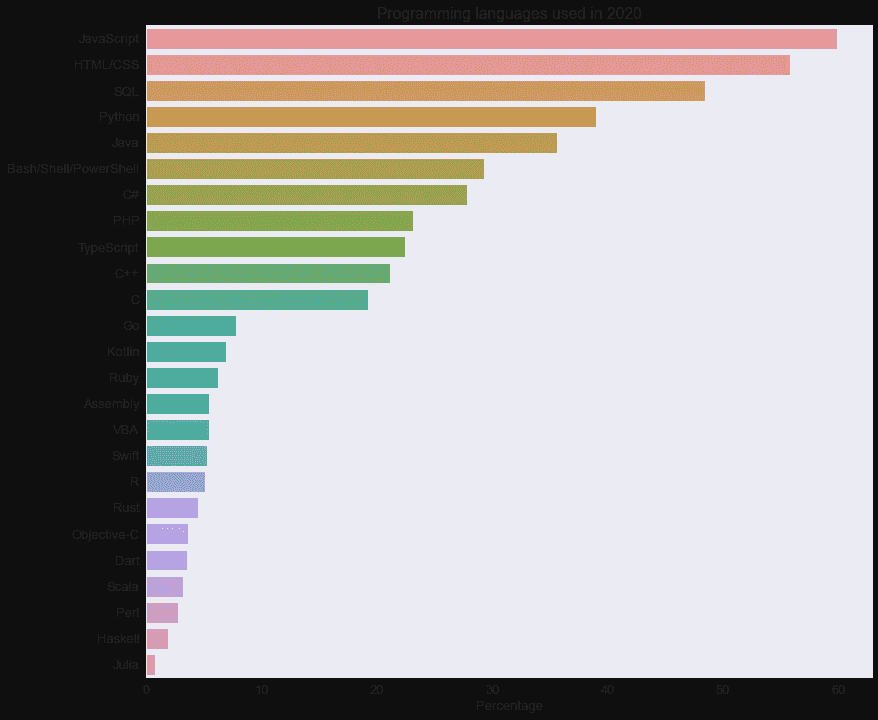

Javascript 和 HTML/CSS 是 2020 年最流行的编程语言。这可能是因为 web 开发是当今世界最受欢迎的技能之一。接下来是 SQL，它对于处理关系数据库是必不可少的，所以大多数程序员必须定期使用它。类似地，Python 在列表中排名第四，这似乎是其他开发形式的流行选择，击败了 Java，后者是二十多年来服务器和应用程序开发的行业标准。

## 2.学生最常用的语言是什么？该列表与专业开发人员最常用的语言相比如何？

```
merged_languages = survey_df.join(new_languagesWorked_df)

students_merged_lang = merged_languages.loc[merged_languages['EmploymentType'] == 'Enthusiast']

prof_merged_lang = merged_languages.loc[merged_languages['EmploymentType'] == 'Professional']new_students_merged_lang = students_merged_lang.loc[:,'C#':'Assembly']
new_students_merged_lang_percentage = new_students_merged_lang.mean().sort_values(ascending=False) * 100

plt.figure(figsize = (6,5))
sns.barplot(x=new_students_merged_lang_percentage, y = new_students_merged_lang_percentage.index)
plt.title('Most common Programming languages 2020 among Students')
plt.xlabel('Percentage')Text(0.5, 0, 'Percentage')
```

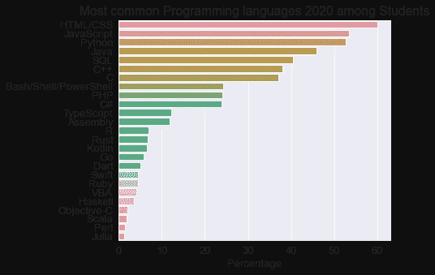

学生中最流行的语言是 HTML/CSS。

```
new_prof_merged_lang = prof_merged_lang.loc[:,'C#':'Assembly']
new_prof_merged_lang_percentage = new_prof_merged_lang.mean().sort_values(ascending=False) * 100

plt.figure(figsize = (6,5))
sns.barplot(x=new_prof_merged_lang_percentage, y = new_prof_merged_lang_percentage.index)
plt.title('Most common Programming languages 2020 among Professionals')
plt.xlabel('Percentage')Text(0.5, 0, 'Percentage')
```

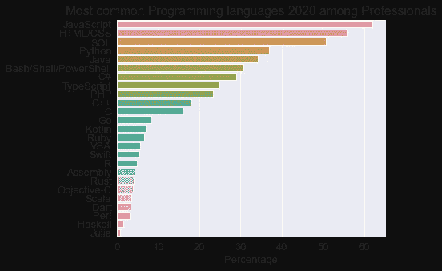

然而，JavaScript 在专业人士中最受欢迎。

## 3.在没有将自己描述为“开发人员，前端”的受访者中，最常见的语言是什么？

```
merged_df_lang_dev = merged_dev_type.join(new_languagesWorked_df)

merged_df_lang_dev_df = merged_df_lang_dev.loc[merged_df_lang_dev['Developer, front-end'] == False]

new_merged_df_lang_dev_df = merged_df_lang_dev_df.loc[:,'C#':'Assembly']
new_merged_df_lang_dev_df_percentage = new_merged_df_lang_dev_df.mean().sort_values(ascending=False) * 100

plt.figure(figsize = (6,5))
sns.barplot(x=new_merged_df_lang_dev_df_percentage.index, y = new_merged_df_lang_dev_df_percentage);
plt.title('Most common languages among respondents other than "Developer, front-end"')
plt.ylabel('Percentage')
plt.xticks(rotation=90);
```

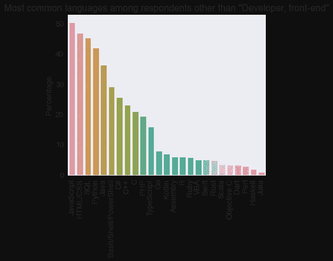

尽管如此，JavaScript 仍然是没有把自己描述为“开发人员，前端”的受访者中最常见的语言。

## 4.在数据科学相关领域工作的受访者中，最常用的语言是什么？

```
ds_merged_lang_df = merged_df_lang_dev.loc[merged_df_lang_dev['Data scientist or machine learning specialist'] == True]

new_ds_merged_lang_df = ds_merged_lang_df.loc[:,'C#':'Assembly']
new_ds_merged_lang_df_percentage = new_ds_merged_lang_df.mean().sort_values(ascending=False) * 100

plt.figure(figsize = (6,5))
sns.barplot(x=new_ds_merged_lang_df_percentage.index, y = new_ds_merged_lang_df_percentage);
plt.title('Most common languages among Data Scientists')
plt.ylabel('Percentage')
plt.xticks(rotation=90);
```

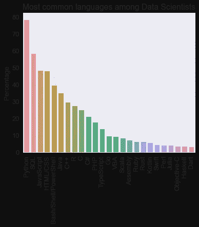

因此，Python 是数据科学家使用最多的语言，其次是 SQL。

## 5.35 岁以上的开发人员最常用的语言是什么？

```
old_merged_df_lang_dev = merged_df_lang_dev.loc[merged_df_lang_dev['Age'] > 35]

new_old_merged_df_lang_dev = old_merged_df_lang_dev.loc[:,'C#':'Assembly']
new_old_merged_df_lang_dev_percentage = new_old_merged_df_lang_dev.mean().sort_values(ascending=False) * 100
new_old_merged_df_lang_dev_percentageJavaScript               64.874070
SQL                      59.191539
HTML/CSS                 58.510352
Bash/Shell/PowerShell    40.198978
Python                   37.716232
C#                       35.170745
Java                     32.356368
PHP                      22.757014
TypeScript               22.559828
C++                      18.929820
C                        17.325446
VBA                       8.729945
Go                        8.694093
Ruby                      8.192166
Perl                      6.417496
Swift                     5.727346
Kotlin                    5.548086
R                         5.521197
Assembly                  5.090974
Objective-C               4.678677
Rust                      3.916824
Scala                     3.531415
Dart                      2.169042
Haskell                   1.353410
Julia                     0.842520
dtype: float64
```

Javascript 是 35 岁以上人群中最流行的语言。

## 6.尼泊尔的开发人员最常用的语言是什么？

```
country_merged_df_lang_dev = merged_df_lang_dev.loc[merged_df_lang_dev['Country'] == 'Nepal']

new_country_merged_df_lang_dev = country_merged_df_lang_dev.loc[:,'C#':'Assembly']
new_country_merged_df_lang_dev_percentage = new_country_merged_df_lang_dev.mean().sort_values(ascending=False) * 100

new_country_merged_df_lang_dev_percentageJavaScript               61.666667
HTML/CSS                 60.833333
SQL                      42.916667
Java                     39.583333
Python                   36.666667
C                        34.166667
PHP                      31.250000
C++                      28.750000
C#                       20.833333
TypeScript               20.416667
Bash/Shell/PowerShell    16.250000
Dart                      7.500000
Kotlin                    6.250000
Ruby                      4.583333
Go                        4.166667
Assembly                  4.166667
Objective-C               3.333333
Swift                     3.333333
R                         2.916667
VBA                       2.500000
Rust                      2.083333
Haskell                   0.416667
Julia                     0.416667
Perl                      0.000000
Scala                     0.000000
dtype: float64
```

在我的国家，JavaScript 是使用最多的编程语言。

从上面的可视化可以得出结论，JavaScript 是众多编程组中最受欢迎的编程语言。

## 7.在接下来的一年里，人们最有兴趣学习哪种语言？

为此，我将使用 LanguageDesireNextYear 列。

```
ny_languages_interested_df = split_multicolumn(survey_df.LanguageDesireNextYear)
ny_languages_interested_percentages = ny_languages_interested_df.mean().sort_values(ascending=False) * 100

plt.figure(figsize = (6,5))
sns.barplot(x=ny_languages_interested_percentages, y = ny_languages_interested_percentages.index)
plt.title('Programming languages people were most interested to learn over the next year')
plt.xlabel('Percentage')Text(0.5, 0, 'Percentage')
```

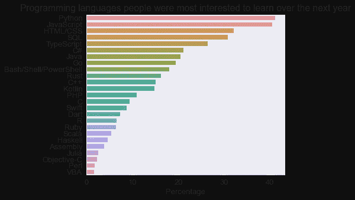

因此，大多数回答者都有兴趣在接下来的一年里学习 Python。显然，它是一种易于学习的通用编程语言，非常适合各种领域:应用程序开发、数值计算、数据分析、机器学习、大数据、云自动化、web 抓取、脚本等等。此外，我还使用 Python 进行这种探索性分析！

## 8.什么是最受欢迎的编程语言，也就是说，有很高比例的人已经使用过这种语言，并希望在接下来的一年里继续学习和使用它？

为此，我将创建一个新的数据框(languages_loved_df ),仅当 new_languagesWorked_df 和 ny_languages_interested_df 中的相应值都为真时，该数据框才包含语言的真值。然后，我将按列计算 languages_loved_df 的总和，并除以按列计算的 languages_worked_df 的总和，得到“喜爱”该语言的受访者的百分比。最后，我将按降序对结果进行排序，并绘制图表

```
languages_loved_df = new_languagesWorked_df & ny_languages_interested_df
languages_loved_percentages = (languages_loved_df.sum() * 100/ new_languagesWorked_df.sum()).sort_values(ascending=False)

plt.figure(figsize=(13, 11))
sns.barplot(x=languages_loved_percentages, y=languages_loved_percentages.index)
plt.title("Most loved programming languages");
plt.xlabel('Percentage');
```

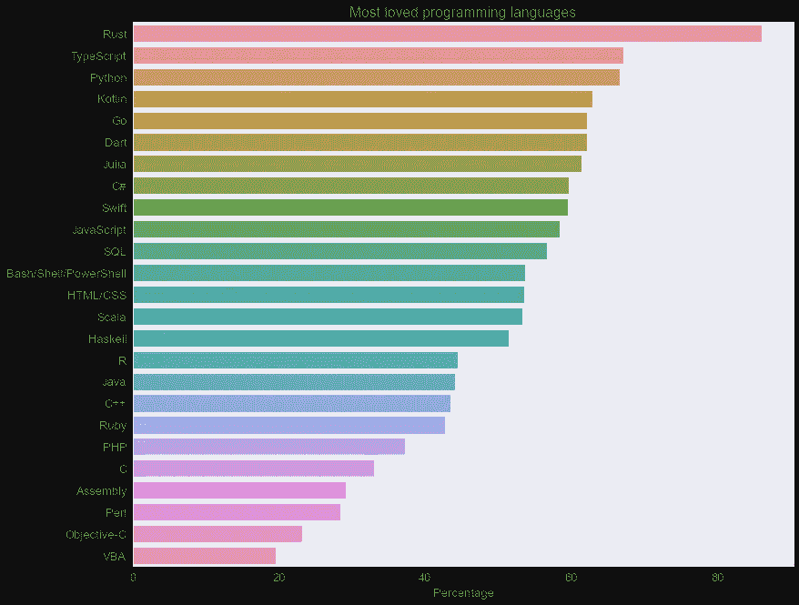

Rust 是 2020 年最受欢迎的编程语言，它已经连续四年成为 StackOverflow 最受欢迎的语言。第二种最受欢迎的语言是 TypeScript，它是 web 开发中 JavaScript 的流行替代语言。同样，Python 排在第三位。

## 9.什么是最可怕的语言，即人们在过去一年中使用但不想在下一年学习/使用的语言？

```
dreaded_lang_df = new_languagesWorked_df & ~ny_languages_interested_df
languages_dreaded_percentages = (dreaded_lang_df.sum() * 100/ new_languagesWorked_df.sum()).sort_values(ascending=False)

plt.figure(figsize=(6, 5))
sns.barplot(x=languages_dreaded_percentages, y=languages_dreaded_percentages.index)
plt.title("Most Dreaded languages");
plt.xlabel('Percentage');
```

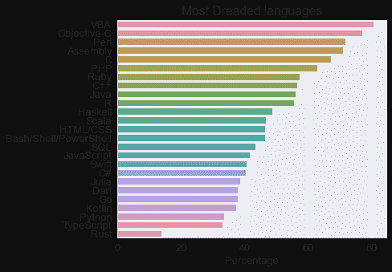

VBA 是 2020 年最令人恐惧的语言，其次是 Objective-C

## 10.哪些国家的开发人员每周工作时间最长？仅考虑回复数超过 250 的国家。

为此，我将使用 groupby 方法来聚合每个国家的行。然后，我将过滤结果，只包括超过 250 名受访者的国家。

```
countries_df = survey_df.groupby('Country')[['WorkWeekHrs']].mean().sort_values('WorkWeekHrs', ascending=False)

high_response_countries_df = countries_df.loc[survey_df.Country.value_counts() > 250].head(15)
high_response_countries_df
```


在 250 多个国家中，伊朗、以色列和中国的工作时间似乎是最长的。其次是美国。然而，总体上没有太大的变化，因为每个国家的平均工作时间都在每周 41 小时左右。

## 11.各大洲的平均工作时间相比如何？

```
continent_data_df = pd.read_csv('./continent.csv')

continent_data_df = continent_data_df.rename(columns = {'location' :'Country'}, inplace = False) #renaming the column 'location' to 'Country'

coun_con_df = survey_df.merge(continent_data_df, on='Country')

new_continent_df = coun_con_df.groupby('continent')[['WorkWeekHrs']].mean().sort_values('WorkWeekHrs', ascending=False)
new_continent_df
```


因此，北美是工作时间最长的大陆，其次是亚洲。

## 12.哪个角色每周平均工作时间最长？哪个最低？

```
#highest
highest_work_df = survey_df.groupby('DevType')[['WorkWeekHrs']].mean().sort_values('WorkWeekHrs', ascending=False).reset_index()
highest_work_df
```


```
#lowest
lowest_work_df = survey_df.groupby('DevType')[['WorkWeekHrs']].mean().sort_values('WorkWeekHrs', ascending=True).reset_index()
lowest_work_df
```


## 13.自由职业者和全职开发人员的工作时间相比如何？

```
empl_type_df = split_multicolumn(survey_df.Employment)

new_empl_df = survey_df.join(empl_type_df)#for full-time
full_time_df = new_empl_df.loc[new_empl_df['Employed full-time'] == True]
fulltime_work_df = full_time_df.groupby('Employed full-time')[['WorkWeekHrs']].mean().sort_values('WorkWeekHrs', ascending=False).reset_index()
fulltime_work_df
```


```
#for freelancers
freelance_df = new_empl_df.loc[new_empl_df['Independent contractor, freelancer, or self-employed'] == True]
freelance_work_df = freelance_df.groupby('Independent contractor, freelancer, or self-employed')[['WorkWeekHrs']].mean().sort_values('WorkWeekHrs', ascending=False).reset_index()
freelance_work_df
```


因此，全职开发人员和自由职业者之间似乎没有太大区别。两人每周的平均工作时间都在 40 小时左右。

## 14.年轻时开始对建立编程生涯有多重要？

为此，我将创建一个年龄与编码经验年数的散点图:

```
sns.scatterplot(x='Age', y='YearsCodePro', hue='Hobbyist', data=survey_df)
plt.xlabel("Age")
plt.ylabel("Years of professional coding experience");
```

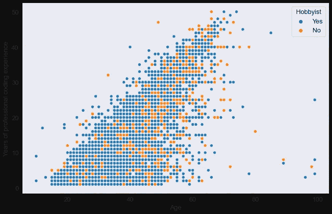

图中到处都是点，表明一个人可以在任何年龄开始专业编程。同样，大部分长期从事专业编码的人，似乎也把它当成了一种爱好。

让我们查看 Age1stCode 列的分布，找出受访者第一次尝试编程的时间:

```
plt.title(schema.Age1stCode)
sns.histplot(x=survey_df.Age1stCode, bins=30, kde=True);
```

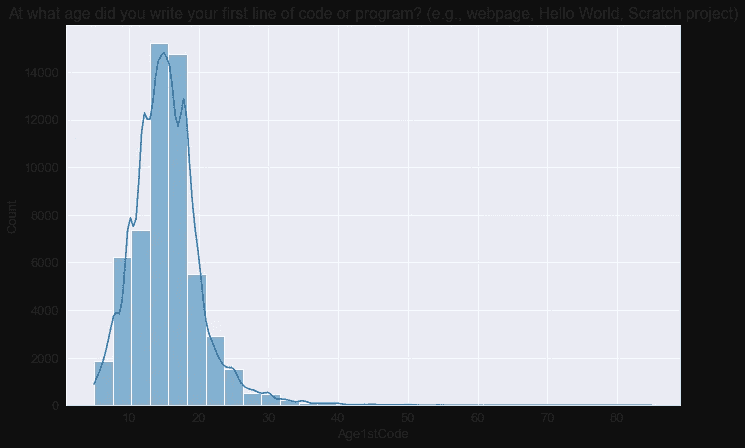

所以看起来大部分被调查者在 40 岁之前就开始编程了。然而，该图还显示了所有年龄段的人都参与了编码，这是非常令人鼓舞的。

## 推论和结论:

通过对堆栈溢出开发者调查 2020 数据集的探索性数据分析，我得出了以下结论:

1.  最多的受访者来自美国和印度。调查中几乎 63%的参与者来自将英语作为口语或在职业上优先考虑英语的国家。因此，根据受访者的人口统计数据，我们可以推断该调查在一定程度上代表了整个编程社区，但来自非英语国家的程序员的回应相对较少。
2.  大多数受访者年龄在 20-40 岁之间，大多数在 25-30 岁之间。因此，大多数年轻人都热衷于编程。
3.  只有大约 8%回答了这个问题的调查应答者认为自己是女性或非二元性的，大约 92%是男性。因此可以得出结论，在编程领域，男性和女性的数量存在巨大差异&非二元性别。
4.  大约 50%的受访者拥有学士或硕士学位，但大约 40%拥有大学学位的程序员拥有计算机科学以外的研究领域。因此，虽然正规教育总体来说很重要，但对于一个人来说，攻读计算机科学领域的学位并不是成为程序员或以此为职业的强制性要求。
5.  超过 70%的受访者是全职员工。大约 10%的人是独立承包人、自由职业者或个体经营者。
6.  大多数女性从事全栈开发或后端开发。
7.  Javascript 和 HTML/CSS 是 2020 年最流行的编程语言。其次是 SQL 和 Python。
8.  学生中最受欢迎的语言是 HTML/CSS，而 JavaScript 在专业人士中最受欢迎。此外，JavaScript 是众多群体中最受欢迎的编程语言。
9.  Python 是数据科学家使用最多的语言，其次是 SQL。
10.  Rust 和 TypeScript 是 2020 年最受欢迎的编程语言，其次是 Python，而 VBA 和 Objective-C 是最可怕的语言，其次是 Perl。
11.  大多数回答者都有兴趣在接下来的一年里学习 Python。
12.  程序员的平均工作时间约为每周 41 小时。北美是工作时间最长的大陆，其次是亚洲。
13.  大多数受访者在 40 岁之前就开始编程，尽管各个年龄段的人都参与编码。我们可以得出结论，一个人可以在任何年龄学习编码。

## 建议:

*   StackOverflow 可以尝试将他们的调查翻译成不同的语言，以鼓励非英语国家参与进来，并获得更具代表性的结果。同样，他们应着重做出更多努力，鼓励代表性不足的社区参与调查。
*   计算机科学确实是一个具有挑战性的领域，在它的任何领域取得成功都需要大量的奉献和实践。然而，如果有人有足够的热情，并准备投入合理的时间和精力，那么他们可以马上开始他们的旅程，不管他们的年龄、教育水平、性别或任何其他因素。网上有大量的资源可以帮助他们完成学习过程——你只需要开始探索。