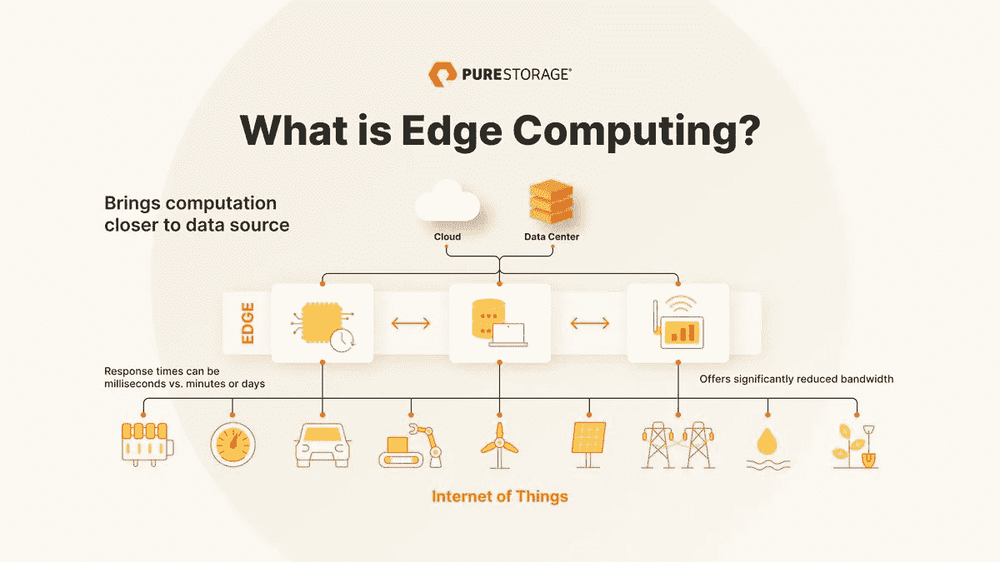
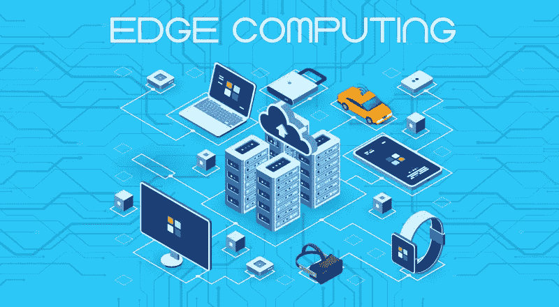
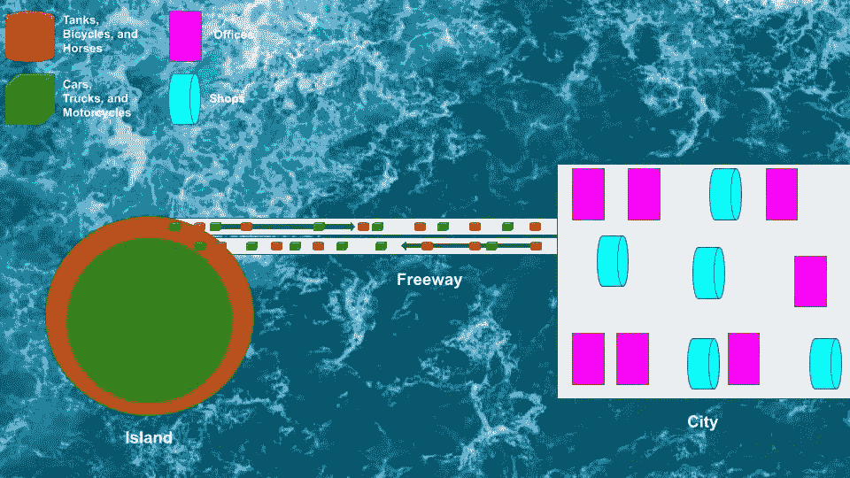
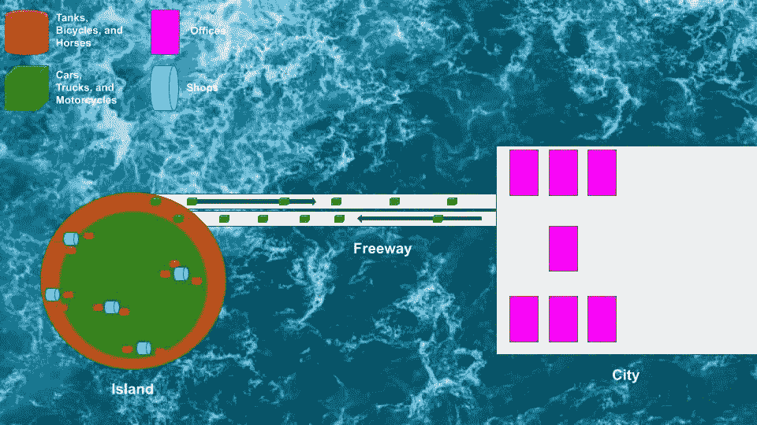

# 什么是边缘计算🤷‍♂️(简体)

> 原文：<https://medium.com/codex/edge-computing-what-is-it-18c16e83375b?source=collection_archive---------2----------------------->

图片来源:纯存储

我看到边缘计算这个术语到处出现…在这篇博客中，我将解释什么是边缘计算，它是否会被采用，以及在这个云模型中你的数据有多安全。

我需要阅读几十篇文章，才能创建该技术的简化类比，并真正理解其用途和好处…现在我与您分享这些信息，所以您不必这样做！

## 目录:

*   什么是边缘计算🙄
*   这种计算模式会成为主流吗🤫
*   边缘计算的优势以及将从该模式中受益的设备🏋️‍♀️

## 什么是边缘计算🙄

图片来源:Codeburst

边缘计算是离用户更近的计算。边缘是终端设备访问网络其余部分的位置。因此，尽管之前只有手机、平板电脑和个人电脑等一些设备，但现在也包括物联网设备(有很多！).

那又怎样？那是什么意思🤷‍♂️

想象一条高速公路…上面提到的所有原始设备(手机、平板电脑和个人电脑)是汽车、卡车和摩托车，高速公路能够维持这些车辆的交通流量。

现在想象一下，同一条高速公路上有坦克、自行车、马匹(物联网设备和其他类型的需要超低延迟的技术，如自动驾驶汽车、智能电网和医院内患者监控等)……交通流量将受到严重影响，所有这些车辆(设备)的增加将大大增加延迟。

假设每个人都在一个岛上，这条高速公路是通往一个由商店和办公室组成的城镇的唯一道路。对于汽车、卡车和摩托车，在这种情况下，它们将前往办公室。坦克、自行车和马匹不断往返于商店之间。

马匹、坦克和自行车必须不断地往返于商店以获取资源(数据)。偏离路线增加了普通车辆往返办公室的时间，降低了效率。

除了时间的增加，想象一下坦克、自行车和马在旅行中消耗的所有燃料/能量。如果他们购买了一件物品，回家后需要将其退回(故障排除数据)，想想这样做需要多长时间，而需要退回的物品已经是一件迟到的礼物，因此我们需要超低延迟(被退回的物品是被送回的数据，例如医院的病人监护，我们不能在他们和我们的系统之间的数据传输中有任何延迟)？

现在，这和边缘计算有什么关系！？

边缘计算是一种“在更靠近数据源的地方进行计算，以最大限度地减少潜在的距离相关挑战”的方法。就像我们的象征性水龙头一样，它通过相当基本的基础设施快速而廉价地输送资源。出现问题时，排除故障也很简单。” [—西门子](https://www.siemens-advanta.com/blog/how-solve-edge-computing-vs-cloud-computing-debate)

所以在这个模型中，你可以看到，我们已经把计算更接近于坦克、自行车和马。这减少了延迟(接收和发送数据所花费的时间，在我们的例子中，红色设备接收和返回货物的时间)，降低了运营成本(在我的例子中是燃料/能源)，以及可靠性(如果一个商店倒闭，还有其他商店)。此外，即使在 Wi-Fi 连接不良的情况下，仍然可以发送和接收数据(因为需要覆盖的距离较短)。—查看其他许多优势[点击这里](https://blog.wei.com/top-5-benefits-of-edge-computing)

## 这种计算模式会成为主流吗🤫

由于我们正在经历的所有计算需求，人们对边缘计算的兴趣正在大幅上升，这种需求与日俱增！除此之外，随着智能门铃和摄像头、运动检测器以及工业安保和安全设备等设备的普及，物联网数据也出现了爆炸式增长。

我的意思是，⬇列出了所有的好处，为什么公司不采用边缘计算呢？

快速说明:边缘计算不会完全取代云计算，它们属于两个不同的类别，不能互相取代。云计算仍将用于处理不受时间驱动的数据。

## 边缘计算的优势以及将从该模式中受益的设备🏋️‍♀️

下面你会发现云计算的一些值得注意的好处:

*   安全性-物联网设备的增加意味着一件事，即漏洞的增加……边缘计算的分布式架构使单一中断更难嵌入数据，因为您可以关闭受损部分而不是整个网络。
*   速度——边缘计算显著降低了真正需要的设备的延迟，例如无人驾驶汽车。你需要在为时已晚之前处理可能导致冲突的原因，并采取相应措施。
*   多功能性-组织能够使用边缘数据中心有效地瞄准其期望的市场，而无需投资非常昂贵的基础设施

点击此处了解埃森哲[的更多优势。](https://www.accenture.com/ae-en/insights/cloud/edge-computing-index)

受益于该模型的示例设备:

*   自动驾驶汽车
*   增强现实
*   安全设备
*   监控(工业加工和医疗保健设备)
*   零售业的库存管理

任何需要实时监控或超低延迟数据传输的设备都将从这种模式中受益匪浅。