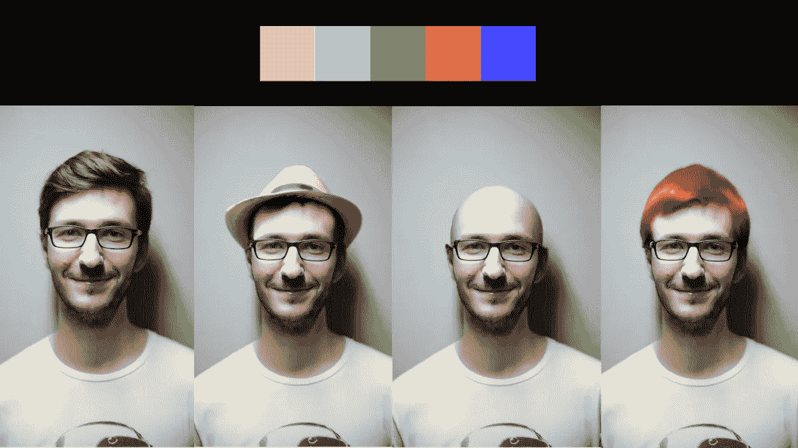

# 编辑真实人脸又回到了 OpenAI 的 Dall-E2

> 原文：<https://medium.com/codex/editing-real-faces-is-back-in-openais-dall-e2-1a4ec28ddd2?source=collection_archive---------5----------------------->

吉姆·克莱德·蒙赫的图片。来自 Pixabay 的 Pexels 肖像

曾经被禁用的功能现在又回到了 Dall-E2。拥有 AI 图像生成器独家访问权限的用户现在可以上传和编辑真实人脸照片。

> 随着我们安全系统的改进，DALL E 现在已准备好支持这些令人愉快的重要用例，同时最大限度地减少…