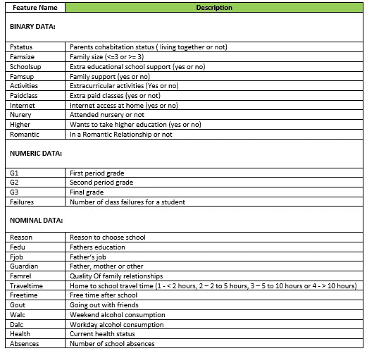
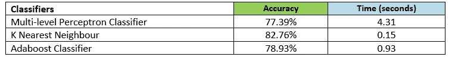

# 预测学生上大学的决定

> 原文：<https://medium.com/codex/educational-data-mining-predicting-students-decision-to-go-to-go-into-university-6ee807f33f1c?source=collection_archive---------0----------------------->

# 介绍

教育数据挖掘是用机器学习算法分析学生数据，以推断信息来进一步帮助学生接受教育。这是一个具有巨大潜在利益的领域，多年来已经引起了研究人员和一些教育机构的极大兴趣。

# 目标

机器学习对教育数据的一个非常常见的应用是预测学生的成绩(我将在另一篇文章中介绍这一点)。不过，在这个项目中，我们的目标明确如下:

*   预测学生通过进入大学深造的最终决定。

有了这些信息，学校管理者就有可能了解对每组学生采取的正确方法。要么通过向学生解释高等教育的重要性来鼓励他们，要么向他们展示可行的选择以及如何追求这些选择。

# **数据集**

为了创建我们的分类模型，我们需要为我们的算法提供数据。我们需要找到这些数据，在这个项目中，我们将利用一个公开的葡萄牙学校数据集。用这个网址可以找到:[https://github . com/Emmanuel 96/Higher _ edu _ dec _ 预测/blob/master/Dataset/student . CSV](https://github.com/Emmanuel96/Higher_edu_dec_prediction/blob/master/Dataset/student.csv)

下图解释了数据集中存在的要素。



数据集功能简要说明

# 履行

为了实现前面解释的目标，我们将使用三种不同的分类算法(多层感知器分类器、K-最近邻和 Adaboost 集成)根据学生的决定对他们进行分类

一旦我们的环境设置好了，我们首先导入我们的 Panda 库，如下所示:

```
import pandas as pd
import numpy as np
import seaborn as sns
```

请注意，如果您还没有安装这些库，您必须安装 pip 或 conda。

接下来，我们导入必要的 scikit-learn 库:

```
**# sklearn imports**
from sklearn.metrics import mean_squared_error
from sklearn.metrics import r2_score
from sklearn.model_selection import train_test_split
from sklearn.preprocessing import LabelEncoder
from sklearn import metrics**# classifiers**
from sklearn.neural_network import MLPClassifier
from sklearn.ensemble import AdaBoostClassifier
from sklearn.neighbors import KNeighborsClassifier
```

# 分类

机器学习算法大多属于监督或无监督学习的范畴。分类是一种监督学习，我们用来将一组数据分为两个或更多个类别。

在我们的例子中，为了实现这一点，首先，我们读取 csv 文件，从中创建一个数据帧，并删除空值，如下所示:

```
data = pd.read_csv(
    r'C:/Users/Emmanuel/Documents/projects/Python/Students Data Analysis/Dataset/student.csv')
student_data = pd.DataFrame(data)**# drop all null data**
student_data.dropna(inplace=True)
```

## 处理分类值

分类算法不适用于分类值，我们需要将它们转换为二进制值。在这种情况下，我们使用 Pandas dummy_data 函数和我们的自定义函数，如下所示:

```
**# function to convert categorical data to binary data**
def handle_cat_data(cat_feats, data):
    for f in cat_feats:
        to_add = pd.get_dummies(data[f], prefix=f, drop_first=True)
        merged_list = data.join(
            to_add, how='left', lsuffix='_left', rsuffix='_right')
        data = merged_list **# then drop the categorical features**
    data.drop(cat_feats, axis=1, inplace=True) return data**# drop all null data**
student_data.dropna(inplace=True)**# array of categorical values**
cat_data = ['school', 'sex', 'address', 'famsize', 'Mjob', 'Fjob', 'reason', 'guardian', 'schoolsup', 'activities', 'nursery', 'fatherd', 'Pstatus', 'higher', 'internet', 'romantic', 'famrel',
            'freetime', 'goout', 'Dalc', 'Walc', 'health', 'Medu', 'famsup']student_data = handle_cat_data(cat_data, student_data)
```

## 拆分数据集以测试和训练数据

我们不能将相同的数据用于训练和测试目的，因为我们的模型已经熟悉了训练数据集，因此为了测试其准确性和稳健性，我们需要一个我们的模型不熟悉的测试数据集。

我们不能将整个数据集直接用于训练和测试，因此我们使用 train_test_split 方法将其分成 80%用于训练，20%用于测试。我们选择较高的列作为目标列，并保留其他列，除了用于训练模型的目标列。我们通过下面的代码片段实现了这一点:

```
**# divide data into training and testing data**
X_train, X_test, y_train, y_test = train_test_split(student_data.drop(
'failures', axis=1), student_data.failures, test_size=0.25, stratify=student_data.failures)**# classifier names for run model function**
classifier_names = ["K Nearest Neighbour",
"Neural Networks", "Adaboost Classifier"]**# classifiers**
classifiers = [
KNeighborsClassifier(),
MLPClassifier(),
AdaBoostClassifier(),
]
```

最后，我们通过调用 run_models 函数来运行我们的模型，如下所示:

```
**# run classification model**
run_models(classifier_names, classifiers, X_train, X_test, y_train, y_test)
```

# 结果和模型评估

下表显示了所用不同算法的精度。这些值可能与您根据不同因素(即您的机器)获得的值略有不同。



分类模型的准确性

为了评估一个模型，我们可以使用不同的因素，但是在这种情况下，我们选择精度和训练模型所花费的时间(以秒为单位)。

MLP 是一个神经网络分类器；它通常需要一个大型数据集，并且可能非常复杂。这里我们使用了一个简单的版本，默认 200 次迭代和 5 层。不出所料，因为它的复杂性，它花了最长的时间。我预计精度会很高，但如果微调，它会给出更好的精度。

这里使用的最后一个分类算法是 Adaboost。它是一种集成分类器，即两种或多种分类算法的组合。在大多数情况下，他们给出更好的结果，但不是在我们这里的情况。在这种情况下，它有点达不到 KNN 分类器。我也对超参数微调很有信心，我们会有更好的准确性

我们可以很容易地看到，K 个最近的邻居给出了最好的准确度；这是非常有趣的，因为它是这里使用的相对最简单的算法，给出了 82.76%的准确度，同时也花费了最短的运行时间。

# **未来工作:**

尽管我们需要用更大的数据集来测试我们的模型，但我们目前可以用它来预测学生的决定。为了使它更加稳健，我们需要微调超参数，看看这对精度有什么影响。

感谢您阅读我的文章，如果您有任何问题或意见，请随时联系我。