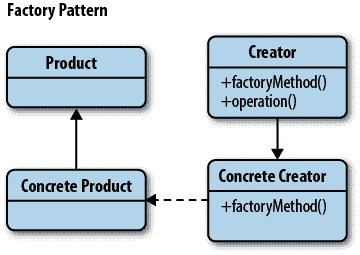
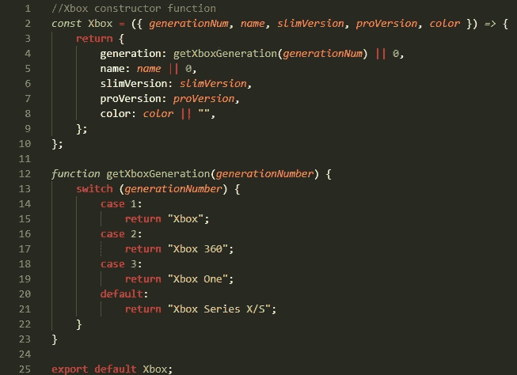
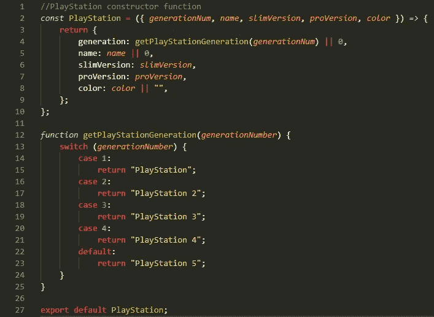
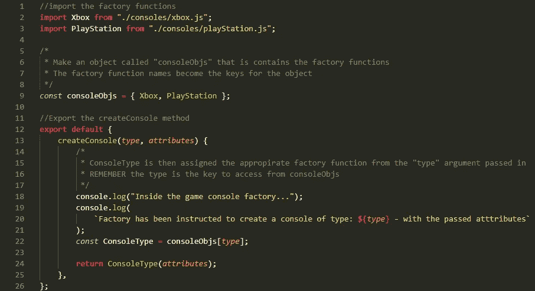
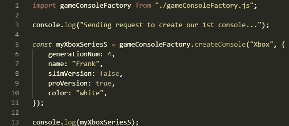
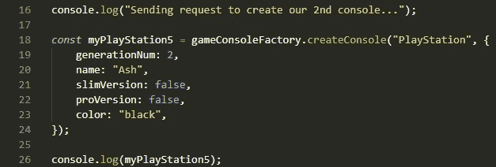
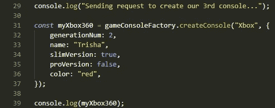
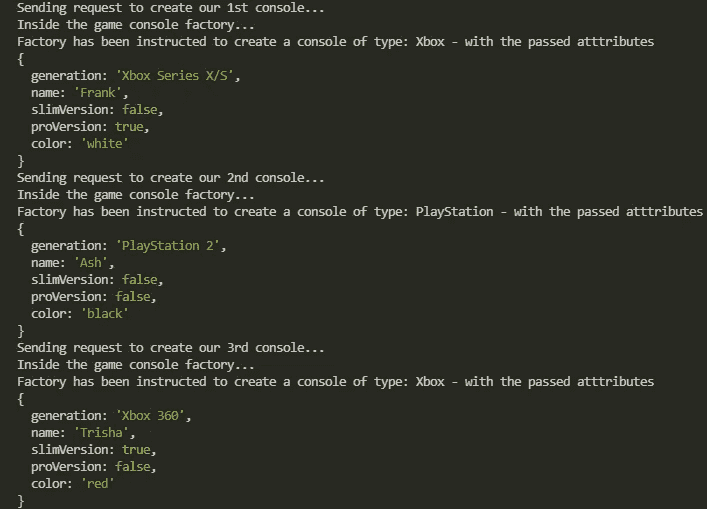

# 使用工厂设计模式高效创建对象(在 JavaScript 中)

> 原文：<https://medium.com/codex/efficient-object-creation-with-the-factory-design-pattern-in-javascript-e99e86b89d9f?source=collection_archive---------15----------------------->

代码中的工厂可以被视为现实生活中的工厂——它们可以根据创建所述对象所需的蓝图来生成对象(照片由 ***马修·米尔曼*** 经由 [**纽约时报**](https://www.nytimes.com/2021/09/10/realestate/prefabricated-modular-apartments.html) )

当处理一个问题时，设计模式是软件开发的关键部分。理解不同的模式增加了开发人员的工具带，以确保在适当的时候选择最合适和有效的解决方案。在我们进入工厂模式本身之前，让我们深入了解一下实际工厂的概念。

*想象一个真实的工厂——它有什么用途？
是根据蓝图生产多种物品(*或物品*)的主要场所。然后想想制造过程，就像这样简单:*

第 1—**有人向工厂提出请求，可以要求为他们制造特定的物品**
第 2—**工厂将从订单请求中指定的物品**中检查其蓝图
第 3—**工厂将根据蓝图**制造物品**，并将该物品发送给客户**/请求者使用

这整个过程可以比喻为工厂模式、它的实现以及它如何创建对象。对象是 JavaScript 中最有用和最通用的类型之一，拥有一个高效的创建模式可以使事情更有组织性和逻辑性。

## 工厂模式是什么，它是如何工作的？

工厂模式可以归类为创建模式，它帮助组织和集中代码中对象的创建。**工厂提供了创建对象的通用接口，**在这里可以指定我们希望创建的对象类型。如果我们以上面的真实工厂为例:
1nd—**我们在代码
中调用我们的工厂**2nd—**指定工厂创建的对象类型**并返回
3rd — **工厂然后创建所述对象并返回它**

工厂模式由几部分组成:
**创建者** —声明工厂方法并可能提供默认实现
**具体创建者** — 实现/覆盖工厂方法以返回具体产品

**产品** —定义由工厂方法
**具体产品**创建的对象的接口—实现产品接口

工厂模式图

## JavaScript 中工厂模式的基本实现

让我们来看一个使用视频游戏控制台来帮助形象化这个概念的例子:

**1 日** — **问题**:在一个*神奇的*世界里，微软和索尼联手成立了 SonySoft。他们打算在一个屋檐下出售任何一代的游戏机。

SonySoft 现在需要一种方法来动态生成任何控制台！

**第二个** — **对象**:在这种情况下，我们希望能够在用户请求时创建 Xboxes 和 PlayStations，因此这些游戏机将成为我们的对象:

xbox.js/playStation.js——创建 Xbox 和 PlayStation 控制台对象的工厂函数。

这两个都是**工厂函数，它们能够映射我们从工厂本身传入的属性，然后返回我们想要的对象**(用户指定的控制台)。这消除了在我们的主代码中创建新控制台对象时的冗余和混乱——现在所需要的就是一种传递控制台属性的方法。

**第三** — **工厂**:工厂负责处理对对象的请求，并使用传入的*类型*和*属性*来控制对象创建方法如何/在哪里处理请求

js——处理我们的控制台创建请求的游戏控制台工厂

工厂中的两个主要部分是**console objects**和 **ConsoleType** (导出的 createConsole 方法中的*)。 **console objects**包含了导入的工厂函数，以备后用。当我们导出 createConsole()时，它接受一个*类型*参数——这个*类型*参数是用户在希望创建一个对象时指定的(该对象将是 *Xbox* 或 *PlayStation，您将在下一部分*中看到)。
**控制台类型**然后使用*类型*参数作为关键字，在**控制台对象**内被分配各自的工厂功能。最后，由于 ConsoleType 被设置为工厂函数，因此它被调用来传入与请求控制台相关联的属性，然后创建实际的控制台对象。*

**第四** — **创建对象**:

现在唯一剩下的事情就是导入我们的工厂，并在我们的主代码中使用它来帮助 SonySoft 制作那些控制台:

index . js——创建我们的第一个控制台，这是一个 Xbox 系列 X/S

index . js——创建我们的第一个控制台，即 PlayStation 2

index . js——创建我们的第一个控制台，这是一个超薄的红色 Xbox 360

输出如下—

*…和 VIOLA* —我们能够使用我们的工厂成功地制造出我们的游戏机！

*(以上所有代码可在我的 GitHub* [***这里***](https://github.com/AlexDeL8/factory-pattern-example) *)*

## 何时使用工厂模式&何时不使用

在某些情况下，工厂模式可以很好地解决问题，但也有不太好的情况:

**何时:**
-当**需要根据环境轻松生成对象的不同实例时，工厂会提供帮助** ( *根据项目运行的环境，工厂返回的对象可能包含不同的属性， 比如 URL* )
-在需要创建**许多共享相同属性**的小对象或**组件的情况下工作良好-在 c **将对象与其他对象**的实例组合时也工作良好，这些对象只需要**满足一个 API 契约** ( *又名鸭类型*)即可工作(*有助于解耦*)**

**何时不要:**
——如果工厂链接开始变长，那么**在创建对象时会包含很多复杂性**(*当一个工厂创建其他工厂时会出现这种情况——通常可以在* [***抽象工厂模式***](https://www.youtube.com/watch?v=v-GiuMmsXj4) 中找到)

## 总结和资源

现在，您可以将这种有用、高效、简洁的创建模式添加到您的工具箱中，用 JavaScript 创建对象。**继续学习的最好方法是亲自动手** —您可以从在示例代码中创建更多的控制台对象开始，方法是在实现部分的末尾克隆 repo，甚至从头开始创建自己的工厂！

同样可以理解的是，有些人会希望继续深入这个概念，并希望在更多的地方学习更多的知识。关于 JavaScript 中工厂方法的更多资源，你可以参考下面的:
📖本文受到了《学习 JavaScript 设计模式的****书**的影响，由**[**Addy Osmani**](https://addyosmani.com/)**(以及 [**Lydia Hallie**](https://www.lydiahallie.io/) )。你可以在这里 找到工厂图样部分 [**。*我强烈建议先去参观这个！
🎥***](https://www.patterns.dev/posts/factory-pattern/)***[**视频由克里斯托弗·奥克拉维**](https://www.youtube.com/watch?v=EcFVTgRHJLM) (一个更长的深潜模式)🎥[**【T42 视频】(一段较短的编码视频)
🎥**](https://www.youtube.com/watch?v=kuirGzhGhyw) **[**视频由 Mosh**](https://www.youtube.com/watch?v=jpegXpQpb3o) (另一个较短的编码视频)编程***********