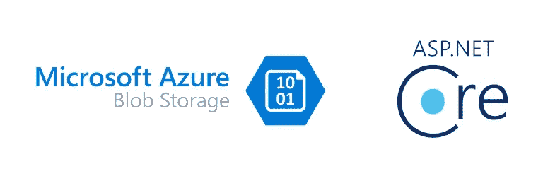

# 使用自定义 ActionResult 从 ASP.NET 核心中的 Azure 存储高效地服务 Blobs

> 原文：<https://medium.com/codex/efficiently-serving-blobs-from-azure-storage-in-asp-net-core-using-custom-actionresult-33399faaecbf?source=collection_archive---------0----------------------->

您可能已经在使用 Azure Blob 存储来存储应用程序中的一些文件。你能有效地将这些文件返回给用户吗？有几件事是经常做的。

## 匿名公共访问

这很容易，需要一点努力。根据[官方文档](https://docs.microsoft.com/en-us/azure/storage/blobs/anonymous-read-access-configure?tabs=portal)，你可以在容器中对你的 blobs 进行匿名公共访问。上传文件后，您可以将 blob 的 URL 放入响应中，例如*https://contoso . blob . core . windows . net/container 1/dir 1/file 1 . pdf*

更进一步，您可以在存储帐户上启用 CDN，可选地为文件添加前缀。您将设置一个 CDN 配置文件，其端点指向您的 blob 存储帐户。官方文档用更简单的方式解释了这些步骤。然后，在将 blob 写入响应之前，修改它的 URL。对于我们上面的 blob，你会得到类似于*https://contoso.azureedge.net/container1/dir1/file1.pdf*的结果，如果你给 CDN 端点原点添加一个前缀，你可以省略一些路径段。例如，您可以将路径设置为`/container1/dir1`，这样得到的 URL 将是*https://contoso.azureedge.net/file1.pdf*。使用 CDN 可以提供更好的用户体验，并有助于节省 Blob 存储成本，但这不是本文的重点。关于这个有大量的信息。

## 认证怎么样？

你已经开发了你的应用程序，但是你想决定是否有人可以访问某些文件。例如，在共享存储帐户的多租户应用程序中。Azure Blob 存储支持使用密钥和 Azure AD 的身份验证。密钥是为您的应用程序准备的。对于您组织中的用户(拥有 Azure 订阅的租户，其中存在存储帐户)，Azure AD 可能足以控制权限，或者使用 SharePoint 等更具企业级的解决方案会更好。不幸的是，情况并非总是如此，至少在我的工作中是这样。

第一个也是相当可靠的选择是使用 ASP.NET 核心，您可以根据自己的喜好控制用户访问，并在此过程中，向最终用户隐藏文件存储位置的内在特性。在大多数情况下，您可以将文件下载到内存或本地磁盘，然后在响应中提供它。

眼熟吗？是啊！为什么？这是最简单的方法，如果可行，为什么要改变呢？不幸的是，至少在我能想到的两种情况下，这往往是低效的:

1.  您希望支持 HTTP HEAD 动词，而不仅仅是 HTTP GET，而不必从 Azure Blob 存储中下载文件。
2.  您需要客户端在下载内容时执行测距。

在这两种情况下，您需要决定是否下载文件的内容。第二种情况对于大文件特别有用。存储/内存(易失性和非易失性)是昂贵的，您并不总是有足够的资源用于这些下载。

## 解决方案？把密码给我！！！

这个问题的解决方案是利用`Azure.Storage.Blobs`库提供的所有特性，包括流式下载。如果文件很大，HTTP HEAD 请求将帮助 HTTP 客户端(如浏览器)在下载前做好适当的准备，如检查空间、计划并行下载(如下载管理器)。

首先，我们创建了一个定制的`ActionResult`实现，因为内置的`FileStreamResult`和`FileContentResult`期望您拥有完整的流或字节数组。基本上，它们只支持本地文件或内容可以保存在内存中的小文件。在这里我们创造`BlobStorageResult`:

为了使用它，我们将控制器简化为:

简单吧？没那么快。我们还需要实现`IActionResultExecutor<BlobStorageResult>`才能在`ExecuteResultAsync(…)`中解决。幸运的是，这并不难。鉴于`BlobStorageResult`继承了`FileResult`，我们可以利用内置的`FileResultExecutorBase`。blob 毕竟是一个文件(大多数时候)。

当我写这篇文章时，我查看了[filestream result executor](https://github.com/dotnet/aspnetcore/blob/main/src/Mvc/Mvc.Core/src/Infrastructure/FileStreamResultExecutor.cs)的内置实现。起初，我认为我甚至不需要使用`FileResult`,因为这将是不同的，直到我意识到使用它将允许我使用`FileResultExecutorBase`,它做许多锅炉板，例如:

1.  验证请求头中提供的范围，并决定我们是否应该写主体。
2.  设置适当的响应头(内容长度、内容类型、If 范围、范围、内容范围等)和响应代码(200、206 或 416)。

提议的方法实现了什么？

1.  允许客户端请求一个范围，当他们这样做时，我们只使用`DownloadStreamingAsync(…)`从 Azure Blob 存储中下载范围
2.  如果我们有 HTTP HEAD 请求所需的详细信息(例如来自数据库)，我们可以避免调用 Azure Blob 存储。
3.  当我们没有 HTTP HEAD 请求所需的细节时，我们可以只获取更快更小的 blob 属性。

最后，设置服务非常简单:

然后可以在 Startup.cs 文件中调用`services.AddBlobStorage(...)`。

尽管这可能涵盖了大多数场景，但它不支持页面 blobs(或者可能是错误地支持？让我知道)，或者传递 ContainerName 和 BlobName 而不是 BlobUrl，但是可以在应用程序中修改。