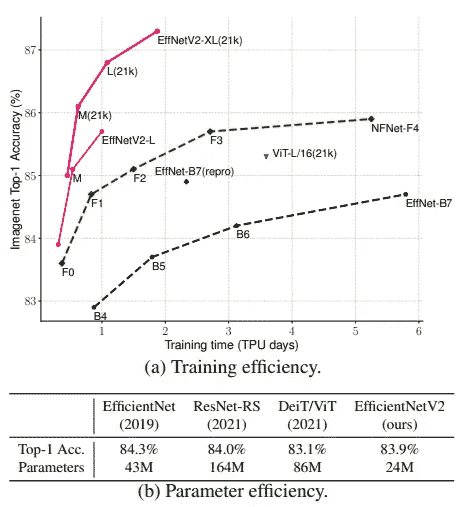
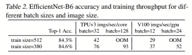
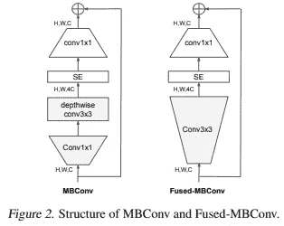
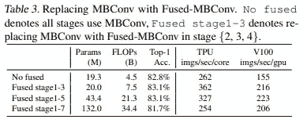
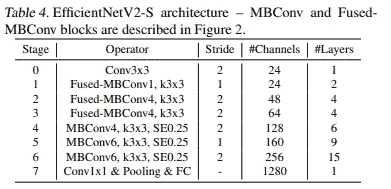
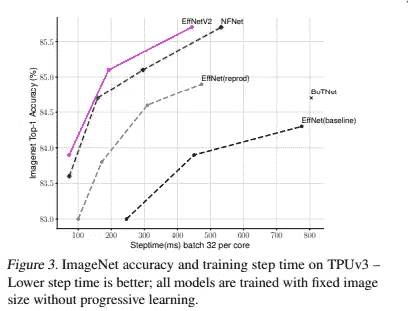
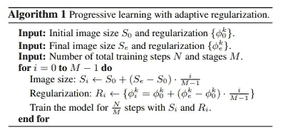

# EfficientNetV2:更小的模型和更快的培训

> 原文：<https://medium.com/codex/efficientnetv2-smaller-models-and-faster-training-fd174bed360c?source=collection_archive---------2----------------------->

照片由 [Guillaume Jaillet](https://unsplash.com/@i_am_g?utm_source=medium&utm_medium=referral) 在 [Unsplash](https://unsplash.com?utm_source=medium&utm_medium=referral)

在寻找最有效的 CNN 架构方面已经有许多实验。一个*高效的*架构必须在许多瓶颈之间找到一个完美的平衡，比如准确性、参数、FLOPs 或推理时间。许多论文根据需要关注不同的瓶颈。例如，DenseNet 和 EfficientNet 试图用较少的参数来提高精度。RegNet、ResNeSt 和 MNasNet 优化了推理速度。NFNets 专注于提高训练速度。

训练高效+参数高效

这篇全新的论文(2021 年 6 月)提供了关于如何有效地训练 CNN 和提高训练速度的深刻见解。重点讨论和改进 CNN 培训的以下突破:

*   神经结构搜索(NAS):使用随机搜索/强化学习来做出最佳模型设计选择并找到超参数。
*   缩放策略:关于如何有效地将小网络升级为大网络的指南，例如 EfficientNet 的复合缩放规则。
*   培训战略:例如，新的正规化方法、培训效率准则。
*   渐进学习:通过逐渐增加图像大小来加速训练。
*   各种类型的卷积和积木:例如，深度方向 conv，深度方向可分离 conv，压缩和激发(se)，MB Conv，融合 MB Conv。

EfficientNetV2 讨论了 EfficientNet 管道的低效之处，并用一种新策略改进了每个组件。在本帖中，我们将讨论 EfficientNet 的问题，并提供本文中提出的解决方案。

## EfficientNet(又名 EfficientNetV1)有什么问题？

EfficientNet 管道搜索使用 NAS 优化 FLOPs (~speed)和准确性的网络 EfficientNet-B0。应用复合缩放规则，通过同时增加深度(层数)、宽度(通道数)和图像大小来放大该网络，并找到高效网络 B1-B7。本文讨论了 EfficientNetV1 的三个瓶颈。

**使用非常大的图像尺寸进行训练很慢:** EfficientNet 以指数方式缩放输入图像分辨率(例如，B7 输入 600×600 的图像)。这导致了严重的内存瓶颈，并迫使批处理变小，从而损害了性能。

**深度方向卷积在早期层中较慢，但在后期阶段有效:**具有深度方向卷积的 MBConv 模块和没有深度方向卷积的融合 MBConv 模块被认为是 EfficientNetV2 中的构建块。深度方向卷积的参数明显较少，但速度较慢，因为它没有利用现代加速器。

由于#通道相对较小，早期层的参数优势不是很大，因此常规 MBConv 模块和融合 MBConv 模块的适当混合可能是最佳选择(表 3)。

**同等地扩大每个阶段是次优的:**通过复合比例法则天真地扩大网络的所有阶段不是最好的主意。直观地说，每个阶段对训练速度和参数效率的贡献是不同的。

# 改进的 NAS 和扩展

作为前面讨论的 EfficientNetV1 问题的解决方案，本文提出了一种改进的 NAS 算法和扩展策略。

## 美国国家科学院（National Academy of Sciences）

新定义的搜索空间是以下定义的简化版本:

*   卷积运算类型:{MBConv，Fused-MBConv}
*   层数
*   内核大小:{3×3，5×5}
*   膨胀率(在 MBConv 内部):{1，4，6}

正如我们所看到的，搜索空间非常窄，因为 EfficientNetV1 的大多数不必要的搜索选项都被删除了。此外，最佳通道尺寸采用 EfficientNetV1 中已搜索的参数。

新的搜索奖励使用简单的加权乘积 A×(S^w)×(P^v 将模型准确度 a、#训练步骤 s 和#参数 p 结合起来。具体来说，w=-0.07 和 v=-0.05 是根据经验得到的。

## 结果

上表描述了使用改进的 NAS 算法搜索的 EffNetV2-S 的基准体系结构。我们观察到

*   早期层发现 Fused-MBConv 更有效，而后者更喜欢原始的 MBConv 模块。
*   早期层更喜欢较小的膨胀比。
*   每一层都倾向于 3×3 内核，比 5×5 内核有更多的层，这在 EfficientNetV1 中略有利用。
*   最终阶段(阶段 7)可能由于其大的参数大小而被完全移除。

## 扩展策略

我们对 EfficientNetV1 的扩展策略进行了两处直接修改。

1.  将最大推断图像大小限制为 480。
2.  在后续阶段添加更多层以增加网络容量，而不会增加太多运行时开销。

这两个微小的修改甚至给 EfficientNetV1 的性能权衡带来了显著的变化。仅仅通过修改缩放策略，黑色的帕累托曲线被改进为灰色曲线。使用这种修改的缩放策略来定义较大的对应 EffNetV2-M 和 EffNetV2-L。

## 渐进式学习

渐进式学习是一种通过逐步增加模型容量(也称为图像大小)来促进训练的策略。准确地说，图像大小在训练期间逐渐增加。然而，它们通常会导致最终精度下降。

EfficientNetV2 通过增加正则化程度和图像大小来改进渐进式学习。直观上，使用小图像大小的训练=小网络容量因此需要弱正则化，而使用大图像大小的训练需要更强的正则化来对抗由于网络容量增加而导致的过拟合。

根据该算法，我们根据 I 的值同时增加图像大小 si 和正则化幅度φI。正则化幅度φI 控制丢失率、随机增加幅度和混合率。

## 摘要

该白皮书指出了原始 EfficientNet 的体系结构和扩展策略中的低效之处。改进的 NAS 算法利用了 EfficientNetV1 的先验知识，并且能够自适应地搜索有效块和重要的超参数。搜索到的架构传达了一致且重要的模式，这些模式提供了关于高效 CNN 架构的见解，在设计网络架构时应加以利用。

复合缩放策略在参数和内存效率方面稍有修改。

与基线 V1 网络相比，改进的渐进式学习算法与改进的网络架构相结合，在相同的计算能力下达到类似的精度时，将 EfficientNetV2 的训练速度提高了 11 倍。