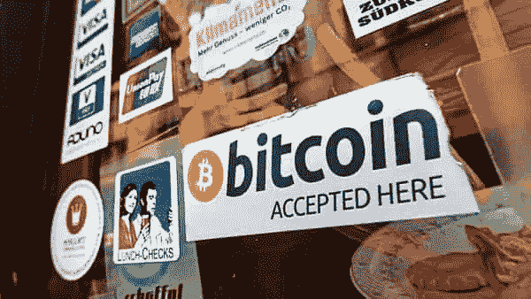

# 萨尔瓦多采用比特币作为法定货币敲响了警钟

> 原文：<https://medium.com/codex/el-salvadors-adoption-of-bitcoin-as-legal-tender-is-a-wake-up-call-c2a1dbbe6569?source=collection_archive---------14----------------------->

信用:livemint

在我们开始之前，我请求你加入我的时事通讯。我保证你将来会有深刻的见解。让我们用惊人的内容来满足我们饥饿的头脑，你甚至可以亲自给我发消息来学习和写一些东西或你对它的看法。

 [## Niraaj 的时事通讯

### 喂养饥饿的心灵。点击阅读 Niraaj 的时事通讯，作者 Niraaj Ojha，是一个子堆栈出版物。启动 5 天…

niraajojha.substack.com](https://niraajojha.substack.com/) 

许多人认为世界领先的加密货币比特币的市场是对冲基金、业余投资者、极客和罪犯之间的赢家和输家游戏。高度不稳定的匿名数字货币所固有的巨大风险最好留给那些非常了解这个游戏的人，或者那些并不真正在乎的人，因为他们会减轻风险或吸收任何损失。但比特币最近对标准支付系统使用受限的国家和个人变得更有吸引力——也就是说，那些最没有能力管理潜在风险的人。

2021 年 6 月，萨尔瓦多成为世界上第一个采用比特币作为货币的国家，颁布了将于 9 月生效的立法。这表明比特币经常被用来购买全国各地的商品和服务，接收者在法律上有义务简单地接受它。

萨尔瓦多人对这种货币实验并不陌生。美元在 2001 年成为萨尔瓦多的货币，并且是国内交易中使用的货币。当时，弗朗西斯科·弗洛雷斯总统的政府允许美元与国家货币科隆一起以一种严格而快速的汇率自由流通。

美元支持者认为，宏观经济稳定的预期收益将超过萨尔瓦多失去的经济主权、货币独立甚至铸币税——制造硬币和纸币的价值与其面值之间的差额。然而，购买力突然下降，使经济更加依赖汇款，过去 20 年来，汇款平均每年占国内生产总值的 20%。

使用比特币作为货币将加剧美元化所揭示的货币约束——特别是缺乏一个独立的宏观经济制度框架来左右国内政策。此外，比特币的波动性远高于美元。6 月 8 日至 6 月 15 日期间，其价值在 32 462 美元至 40 993 美元之间波动，5 月 15 日至 6 月 15 日期间，其价值在 34 259 美元至 49 304 美元之间波动。如此大的波动——因此无可争议的事实是，它们完全是由市场驱动的，政策制定者没有控制波动的余地——使比特币成为不合适的宏观经济稳定工具。萨尔瓦多总统 Nayib Bukele 在推特上表示，比特币将促进汇款转账，并大大降低交易成本。尽管联合国和 20 国集团多次呼吁降低费用，但移民汇钱回家必须支付的费用高得惊人。与地球银行一致，国际汇款 200 美元的典型全球成本约为 13 美元，即 6.5%，远高于可持续发展目标的 3 美元。

尽管如此，在 2020 年，低收入和中等收入国家收到的汇款为 5400 亿美元——仅略高于 2019 年的总额 5480 亿美元，远高于这些国家的外国直接投资(2020 年为 2590 亿美元)和海外发展援助(2020 年为 1790 亿美元)。将费用降低到 20 英镑可以增加汇款，最高可达每年 160 亿美元。

庞大但分散在全球的汇款业务依赖于通过商业银行支付系统的电子转账，银行对使用这一基础设施收取高额费用，因此利用了安全可靠的国际网络的优势。但是高费用并不是唯一的问题。许多移民在他们工作的国家没有支票账户，他们在家乡的家人也可能是世界上 17 亿没有银行账户的人之一。此外，一些国际移民可能不得不将资金转移到没有融入国际支付系统或接受跨境转移能力受到限制的国家，例如叙利亚或古巴。

Bukele 认为有必要挑战这一技术，包括提供低成本和低风险的替代方案。但比特币是错误的工具。是的，它允许人们直接在全球范围内转移价值，而无需昂贵的第三方中介。但是它的波动性使它充其量只是一种资产——尤其是一种有用的风险存储——而不是一种交易方式。价格突然下跌的危险意味着移民和他们在家乡的家人永远无法确定转移的现金数量。我们不应该把萨尔瓦多采用比特币仅仅视为加密热潮的又一个例子，而是应该一直反思为什么我们世界上的许多人愿意出于非投机目的接受加密货币。也许解决办法在于一个不可否认的事实，即目前的国际经济体系要么对它们服务不佳，要么根本不起作用。
数字货币的创新，如非洲的 M-Pesa 移动货币服务，已经在许多发展中国家的支付系统中取得了重大进展。但要提供支持数字货币的基础设施和监管框架，还需要做更多的工作。不过，就目前而言，情况仍不明朗。

迫切需要协调的跨境政策来确保比特币及其变体在发展中国家弊大于利。除非公众和个人部门都接受关键改革，让所有人或任何人都能以低成本获得基本银行服务，否则人民和政府将越来越被比特币和其他低成本、高风险、不透明的传统银行替代品所吸引。

大脑袋

## 关注我们的[博客](https://bigbrains-blog.blogspot.com/2021/07/el-salvadors-adoption-of-bitcoin-as.html)，加入我们的[不和谐服务器](https://discord.com/invite/YXqeDTNH9J)和[子编辑](https://www.reddit.com/r/BigBrainsSubmissions/)！！