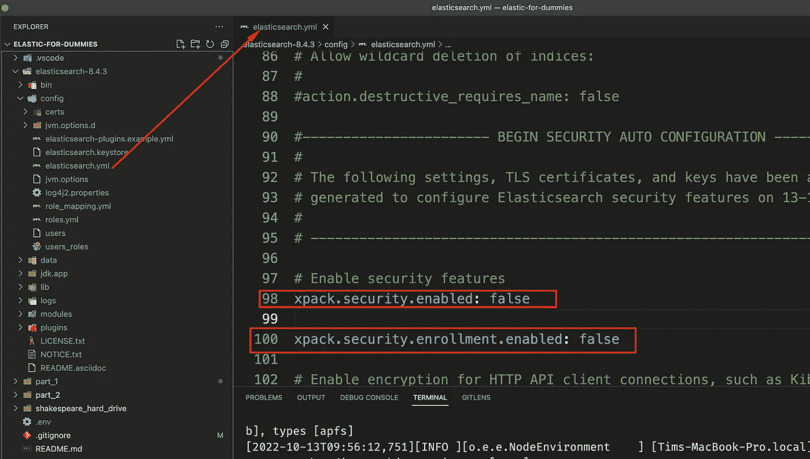
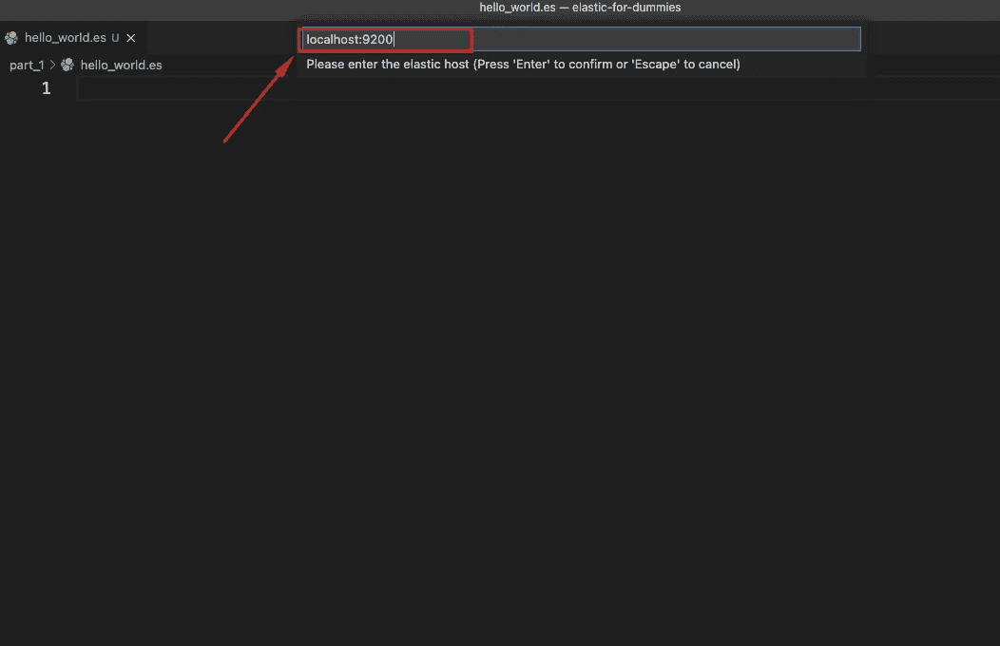
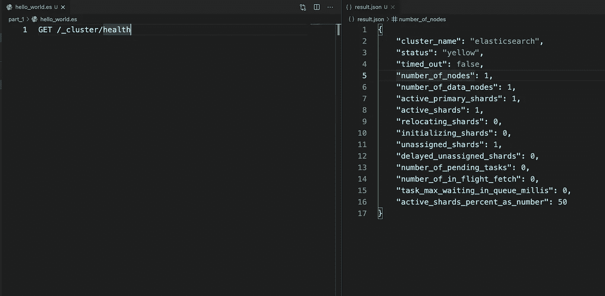
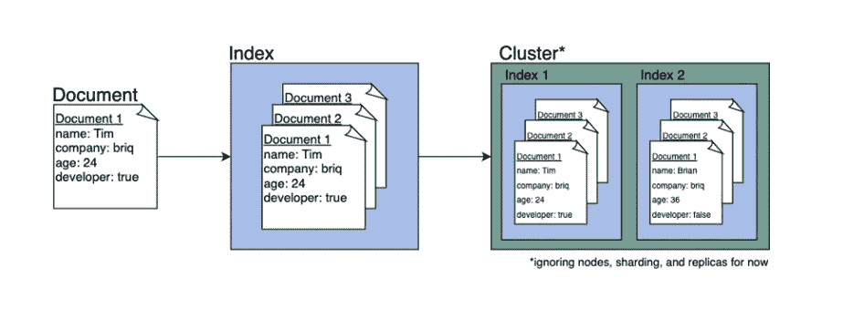
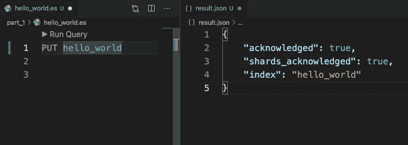
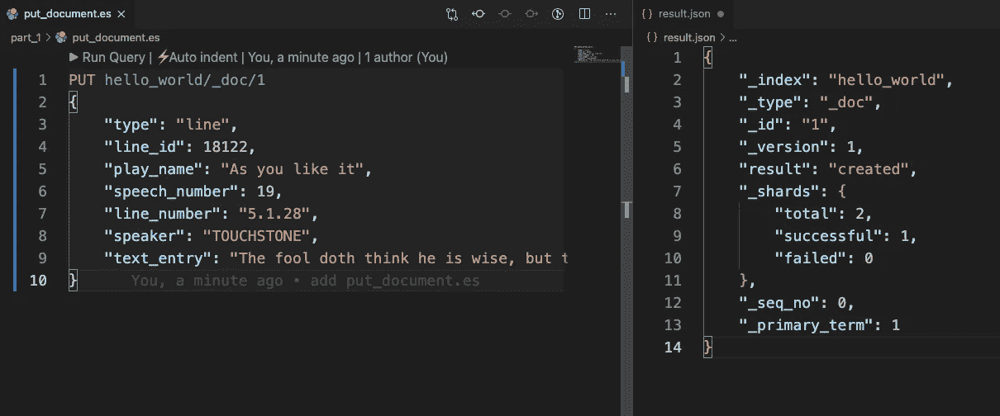
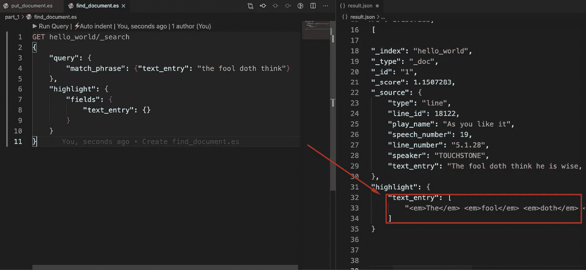
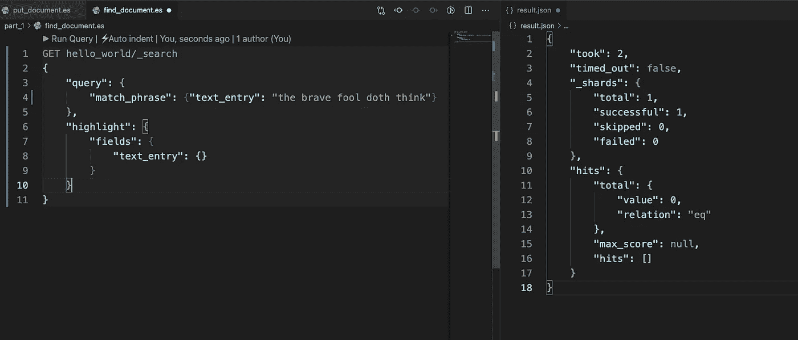

# 假人的弹性研究:第一部分

> 原文：<https://medium.com/codex/elasticsearch-for-dummies-part-1-be184a739b60?source=collection_archive---------0----------------------->


我最喜欢的技术之一是 Elasticsearch(从现在开始我将称之为 Elastic)。Elastic 是一个开源的搜索引擎，非常灵活和强大。我可以给出无数的[用例](https://www.elastic.co/customers/)来说明在哪里以及为什么使用 Elastic，但是这将偏离本文的目的。

这个系列是献给那些傻瓜们的。这是写给那些已经意识到他们对弹性一无所知并且愿意承认这一点的人的。对于那些体现了以下莎士比亚的报价:


威廉·莎士比亚。信用:【tymoff.com】T4

当我试图自己解决所有这些问题时，这些文章是我希望存在的资源。我希望这将有助于、激励和简化你在软件工程的广阔世界中的旅程。

我们开始吧，好吗？

# 搭建舞台

是时候发挥你的想象力了:你刚刚拿到了一个硬盘[,里面有威廉·莎士比亚所有出版的作品，现在就看你怎么把它放进橡皮筋里了。](https://github.com/timothestes/elastic-for-dummies/tree/main/shakespeare_hard_drive)

我们将开始索引莎士比亚的全部作品，但现在让我们从我之前引用的戏剧《如你所愿》中的一句开始。数据是 JSON 格式的，这样更容易放入 Elastic。

```
{
    "type": "line",
    "line_id": 18122,
    "play_name": "As you like it",
    "speech_number": 19,
    "line_number": "5.1.28",
    "speaker": "TOUCHSTONE",
    "text_entry": "The fool doth think he is wise, but the wise man knows himself to be a fool."
}
```

对于那些不熟悉的人来说，JSON 只是一种使用键-值对存储数据的方式(你们 Python 人可能会认为这是一个 [Python 字典](https://realpython.com/lessons/dictionary-python/)！)

看资料可以看到，这条线属于一个叫试金石的老乡，线号是`5.1.28`。现在不是非常有用的信息，但也许我们以后可以用它做一些很酷的事情。

我们来制定一个游戏计划。我们需要做以下事情(如果你不知道每一步意味着什么也没关系):

1.  旋转沙盒弹性集群。
2.  创建一个索引来存储我们的数据。
3.  将我们的文件插入索引中。

# 旋转您的第一个集群

首先，将 Elastic 下载到您的本地计算机上，为您的系统选择合适的下载文件(您可以在这里找到下载文件)。

要让 Elastic 在 Mac 上运行:

*   下载并解压你下载的文件，并将`cd`放入解压后的目录。
*   编辑 config 目录中的 elasticsearch.yml 文件，并禁用 xpack-security 特性标志。为了学习 Elasticsearch，我不想让我们陷入认证和安全的细节中。仅在本地开发和易于测试时执行此步骤，不要在生产用例中执行。



禁用 xpack 身份验证(暂时)

*   要启动 elasticsearch，请运行`bin/elasticsearch`(或在 Windows 上运行`bin\elasticsearch.bat`)
*   为了验证集群已经启动并正在运行，让我们在一个单独的终端会话中向`http://localhost:9200/`发出一个未经身份验证的请求:

```
➜ curl [http://localhost:9200](http://localhost:9200)
{
  "name" : "Tims-MacBook-Pro.local",
  "cluster_name" : "elasticsearch",
  "cluster_uuid" : "JZcAF-F1S-y-CmBtQ-roOQ",
  "version" : {
    "number" : "8.4.3",
    "build_flavor" : "default",
    "build_type" : "tar",
    "build_hash" : "42f05b9372a9a4a470db3b52817899b99a76ee73",
    "build_date" : "2022-10-04T07:17:24.662462378Z",
    "build_snapshot" : false,
    "lucene_version" : "9.3.0",
    "minimum_wire_compatibility_version" : "7.17.0",
    "minimum_index_compatibility_version" : "7.0.0"
  },
  "tagline" : "You Know, for Search"
}
```

现在，让我们将可信的 VSCode IDE 连接到本地集群，这样我们就可以通过一些简单的 REST APIs 与它对话。

要将本地弹性集群连接到 VSCode:

*   下载 VSCode 扩展的 [Elasticsearch。](https://marketplace.visualstudio.com/items?itemName=ria.elastic)
*   在 VSCode 中创建新文件`hello_world.es.`
*   当您创建一个启用了扩展名的`.es`文件时，它会提示您指定连接(您可以保留`localhost:9200`):



*   为了验证我们已经连接到我们的沙盒集群，在新文件中键入`GET _cluster/health` 并按`ctrl+enter` 运行命令。您应该会看到类似这样的内容:



恭喜:您刚刚创建了您的第一个集群！


你的第一个集群是 ALIVEEEEE！

# 创建您的第一个索引

首先，一些词汇:

*   简单地说，一个*索引*是我们存储*文档*的一个极其优化的地方。索引通常由许多文档组成。
*   *文档*是一个或多个键值对的集合，我们可以对其进行搜索和过滤(想象一下类似于我们之前谈到的 Shakespeare JSON 对象)。
*   集群是我们存储和管理*索引*的地方。



文档、索引和集群之间的关系

在将文档放入集群之前，我们首先要创建一个索引。要创建您的第一个索引，请在您的`hello_world.es`文件中运行`PUT hello_world`:



在现实世界中，建立一个索引通常比这更复杂，但是我们现在尽量保持简单。我希望你把注意力放在概念上，而不是细节上(细节可以稍后再来)。

现在我们已经创建了一个索引，我们准备开始索引文档。

# 将文档插入第一个集群

如果你不喜欢打字，复制粘贴 [put_document.es](https://github.com/timothestes/elastic-for-dummies/blob/main/part_1/put_document.es) 文件，运行`PUT hello_world/_doc/1`命令:



让我们来分解一下刚刚发出的命令:`PUT hello_world/_doc/1`

*   PUT 指定动作类型。我们想*放*一个文档。
*   `hello_world`是我们要将文档放入的索引
*   `_doc/1`是指定 doc_id(与索引中的文档相关联的唯一 id)的语法

但是我们如何知道文档被编入了索引呢？嗯，我们从集群得到了一个成功的响应，但是为了确定，让我们进行第一次弹性查询并手动找到那个文档。

# 制作您的第一个弹性查询

Elastic 使用基于 JSON 的专用查询 DSL(领域特定语言)来定义查询。让自己习惯于查询语法将会有很大的帮助，所以不要盲目地将代码片段复制并粘贴到文件中！打几个出来可以帮助你理解它们的结构。

要进行查询，我们首先必须决定要查询哪些字段。引用是我们想要找到的文档中最令人难忘的部分，所以让我们在`text_entry`字段中进行文本匹配短语查询。

下面的[查询](https://github.com/timothestes/elastic-for-dummies/blob/main/part_1/find_document.es)将搜索其`text_entry`字段包含短语“傻瓜确实在想”的文档(加上一些高亮显示以准确显示我们找到的内容):



因为我们要求突出显示，我们可以在`response.json`中看到我们搜索的短语！超级酷。

让我们换个话题:如果我们搜索“勇敢的傻瓜会思考”这个短语，你认为会发生什么？(注意我在查询中添加了一个额外的单词)



如果你猜我们不会有结果，那你就猜对了！这是因为`match_phrase`查询只寻找精确的短语匹配。

我们的第一次会议到此结束。要进行清理，请在运行集群的终端中使用命令`ctrl+c`来停止集群。

如果你能走到这一步，我为你感到骄傲！希望您在概念层面上理解了什么是文档、索引和集群。您能够成功地创建您的第一个索引，索引您的第一个文档，然后进行您的第一个弹性查询。

这只是冰山一角，还有很多东西要学。在我的下一篇文章中，我将讨论弹性搜索映射和虚拟数据类型…