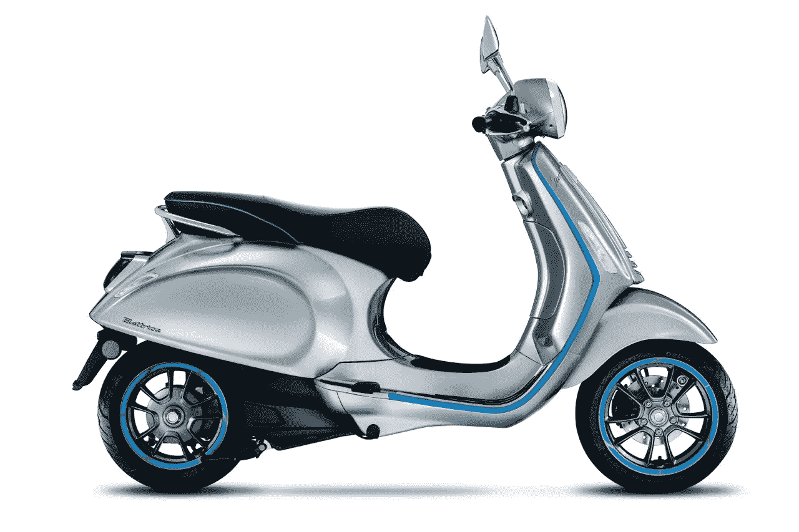

# 电动助力车因为“为什么不”？

> 原文：<https://medium.com/codex/electric-mopeds-because-why-not-98b9608b6c00?source=collection_archive---------9----------------------->

## 小马达从来没有这么干净安静过！

[Elettrica(Vespa 媒体)](https://images.piaggio.com/vespa/vehicles/nve3000u00/nve3hvcu02/nve3hvcu02-01-m.png)

在这个时代，电力在各种交通工具中变得越来越普遍。油价和永无止境的通货膨胀使得这一选择越来越有吸引力。如此吸引人，以至于 Piaggio 集团公司 Vespa 以其 Elettrica 模型的形式跳上了电池供电的轻便摩托车潮流。