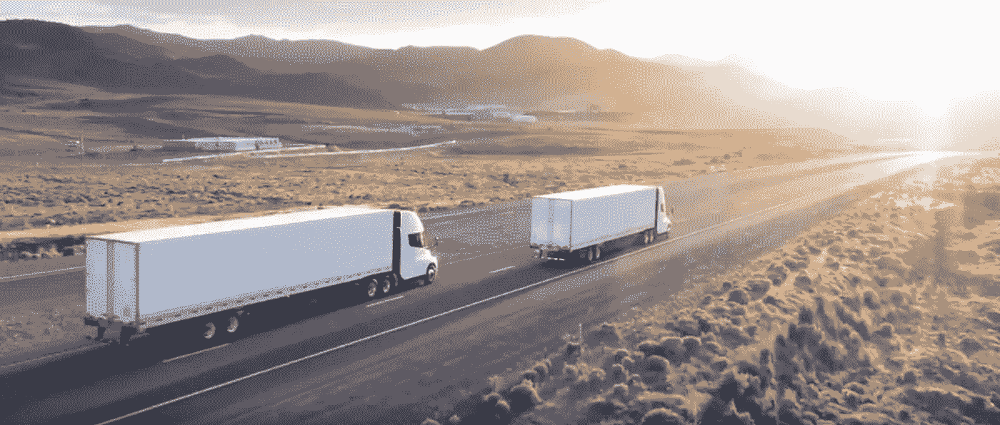

# 电动半挂卡车:另一种重要的交通工具

> 原文：<https://medium.com/codex/electric-semis-another-important-form-of-transportation-f4426f4dd23a?source=collection_archive---------1----------------------->

## 一次减少一辆卡车的碳排放！

[特斯拉 Semi 卡车(特斯拉媒体)](https://www.tesla.com/semi)

在减少碳排放的努力中，最重要的贡献者之一一直是牵引车-拖车(semis)。一般来说，汽车每天在路上行驶几个小时，从每加仑 15 英里到每加仑 50 英里不等。一辆半卡车…