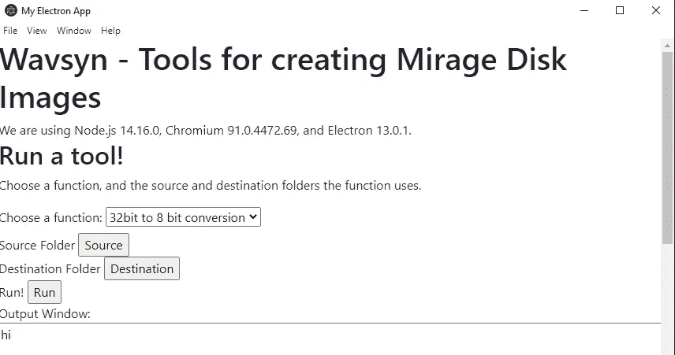
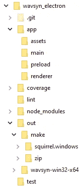
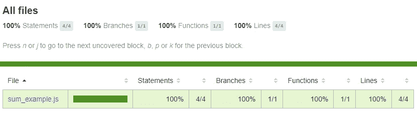
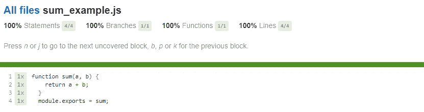
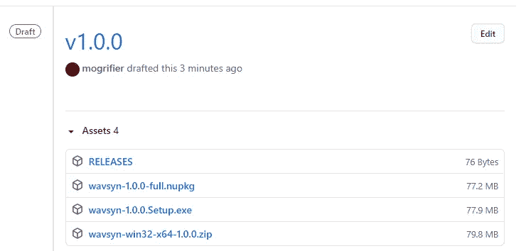

# 电子桌面应用程序模板

> 原文：<https://medium.com/codex/electron-desktop-app-template-14c5e9c40b1e?source=collection_archive---------0----------------------->


[粘土银行](https://unsplash.com/@claybanks?utm_source=medium&utm_medium=referral)在 [Unsplash](https://unsplash.com?utm_source=medium&utm_medium=referral) 拍摄的照片

我写了一堆 Python 代码，作为将音频样本(用于乐器合成器)转换为 8 位格式的概念证明，以便为 80 年代著名的 lo-fi 采样器 Ensoniq Mirage 创建软盘映像。你没看错——*软盘镜像*。代码可以工作(嗯，在我的机器上)，但是不容易使用([https://github.com/mogrifier/miragetools](https://github.com/mogrifier/miragetools))。我需要一个桌面应用程序来简化使用、维护和分发应用程序。我过去曾开发过 PyQT 和 JavaFX 应用程序，但我想尝试一些不同的东西，事实证明，我相信*比*好得多。

# 输入电子

首先，你应该已经知道一些关于电子的知识。这不是一个让你入门的教程，而是深入到更详细和更高级的主题，同时还提供了模板项目来帮助你。

> **模板链接**https://github.com/mogrifier/electron-template

我收集了不下 30 个网站的信息把这个资源放在一起，所以它会帮助大多数用户(如果是的话请成为粉丝！)它还修复了我在网上找到的教程的一些问题。有大量的电子教程。试过之后，回到这里。初学者应该从这里开始:[https://www.electronjs.org/](https://www.electronjs.org/)。我强烈推荐使用 Visual Studio 代码进行开发。它是基于电子和铬的！您还应该安装 nodejs 扩展包。

我决定利用我的应用程序的开端，把它变成一个模板项目，你可以自由地从 Github 克隆，并以任何你喜欢的方式使用(麻省理工学院许可)。该模板侧重于添加您通常会在 DevOps 管道中看到的功能。有些人只是想跳进去写代码，但是使用这个模板会帮助你写出更好的代码，而且很容易使用。模板项目将帮助你完成那些不性感但必要的事情:

*   电子项目结构
*   使用 npm 运行命令
*   单元测试
*   代码覆盖率
*   棉绒格子
*   构建部署工件
*   发布您的应用

以下部分将详细介绍模板的使用。Electron 还提供了其他一些很棒的功能，比如应用程序更新服务。参见[https://github.com/electron/update.electronjs.org](https://github.com/electron/update.electronjs.org)。

Electron 广泛用于流行的桌面应用程序(如 Slack ),并且得到了很好的支持和良好的文档记录，这使得它成为构建高质量应用程序的首选，而不会带来太多额外的麻烦。如果你已经建立了网站，你可以利用你在 Javascript、HTML 和 CSS 方面的技能。

# 您需要的命令

下面是设置和使用该模板所需的所有命令的摘要。下面将对它们进行更详细的讨论。你应该有 node ≥ v16.3.0 否则会出错。从【nodejs.org】下载| node . js 安装节点你还需要从【git-scm.com】Git-下载[Git](https://git-scm.com/download/)

**安装需要的命令。这些必须从您的项目文件夹中运行！！**

```
[the first command will install the rest, but running again will not cause harm and can update some things]
npm install --save-dev electron
npm install --save-dev @electron-forge/cli
npx electron-forge import
npm i [@electron](http://twitter.com/electron)-forge/maker-zip
npm i [@electron](http://twitter.com/electron)-forge/publisher-github
npm i eslint
```

请注意，我忽略了-g 标志。这意味着全局安装，这样所有未来的项目都可以使用这些模块和相关的命令，而不需要重新安装模块。但是，对于一个应用程序，您希望所有东西都安装在应用程序目录中。安装过程将创建一个“node_modules”文件夹，并把它们都放在那里，包括 node 的一个版本。您应该查看一下文件夹，看看发生了什么。

其他问题(在 Mac 上，但可能在其他地方发生)。电子捆绑节点到你的应用程序。这可能会导致主机操作系统上的版本与应用程序中的版本不同。我通过使用“n”来更新电子应用程序文件夹中的节点，修复了这个问题。首先，我全局安装了‘n ’:

```
sudo npm install -g n
```

然后在应用程序文件夹中运行:sudo n stable

旧的节点版本也有一个问题，它会创建根拥有的文件。这个命令(更改您的用户名)将修复:sudo chown-R 501:20 "/Users/eizdepski/。国家预防机制"

**生命周期命令:**

*   npm 运行测试
*   npm 运行 lint
*   npm 运行制造
*   npm 运行开始
*   npm 运行包
*   npm 运行发布

# Wavsyn 应用程序

我真的建立这个应用程序，但你只需要模板。这里是一些背景的应用程序背景。我的 app 的概念真的很简单。您选择一个要运行的函数，并选择输入和输出目录。下一次迭代将允许选择多个步骤来运行，甚至在一个简单的工作流中将它们链接在一起。保留中间步骤输出，因为它们可能有用。还显示了运行函数的输出。



没有风格的简单用户界面



我的应用程序文件夹结构

## 应用程序文件夹结构

电子应用程序中的文件夹结构很重要。网上有各种各样的模板。在左边你可以看到我的决定。注意，有些文件夹是由我正在使用的工具制作的，比如 coverage。我自己添加了 lint 文件夹来存储报告(也添加到了. gitignore。)

## 查看 NPM 可以使用哪些功能

节点包管理器(npm)是一个强大的开发工具。它可以运行的函数在 package.json 中找到；有些是由您更新/创建的，而有些是由您安装的节点模块创建的。您可以查看 package.json 的脚本部分的内容，或者只运行“npm run”

```
G:\vsc_workspace\wavsyn_electron>npm run
Lifecycle scripts included in wavsyn@1.0.0:
 start
 electron-forge start
 test
 jest test 
available via `npm run-script`:
 package
 electron-forge package
 make
 electron-forge make 
G:\vsc_workspace\wavsyn_electron>
```

# 运行应用程序和测试

g:\ VSC _ workspace \ wav syn _ electron > NPM start

> wavsyn@1.0.0 启动
>电子。

这将启动你的应用程序。它将看起来像一个本地应用程序，并在浏览器窗口中运行。**你甚至可以从视图菜单打开 chrome 开发者工具！**

为了测试，我决定使用 jest ( [https://jestjs.io](https://jestjs.io) )。它很容易使用，从 package.json 中的一个命令开始，由脸书维护。应该会持续一段时间！在这种情况下，文件夹“test”包含测试，并且是 jest 命令的参数。

## package.json 的

```
“scripts”: {
“start”: “electron-forge start”,
“test”: “jest test”,
“package”: “electron-forge package”,
“make”: “electron-forge make”
}
```

## 运行测试

```
G:\vsc_workspace\wavsyn_electron>npm test
> wavsyn@1.0.0 test
> jest testPASS test/sum_example.test.js
 √ adds 1 + 2 to equal 3 (3 ms)— — — — — — — — | — — — — -| — — — — — | — — — — -| — — — — -| — — — — — — — — — -
File | % Stmts | % Branch | % Funcs | % Lines | Uncovered Line #s 
 — — — — — — — — | — — — — -| — — — — — | — — — — -| — — — — -| — — — — — — — — — -
All files | 100 | 100 | 100 | 100 | 
 sum_example.js | 100 | 100 | 100 | 100 | 
 — — — — — — — — | — — — — -| — — — — — | — — — — -| — — — — -| — — — — — — — — — -
Test Suites: 1 passed, 1 total
Tests: 1 passed, 1 total
Snapshots: 0 total
Time: 0.868 s
Ran all test suites matching /test/i.G:\vsc_workspace\wavsyn_electron>
```

## 测试覆盖率

我选择 jest 的另一个原因是，它可以自动创建覆盖率报告，能够查看每个文件中哪些行被测试覆盖，哪些行没有被测试覆盖。这使得准确识别您的测试弱点变得容易。覆盖率报告在覆盖率文件夹中(由 jest 制作)。包括 XML 和 HTML 报告。



汇总覆盖报告



详细的覆盖报告

# 用于部署和分发的电子锻造

电子锻造是电子 Github 背后的人推荐的。我发现安装和使用它非常简单，但后来遇到了麻烦。帮助在下面。

## 安装电子锻造

详见[https://www.electronforge.io/cli](https://www.electronforge.io/cli)。

```
G:\vsc_workspace\wavsyn_electron>npm install — save-dev [@electron](http://twitter.com/electron)-forge/cli
npm WARN deprecated har-validator@5.1.5: this library is no longer supported
npm WARN deprecated uuid@3.4.0: Please upgrade to version 7 or higher. Older versions may use Math.random() in certain circumstances, which is known to be problematic. See [https://v8.dev/blog/math-random](https://v8.dev/blog/math-random) for details.
npm WARN deprecated request@2.88.2: request has been deprecated, see [https://github.com/request/request/issues/3142](https://github.com/request/request/issues/3142)
npm WARN deprecated node-pre-gyp@0.11.0: Please upgrade to [@mapbox/node-pre-gyp](http://twitter.com/mapbox/node-pre-gyp): the non-scoped node-pre-gyp package is deprecated and only the [@mapbox](http://twitter.com/mapbox) scoped package will recieve updates in the future
added 363 packages, and audited 762 packages in 57s58 packages are looking for funding
 run `npm fund` for detailsfound 0 vulnerabilities
```

## 为运行“make”准备项目

电子锻造公司有一系列的步骤来让你的项目为“制作”做好准备。额外的依赖项被安装，命令被添加到 package.json 中。“out”文件夹会自动添加到。gitignore 也是。

```
G:\vsc_workspace\wavsyn_electron>npx electron-forge import
✔ Checking your system
✔ Initializing Git Repository
✔ Writing modified package.json file
✔ Installing dependencies
✔ Writing modified package.json file
✔ Fixing .gitignore
We have ATTEMPTED to convert your app to be in a format that electron-forge understands.Thanks for using “electron-forge”!!!
```

## 运行“make”

命令“npm run make”构建您的应用程序可执行文件，并提供运行所需的附加依赖项。你需要分发整个目录(一个 zip 文件会很好——见下面的修复制作一个！)将您的应用程序交给某人或提供 squirrel 设置文件。

```
G:\vsc_workspace\wavsyn_electron> npm run make> wavsyn@1.0.0 make
> electron-forge make --targets [@electron](http://twitter.com/electron)-forge/maker-squirrel,[@electron](http://twitter.com/electron)-forge/maker-zip✔ Checking your system
✔ Resolving Forge Config
We need to package your application before we can make it
✔ Preparing to Package Application for arch: x64
✔ Preparing native dependencies
✔ Packaging Application
Making for the following targets: squirrel, zip
✔ Making for target: squirrel - On platform: win32 - For arch: x64
⠋ Making for target: zip - On platform: win32 - For arch: x64(node:20052) [DEP0147] DeprecationWarning: In future versions of Node.js, fs.rmdir(path, { recursive: true }) will be removed. Use fs.rm(path, { recursive: true }) instead
(Use `node --trace-deprecation ...` to show where the warning was created)
✔ Making for target: zip - On platform: win32 - For arch: x64
G:\vsc_workspace\wavsyn_electron>
```

“out”文件夹包含 to folders: make 和一个用于您的计算机架构的文件夹(在我的例子中，是 wavsyn-win32-x64)。make 文件夹包含您的可分发目标。这些必须在 package.json 中定义。我注意到的一件事是没有创建主目录的 zip 文件(“wavsyn-win32-x64”)。Squirrel 输出是默认创建的(对于 electronic-forge make 没有目标参数)。package.json 文件缺少生成 zip 文件的命令。以下是对它的必要修正。

您可能还需要这样安装它:

```
G:\vsc_workspace\wavsyn_electron>npm i -g [@electron](http://twitter.com/electron)-forge/maker-zip
```

您需要修改 package.json 中的脚本命令:

```
"make": "electron-forge make --targets @electron-forge/maker-squirrel,@electron-forge/maker-zip"
```

您还需要通过添加“win32”来修改 forge 的 config 元素:

```
{“name”: “@electron-forge/maker-zip”,
“platforms”: [
“darwin”, “win32”]}
```

## 电子锻造的其他特征

使用这个工具还有其他一些很好的理由。它可以运行其他命令，例如:

*   lint —运行您配置的 linter
*   发布——将您的工件发送到您的 github 帐户(或 AWS S3)

## 线头

我在用 eslint。您需要安装 eslint 并创建一个配置文件。然后，您必须配置 package.json 以正确运行它。参见[https://eslint.org/docs/user-guide/command-line-interface](https://eslint.org/docs/user-guide/command-line-interface)

```
installation: > npm i -g eslint
initialization: > eslint — init
script command: "lint": "eslint app/**",I ultimately modified my lint command write an html report to a folder in my app root:
"lint": "eslint app/** -f html -o ./lint/report.html --cache:true",
```

## 出版

**注意:命令“npm 发布”和“npm 运行发布”是完全不同的。**前者登录 https://registry.npmjs.org/。后者用于发布到您的 github 存储库(或其他地方)。

仅安装电子 CLI 不会安装任何发布者(或除 CLI 之外的任何东西)。以下是如何为 github 安装。注意，您还需要一个具有存储库权限的 Github 访问令牌([https://github.com/settings/tokens](https://github.com/settings/tokens))。您应该将这个令牌放在环境变量 GITHUB_TOKEN 中，而不是放在 package.json 中，因为这样会在您的 git 系统中暴露它的值。为了使用这个新变量，我必须重启 Visual Studio 代码。

```
G:\vsc_workspace\wavsyn_electron>npm i -g [@electron](http://twitter.com/electron)-forge/publisher-github
```

您还需要两套 package.json 的配置代码。

```
"publishers": [{
"name": "@electron-forge/publisher-github",
"config": 
{"repository": {"owner": "mogrifier","name": "wavsyn"},
"prerelease":"true"}}]
```

脚本需要这样:

```
"publish": "electron-forge publish",
```

最后，devDependencies 需要:

```
"@electron-forge/publisher-github": "^6.0.0-beta.57",
```

现在你会问，我是从哪里得到版本号的？我运行“npm list”来查看已安装软件包的列表，其中恰好包括它们的版本号。

运行 publish-github 命令会得到以下输出:

```
G:\vsc_workspace\wavsyn_electron>npm run publish> wavsyn@1.0.0 publish  
> electron-forge publish✔ Checking your system
✔ Resolving Forge Config
We need to package your application before we can make it
✔ Preparing to Package Application for arch: x64
✔ Preparing native dependencies
✔ Packaging Application
Making for the following targets: squirrel, zip
✔ Making for target: squirrel - On platform: win32 - For arch: x64
⠋ Making for target: zip - On platform: win32 - For arch: x64(node:19572) [DEP0147] DeprecationWarning: In future versions of Node.js, fs.rmdir(path, { recursive: true }) will be removed. Use fs.rm(path, { recursive: true }) instead
(Use `node --trace-deprecation ...` to show where the warning was created)
✔ Making for target: zip - On platform: win32 - For arch: x64
✔ Resolving publish target: [@electron](http://twitter.com/electron)-forge/publisher-github
✔ Searching for target release: 1.0.0
✔ Uploading Artifacts 4/2 to v1.0.0G:\vsc_workspace\wavsyn_electron>
```

现在转到您的存储库并单击 Releases。



我的 Github 存储库中的应用程序草案的版本

# 安全扫描

想要对您的 node js 项目进行漏洞扫描吗？如果您在安装新模块时查看输出，您会看到 audit 是由安装进程自动运行的。您也可以使用命令“ **npm audit”手动运行**还有一些其他的工具，商业的和免费的。参见 2020 年关于该主题的一篇文章:[https://www . freecodecamp . org/news/6-tools-you-can-use-to-check-for-vulnerability-in-node-js/](https://www.freecodecamp.org/news/6-tools-you-can-use-to-check-for-vulnerabilities-in-node-js/)

# 多方面的

什么是 package-lock.json？从 awesome 堆栈溢出:

> package-lock.json 仅用于将依赖项锁定到特定的版本号。

这意味着它不会随着对 package.json 的每次更改而更改，但有时会。

# 结论

希望这些信息能让你更快地进行电子桌面应用程序开发和一些适当的开发工作。在新的开发环境中使用通用的 web 技能是加速项目的一个好方法。添加 DevOps 将帮助您交付更高质量的产品。

做粉丝。提问。去造点东西吧！