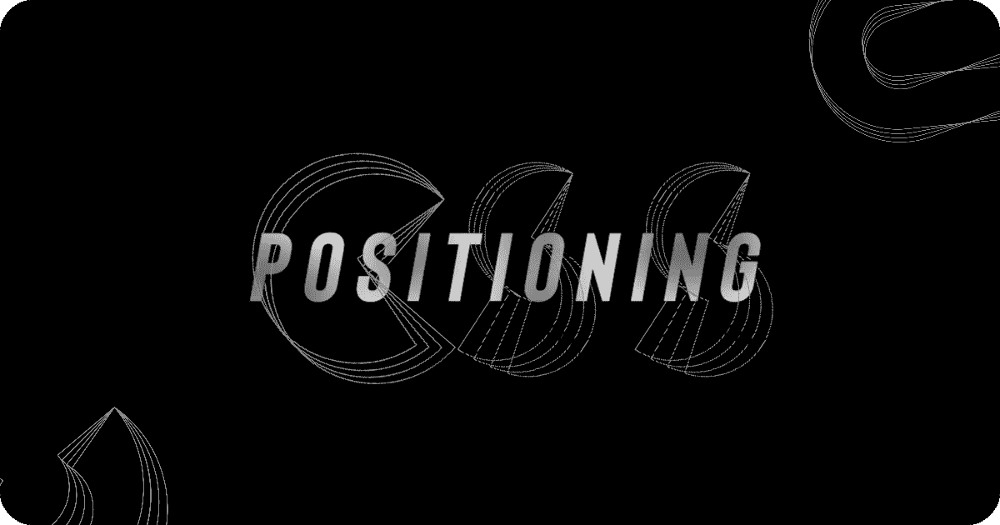
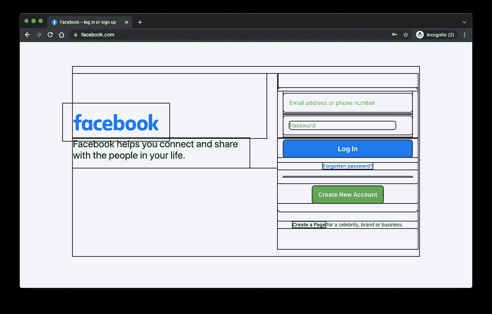
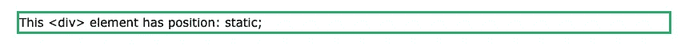
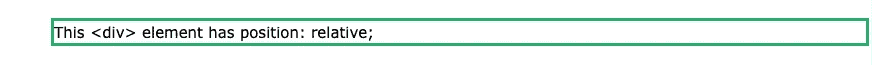
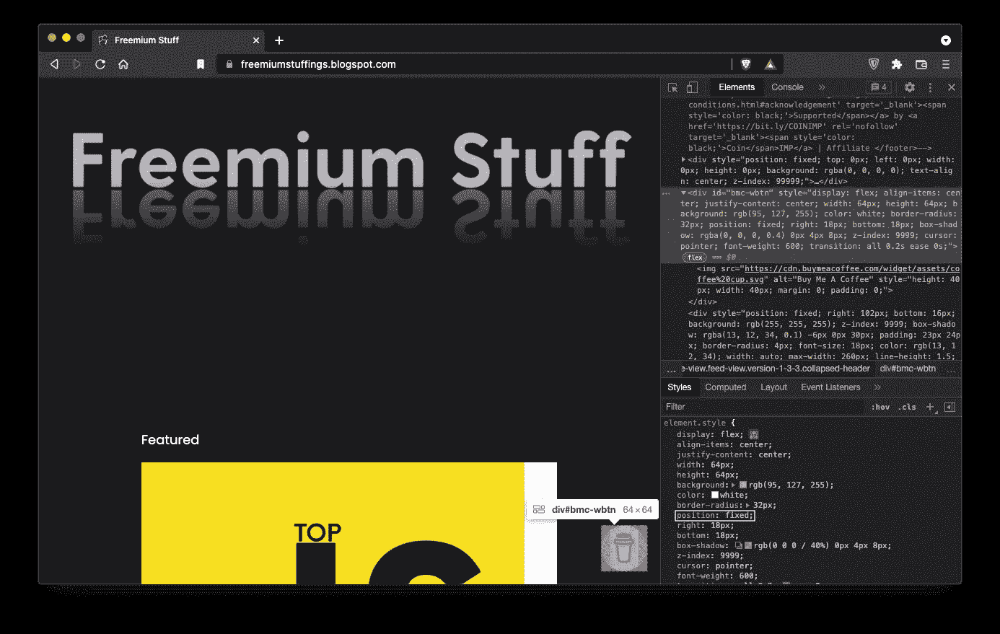
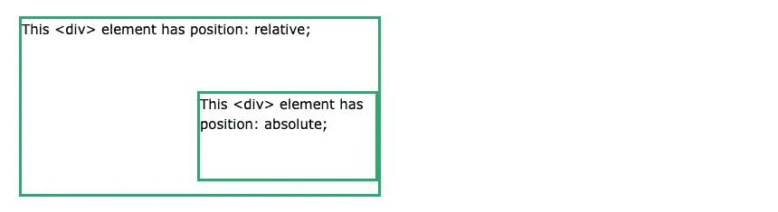
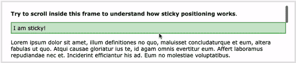

# ELI5:在 CSS 中定位

> 原文：<https://medium.com/codex/eli5-positioning-in-css-305d2d19fb2?source=collection_archive---------11----------------------->

*用过你所有的免费故事，在这里免费阅读*[](https://simily.co/all-stories/bhaveshrawat/css-positioning-explained/)**。**

**

*图片来源:作者*

*昨晚，我把我的[博客的](https://freemiumstuffings.blogspot.com)主题调到了黑暗模式。经过大量的 CSS 调整、谷歌搜索、Reddit 提问和学习一些标签后，它终于诞生了。*

*你可以在这里查看博客:*

*[](https://freemiumstuffings.blogspot.com) [## 免费增值的东西:策划的东西。给你的。免费的。

### 策展 150 多种内容，包括顶级的 Udemy、Coursera、谷歌课程、网络电子书、开发、编程…

freemiumstuffings.blogspot.com](https://freemiumstuffings.blogspot.com) 

嗯，这让我学习，更像是，修改 CSS 定位，我想，嗯，为什么不让其他人也容易些呢。开始了。

# 配置

问问你自己，你是如何看待“定位”某样东西的。你基本上是在告诉它应该住在哪里，对吗？现在，一个网页是由盒子组合而成的。



图片来源:脸书

CSS 中的定位是指设置一个元素在网页中的位置。

*附注:这是我用来展示这些区块的代码*

```
* {
    outline: 2px solid #1a1a1a;
  }
```

有没有注意到即使你滚动屏幕，顶部的导航条仍然在顶部？是的，这是因为它的定位就是这样。

让我们看第一部，好吗？

## 位置:静态；

这是所有 HTML 元素的默认位置。它和这些文字一样，是和网页的正常流程一起定位的。你不能用上、下、左、右属性。

```
div. static {
  position: static;
  border: 3px solid #73AD21;
}
```



w3 学校

很简单，对吧？它使元素相对于网页是静态的。

## 位置:相对；

现在，如果你想指定一个静态的特定元素的方向，这就是相对位置发挥作用的地方。

```
div. static {
  position: relative;
  left: 30px;
  border: 3px solid #73AD21;
}
```



w3 学校

*注意:其他内容不会被调整以适合元素留下的任何间隙。*

简而言之，没有任何方向属性的相对就像静态一样。

## 位置:固定；

这个名字暴露了一切，不是吗？无论如何，元素都固定在视口的指定位置！

> 浏览器的视窗是窗口中可以看到网页内容的区域。这通常与呈现的页面大小不同，在这种情况下，浏览器为用户提供滚动条来滚动和访问所有内容。
> - MDN

视窗基本上是你在屏幕上看到内容的区域，它因设备而异。


这是我的视窗

使一个元素的行为像一个覆盖图。它相对于视窗定位，这意味着即使页面滚动，它也总是停留在同一位置。

“固定位置”元素也从文档正常流动中删除，这使它们的行为类似于叠加。

示例:



[免费增值的东西](https://freemiumstuffings.blogspot.com)

## 位置:绝对；

记住，在`position: relative;`中，元素是如何驻留在指定的空间中，但将正常区域留给自己的。嗯，在绝对位置，就像固定一样，元素从文档正常流程中删除，这意味着，对于其他元素，它不存在于网页中。再次强调重叠的力量。

具有绝对位置的元素相对于其最近的定位祖先定位。它查找相对父节点，如果有的话。如果不是相对的，那么就变成相对于。

```
div.relative {
 position: relative;
 width: 400px;
 height: 200px;
 border: 3px solid #73AD21;
}div.absolute {
 position: absolute;
 top: 80px;
 right: 0;
 width: 200px;
 height: 100px;
 border: 3px solid #73AD21;
}
```



## 位置:粘性；

几乎每个导航/顶部导航都有这个位置。这是固定和相对/静态的混合体。让我们分解一下，看看它能带来什么。

所以，这个 position 元素从 static/relative 中得到的怪癖是，它遵循网页的正常流程，直到它到达指定的标记，当它到达指定的标记时，它就像一个覆盖图一样，固定在那个位置。

```
div.sticky {
 position: -webkit-sticky; /* Safari */
 position: sticky;
 top: 0;
 background-color: green;
 border: 2px solid #4CAF50;
}
```



现在，sticky 确实让你想玩它，这没什么不好。去做吧。但是你可能应该读一读这个惊人的[故事](https://elad.medium.com/css-position-sticky-how-it-really-works-54cd01dc2d46)，作者是[埃拉德·谢赫特尔](https://medium.com/u/9fc81237aa4e?source=post_page-----305d2d19fb2--------------------------------)。他以一种非常容易理解的方式打破了这个棘手的局面。* 

*好了，这就是这个故事，希望这个故事值得你花时间，你喜欢它。如果你有，考虑跟我来这里。*

*你知道吗，按住拍手图标，你可以发出不止一次的拍手声，很简单，对吧！*

*和平。*

*如果你愿意支持我，你可以在这里做[](https://www.buymeacoffee.com/BhaveshRawat)**。非常感谢！！***

## **更多故事**

**[](/geekculture/what-is-meta-charset-utf-8-and-why-do-we-use-it-4eee7456fa1c) [## 让我们深入了解一下

### 所以，我最近看到很多人，主要是刚开始学 HTML 的人，询问这个 meta 标签，charset 属性是…

medium.com](/geekculture/what-is-meta-charset-utf-8-and-why-do-we-use-it-4eee7456fa1c) [](https://bhavesh-rawat.medium.com/5-best-ways-to-transfer-data-from-an-android-smartphone-to-laptop-bda94d080304) [## 在智能手机和笔记本电脑之间无线传输数据的 5 种最佳方式。

### 以下是如何通过使用这 5 种方法传输数据来提高您的工作效率。我打赌你不知道所有的…

bhavesh-rawat.medium.com](https://bhavesh-rawat.medium.com/5-best-ways-to-transfer-data-from-an-android-smartphone-to-laptop-bda94d080304) [](/writers-blokke/never-have-i-ever-53c605efaa96) [## 我从来没有…

### …如此想尝试智能手机！

medium.com](/writers-blokke/never-have-i-ever-53c605efaa96)**