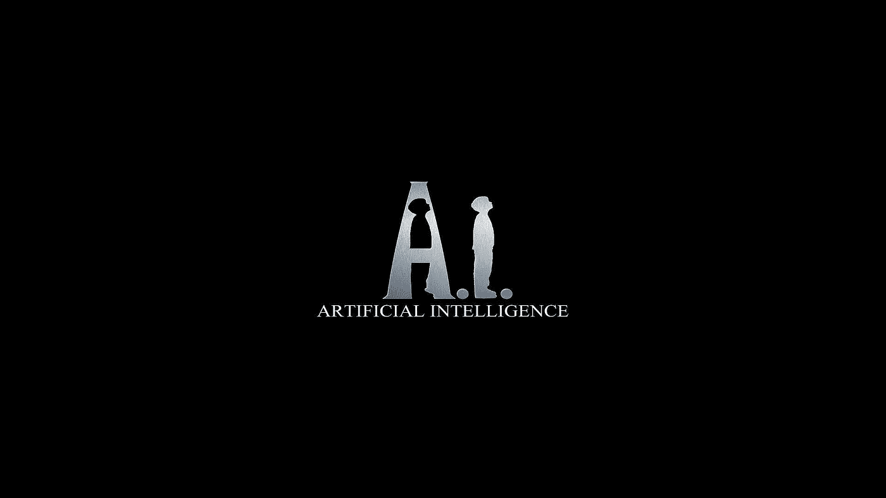

# 消除人工智能(AI)中的偏见

> 原文：<https://medium.com/codex/eliminating-bias-in-artificial-intelligence-ai-5af87de0260a?source=collection_archive---------19----------------------->

## 人类偏见可能渗透到人工智能系统的程度已经开始在社会上展开辩论，可能会产生严重影响。

图片:[https://wallpapercave.com/w/wp2042025](https://wallpapercave.com/w/wp2042025)

***人工智能的决策会比人类的决策更少偏差吗？还是 AI 会让这些问题变得更糟？***