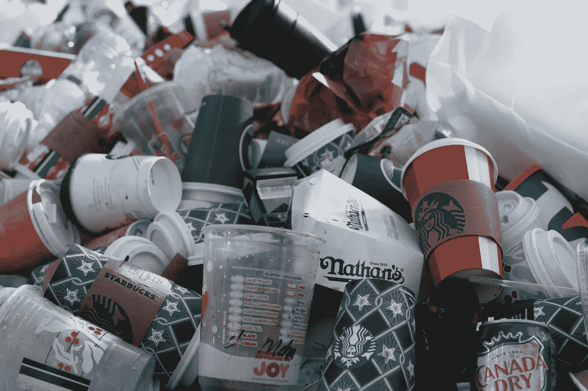

# 消除这 7 种浪费将会提升你的软件交付的价值

> 原文：<https://medium.com/codex/eliminating-these-7-wastes-will-level-up-the-value-your-software-delivers-da36bf2ed65b?source=collection_archive---------9----------------------->

Jasmin Sessler 在 Unsplash 上的照片

***消除浪费对于通过软件实现价值至关重要。***

20 世纪 40 年代末，丰田遇到了一个问题。制造业很昂贵，所以价格很高。但是日本典型的汽车购买者现金不足。**降低制造成本是销售汽车的唯一途径。**

大规模生产本来可以解决这个问题，但日本的经济规模不足以创造成千上万辆汽车的需求。丰田不得不另辟蹊径，他们转向了大野泰一。

大野豪志的丰田生产系统(TPS)则是另一种方式。他是这样描述的:

> *我们所做的就是查看从客户给我们订单到我们收取现金的时间线。我们正在通过消除无附加值的浪费来缩短这一时间。*

TPS 的另一位前辈新乡重夫确定了**七大类制造废物:**

*   库存
*   生产过剩
*   额外处理
*   运输
*   等待
*   移动
*   缺点

精益软件开发的鼻祖 Mary 和 Tom Poppendieck 将这些解释为软件开发的七种浪费。

***从你的软件工程生态系统中消除这七种浪费将会立即提升你交付给你的组织的价值:***

# #1:部分完成的工作

部分完成的工作往往在完成之前很久就过时了，而且总是碍事。您会在未编码的需求、未提交的代码、未测试的代码、未记录的代码、未部署的代码、注释掉的代码和复制/粘贴重用中找到它。

# #2:额外功能

额外的功能会使产品臃肿，增加成本，而且可能永远不会被使用！额外的代码必须被跟踪、编译、集成、测试和维护。它增加了复杂性和潜在的故障点。

# #3:重新学习

学习创造价值。重新学习会造成浪费。为什么？因为我们已经失去了原始学习所创造的价值(而不是成本)。我们重复这个循环的次数越多，我们制造的废物就越多。

# #4:移交

当我们将需求、代码或其他工件转移到不是其创建的一部分的个人/团队时，就发生了移交。大部分知识很难交流，所以知识总是被落下。

# #5:延迟

任何延迟增值活动开始或完成的事情。延迟会妨碍您的客户尽快实现价值，并且会在您的流程中引入不连续性。

# #6:任务切换

有效的软件开发需要深入、集中的思考。干扰是深度集中思考的终极敌人，任何任务转换都构成了干扰。

# #7:缺陷

这种浪费应该是不言而喻的，缺陷是要发生的(人无完人！).我们可以将浪费量化为缺陷的影响和未被发现的时间的乘积。