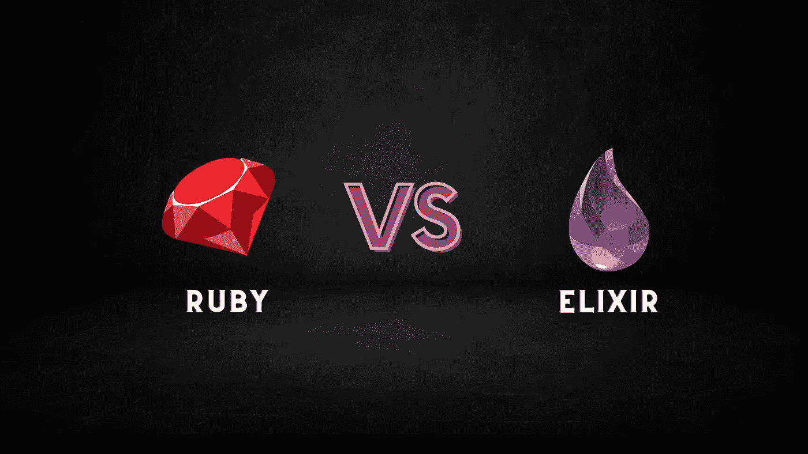

# 仙丹 vs 红宝石:哪个更快？

> 原文：<https://medium.com/codex/elixir-vs-ruby-which-is-faster-50c395c983fe?source=collection_archive---------9----------------------->

## 两种编程语言的比较，Elixir vs Ruby。

Ruby 和 Elixir 是两种流行的编程语言，在业界越来越受欢迎。它们有一些相似之处，但也有不同的优势。在本文中，我们将详细比较 Ruby 和 Elixir，以帮助您决定哪一个最适合您的需求。