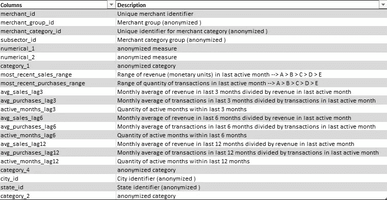

# Elo 商户类别推荐-了解客户忠诚度

> 原文：<https://medium.com/codex/elo-merchant-category-recommendation-understand-customer-loyalty-f952438e6d17?source=collection_archive---------4----------------------->

**作者** : [普拉文·贾拉贾](https://www.linkedin.com/in/praveen-jalaja)

信用:[马塞洛索萨](https://www.google.com/url?sa=i&url=https%3A%2F%2Fkumodot.com%2Fprojects%2FBdq44&psig=AOvVaw1WL26v-guuOlM0ZQ4w-X0y&ust=1613217622115000&source=images&cd=vfe&ved=0CAMQjB1qFwoTCMie9pGm5O4CFQAAAAAdAAAAABAD)

为了更好地了解机器学习世界，建立一个模型将比阅读和在线浏览视频更有帮助。实践是衡量对机器学习概念及其正确应用的理解所必需的。同样，这也是为了更好地了解 ML world 而进行的动手案例研究之一。因为，这里讨论的案例研究是 Kaggle competition Elo 商家类别推荐。

## 介绍

Elo 商家分类推荐是一个由 Elo 提供的 Kaggle 竞赛。它是巴西最大的支付品牌之一，向客户提供借记卡和信用卡。作为一个支付品牌，为商家提供优惠促销和折扣是一个很好的营销策略。持卡人可以使用各种商家的促销折扣。作为支付品牌，Elo 希望通过促销为持卡人提供个性化体验。通过基于用户的支付行为在不同的商家上向用户提供促销，可以增加和丰富用户体验并吸引消费者。

两年前，Elo 举办了 Kaggle 竞赛，让参赛者建立一个个性化促销和折扣的解决方案。Elo 已经建立了 ML 模型来理解其他方面，如顾客的食物和购物。这一竞争是为了专门构建模型，该模型可用于发现客户对品牌的忠诚度，以个性化折扣和促销活动。

## **概述:**

关于 Elo 类别建议的案例研究是通过遵循以下步骤流程完成的:

1.  定义业务问题
2.  机器学习问题公式
3.  探索性数据分析
4.  数据清理
5.  特征工程
6.  工程特征的探索
7.  模型结构
8.  结论。

## 定义业务问题

Elo 作为一个支付品牌，需要让他们的客户使用他们提供的卡在不同的地方进行支付。所以，换句话说，顾客对品牌的忠诚度是关键。Elo 需要留住对品牌有高度忠诚度的客户。这可以通过针对他们的不同促销活动目标来实现。持有 Elo 支付卡的客户可能有数百万，但该活动必须针对他们，基于他们对 Elo 品牌的忠诚度。

例如，一个客户在不同的商户长期使用 Elo 卡，用户的忠诚度很高。因此，为了留住客户，Elo 可以对客户最喜欢或经常使用的商家开展折扣活动。在很大程度上，这些忠诚的客户得到了折扣，并在未来的购买中继续付款。这种个性化带来了许多新客户，并保持了现有的客户。

问题是要找到一个能反映持卡人对 Elo 支付品牌忠诚度的指标。所以，Elo 用它来做促销活动的商业决策。因此，Elo 可以减少不必要的活动，并专注于需要的区域。

## 机器学习问题公式

在机器学习方面，我们需要一个度量来衡量客户的忠诚度。忠诚度得分是 Elo 品牌给出的一个衡量指标，用于衡量客户对 Elo 品牌的忠诚度。这些忠诚度得分取决于客户的许多方面。购买历史、使用时间、商家的多样性等。忠诚度得分可以从顾客购买和使用的信息中预测出来。从顾客的购买数据中预测忠诚度得分是我们问题的症结所在。忠诚度得分是应该建立机器学习模型来预测的目标变量。

目标变量—忠诚度得分

输入特征—持卡人的购买历史、使用时间等。

限制是所提供的数据不是真实的客户数据。由于客户的隐私和法律限制，所提供的数据是虚构和模拟的数据。模拟数据有时会存在人为引起的偏差，这会影响预测模型的性能。识别偏差并在最终模型中加以说明也是解决问题的一部分。

## 探索性数据分析

[**train.csv**](https://www.kaggle.com/c/elo-merchant-category-recommendation/data?select=train.csv) —该 csv 文件包含客户订购 Elo 卡的基本信息。train.csv 中有六个变量。目标变量(忠诚度得分)用于训练该文件中给出的模型。

[**test.csv**](https://www.kaggle.com/c/elo-merchant-category-recommendation/data?select=test.csv) —这是我们测试最终模型的测试数据。除了目标变量之外，它具有与 train.csv 相同的所有列。

train.csv

训练数据具有目标值，其简单的 PDF 显示其具有-30 左右的异常值，并以平均值 0 标准化。

目标相对于匿名化特征的类别(特征 _1、特征 _2、特征 _3)的分布互不不同。这表明，在这三个匿名化特征中，目标值对于不同的类别是不偏斜的。我们需要深入挖掘，以建立 **card_id** 和目标值之间的关系。并且，目标变量(忠诚度得分)的行为类似于关于 **first_active_month** 的阻尼频率图。该卡在 2012 年至 2015 年期间活跃，有较大的峰值和谷值，但在 2015 年之后，目标变为线性并呈上升趋势。这可能是由于在两个时间段之间用卡进行的交易类型不同。

因为，训练和测试的分布几乎相同。因此，在数据转换中没有基于时间的分割。并且，它保证了对测试数据的预测。

所有这三个特征的 VIF 值都远低于 10。所以训练数据不存在多重共线性的问题。

[**historical _ transactions . csv**](https://www.kaggle.com/c/elo-merchant-category-recommendation/data?select=historical_transactions.csv)—这个 CSV 文件包含 14 个不同的变量，这些变量与每个客户的交易有关。

**New _ merchants _ transactions . CSV**—它具有与 historical_transactions.csv 相同的一组列变量，但记录在不同的时间范围内。这包含计算忠诚度积分之前的交易信息。这是客户交易的最新信息。

historical_transactions.csv

历史和新商户交易数据特征，如类别 _1、类别 _2、类别 _3、分期付款和月份延迟，在相对于目标值的分布上几乎没有差异。而且，没有透露任何关于目标变量与卡片关系的细节。

关于新商户交易数据的一个重要特征是，其中没有未授权的交易，所有交易的**授权标志**为真。此外，来自交易数据的另一个重要信息是，购买金额被归一化并添加了恒定噪声。因为，它操纵数据识别的操纵技术可以帮助建模。并且在**购买金额**上，历史交易比新商户交易具有更少的异常值，这再次证明交易类型在某些方面是不同的。

并且，购买日期特征可以揭示交易的固有属性，并且交易是时间相关的，由此设计的特征将在预测中有用。

上面两个图显示了一周和一小时内购买次数的趋势。我们可以清楚地看到这种模式，工作日的交易量在一周中不断增加，而在周日有所下降。而且，下午到晚上的时间有更高的交易量。而且，一个重要的信息来自交易的时刻，在一天的零时有巨大的峰值。而且，大多数在线零售商的订购交易都发生在一天的最后时刻。这意味着交易不仅有直接卡支付，也有订阅类的在线交易。

在商户、历史和新商户交易中有许多缺失值，因此必须以直观/有效的方式估算这些缺失值，以便更好地预测。

授权标志的值稍高一些，大约为 32，这表明可能存在相关性。所以这个变量需要进一步调查。除了授权标志之外，其余变量看起来并不相关。

招商. csv

从对商家数据的探索中，其具有更多关于商家的数据，这些数据似乎对目标值的预测没有帮助，并且增加了问题的复杂性，因此在本研究中，没有以任何方式使用商家数据来构建模型。

在对交易、商家和列车数据的探索结束时，交易的给定特征对于目标分数的计算不是大的因素。存在有助于预测目标分数的一个或多个聚集的或设计的特征。利用不同的特征工程技术和市场研究技术，我们必须产生新的特征，这些特征在预测模型中可能非常有用，也可能不太有用。通过实现主要的特征工程思想，我们必须产生特征并在此基础上建立模型。

## 数据清理

在进入特性工程之前，EDA 的一个重要发现是数据文件中存在空值。空值必须在特征工程之前输入。有许多方法可以估算空值。这里，空值的插补是通过基于特征和其他特征的非空值构建的模型来完成的，以预测空值。

## 特征工程

**一次热编码-** 交易数据中的分类特征(类别 _3、类别 _2、月份滞后)在这些特征的工程特征之前进行一次热编码。

**取消购买金额的匿名化-** 正如我们在 EDA 中所讨论的，购买金额特征通过均值居中和缩放来实现匿名化。借助 [raddar](https://www.kaggle.com/raddar) 对[内核](https://www.kaggle.com/raddar/towards-de-anonymizing-the-data-some-insights)的洞察，购买金额通过除以 0.00150265118 加 497.06 去匿名化。

**聚合-** 在事务数据中，数据中有数字和类别特征。计算交易数据特征的基本统计数字，如唯一值、平均值、最大值、最小值、总和、标准偏差和偏斜的数量，以便为每个特征上的每个卡 id 生成单个值。

**日期时间功能-** 购买日期功能记录交易的时间戳。除了小时、日、周、月和年的基本统计特征之外，其他特征如

1.  交易当天是否为周末。
2.  购买的平均间隔时间。
3.  节日采购与否。

然后，将这些特性与所需的统计信息聚合到模型中。

除了上述主要特征之外，工程特征的一些比率被计算，如交易数量和日期差异数量之间的计数比率等。

训练和测试数据与事务的这些设计特征合并。而且，基本时间功能也是从第一个活动月份功能中派生出来的。

**RFM 分析**是一种市场研究方法，使用客户交易的三个衡量标准对其进行分类。

*   R —摄政—自上次交易以来的天数
*   F —频率—交易的频率
*   m——货币价值——客户/持卡人所花的钱总数。

通过计算 RFM 指数和 RFM 分数来了解顾客忠诚度。因此，这里我使用分位数对 RFM 值进行分类，通过简单的加法 RFM 得分和串联 RFM 指数作为特征导出。

最后，我从交易、训练和测试数据中导出了 280 个数字特征。这 280 个特征被输入到模型中用于训练和预测。

## **工程特征探索**

最后一组工程特征中，有许多具有 nan 值的特征。在 280 个要素中，有 158 个要素包含 Nan 值。一半以上的特征必须归因于 nan 值。因为通过建立模型进行插补需要大量内存和时间。简单的插补技术就足够了。在这项研究中，我试验了模式插补和零插补。从其结果来看，将 nan 值输入为零会产生更好的预测结果。

## **模型构建**

**评价指标**-均方根误差。在像 Kaggle 这样的平台上的竞赛中，评估模型预测的度量是由竞赛提供者自己给出的。

根据对现有解决方案和内核的研究，线性回归等简单模型，KNN 并不能更好地预测目标值。所以，我像 GBDT 一样跳进了复杂的模型。

**light GBM**——梯度推进模式是走向解决的第一步。没有超参数调整的 LightGBM 模型导致较差的 RMSE 值 3.744407。但是通过使用 [optuna](https://optuna.readthedocs.io/en/stable/index.html) 封装的超参数调谐给出了更好的 RMSE 值 3.61634。 [Optuna](https://optuna.readthedocs.io/en/stable/index.html) 软件包是一个很棒的超参数优化框架，它提供了比 sklearn 网格和随机搜索方法更多的优化控制。

**XGBoost** -具有调整的超参数的 XGBRegressor 模型并不比 lightGBM 模型更好的 RMSE 分数，但是在使用 GPU 的训练中更快。

**叠加**-XGBoost 和 lightGBM 模型预测的简单混合比 XGBoost 模型预测提高了 RMSE 评分。然后，使用脊元学习器堆叠两个模型预测。这个具有元学习者的堆叠模型在 Kaggle 上给出了比所有其他模型预测更好的 RMSE 分数。

## 结论

基于 XGBoost 和 lighGBM 模型构建的堆叠模型具有脊元学习器，与其他模型相比，给出了更好的 Kaggle 分数 3.61596。这项研究揭示了机器学习模型构建的特征工程方面的真正力量。输入到模型中的训练数据中的几乎所有特征都是工程数据。

## **未来工作**

1.  包含来自商家数据的工程特征有助于改进模型预测。
2.  特征选择可以通过减少不需要的特征所增加的偏差来提高模型的性能。

## 参考资料:

1.  [https://www.appliedaicourse.com/](https://www.appliedaicourse.com/)
2.  [https://www . ka ggle . com/Brendan hasz/elo-data-cleaning-and-EDA](https://www.kaggle.com/brendanhasz/elo-data-cleaning-and-eda)
3.  [https://www . ka ggle . com/denzo 123/a-closer-look-at-date-variables](https://www.kaggle.com/denzo123/a-closer-look-at-date-variables)
4.  [https://towards data science . com/find-your-best-customers-with-customer-segmentation-in-python-61d 602 F9 eee 6](https://towardsdatascience.com/find-your-best-customers-with-customer-segmentation-in-python-61d602f9eee6)
5.  https://www.kaggle.com/raddar/target-true-meaning-revealed
6.  [https://www . ka ggle . com/rajeshcv/customer-loyalty-based-on-RFM-analysis](https://www.kaggle.com/rajeshcv/customer-loyalty-based-on-rfm-analysis)
7.  [https://www . analyticsvidhya . com/blog/2020/11/hyperparameter-tuning-using-optuna/](https://www.analyticsvidhya.com/blog/2020/11/hyperparameter-tuning-using-optuna/)

GitHub 回购:

 [## pra veen-jalaja/Elo-类别-建议

### Elo 类别推荐 Kaggle 竞争的案例研究 Elo 商家类别推荐是一个 Kaggle…

github.com](https://github.com/praveen-jalaja/Elo-Category-Recommendation) 

**Linkedin 个人资料** : [Praveen Jalaja](https://www.linkedin.com/in/praveen-jalaja/)