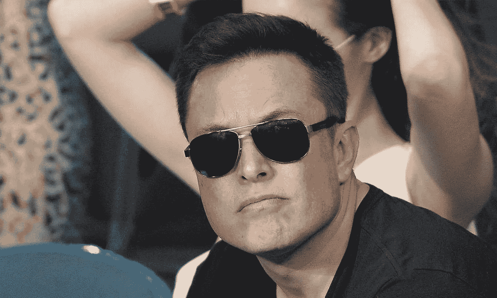

# 埃隆·马斯克和推特:言论自由不是自由

> 原文：<https://medium.com/codex/elon-musk-and-twitter-free-speech-is-not-free-374f2997f3ee?source=collection_archive---------14----------------------->

## 尤其是当花费超过 400 亿美元的时候

来源:[维基共享资源](https://commons.m.wikimedia.org/w/index.php?search=elon+musk&title=Special:MediaSearch&type=image)

当一个亿万富翁提出用全部现金支付超过 400 亿美元时，言论自由就不自由了。尽管有数百万条推文称赞埃隆·马斯克是言论自由的捍卫者和捍卫者，但人们必须意识到，没有哪个亿万富翁会纯粹出于慈善目的花那么多钱，或者真的花那么多钱…