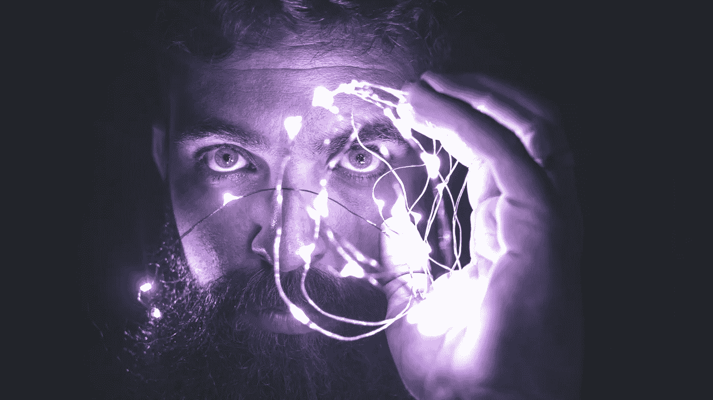

# 埃隆·马斯克的创意 Neuralink 2025 的未来

> 原文：<https://medium.com/codex/elon-musks-brain-child-the-future-of-neuralink-2025-6582c196af16?source=collection_archive---------0----------------------->

## 未来技术

## 人工智能与人类未来融合的创新

照片由来自 [Pexels](https://www.pexels.com/photo/person-holding-string-lights-photo-818563/?utm_content=attributionCopyText&utm_medium=referral&utm_source=pexels) 的[大卫·卡索拉托](https://www.pexels.com/@davidcassolato?utm_content=attributionCopyText&utm_medium=referral&utm_source=pexels)拍摄

# 埃隆·马斯克的创意

埃隆·马斯克最近因他的最新公司 Neuralink 而成为头条新闻。埃隆·马斯克是一名美国企业家和投资者，经营特斯拉和 SpaceX。他是…