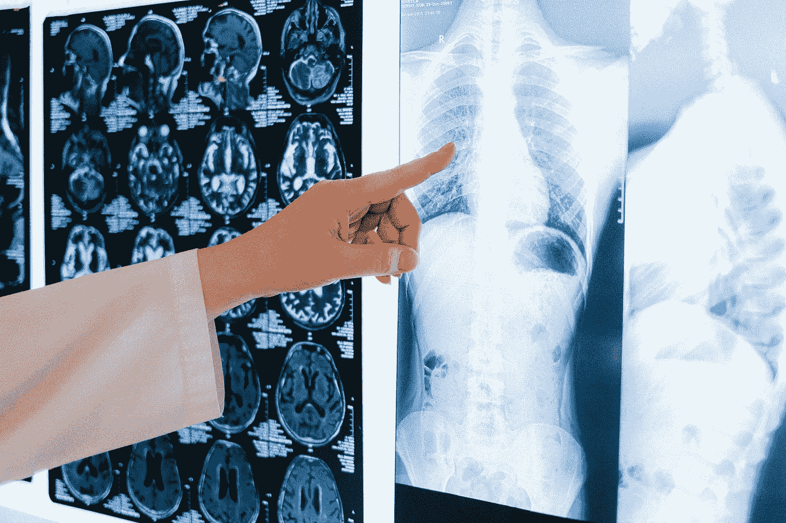

# 埃隆·马斯克关于 Neuralink 的最新发布

> 原文：<https://medium.com/codex/elon-musks-latest-release-about-neuralink-f55164a5cb85?source=collection_archive---------2----------------------->

## 升级智能手机的脑机接口

来自 [Pexels](https://www.pexels.com/photo/person-holding-white-printer-paper-4226124/?utm_content=attributionCopyText&utm_medium=referral&utm_source=pexels) 的 [Anna Shvets](https://www.pexels.com/@shvetsa?utm_content=attributionCopyText&utm_medium=referral&utm_source=pexels) 的照片

# 新闻稿

在最近与播客乔·罗根的采访中，埃隆·马斯克谈到了他的最新风险投资 Neuralink。用他的话说，“Neuralink 正在建立一个脑机接口，让我们可以直接与计算机交流，而无需说话或打字。”