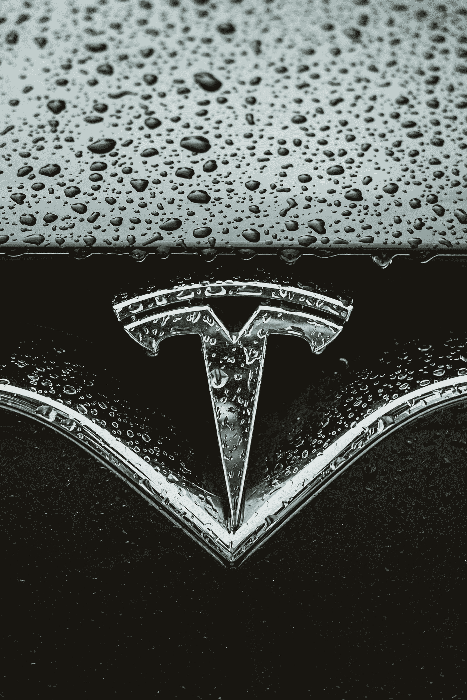

# 埃隆马斯克的总体规划，从过去到爆炸！

> 原文：<https://medium.com/codex/elon-musks-master-plan-from-past-to-blast-84f24c4a87cb?source=collection_archive---------37----------------------->

[德乐思教授](https://unsplash.com/@andreasdress?utm_source=medium&utm_medium=referral)在 [Unsplash](https://unsplash.com?utm_source=medium&utm_medium=referral) 上拍照

照片由[查理迪茨](https://unsplash.com/@charliedeets?utm_source=medium&utm_medium=referral)在 [Unsplash](https://unsplash.com/?utm_source=medium&utm_medium=referral) 拍摄

# 开头:第一部分

一开始，特斯拉努力获得动力，从零开始创建一家汽车公司不是一件容易的事情，事实上如此困难，以至于福特和特斯拉是美国唯一没有破产的汽车制造商，所以这就引出了一个问题，他们是怎么做到的？